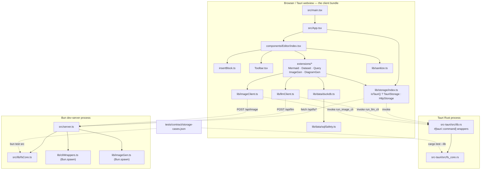

# Motion — Current Code Walkthrough

> Generated from the repository after Phase 1 ("make web mode a real
> filesystem") landed. **Currency for product status:** see
> `docs/designs/current_design_doc.md` **§0** (post-v0.1 dogfood amendment) —
> packaged build, block round-trip, enrichment UI (AI Refine + Synthesize),
> labeled Save, and dataset/SQL E2E are shipped. Line-level citations in this
> walkthrough may lag HEAD; prefer the design-doc §0 table over any claim
> here that enrichment is dead code or that four blocks fail round-trip.
>
> **Read this first if you have read anything older about Motion:**
> `WebStorage` no longer exists. It was deleted in Phase 1 and replaced by
> `HttpStorage` (`src/lib/storage/index.ts` — `HttpStorage`), which performs
> real reads and writes against a real filesystem through the dev server's
> `/api/fs/*` routes. Any description of browser mode as a `console.warn`
> no-op is describing deleted code.

---

## 1. Orientation

### 1.1 The system in three sentences

Motion is a local-first technical writing IDE: a React + Tiptap WYSIWYG
markdown editor whose documents can embed live blocks — Mermaid diagrams,
CSV/JSONL datasets, SQL queries over DuckDB-WASM, and two LLM-CLI-backed
generative blocks. It runs in exactly two runtimes from one codebase: a
packaged Tauri desktop app whose Rust backend owns the filesystem, and a
browser pointed at a hand-written Bun dev server that owns the filesystem on
its behalf. The whole design rests on one rule — the browser bundle may never
touch `Bun` or `fs` directly — and one shared contract
(`tests/contract/storage-cases.json`) that forces the Rust and TypeScript
filesystem cores to behave identically.

### 1.2 Directory map

| Path | What lives there | Why |
|---|---|---|
| `src/main.tsx` | Browser entrypoint; React root; the `data-app-ready` flag | The single root of the client import graph the guard walks |
| `src/App.tsx` | Shell: header, search, file list, view-mode toggle | Owns `workspacePath` / `files` / `currentFilePath` state |
| `src/components/Editor/` | Tiptap editor, toolbar, slash menu, block insertion | The primary user surface |
| `src/components/Editor/extensions/` | Five custom Tiptap `Node`s + `blockAttrs.ts` + `tableKit.ts` | Each block is a `<pre data-type="…">` on disk; tables are GFM pipes |
| `src/lib/storage/index.ts` | `StorageProvider`, `TauriStorage`, `HttpStorage`, `isTauri()` | The runtime fork, chosen once at module load |
| `src/lib/fsCore.ts` | Browser-mode filesystem core (jail, resolve, list, read, write) | Runs **in the Bun dev-server process**, never in the bundle |
| `src-tauri/src/fs_core.rs` | The same core in Rust | Runs in the desktop app's Rust process |
| `src-tauri/src/lib.rs` | `#[tauri::command]` wrappers + `WorkspaceState` | Thin: state lookup, then delegate to `fs_core` |
| `src/lib/{llmClient,imageClient}.ts` | Browser-safe entry points that fork on `isTauri()` | The only sanctioned way UI code reaches a CLI |
| `src/lib/{cliWrappers,imageGen}.ts` | `Bun.spawn` CLI wrappers | Server/desktop-side only; must stay unreachable from `main.tsx` |
| `src/lib/data/{duckdb,sqlSafety}.ts` | DuckDB-WASM lifecycle + SQL validation | Document-supplied SQL is untrusted input |
| `src/server.ts` | The Bun dev server: build, watch, HTML, `/api/*` | Also the browser's filesystem backend |
| `tests/contract/storage-cases.json` | The hand-written cross-language storage contract | Neither language owns it |
| `e2e/` | Playwright specs + the auto-applied console/network gate | `fixtures.ts` is the gate every spec inherits |
| `scripts/guard-client-bundle.ts` | Static import-graph guard for `Bun.` | Catches what runtime tests structurally cannot |

### 1.3 Architecture (derived from actual imports and calls)



Two facts the diagram encodes that are easy to miss:

1. `src/lib/fsCore.ts` sits **inside the Bun process box**, not the browser box.
   It is imported only by `src/server.ts` (lines 11–18) and by its own test. Its
   header says so explicitly: *"NOT imported by the browser bundle"*
   (`src/lib/fsCore.ts`, lines 14–15).
2. The dotted edges are the only two ways client code crosses a process
   boundary: `invoke()` or `fetch()`. Everything else is in-process.

---

## 2. Execution-order tour

### 2.1 Trace 1 — Boot: request to `data-app-ready`

**Step 1 — the server builds before it listens.**
`buildApp()` runs at module top level, awaited, before `Bun.serve` is reached
(`src/server.ts` — `buildApp()`, lines 46–77; the top-level `await buildApp()`
at line 118). It calls `Bun.build` with `entrypoints: [src/main.tsx]`,
`target: "browser"`, `format: "esm"` (lines 49–59), writes `dist/main.js`, then
reads it back into the module-level `jsBundle` string (lines 70–73). Failure
logs and returns `false`; it does **not** throw, so a broken build still starts
a server that serves the previous (or empty) bundle — see §6.

**Step 2 — `GET /`.**
`Bun.serve`'s `fetch` handler matches `/` or `/index.html` and calls
`generateHTML()` (`src/server.ts` — `fetch`, lines 155–163). `generateHTML()`
(lines 89–108) reads `src/index.css` via `getCSS()` (lines 80–86), inlines it
into a `<style>` block, and emits a document whose entire body is:

```html
  <div id="root"></div>
  <script type="module" src="/bundle.js"></script>
```

(`src/server.ts` — `generateHTML()`, lines 103–106.) The HTML is generated in
memory on every request. The repository's root `index.html` is **not** involved
(see §5.6).

**Step 3 — `GET /bundle.js`** returns the in-memory `jsBundle` with
`Cache-Control: no-cache` (`src/server.ts` — `fetch`, lines 173–180).

**Step 4 — `main.tsx`.** The module finds `#root`, throwing if it is absent
(`src/main.tsx`, lines 5–8), creates a React 19 root and renders `<App />`
(lines 10–11).

**Step 5 — `App` mounts.** `App()` initialises five pieces of state
(`src/App.tsx`, lines 8–12) and renders header, sidebar, and
`<Editor viewMode={viewMode} filePath={currentFilePath} />` (line 165). On a
cold boot `currentFilePath` is `null`.

**Step 6 — Tiptap extension registration.** `useEditor` is called with the
extension array (`src/components/Editor/index.tsx` — `Editor()`, lines 136–150):

```ts
extensions: [
    StarterKit.configure({ codeBlock: false }),
    MermaidExtension,
    DatasetExtension,
    QueryExtension,
    ImageGenExtension,
    DiagramGenExtension,
    CodeBlockLowlight.configure({ lowlight, defaultLanguage: "typescript" }),
],
```

`StarterKit`'s built-in `codeBlock` is disabled so `CodeBlockLowlight` can own
`<pre>` without a duplicate-name collision. `MermaidExtension` declares
`priority: 1000` (`src/components/Editor/extensions/MermaidExtension.tsx`, line
209) so its `parseHTML` rules are consulted before `CodeBlockLowlight`'s — this
is the single line that makes the mermaid round trip in §2.6 work.

`content: welcomeHTML` (line 151) seeds the document with the built-in welcome
page (lines 80–111), which contains one of every block type.

**Step 7 — the readiness flag.** After `root.render()` returns,
`src/main.tsx` lines 16–18:

```ts
requestAnimationFrame(() => {
    document.documentElement.dataset["appReady"] = "true";
});
```

`render()` in React 19 is asynchronous; the rAF callback fires after the next
paint, so the attribute means "React has actually rendered", not "the bundle
parsed". `gotoApp()` waits on exactly this (`e2e/fixtures.ts` — `gotoApp()`,
lines 94–97), which is why no spec in `e2e/` needs an arbitrary sleep.

**What can fail here:** a missing `#root` throws before render (main.tsx:7); a
failed `Bun.build` yields an empty `jsBundle` and a blank page with no error;
`/favicon.ico` is answered `204` deliberately (`src/server.ts`, lines 168–170)
because a `404` would trip the E2E network gate on every run.

---

### 2.2 Trace 2 — Open folder → list → read, in both runtimes

**Shared entry.** `App.handleOpenFolder` (`src/App.tsx`, lines 25–40):

```ts
const path = await storage.openFolder();
if (path) {
    setWorkspacePath(path);
    const markdownFiles = await storage.listFiles(path);
    setFiles(markdownFiles);
    setCurrentFilePath(null);
    setSearchQuery("");
}
```

Errors are caught, logged, and surfaced with `alert()` (lines 35–39).
`storage` is a module-level singleton chosen once, at import time:

```ts
export const storage: StorageProvider = isTauri() ? new TauriStorage() : new HttpStorage();
```

(`src/lib/storage/index.ts`, line 117; `isTauri()` delegates to the official
`@tauri-apps/api/core` detector at line 115 — the comment at lines 111–114
warns against checking `window.__TAURI__`, which only exists under
`withGlobalTauri`.)

#### Desktop (Tauri) path

1. `TauriStorage.openFolder()` (`src/lib/storage/index.ts`, lines 14–26) opens
   the native picker via `@tauri-apps/plugin-dialog`'s `open({ directory: true,
   multiple: false })`. A cancelled dialog returns a non-string, and the method
   returns `null` — `handleOpenFolder`'s `if (path)` then does nothing.
2. On success it calls `invoke<string>("set_workspace", { path: selected })`
   (line 24) **before returning**. This is the registration step: until it runs,
   every other Rust command refuses.
3. `set_workspace` (`src-tauri/src/lib.rs`, lines 109–123) canonicalizes the
   path, rejects a non-directory, and stores it in
   `WorkspaceState { root: Mutex<Option<PathBuf>> }` (lines 90–92, registered
   via `.manage(...)` at lines 164–166).
4. `TauriStorage.listFiles(path)` → `invoke("list_markdown_files", { path })`
   (line 29) → `list_markdown_files` (`src-tauri/src/lib.rs`, lines 145–150):

   ```rust
   let root = workspace_root(&state)?;
   let target = fs_core::resolve_in_workspace(&root, &path).map_err(String::from)?;
   fs_core::collect_files(&target, fs_core::MARKDOWN_EXTENSIONS).map_err(String::from)
   ```

   The doc comment at lines 137–144 records why: this command *used to* write
   the workspace root from its own argument — a second, unguarded way to
   re-root the jail. It now only reads `workspace_root` (lines 99–107, which
   returns `"No workspace opened. Open a folder first."` when unset) and
   validates its argument as a location *inside* the already-open workspace.
5. `Editor`'s load effect calls `storage.readFile(path)` →
   `invoke("read_file", { path })` (line 33) → `read_file`
   (`src-tauri/src/lib.rs`, lines 125–129) → `fs_core::read_workspace_file`
   (`src-tauri/src/fs_core.rs`, lines 169–179), which resolves through the jail
   and then reads.

All seven commands are registered in `invoke_handler` (`src-tauri/src/lib.rs`,
lines 177–185).

#### Browser (HTTP) path

1. `HttpStorage.openFolder()` (`src/lib/storage/index.ts`, lines 75–80):

   ```ts
   const res = await fetch("/api/fs/workspace");
   if (!res.ok) return await failed(res, "Failed to open workspace");
   const { root } = await res.json();
   return root ?? null;
   ```

   There is no browser folder picker. The workspace is fixed by the server, and
   this returns the **real absolute root** so the UI displays where it is
   working (the sidebar heading uses its basename — `src/App.tsx`, lines
   122–124).
2. Server side, `GET /api/fs/workspace` returns `{ root: WORKSPACE_ROOT }`
   (`src/server.ts` — `fetch`, lines 240–241). `WORKSPACE_ROOT` is computed once
   at module load from `MOTION_WORKSPACE`, defaulting to `public/demo`, and
   created if missing (`src/server.ts`, lines 34–40). The comment at lines
   233–236 states the security rule plainly: the root comes from the
   environment **and nothing else**, because accepting a client-supplied
   directory would turn the dev server into an arbitrary-filesystem read API
   for anything that can reach port 3000.
3. `HttpStorage.listFiles(_path)` (lines 82–86) ignores its argument and calls
   `GET /api/fs/list`, which returns `collectFiles(WORKSPACE_ROOT,
   MARKDOWN_EXTENSIONS)` (`src/server.ts`, lines 243–246).
4. `collectFiles` (`src/lib/fsCore.ts`, lines 106–128) asserts the root is a
   real directory (`assertDirectory`, lines 94–100), walks recursively, skips
   any directory whose name starts with `.` (line 114), filters by lowercased
   extension (lines 117–120), sorts, and returns **absolute** paths.
5. `HttpStorage.readFile(path)` (lines 88–93) issues
   `GET /api/fs/read?path=<encoded>`; the server calls
   `readWorkspaceFile(WORKSPACE_ROOT, target)` (`src/server.ts`, lines 251–259)
   → `src/lib/fsCore.ts`, lines 133–139.

**Error translation.** Anything thrown inside the `/api/fs/` block is mapped
from the shared error class onto HTTP (`src/server.ts` — `fetch`, lines
277–286):

```ts
const status = error instanceof FsError
    ? { denied: 403, "not-found": 404, "not-a-directory": 400 }[error.code]
    : 500;
```

On the client, `failed()` (`src/lib/storage/index.ts`, lines 46–55) reads the
JSON body and re-throws the server's own message, so `App`'s `alert` and
`Editor`'s error render show "Access denied: path is outside the opened
workspace" rather than "403".

**Why the two runtimes stay comparable:** both call the *same* functions —
`resolveInWorkspace` / `resolve_in_workspace`, `collectFiles` /
`collect_files`, `readWorkspaceFile` / `read_workspace_file` — and both are run
against `tests/contract/storage-cases.json` (§2.4).

---

### 2.3 Trace 3 — Save, including the parent jail re-check

**Trigger.** Either the toolbar save button (`src/components/Editor/Toolbar.tsx`
— `Toolbar()`, lines 218–228, calling `onSave?.()`) or ⌘/Ctrl-S, registered as a
`window` keydown listener with `preventDefault()`
(`src/components/Editor/index.tsx`, lines 284–293).

**`handleSave`** (`src/components/Editor/index.tsx`, lines 220–230):

```ts
if (!editor || !filePath) return;
try {
    await storage.writeFile(filePath, rawMarkdown);
    console.log("File saved successfully:", filePath);
} catch (error) {
    console.error("Failed to save file:", error);
    alert(`Error saving file: ${error}`);
}
```

Two things worth internalising. First, it writes `rawMarkdown`, not the editor
HTML — `rawMarkdown` is kept current by `onUpdate`, which runs
`turndown.turndown(updatedEditor.getHTML())` on every change (lines 204–207).
Second, with no `filePath` (the welcome document) save is a silent no-op.

**Browser.** `HttpStorage.writeFile` (`src/lib/storage/index.ts`, lines 95–102)
POSTs `{ path, content }` as JSON to `/api/fs/write`. The server validates both
fields are strings, then calls `writeWorkspaceFile(WORKSPACE_ROOT, body.path,
body.content)` and answers `{ ok: true }` (`src/server.ts`, lines 261–271).

**`writeWorkspaceFile`** (`src/lib/fsCore.ts`, lines 141–153) — the parent
re-check is the point of interest:

```ts
const path = resolveInWorkspace(root, requested);
// The parent must be inside the workspace too, matching write_file's second
// jail check -- otherwise a symlinked directory could take the write out.
const parent = dirname(path);
if (!isInsideWorkspace(realOrThrow(root), parent)) {
    throw new FsError("denied", "Access denied: path is outside the opened workspace");
}
if (!existsSync(parent)) { mkdirSync(parent, { recursive: true }); }
writeFileSync(path, content, "utf8");
```

Why check twice? `resolveInWorkspace` (lines 75–92) canonicalizes: if the target
exists it `realpath`s the file; if it does not, it `realpath`s the **parent** and
joins the basename (lines 79–86). That already resolves symlinks — but
`mkdirSync(parent, { recursive: true })` on the next line is a *creating*
operation. Re-verifying the parent immediately before creating it keeps the
directory-creation step inside the same jail the file check passed, rather than
trusting that a single earlier check covers two distinct filesystem effects.

**Desktop.** `TauriStorage.writeFile` → `invoke("write_file", { path, content })`
(`src/lib/storage/index.ts`, lines 36–38) → `write_file`
(`src-tauri/src/lib.rs`, lines 131–135) → `fs_core::write_workspace_file`
(`src-tauri/src/fs_core.rs`, lines 181–202), which performs the identical
sequence:

```rust
let path = resolve_in_workspace(root, requested)?;
let root_real = real_or_not_found(root)?;
if let Some(parent) = path.parent() {
    if !is_inside_workspace(&root_real, parent) { /* Denied */ }
    if !parent.exists() { fs::create_dir_all(parent)?; }
}
fs::write(&path, content)
```

**New Note.** `App.handleNewNote` (`src/App.tsx`, lines 46–67) builds
`untitled-<ISO timestamp with : and . replaced>.md`, joins it onto
`workspacePath` with a platform-guessed separator (lines 53–56), writes
`"# New Note\n\n"` through the same `storage.writeFile`, then optimistically
inserts the path into `files` and selects it (lines 58–61). Because the write is
real in both runtimes now, the subsequent read by `Editor` finds a real file —
that is bug B2, and `e2e/persistence.spec.ts` lines 54–76 is its regression
test.

---

### 2.4 Trace 4 — THE CONTRACT

`tests/contract/storage-cases.json` is the artifact that keeps two hand-written
implementations of one filesystem jail honest. It has two top-level keys:
`setup` (lines 22–38) and `cases` (lines 40–156).

#### The fixture `setup`

```json
"setup": {
  "files": { "note.md": …, "nested/deep.md": …, "data/sales.csv": …,
             "data/events.jsonl": …, "notes.txt": …, ".hidden/secret.md": … },
  "outside_files": { "secret.md": "# Outside the jail\n" },
  "symlinks": { "escape-link.md": "../outside/secret.md" },
  "sibling_dirs": ["-evil"]
}
```

(`tests/contract/storage-cases.json`, lines 22–38.) Each of the four sections
exists to make one class of escape reachable: ordinary contents, a real file
genuinely outside the jail, a symlink pointing at it, and a sibling directory
whose name *shares the workspace's string prefix*.

#### How TypeScript loads and runs it

`src/lib/fsCore.contract.test.ts` reads the JSON at module scope with a URL
relative to the test file, so the path does not depend on cwd (lines 22–24):

```ts
const contract = await Bun.file(
    new URL("../../tests/contract/storage-cases.json", import.meta.url)
).json();
```

`buildFixture()` (lines 33–63) creates a fresh temp dir **per case**, and
critically `realpathSync`es it (line 37) — on macOS `/tmp` is a symlink to
`/private/tmp`, and the implementation canonicalizes, so an unresolved root
would never equal the paths the implementation returns. It then materialises
`files`, `outside_files`, `symlinks`, and for each entry in `sibling_dirs`
creates `root + suffix` containing `planted.md` bait (lines 55–60).

The cases become individual `test()`s inside one `describe` (lines 74–132), each
dispatching on `c.op` through a `switch` (lines 82–99) that maps
`read` / `write` / `write_then_read` / `list_markdown` / `list_markdown_shape` /
`list_data` onto the four exported functions.

#### How Rust loads and runs it

`src-tauri/src/fs_core.rs` — `mod contract`, lines 204–376. It resolves the
fixture relative to the crate rather than the cwd (lines 224–228):

```rust
let path = Path::new(env!("CARGO_MANIFEST_DIR")).join("../tests/contract/storage-cases.json");
```

`build()` (lines 230–260) mirrors the TypeScript fixture exactly, including the
same macOS canonicalization note (lines 233–235). The runner
`storage_contract_rust_implementation` (lines 279–375) is a **single** `#[test]`
that loops over all cases and accumulates `failures: Vec<String>`, asserting the
vector is empty at the end (lines 369–374) — so one run reports every violation
at once instead of stopping at the first.

Note the structural difference: TypeScript gets one named test per case (better
reporting under `bun test`), Rust gets one aggregate test. Both consume the same
`name` field, so a failure message names the same case in either language.

#### `$ROOT` / `$OUTSIDE` expansion

Case paths cannot contain absolute paths — they are unknown until the temp
directory exists. Two sentinels bridge that. TypeScript
(`src/lib/fsCore.contract.test.ts` — `expand()`, lines 66–68):

```ts
return path.replace("$OUTSIDE", f.outside).replace("$ROOT", f.root);
```

Rust (`src-tauri/src/fs_core.rs` — `expand()`, lines 262–265) does the same, and
in the same order — `$OUTSIDE` before `$ROOT`. **That order is load-bearing**:
`$ROOT` is a prefix of nothing here, but `$OUTSIDE` is not a prefix of `$ROOT`
either, so the two orders happen to agree; keeping them textually identical is
what guarantees they continue to. The sibling case
`"$ROOT-evil/planted.md"` (line 89) relies on `$ROOT` expanding to the bare
workspace path so the `-evil` suffix concatenates into the sibling directory
name.

Listing expectations go the other way: results are absolute, so both runners
strip the root prefix before comparing against `expect.relative_paths`
(TypeScript lines 117–120, using `relative()` then normalising `sep` to `/`;
Rust `relative_paths()`, lines 267–277, using `strip_prefix` then replacing
`\` with `/`). That normalisation is what lets one fixture describe both
platforms.

#### Error-*class* assertions

`expect.result` is one of `ok | denied | not-found | not-a-directory`
(`tests/contract/storage-cases.json`, line 19) — never a message string. The
JSON says why at lines 13–14: *"Error cases assert an error CLASS, not a message
string, so the two languages can word their errors naturally."*

TypeScript classifies with `classify()` (lines 70–72):

```ts
return err instanceof FsError ? err.code : `unexpected:${String(err)}`;
```

An unexpected exception type therefore fails with a *distinguishable* string
rather than being silently miscounted as the right error. Rust classifies via
`FsErrorCode::as_str()` (`src-tauri/src/fs_core.rs`, lines 20–29), whose doc
comment names it "wire name shared with the contract fixture and the TypeScript
side" — the enum-to-string mapping is the shared vocabulary.

Both runners also treat "expected an error, got success" as a distinct failure
(`src-tauri/src/fs_core.rs`, line 336; the TypeScript equivalent is
`expect(() => run()).toThrow()` at line 102). That matters: a jail that stops
enforcing would otherwise look like a passing `ok`.

#### Why hand-written, not generated

Stated in the fixture itself (`tests/contract/storage-cases.json`, lines 3–6):

> "Canonical storage contract. Hand-written and language-neutral on purpose:
> generating it from TypeScript would make TS the source of truth and give us a
> second artifact to keep in sync, which is the exact failure mode this file
> exists to prevent."

Generating the fixture from either implementation makes that implementation
definitionally correct — the generated cases would encode whatever it currently
does, bugs included, and the other language would be graded against those bugs.
The hand-written file is instead a third, independent statement of intent that
*both* implementations can be wrong about. Several cases carry a `_why` field
recording the specific historical divergence they pin: the cwd-versus-root
resolution split (line 55), the 200-plus-index.html missing-file bug (line 68),
the `startsWith` sibling escape (line 87), the faked `writeFile` (line 100), and
the relative-versus-absolute listing mismatch (line 152).

---

### 2.5 Trace 5 — Path containment, and why `startsWith` is a real escape

**TypeScript** (`src/lib/fsCore.ts` — `isInsideWorkspace()`, lines 48–52):

```ts
export function isInsideWorkspace(root: string, candidate: string): boolean {
    const rel = relative(root, candidate);
    if (rel === "") return true;
    return !rel.startsWith("..") && !isAbsolute(rel);
}
```

**Rust** (`src-tauri/src/fs_core.rs` — `is_inside_workspace()`, lines 75–77):

```rust
pub fn is_inside_workspace(root: &Path, candidate: &Path) -> bool {
    candidate.starts_with(root)
}
```

These look opposite and are equivalent. `Path::starts_with` in Rust compares
**path components**, not bytes. `path.relative` in Node likewise decomposes into
components and returns the component-wise route from `root` to `candidate`; if
that route has to climb out (`..`) or is absolute (no relation at all, e.g.
different Windows drives), the candidate is outside.

**The naive escape.** A JavaScript `candidate.startsWith(root)` is a *byte*
prefix test. For a workspace at `/x/ws`:

```
"/x/ws-evil/planted.md".startsWith("/x/ws")   →  true   ← escape
relative("/x/ws", "/x/ws-evil/planted.md")     →  "../ws-evil/planted.md"  → rejected
Path::new("/x/ws-evil/planted.md").starts_with("/x/ws")  →  false          → rejected
```

`/x/ws-evil` is a *sibling* directory, not a child. The naive check hands out
its entire contents. This is not hypothetical in this repo: it is the reason
the contract carries `"sibling_dirs": ["-evil"]` (`tests/contract/storage-cases.json`,
line 37) and the case *"refuses a sibling directory sharing the workspace name
prefix"* (lines 85–91), whose `_why` states it outright. The TypeScript source
comment (lines 36–47) and the Rust source comment (lines 71–74) each independently
document the same reasoning, so the next person editing either file sees it.

**The root counts as inside.** Both implementations say so (`rel === ""` returns
`true`; `starts_with` is reflexive), and both comments explain why: a top-level
note's parent *is* the root, and `writeWorkspaceFile` checks the parent
(`src/lib/fsCore.ts`, lines 45–46; `src-tauri/src/fs_core.rs`, lines 73–74).
Making the root exclusive would break every top-level save.

**Containment is only half the jail.** `resolveInWorkspace` /
`resolve_in_workspace` do the other half by *canonicalizing before* checking
(`src/lib/fsCore.ts`, lines 75–92; `src-tauri/src/fs_core.rs`, lines 89–121).
Three behaviours matter:

1. A relative path resolves against the **workspace root**, not the process cwd
   (`join(rootReal, requested)` / `root_real.join(requested_path)`). This is
   what makes a document portable: a Dataset block storing
   `source: data/sales.csv` means the same file on desktop and in the browser.
   The Rust comment (lines 81–86) records that this previously errored with
   "Path has no parent directory" while Node resolved against cwd — the exact
   divergence the contract now pins (line 55).
2. An existing path is `realpath`ed, so a symlink is followed *before*
   containment is judged — this is what rejects `escape-link.md`.
3. A path that does not exist has its **parent** canonicalized and the filename
   joined on (`src/lib/fsCore.ts`, lines 83–85; `src-tauri/src/fs_core.rs`,
   lines 102–111), so `..` segments and symlinked parents cannot reach the
   containment check unresolved. The Rust comment at lines 108–110 spells this
   out.

One consequence worth knowing: a traversal to a path that does not exist
(`../../../etc/nonexistent`) fails as **not-found**, not **denied**, because
`real_or_not_found` on its parent fails first. `e2e/persistence.spec.ts` lines
115–119 documents this and deliberately tests `/etc/passwd` — a file that really
exists — so the assertion exercises the containment check itself.

---

### 2.6 Trace 6 — The markdown round trip

#### Load: disk → editor

`Editor`'s load effect (`src/components/Editor/index.tsx`, lines 233–264):

```ts
const content = await storage.readFile(filePath);
setRawMarkdown(content);
const rawHtml = await marked.parse(content);
const html = sanitizeHtml(typeof rawHtml === "string" ? rawHtml : String(rawHtml));
editor.commands.setContent(html, { emitUpdate: false });
```

`marked.parse` may return a promise, hence the `typeof` narrowing.
`sanitizeHtml` (`src/lib/sanitize.ts`, lines 6–12) runs DOMPurify with
`ADD_ATTR: ["data-type", "class", "style"]` and `ALLOW_DATA_ATTR: true` —
**preserving `class` and `data-type` is not cosmetic**, it is what allows the
block extensions' `parseHTML` rules to match after sanitisation. `emitUpdate:
false` stops `setContent` from firing `onUpdate`, which would immediately
turndown the freshly-loaded document and overwrite `rawMarkdown`.

On failure the error is rendered through `escapeHtmlText` (`src/lib/sanitize.ts`,
lines 38–45) before being injected — never the raw error object
(`src/components/Editor/index.tsx`, lines 247–256).

#### Save: editor → disk

`onUpdate` (lines 204–207) keeps `rawMarkdown = turndown.turndown(editor.getHTML())`
current on every keystroke. The only custom turndown rule is registered at
lines 26–34:

```ts
turndown.addRule("fencedCodeBlock", {
    filter: ["pre"],
    replacement: function (content, node) {
        const code = (node as HTMLElement).querySelector("code");
        const className = code ? code.getAttribute("class") || "" : "";
        const language = className.replace("language-", "");
        return "\n\n```" + language + "\n" + content + "\n```\n\n";
    },
});
```

**Every `<pre>` in the document goes through this one rule**, and the fence's
info string comes from exactly one place: the `class` attribute on the child
`<code>`.

#### Why mermaid survives and the other four do not

Compare the five `renderHTML` implementations:

| Extension | `renderHTML` child code element | Cite |
|---|---|---|
| Mermaid | `["code", { class: "language-mermaid" }, HTMLAttributes.content]` | `MermaidExtension.tsx`, lines 244–250 |
| Dataset | `["code", {}, content]` | `DatasetExtension.tsx`, lines 167–171 |
| Query | `["code", {}, \`sql: ${…}\`]` | `QueryExtension.tsx`, lines 160–166 |
| ImageGen | `["code", {}, content]` | `ImageGenExtension.tsx`, lines 205–209 |
| DiagramGen | `["code", {}, serialized]` | `DiagramGenExtension.tsx`, lines 238–242 |

Only Mermaid puts a language class on `<code>`. All five put `data-type="…"` on
the `<pre>` — and **markdown has no way to carry an HTML attribute**. A fenced
code block can carry exactly one piece of metadata: the info string.

The round trip, step by step:

**Mermaid.**
`renderHTML` → `<pre data-type="mermaid"><code class="language-mermaid">graph TD…</code></pre>`
→ turndown reads `class="language-mermaid"` → ` ```mermaid ` fence →
saved to disk → on reload `marked.parse` turns a ` ```mermaid ` fence into
`<pre><code class="language-mermaid">…</code></pre>` → `sanitizeHtml` keeps the
class → Tiptap matches `MermaidExtension`'s **second** `parseHTML` rule
(`MermaidExtension.tsx`, lines 230–240), which explicitly checks
`code.classList.contains("language-mermaid")` and does *not* require
`data-type`. `priority: 1000` (line 209) ensures this rule is tried before
`CodeBlockLowlight`'s generic `<pre>` rule. The node is restored, live.

**The other four.**
`renderHTML` → `<pre data-type="dataset"><code>source: …\nname: …</code></pre>`
→ turndown finds no class → `language = ""` → a bare ` ``` ` fence → saved →
on reload `marked.parse` produces `<pre><code>…</code></pre>` with **no**
`data-type` and **no** class. Each of the four extensions has exactly one
`parseHTML` rule, and all four require the attribute selector
`pre[data-type="…"]` (`DatasetExtension.tsx`, line 140; `QueryExtension.tsx`,
line 145; `ImageGenExtension.tsx`, line 190; `DiagramGenExtension.tsx`, line
223). None matches. `CodeBlockLowlight` claims the node instead, with
`defaultLanguage: "typescript"` (`src/components/Editor/index.tsx`, lines
146–149).

The *data* is not lost — the serialized `key: value` body is still the code
block's text, and hand-restoring `data-type` in HTML would revive the block. But
after one save-and-reload cycle a Dataset, Query, ImageGen, or DiagramGen block
is an inert, syntax-highlighted code block. This is the single largest gap
between what the welcome document demonstrates and what a saved document
retains. The fix implied by the citations above is a one-line change per
extension (emit `class="language-dataset"` etc. and add a class-based
`parseHTML` rule, exactly as Mermaid does) — `DiagramGenExtension.tsx` line
226–227 already carries a `B7` marker acknowledging the serializer is
provisional.

#### The markdown-mode edge

`shouldSyncMarkdownIntoEditor(prev, next)` (`src/components/Editor/index.tsx`,
lines 41–46) returns true only for `prev === "markdown" && next !== "markdown"`.
The effect at lines 269–281 then re-parses `rawMarkdown` through
`marked.parse` → `sanitizeHtml` → `setContent`. The other direction needs no
push because `onUpdate` already keeps `rawMarkdown` current. This tiny pure
function is unit-tested (`src/components/Editor/index.test.ts`, lines 4–30).

---

### 2.7 Trace 7 — Inserting a block

Both entry points converge on one function.

**Toolbar.** `INSERT_COMMANDS.map(...)` renders one button per block type,
each calling `insertBlock(editor, cmd.nodeType)` with no range
(`src/components/Editor/Toolbar.tsx`, lines 183–191).

**Slash menu.** `detectSlashTrigger` (`src/components/Editor/index.tsx`, lines
64–78) runs on both `onUpdate` (line 206) and `onSelectionUpdate` (lines
210–212) — content changes and bare cursor moves both matter. It requires an
empty selection, then tests the text from the start of the block to the cursor
against `/^\/(\S*)$/` (line 69). Anchoring at `^` scopes the trigger to "`/` is
the first character of the block", so typing "and/or" mid-sentence never opens
it. It records `range: { from: $from.start(), to: $from.pos }` — the span to
delete — plus viewport coordinates from `editor.view.coordsAtPos` (line 71),
used directly by the `position: fixed` popup (lines 310–313).

Keyboard handling lives in `editorProps.handleKeyDown`
(`src/components/Editor/index.tsx`, lines 159–198), registered **once** at
editor creation. Because it can never be re-registered, it reads state through
`slashMenuRef` (kept in sync at lines 124–126) and `executeSlashCommand`
(a `useCallback` with an empty dep array, lines 128–134) rather than closing
over `slashMenu` directly — closing over state here would freeze the menu at
its first value.

Mouse selection uses `onMouseDown` with `preventDefault()`, not `onClick`
(lines 322–325). The comment at lines 307–309 gives the reason: `onClick` fires
after focus has already moved to the menu div, by which point the editor
selection — and therefore the stored `range` — is no longer valid.

**`insertBlock`** (`src/components/Editor/insertBlock.ts`, lines 21–31):

```ts
const chain = editor.chain().focus();
if (range) { chain.deleteRange(range); }
chain.insertContent([{ type: nodeType }, { type: "paragraph" }]).run();
```

**The trailing paragraph.** The comment at lines 16–20 states the reason
precisely: all five block nodes are declared `atom: true` (e.g.
`MermaidExtension.tsx` line 207, `DatasetExtension.tsx` line 116). Inserting an
atom at a position with no following block — the end of the document being the
common case — leaves ProseMirror with a `NodeSelection` **on the newly inserted
node itself**, because there is no text position after it for a cursor to
occupy. The next `insertContent` then *replaces the selected node* instead of
adding one. Symptom: click "Mermaid" twice, still have one Mermaid block.
Always inserting `[node, paragraph]` guarantees a text position exists after
the atom, so the cursor lands there and the next insert appends.

---

### 2.8 Trace 8 — A generative block, end to end

Take **AI Diagram**. The user types a prompt and clicks Generate:
`handleGenerate` (`src/components/Editor/extensions/DiagramGenExtension.tsx`,
lines 71–94) sets loading, calls `generateMermaidDiagram(editPrompt)`, and on
success calls `updateAttributes({ prompt, content })` — which writes into the
Tiptap node and thus into the document.

**`generateMermaidDiagram`** (lines 16–27):

```ts
const response = await callLLMFromUI("claude", {
    prompt: `Generate a Mermaid diagram for: ${userPrompt}`,
    systemPrompt: "You output only valid Mermaid diagram syntax. …",
});
const candidate = stripCodeFence(response.content);
await mermaid.parse(candidate);
return candidate;
```

Two defences before the output is accepted. `stripCodeFence` (lines 11–14)
removes a wrapping ` ```mermaid ` fence, because models asked for "no fences"
add them anyway; it is unit-tested at
`src/components/Editor/extensions/DiagramGenExtension.test.ts`, lines 4–20.
`mermaid.parse` throws on invalid syntax **without rendering**, so a bad
generation surfaces as a caught error (lines 85–92) rather than a broken node
persisted into the document.

**The runtime fork.** `callLLMFromUI` (`src/lib/llmClient.ts`, lines 13–41):

```ts
if (isTauri()) {
    const content = await invoke<string>("run_llm_cli", {
        provider, prompt: options.prompt, systemPrompt: options.systemPrompt,
    });
    return { content, rawOutput: content };
}
const res = await fetch("/api/llm", { method: "POST", … });
```

The Tauri branch reaches `run_llm_cli` (`src-tauri/src/lib.rs`, lines 21–53),
which builds per-provider argv mirroring `cliWrappers.ts` (lines 27–39), runs it
through `tokio::process::Command` wrapped in a 120s `timeout` (lines 41–45),
and maps a non-zero exit to an `Err` carrying stderr (lines 47–50).

The browser branch reaches `POST /api/llm` (`src/server.ts`, lines 185–208).
The handler **allowlists the provider** against
`ALLOWED_LLM_PROVIDERS = ["opencode", "claude", "qwen"]` (line 20, checked at
lines 189–194) before it does anything else — without that, the request body
would name the binary to execute. It then calls `callLLM` from
`src/lib/cliWrappers.ts`.

**`callLLM`** (`src/lib/cliWrappers.ts`, lines 29–98) is where `Bun.spawn`
actually happens (line 56), in the dev-server process. It pipes stdout/stderr,
arms a 120s kill timer (lines 61–68), awaits
`Promise.all([proc.exited, stdout text, stderr text])` (lines 74–78), and
distinguishes timeout from non-zero exit (lines 80–86). `imageGen.ts` is the
same shape for the `imagen` CLI (`src/lib/imageGen.ts` — `generateImage()`,
lines 26–75), returning a base64 data URI; its header comment (lines 8–14)
flags the deliberate trade-off that images are inlined into the markdown at
~1.3× the PNG's bytes.

**The whole point of the fork:** `Bun.spawn` exists only in a real Bun process.
It is undefined in a browser *and* in the Tauri webview. `llmClient.ts` imports
its types from `cliWrappers.ts` using `import type` (line 3) precisely so the
implementation never enters the bundle — which is the case §2.10 explains the
guard must handle.

`ImageGen` follows the identical path through `generateImageFromUI`
(`src/lib/imageClient.ts`, lines 12–27) → `run_image_cli`
(`src-tauri/src/lib.rs`, lines 59–86) or `POST /api/image` (`src/server.ts`,
lines 213–225).

---

### 2.9 Trace 9 — Dataset → Query

**Dataset.** `DatasetNodeView.loadData` (`src/components/Editor/extensions/DatasetExtension.tsx`,
lines 20–40) runs on mount and whenever `source`, `name`, or the clamped `limit`
changes (lines 42–44):

```ts
const rawName = name || source.split("/").pop()?.replace(/\.[^/.]+$/, "") || "table";
const normalized = String(rawName).replace(/[^A-Za-z0-9_]/g, "_").replace(/^(\d)/, "_$1");
const tableName = validateIdentifier(normalized || "table");
await registerFile(source, tableName);
const results = await executeQuery(`SELECT * FROM "${tableName}" LIMIT ${safeLimit}`);
```

Note the belt and braces: the name is *normalised* to safe characters, then
still passed through `validateIdentifier` (`src/lib/data/sqlSafety.ts`, lines
10–15), which throws on anything not matching `/^[A-Za-z_][A-Za-z0-9_]*$/`.
`safeLimit` comes from `clampLimit(limit)` at line 10, and `clampLimit`
(`sqlSafety.ts`, lines 27–36) coerces, floors, and bounds to `MAX_QUERY_LIMIT`
(10,000) — so the interpolated `LIMIT ${safeLimit}` is provably an integer.
`limit` is additionally clamped on both parse and render of the node attribute
(`DatasetExtension.tsx`, lines 127–133), so a hand-authored `limit: 99999999`
in a markdown file never reaches SQL.

The source picker is populated from `storage.listDataFiles()` (line 17) —
`GET /api/fs/data-files` in the browser (`src/server.ts`, lines 248–249) or the
`list_data_files` command on desktop (`src-tauri/src/lib.rs`, lines 153–157),
both filtering on `DATA_EXTENSIONS = ["csv","json","jsonl"]`.

**`registerFile`** (`src/lib/data/duckdb.ts`, lines 51–77) is the bridge from
Motion's filesystem to DuckDB's virtual one:

```ts
const content = await storage.readFile(filePath);       // real FS, jailed
const buffer = new TextEncoder().encode(content);
await database.registerFileBuffer(filePath, buffer);    // DuckDB VFS
…
await conn.query(`CREATE OR REPLACE TABLE "${safeTable}" AS SELECT * FROM ${readFunction}('${safePath}')`);
```

`readFunction` is `read_json_auto` or `read_csv_auto` by extension (lines
68–69); the path is single-quote-escaped via `escapeSqlString` (`sqlSafety.ts`,
lines 20–22). DuckDB itself never touches the OS filesystem — it only sees the
buffer handed to `registerFileBuffer`, so the workspace jail from §2.5 is the
only filesystem gate in play.

`initDuckDB` (lines 35–46) memoises a single `AsyncDuckDB` in a module-level
`db` and loads WASM from **local** `/duckdb/*` bundles rather than JSDelivr
(lines 18–27) — the comment cites CORS problems with Workers.

**Query.** `QueryNodeView.runQuery` (`src/components/Editor/extensions/QueryExtension.tsx`,
lines 14–26) calls `executeQuery(sql)` on mount and whenever `sql` changes
(lines 28–30). The SQL comes straight out of the document, so it is untrusted.

**`executeQuery`** (`src/lib/data/duckdb.ts`, lines 83–113) validates first:

```ts
const safeSql = validateSelectSql(sql);
```

`validateSelectSql` (`src/lib/data/sqlSafety.ts`, lines 42–72) rejects empty
input, strips one trailing semicolon and then rejects any remaining `;`
(multi-statement, lines 52–56), requires the statement to start with `SELECT`
or `WITH` (lines 58–61), and finally word-boundary-matches a forbidden-verb list
including `ATTACH`, `COPY`, `CREATE`, `INSTALL`, `LOAD`, `EXPORT`
(lines 65–69) — `ATTACH`/`COPY`/`INSTALL`/`LOAD` being the DuckDB-specific
routes back out to a filesystem or a network. The word-boundary match is what
keeps `created_at` from being mistaken for `CREATE`.

**The ordering race.** A Query block can mount before the Dataset block it
depends on has finished `registerFile`. `executeQuery` handles it by retrying
on `"does not exist"` up to three times with linear backoff (lines 100–108),
and guards `conn.close()` behind a `closeOnce` latch (lines 88–94) so the retry
path cannot double-close. This is a pragmatic fix, not coordination: two blocks
racing over a shared module-level DuckDB instance is the actual shape of the
problem.

---

### 2.10 Trace 10 — The validation loop

#### `e2e/fixtures.ts` — four listeners, one automatic gate

Every spec imports `test` from `./fixtures`, never from `@playwright/test`
(`e2e/fixtures.ts`, lines 1–8). The fixture is declared `{ auto: true }`
(line 87), so a spec cannot forget it. The four listeners
(`e2e/fixtures.ts`, lines 57–77):

```ts
page.on("console",       msg => msg.type() === "error" ? guard.record(…) : /* warning */);
page.on("pageerror",     err => guard.record(`uncaught exception: …`));
page.on("requestfailed", req => guard.record(`request failed: …`));
page.on("response",      res => { if (res.status() >= 400) guard.record(`HTTP ${res.status()}: …`); });
```

At teardown it asserts `guard.unexpected()` is empty (lines 80–85).

**Why `status >= 400` is checked separately from `requestfailed`.** The header
comment states it (lines 18–23): Playwright's `requestfailed` fires only for
**transport-level** failures — DNS, connection reset, aborted. An HTTP 404 or
500 is a *successful* request that happens to carry an error status, so
`requestfailed` never fires for it. And a 404 is precisely the signature of bug
B2: New Note wrote to a backend that did not write, then the editor fetched a
file that did not exist. A gate watching only `requestfailed` would sail past
the exact bug it exists to catch. The two listeners cover disjoint failure
classes; either alone leaves a hole.

Warnings are recorded but never fatal (lines 60–62). `allow(pattern)` (lines
39–41) scopes a single expected violation, filtered at `unexpected()` (lines
47–49); `e2e/persistence.spec.ts` lines 112–113 uses it for the deliberate 403.
The comment warns that a bare `/./` defeats the gate.

The gate's own correctness is proved by hand:
`e2e/guard.proof.capture.spec.ts` injects three defects and expects
**3 failed / 1 passed** — if all four pass, the gate has stopped working. It is
excluded from the suite by `testIgnore` unless `BASELINE=1`
(`playwright.config.ts`, line 22).

#### `scripts/guard-client-bundle.ts` — walking the import graph

Motivation, from the file header (lines 1–19): the same root cause has been
re-fixed four times, and a runtime gate structurally cannot catch it. The E2E
suite only observes code a spec executes; the four enrichment modules
(`TopicRefiner`, `ContentInjector`, `TOCGenerator`, `SkillGenerator`) are
currently unreachable from the UI, so browser-unsafe code in them would stay
green until the day someone wires them to a button.

So the guard walks the **real import graph** from `src/main.tsx`
(lines 23–24, 72–92): pop a file, read it, flag any line matching `BUN_USE`,
push its resolved relative imports. `BUN_USE` is
`/(?<![A-Za-z0-9_$."'`])Bun\s*[.[]/` (line 27) — the lookbehind stops
`myBun.x` or `"Bun."` from matching. Comment-only lines are skipped so prose
about Bun does not trip it (lines 80–82). Only relative specifiers are followed;
bare specifiers resolve to `node_modules` and are ignored (line 32).

**Why it must skip `import type`** (lines 51–57):

```ts
const TYPE_ONLY_RE = /(?:^|\n)[ \t]*(?:import|export)[ \t]+type[ \t][\s\S]*?from[ \t]*["'][^"']+["']/g;
```

applied before the import scan (line 61). A type-only import is **erased at
compile time** — it contributes nothing to the bundle, so treating it as
reachability is simply wrong. And it is not a technicality: `src/lib/llmClient.ts`
line 3 is exactly

```ts
import type { LLMOptions, LLMResponse, ModelProvider } from "./cliWrappers";
```

which borrows types from the `Bun.spawn`-using `cliWrappers.ts` without
dragging its implementation into the browser. Without `TYPE_ONLY_RE`, the guard
would follow that edge, find `Bun.spawn` at `cliWrappers.ts:56`, and fail —
permanently, on correct code. The pressure to then delete the guard is how this
class of bug returns.

On violation it prints file:line for each offender and exits 1 (lines 96–107),
naming the fix ("Route it through src/lib/llmClient.ts or src/lib/imageClient.ts").

#### Where the gates run

| Gate | Command | Where |
|---|---|---|
| typecheck | `tsc --noEmit` | pre-commit (fast subset) + CI |
| client-bundle guard | `bun run scripts/guard-client-bundle.ts` | pre-commit + CI |
| unit tests | `bun test src` | pre-commit + CI |
| E2E | `bunx playwright test` | CI only |
| Rust | `cargo test --lib`, `cargo clippy --all-targets -- -D warnings` | CI only |

Scripts: `package.json`, lines 6–15 (`verify` chains typecheck → guard → unit →
e2e at line 14). CI: `.github/workflows/ci.yml` — the `verify` job at lines
23–65 and the `rust` job at lines 67–103 (which installs the Tauri Linux system
deps at lines 79–89 before `cargo test`). The header comment at lines 3–11
records two important caveats: this workflow is new (the only prior workflow
validated worklog JSONL and never installed Bun or Rust, so *"a PR deleting
src/App.tsx passed green"*), and adding the file does not block merges — branch
protection must require the `verify` and `rust` checks.

The pre-commit hook runs the fast subset only, and only when application code
is staged (`hooks/pre-commit`, lines 122–130, gated by a
`git diff --cached --name-only | grep -qE '^(src/|scripts/|e2e/|package\.json|tsconfig\.json)'`).
Its own comment (lines 116–118) is blunt: agents use `--no-verify` freely, so
nothing in the hook is load-bearing — CI is the authoritative gate.

---

## 3. Load-bearing invariants

| # | Invariant | Enforced at | What breaks if violated |
|---|---|---|---|
| 1 | No module reachable from `src/main.tsx` may reference `Bun` | `scripts/guard-client-bundle.ts`, lines 72–107; CI `.github/workflows/ci.yml`, lines 42–44 | `Bun is not defined` at runtime in browser **and** packaged webview. Re-fixed four times before the guard existed |
| 2 | Containment is component-aware, never a string prefix | `src/lib/fsCore.ts` lines 48–52; `src-tauri/src/fs_core.rs` lines 75–77; contract case lines 85–91 | `/x/ws-evil` becomes readable from a `/x/ws` workspace |
| 3 | Paths are canonicalized *before* the containment check | `src/lib/fsCore.ts` lines 75–92; `src-tauri/src/fs_core.rs` lines 89–121 | Symlink and `..` escapes both succeed |
| 4 | A write re-checks the parent directory | `src/lib/fsCore.ts` lines 144–148; `src-tauri/src/fs_core.rs` lines 185–193 | `mkdir -p` creates directories outside the jail |
| 5 | The browser workspace root comes from `MOTION_WORKSPACE` only, never the request | `src/server.ts` lines 34–40, comment 233–236 | The dev server becomes an arbitrary-filesystem read API for anything on port 3000 |
| 6 | A missing file is an error, never `200` + HTML | `src/server.ts` lines 318–321; contract case lines 66–72 | A missing note "opens" showing a page of HTML; invisible to the network gate |
| 7 | Both filesystem cores satisfy the same fixture | `src/lib/fsCore.contract.test.ts` 74–132; `src-tauri/src/fs_core.rs` 279–375 | The two runtimes silently diverge — they already had, seven ways |
| 8 | Document-supplied SQL is a single `SELECT`/`WITH` with no forbidden verbs | `src/lib/data/sqlSafety.ts` lines 42–72 | `ATTACH`/`COPY`/`INSTALL` reopen a filesystem/network path from a `.md` file |
| 9 | Table names are validated identifiers; limits are clamped integers | `sqlSafety.ts` lines 10–15, 27–36; `DatasetExtension.tsx` lines 27–29, 127–133 | SQL injection through a document attribute |
| 10 | All HTML from markdown, and all SVG from Mermaid, passes DOMPurify | `src/lib/sanitize.ts` lines 6–12, 27–33; call sites `Editor/index.tsx` 243–245, 273–276, `MermaidExtension.tsx` 56 | XSS from an untrusted `.md` file |
| 11 | `setContent` always uses `emitUpdate: false` | `Editor/index.tsx` lines 246, 254, 259, 277 | Load immediately turndowns the fresh document over `rawMarkdown` |
| 12 | Atom insertion is always paired with a trailing paragraph | `insertBlock.ts` lines 21–31 | The second insert replaces the first block instead of adding one |
| 13 | The Rust workspace root is written only by `set_workspace` | `src-tauri/src/lib.rs` lines 109–123, 145–150; test 232–248 | Any command can re-root the sandbox (this was bug B14) |
| 14 | Zero console errors / uncaught exceptions / failed requests / ≥400 responses during E2E | `e2e/fixtures.ts` lines 57–85 | Defects become invisible; the suite becomes theater |

---

## 4. Tests as executable specification

Not an inventory — the five that carry the most weight.

### 4.1 The storage contract, run twice

`src/lib/fsCore.contract.test.ts` lines 74–132 and
`src-tauri/src/fs_core.rs` lines 279–375.

**Rule proved:** the browser and desktop filesystem cores agree on jail
enforcement, relative-path resolution, listing order and shape, and error
classification.

**Regression caught:** every historical divergence encoded in the fixture's
`_why` fields. Concretely, if someone "simplifies" `isInsideWorkspace` to
`candidate.startsWith(root)`, the case at
`tests/contract/storage-cases.json` lines 85–91 turns `bun test src` red; if
someone makes the Rust side reject bare relative paths again, lines 53–59 turn
`cargo test --lib` red. Because the fixture is hand-written (lines 3–6), neither
change can be "fixed" by regenerating it.

### 4.2 `e2e/persistence.spec.ts` — "an edit survives save and reload"

Lines 31–52. The key move is asserting on the network, not on a timeout
(lines 43–47):

```ts
const write = page.waitForResponse(
    (r) => r.url().includes("/api/fs/write") && r.request().method() === "POST"
);
await page.getByRole("button", { name: /^Save/ }).click();
expect((await write).status()).toBe(200);
```

**Rule proved:** a save reaches the server, lands on disk, and is visible after
a full reload.

**Regression caught:** the whole class Phase 1 closed. The file's header (lines
1–9) is explicit — under the old `WebStorage`, `writeFile` was a `console.warn`
that reported success, so this test *could not have failed*. It would have
passed green against a backend that never wrote a byte. That is why the storage
replacement had to precede the test.

### 4.3 `e2e/persistence.spec.ts` — "writes land on disk where the next read can find them"

Lines 78–108. After saving, it bypasses the editor entirely and re-reads via
`page.evaluate(fetch("/api/fs/list"))` then `fetch("/api/fs/read?path=…")`
(lines 95–105).

**Rule proved:** the bytes are on the filesystem, not merely in React state.
An editor that cached the edit and a server that dropped it would pass 4.2's
reload check only if the reload also re-read from disk — this test removes the
editor from the loop so there is no ambiguity.

### 4.4 `e2e/persistence.spec.ts` — "the filesystem API refuses a real file outside the workspace"

Lines 110–127. It fetches `/etc/passwd` and asserts `403` plus
`expect(result.body).not.toContain("root:")`.

**Rule proved:** the jail is enforced at the HTTP boundary, not only in unit
tests.

**Why `/etc/passwd` specifically:** the comment at lines 116–119 explains that a
traversal like `../../../etc/passwd` would also be refused — but as
**not-found**, because it lands on a nonexistent path and never reaches the
containment check. Only an absolute path to a file that genuinely exists
exercises containment itself. This is a test whose *choice of input* is the
insight.

### 4.5 `src/components/Editor/extensions/blockAttrs.test.ts` — "treats serialized null/undefined as unset"

Lines 21–26.

**Rule proved:** `parseBlockAttrs` maps the serialized sentinels `null` and
`undefined` to `""` (`blockAttrs.ts`, lines 12, 22).

**Regression caught:** named in the source comment (`blockAttrs.ts`, lines
1–9). The welcome document serializes an unset diagram as `content: null`
(`Editor/index.tsx`, line 110). Parsed naively that is the 4-character *string*
`"null"` — truthy, so the render guard `if (content && !loading)`
(`DiagramGenExtension.tsx`, line 59) let it through to `mermaid.render()`, and
**every cold load logged an `UnknownDiagramError`**. That console error alone
fails every E2E spec via the gate in §2.10. The deeper lesson is in the same
comment: this parser existed as three near-identical inline copies, so fixing it
in one would have left the other two — extracting it was the fix.

---

## 5. Junior engineer orientation

### 5.1 The five things to internalise

1. **There are two runtimes and one codebase.** Everything unusual about this
   repo follows from that. The fork happens in exactly three files:
   `src/lib/storage/index.ts` (line 117), `src/lib/llmClient.ts` (line 17),
   `src/lib/imageClient.ts` (line 13).
2. **`Bun` does not exist in the browser or in the Tauri webview.** The webview
   part is the one people forget. `bun run guard:client` is the mechanical
   answer; when it fails, route through `llmClient.ts` / `imageClient.ts`.
3. **The filesystem jail is written twice and must behave once.** Change
   `src/lib/fsCore.ts` and you almost certainly must change
   `src-tauri/src/fs_core.rs`, and the contract will tell you if you didn't.
4. **The E2E gate is automatic and strict.** A stray `console.error` fails an
   unrelated spec. That is deliberate.
5. **Blocks are `<pre data-type="…">` on disk, and markdown cannot carry
   attributes.** This single fact explains §2.6 entirely.

### 5.2 Where to start debugging

| Symptom | Start here |
|---|---|
| Blank page | `src/server.ts` — `buildApp()`, lines 46–77. A failed build logs and returns `false`; the server still starts |
| "Bun is not defined" | `bun run guard:client`; then `src/lib/llmClient.ts` / `imageClient.ts` |
| Save appears to do nothing | `Editor.handleSave`, lines 220–222 — it returns early when `filePath` is `null` (the welcome doc) |
| "Access denied" | `resolveInWorkspace` (`fsCore.ts`, 75–92) / `resolve_in_workspace` (`fs_core.rs`, 89–121) |
| "No workspace opened" | Desktop only: `set_workspace` was never called — `TauriStorage.openFolder`, line 24 |
| Block became a plain code block | §2.6. Expected today for four of five block types |
| E2E fails with no visible assertion | The teardown assertion in `e2e/fixtures.ts`, lines 80–85. Read the listed violations |
| Query says a table does not exist | The Dataset/Query mount race — `duckdb.ts`, lines 100–108 |

### 5.3 Where common changes are made

- **New toolbar button** → `src/components/Editor/Toolbar.tsx`.
- **New insertable block type** → add to `INSERT_COMMANDS`
  (`insertBlock.ts`, lines 8–14); it appears in both the toolbar (Toolbar.tsx,
  183–191) and the slash menu (`Editor/index.tsx`, 303–305) automatically.
- **New filesystem operation** → add to `StorageProvider`
  (`src/lib/storage/index.ts`, lines 4–11), then **all three**: `TauriStorage`,
  `HttpStorage`, a Rust command in `lib.rs`, a route in `server.ts`, and a case
  in the contract.
- **New API route** → `src/server.ts` `fetch`, and mirror it as a
  `#[tauri::command]` if UI code will call it.
- **Editor UI state** → `src/components/Editor/index.tsx`.
- **Document shell / file list** → `src/App.tsx`.

### 5.4 Files that are risky to modify

| File | Risk |
|---|---|
| `src/lib/fsCore.ts` / `src-tauri/src/fs_core.rs` | The security boundary. Any change must keep both sides and the contract in agreement |
| `tests/contract/storage-cases.json` | Weakening a case silently weakens both implementations. Add cases; think hard before removing one |
| `scripts/guard-client-bundle.ts` | Loosening `TYPE_ONLY_RE` or `BUN_USE` reopens a bug fixed four times |
| `e2e/fixtures.ts` | A broad `allow()` pattern makes the whole suite decorative |
| `src/components/Editor/index.tsx` — `useEditor` options | `editorProps` callbacks register once; closing over state instead of refs freezes the slash menu (see lines 156–158) |
| `src/lib/sanitize.ts` — `sanitizeHtml` | Dropping `class` or `data-type` from `ADD_ATTR` silently breaks block round-tripping |
| `src/lib/data/sqlSafety.ts` | The only thing between a `.md` file and DuckDB |
| `src-tauri/src/lib.rs` — `WorkspaceState` | Any new write path to `root` recreates bug B14 |

### 5.5 Invariants that must never be broken

§3, items 1–5 and 8–10 in particular. If you must break one temporarily to make
progress, break it on a branch with the corresponding gate still red — never by
loosening the gate.

### 5.6 Gotchas for newcomers

- **There is no HMR.** `bun run dev` is `bun --hot run src/server.ts`
  (`package.json`, line 7) — `--hot` reloads the *server process*, not your
  browser. A watcher rebuilds the bundle on `.ts`/`.tsx`/`.css` changes with a
  150 ms debounce (`src/server.ts` — `scheduleRebuild()`, lines 124–138, watcher
  at 141–145), but nothing notifies the page. **Reload the browser manually.**
- **The root `index.html` is stale and unused.** It still points at
  `/src/main.tsx` (`index.html`, line 14), a path the server does not serve, and
  it preconnects to Google Fonts. The served HTML is generated in memory by
  `generateHTML()` (`src/server.ts`, lines 89–108). Editing `index.html` to fix
  a bug will do exactly nothing.
- **`bun test` must be scoped to `src`.** The script is `bun test src`
  (`package.json`, line 11) and CI runs `bun test src`
  (`.github/workflows/ci.yml`, line 47). Unscoped, Bun's test runner picks up
  `e2e/*.spec.ts`, which are Playwright specs, and fails. `CLAUDE.md` calls this
  out too.
- **`Bun` is undefined in the browser AND in the webview.** The packaged Tauri
  app's UI is a webview; it is not a Bun process either. This is the single
  mistake most repeated in this repo's history
  (`scripts/guard-client-bundle.ts`, lines 3–8, listing four prior fix commits).
- **E2E runs against a seeded temp workspace.** `playwright.config.ts` line 6
  calls `createWorkspace()` at config-load time so `webServer.env` can reference
  it (line 52); `e2e/workspace.ts` lines 12–28 seeds five files including
  `nested/deeper.md` (which proves recursive listing) and the CSV/JSONL the data
  blocks use. Specs never touch the tracked `public/demo` fixtures.
- **`reuseExistingServer: false` is deliberate.** `playwright.config.ts`, lines
  49–51: an already-running dev server would be pointed at *someone's real
  workspace*, not the seeded scratch one — and the specs perform real writes
  now. Expect every `bunx playwright test` run to boot its own server on 3000;
  kill your own `bun run dev` first.
- **`workers: 1` / `fullyParallel: false`** (lines 24–25). Raising it needs
  per-worker `MOTION_WORKSPACE` isolation, otherwise the save and new-note specs
  race over one filesystem root.
- **`*.capture.spec.ts` are hand-run probes, not gates**
  (`playwright.config.ts`, line 22). `BASELINE=1` opts them in, and
  `guard.proof.capture.spec.ts`'s **correct** result is 3 failed / 1 passed.
- **`/favicon.ico` answers 204, not 404** (`src/server.ts`, lines 168–170) —
  a 404 would fail every spec through the network gate.

---

## 6. Gaps and design drift

### 6.1 Documentation that contradicts the code (confirmed)

| Claim | Where | Reality at HEAD |
|---|---|---|
| "Storage is swapped at module load by `isTauri()`: `TauriStorage` … vs **`WebStorage`** in a browser" | `CLAUDE.md`, "Frontend — how this app ACTUALLY runs" | `WebStorage` is deleted. It is `HttpStorage` (`src/lib/storage/index.ts`, lines 69–109), backed by `/api/fs/*`. **Fixed:** `CLAUDE.md` was corrected in the same change that published this document. |
| "`WebStorage` warns on construction by design" | `e2e/fixtures.ts`, lines 21–22 (comment justifying non-fatal warnings) | No such warning exists any more. The comment's *conclusion* (warnings are not a defect signal) still stands. **Fixed:** the stale example was removed from the comment in the same change that published this document. |
| Rust job comment: "The workspace jail (`ensure_within_workspace` / `resolve_path`) lives here" | `.github/workflows/ci.yml`, lines 95–96 | Those symbols no longer exist; the jail is `is_inside_workspace` / `resolve_in_workspace` in `src-tauri/src/fs_core.rs` |
| `docs/designs/current_design_doc.md` | Frontmatter `git_hash: d7acd31` | Generated one commit before Phase 1 merged (`13240d0`). Any storage-layer statement in it predates `HttpStorage` |

### 6.2 Code behaviour absent from the design doc

- The `/api/fs/*` route family and its `FsError`→HTTP status mapping
  (`src/server.ts`, lines 237–287).
- `MOTION_WORKSPACE` as the sole source of the browser workspace root
  (`src/server.ts`, lines 34–40).
- The concrete four-of-five block-degradation behaviour on markdown round trip
  (§2.6) — the design doc describes the blocks, not their persistence fidelity.

### 6.3 Dead or apparently unused code (confirmed)

- `src/lib/{TopicRefiner,ContentInjector,TOCGenerator,SkillGenerator}.ts` and
  their tests. Named as dead code by `scripts/guard-client-bundle.ts`, lines
  10–14: no E2E spec runs them, and they are not reachable from `src/main.tsx`
  (which is why the guard is static rather than runtime).
- `src/lib/fsCore.ts` — `toWorkspaceRelative()` (lines 156–159): exported with a
  clear purpose ("for portable storage") but no caller at HEAD.
- `index.html` at the repository root (§5.6).
- `src/lib/data/duckdb.ts` line 30: `let logger = new duckdb.ConsoleLogger()` is
  never reassigned — `const` would do.

### 6.4 Inconsistent serialization (confirmed)

The five block extensions do not serialize alike:

- Mermaid alone emits a language class (`MermaidExtension.tsx`, line 248) and
  alone has a class-based parse rule (lines 230–240).
- Dataset and ImageGen serialize by iterating `Object.entries(HTMLAttributes)`
  (`DatasetExtension.tsx`, lines 162–165; `ImageGenExtension.tsx`, lines
  200–203), which means any attribute Tiptap adds later leaks into the block
  body; Query and DiagramGen hand-write their fields
  (`QueryExtension.tsx`, line 164; `DiagramGenExtension.tsx`, line 236).
- Query's `parseHTML` (lines 146–155) has its own ad-hoc `sql:` line parser and
  does **not** use `parseBlockAttrs`, so it does not get the `null`/`undefined`
  sentinel handling the other three share.

`DiagramGenExtension.tsx` lines 226–227 acknowledges the serializer is
provisional and tracks it as B7.

### 6.5 Missing tests (confirmed)

- **No test covers the markdown round trip of any block type.** §2.6's
  degradation is derivable from the code but is not pinned by a test, so
  "fixing" it would break nothing and regressing it further would break nothing.
- No E2E spec exercises a generative block (`/api/llm`, `/api/image`) — both
  require a real CLI on `PATH`, so this is understandable, but the fork in
  `llmClient.ts` is untested in both directions.
- No test covers `validateSelectSql` directly; it is exercised only
  transitively. Given it is the SQL trust boundary, a small unit suite would be
  cheap.
- `src-tauri/src/lib.rs` — `set_workspace_rejects_a_file` (lines 221–226)
  asserts only `!file.is_dir()` on its own fixture. It never calls
  `set_workspace`, so it does not actually test the rejection path.
  *(Confirmed by reading the test body; the function's real guard is at lines
  114–116.)*

### 6.6 Reasonable inferences (not statically confirmed)

- A failed `Bun.build` yields a blank page rather than an error page. *Inferred*
  from `buildApp()` returning `false` without throwing (lines 61–66) and
  `jsBundle` retaining its prior value; not observed at runtime.
- Turndown's `pre` rule fires for the Query node view's decorative inner
  `<pre>` (`QueryExtension.tsx`, lines 88–90) only if that markup reaches
  `editor.getHTML()`. Node views are not part of the serialized document, so it
  should not — but this was not verified by execution.
- `ALLOWED_LLM_PROVIDERS` (`src/server.ts`, line 20) and the Rust `match` on
  provider (`src-tauri/src/lib.rs`, lines 27–39) are maintained separately; they
  agree today. Nothing enforces that they continue to.
