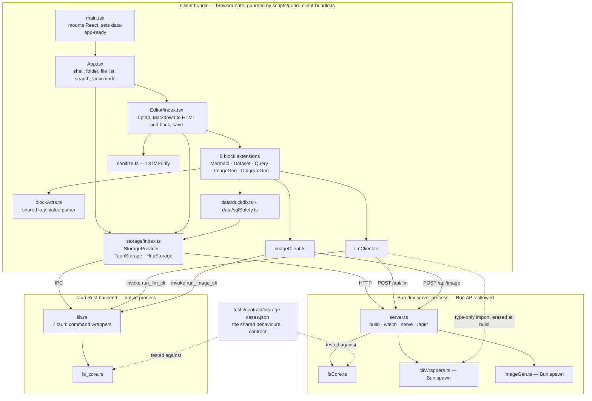
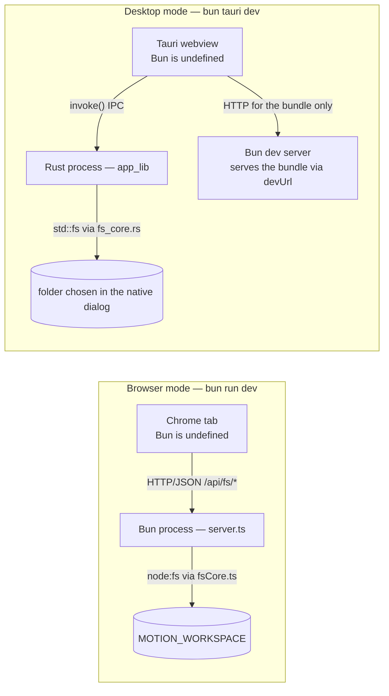
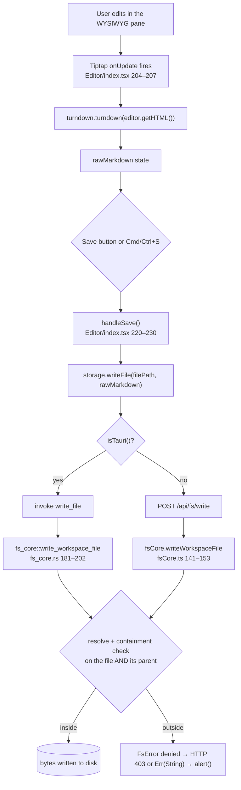
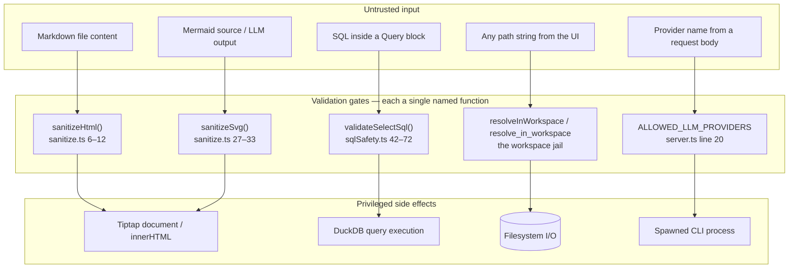
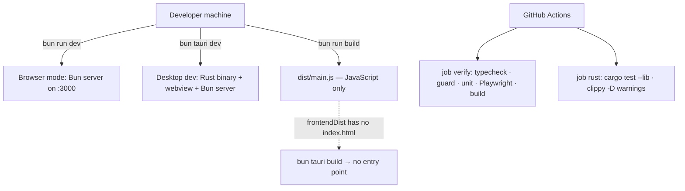

# Motion — Current Design Document

> Generated against the code as it exists at commit
> `13240d084d2f97b1df49616a573ebd29f7e994e2`, immediately after Phase 1 of the
> validation-loop plan landed. Every code claim cites a repository-relative path,
> a function, and line numbers. Where the repository's own prose contradicts the
> code, the code wins and the contradiction is recorded in §31.
>
> **Note for readers of an earlier revision of this document:** `WebStorage` no
> longer exists. Browser mode is now backed by a real filesystem API. See §6.1.

---

# 1. Document Overview

## 1.1 Purpose

Motion is a local-first technical writing IDE: it edits Markdown files on the
user's own filesystem, renders diagrams and SQL query results inline, and can
generate images and diagrams from natural-language prompts by shelling out to
command-line tools the user already has installed.

This document explains what the system does, why it is built the way it is, how
the components interact, and what a developer must understand before changing
it. It is written for two audiences at once: a junior developer who needs
implementation-level guidance, and a project manager who needs scope,
dependencies, risk, and known limitations.

## 1.2 Scope

**In scope:** the shipped application — the React/Tiptap editor, the two storage
implementations, the Bun development server, the Tauri desktop shell, the
DuckDB-WASM data layer, the CLI-backed generative blocks, and the validation loop
(tests, guards, CI) that gates all of it.

**Out of scope:** the `bin/` worklog tooling (a work-tracking and documentation
CLI that lives alongside the app but is not part of it), the generated
`docs/.index/` wiki artifacts, and the vendored DuckDB-WASM binaries under
`public/duckdb/`.

## 1.3 Intended audience and where to start

| Reader | Start at |
|---|---|
| New contributor | §2, §5, §6.1 (one contract, two implementations), §29 |
| Reviewer / architect | §5, §6, §22, §31 |
| Project manager | §2, §7, §31, §32 |
| Security reviewer | §22, §9.2, §14 |

## 1.4 Definitions and acronyms

| Term | Definition |
|---|---|
| **Workspace** | The single directory tree Motion is allowed to read and write. Everything outside it is refused. |
| **Workspace jail** | The containment check that enforces the above. Implemented twice — see §6.1. |
| **Storage contract** | The behavioural specification both filesystem implementations must satisfy, expressed as `tests/contract/storage-cases.json`. |
| **Browser mode** | `bun run dev` — the app served by the Bun dev server at `http://localhost:3000`, storage backed by HTTP. |
| **Desktop mode** | `bun tauri dev` — the same UI inside a Tauri 2 webview, storage backed by Rust IPC commands. |
| **Tauri** | A Rust framework that wraps a web UI in a native window. The UI is still a webview, so browser constraints still apply. |
| **IPC / `invoke`** | Inter-process communication. `invoke("cmd", args)` in JavaScript runs `#[tauri::command] fn cmd` in Rust. |
| **Bun** | The JavaScript runtime this project uses instead of Node.js. `Bun.*` APIs exist only in a real Bun process. |
| **HMR** | Hot Module Replacement — live browser refresh on source change. Motion does **not** have it (§29.4). |
| **Tiptap / ProseMirror** | The rich-text editor framework (Tiptap 3) and the document model beneath it. |
| **Atom node** | A Tiptap node with no editable child content. All five block extensions are atoms. |
| **E2E** | End-to-end tests — Playwright specs driving a real browser against the real dev server. |
| **DuckDB-WASM** | An analytical SQL engine compiled to WebAssembly, running in a Web Worker inside the page. |
| **Enrichment modules** | `ContentInjector`, `TopicRefiner`, `TOCGenerator`, `SkillGenerator` — currently unreachable code (§11.7). |
| **ULID** | Universally Unique Lexicographically Sortable Identifier — the work-item IDs in `docs/roadmap.md`. |

## 1.5 Related documents

| Document | Role | Currency |
|---|---|---|
| `README.md` | User-facing overview and known limitations | **Stale in two places** — §31, item D1 |
| `CLAUDE.md` | Working agreement, runtime facts, Definition of Done | Current at this commit (lines 54–58 describe `HttpStorage`) |
| `CHANGELOG.md` | Release history; the `0.1.0` entry begins at line 5 | Current |
| `docs/roadmap.md` | Generated from `.work/todo.jsonl`; the authoritative backlog | Generated, current |
| `docs/plans/2026-07-28-validation-loop.md` | The plan this work executes. Phases 0, 0.5 and 1 have landed | Current |
| `docs/plans/2026-07-26-motion-next-phase.md` | The prior feature-reachability plan | Partly superseded |
| `tests/contract/storage-cases.json` | The storage contract — normative, not documentation | Current |

There is no `docs/adr/` directory. §6 reconstructs the architectural decisions
from code comments, the plans, and the changelog, labelling anything inferred.

## 1.6 Assumptions

- **Assumption** — Motion is single-user and single-instance. Nothing
  authenticates a user, coordinates concurrent writers, or locks a file. The dev
  server binds a port with no authentication
  (`src/server.ts — Bun.serve(), lines 148–150`).
- **Assumption** — the intended deployment is a developer's own machine. There is
  no container image, no infrastructure-as-code, and no hosted environment
  anywhere in the repository.
- **Assumption** — the `claude`, `opencode`, `qwen` and `imagen` CLIs are
  user-installed and user-authenticated. Nothing installs, configures or checks
  them; `src/lib/cliWrappers.ts — callLLM(), line 56` spawns the provider name as
  an executable and nothing more.
- **Confirmed** — Markdown files on the user's disk are the only durable store.
  No database, no cache, no queue.

## 1.7 Open questions

Carried to §34 with full context. In brief: whether the packaged desktop build is
repaired before or after block round-tripping; whether the four enrichment
modules are wired up or deleted; and whether browser mode is ever intended to be
reachable from beyond `localhost`.

---

# 2. Executive Summary

## 2.1 Business purpose

Technical writers and developers keep documentation as Markdown in a folder or a
git repository. Editing it well means switching constantly between a text editor,
a diagram tool, a spreadsheet or SQL console, and an image generator. Motion
collapses that into one editor: the Markdown stays plain Markdown on disk, but
diagrams, datasets, SQL results and generated images render inline while you
write.

"Local-first" is the product's core promise and its main constraint
(`README.md`, lines 5–7). There is no account, no sync service, no server-side
storage. The only network calls the application makes are to its own dev server
on `localhost`; the only AI calls are subprocess invocations of command-line
tools the user already has installed.

## 2.2 Main user workflows

1. **Open a folder.** Motion lists every Markdown file underneath it, recursively.
2. **Open a note and edit it** in one of three view modes — WYSIWYG, raw
   Markdown, or a split view of both.
3. **Save** with the toolbar button or `Cmd/Ctrl+S`. The Tiptap document is
   converted back to Markdown and written to the same file.
4. **Create a new note** in the open workspace.
5. **Insert a content block** from the toolbar or by typing `/` at the start of a
   line: Mermaid diagram, Dataset, SQL Query, AI Image, AI Diagram.
6. **Query local data.** A Dataset block registers a CSV/JSON/JSONL file as a
   DuckDB table; a Query block runs `SELECT` against it and renders a table.
7. **Generate.** An AI Image block calls the `imagen` CLI; an AI Diagram block
   calls the `claude` CLI and validates that the result is parseable Mermaid.

## 2.3 Major system components

| Component | Where | One-line role |
|---|---|---|
| React shell | `src/App.tsx` | Header, search, file sidebar, view-mode switch |
| Tiptap editor | `src/components/Editor/index.tsx` | The document, three view modes, save |
| Block extensions | `src/components/Editor/extensions/` | Five custom node types with React node views |
| Storage abstraction | `src/lib/storage/index.ts` | One interface, two real implementations, chosen at module load |
| Browser filesystem core | `src/lib/fsCore.ts` | Jail, path resolution, listing, read/write — executed by the Bun dev server |
| Desktop filesystem core | `src-tauri/src/fs_core.rs` | The same behaviour in Rust, executed by the Tauri backend |
| The contract | `tests/contract/storage-cases.json` | The hand-written, language-neutral fixture both cores are tested against |
| Bun dev server | `src/server.ts` | Bundles, serves, exposes `/api/fs/*`, `/api/llm`, `/api/image` |
| Tauri backend | `src-tauri/src/lib.rs` | Seven IPC commands — thin wrappers over `fs_core` plus two CLI shells |
| Data layer | `src/lib/data/` | DuckDB-WASM lifecycle plus SQL validation |
| Transport routers | `src/lib/llmClient.ts`, `src/lib/imageClient.ts` | Pick `invoke()` or `fetch()` so UI code never touches `Bun` |
| Validation loop | `e2e/`, `scripts/guard-client-bundle.ts`, `.github/workflows/ci.yml` | The mechanism that makes "it works" checkable |

## 2.4 External dependencies

Everything external is a **local command-line tool**, not a network service:
`claude`, `opencode`, `qwen` (LLM CLIs) and `imagen` (image generation). All four
are optional; the app runs without them and the generative blocks fail with a
visible error. There is no API-key handling anywhere in the codebase because
Motion never talks to a provider directly — the CLI owns its own credentials.

There is no backend service, no database server, no message queue, no cache, no
managed AI platform, and no Model Context Protocol server.

## 2.5 Key architectural decisions

Each is developed fully in §6.

1. **One storage contract, two implementations, one shared fixture.** Browser
   mode and desktop mode cannot share code — one is TypeScript, one is Rust — so
   they share a hand-written *test fixture* instead, and both suites run it.
2. **Path containment is component-aware, never string `startsWith`.**
   `/x/ws` is a string prefix of `/x/ws-evil`.
3. **The dev server's workspace root is environment-only.** It is never taken
   from the request; accepting a client-supplied directory would turn the dev
   server into an arbitrary-filesystem read API.
4. **Anything needing `Bun` sits behind a transport router**, and a *static*
   guard over the import graph enforces it — a runtime check cannot, because
   dormant code never runs.
5. **The validation loop is a first-class architectural component.** The E2E
   harness fails on console errors, uncaught exceptions, failed requests, and any
   HTTP status ≥ 400.

## 2.6 Primary risks

| Risk | Severity | Detail |
|---|---|---|
| The packaged desktop build does not work | High | `bun run build` emits no `index.html`, so `frontendDist` points at a directory with no entry point. Only `bun tauri dev` runs. §27.3 |
| Four of five block types do not survive save/reload | High | They serialize without a language class, so the round trip degrades them into plain code blocks. §9.4 |
| Four enrichment modules are dead code | Medium | They reach `Bun.spawn` through `cliWrappers.ts` and cannot execute in either shipped mode. §11.7 |
| `README.md` still describes the pre-Phase-1 world | Medium | It tells readers browser mode does not persist writes. It does now. §31 D1 |
| No HMR | Low | Every source change needs a manual browser reload. §29.4 |

---

# 3. Requirements Summary

The repository has no formal requirements document. The requirements below are
**reconstructed** from the code, the tests, the contract fixture, `README.md`,
`CLAUDE.md`, and `docs/plans/2026-07-28-validation-loop.md`.

## 3.1 Functional requirements

| ID | Requirement | Implemented in | State |
|---|---|---|---|
| FR-1 | Open a folder and list every Markdown file beneath it, recursively | `src/lib/fsCore.ts — collectFiles(), lines 106–128`; `src-tauri/src/fs_core.rs — collect_files(), lines 135–141` | **Confirmed**, both modes |
| FR-2 | Filter the note list by name as the user types | `src/App.tsx — filteredFiles, lines 19–23` | **Confirmed** |
| FR-3 | Read a Markdown file into the editor | `src/components/Editor/index.tsx — loadFile(), lines 236–263` | **Confirmed** |
| FR-4 | Write the edited document back to the same file | `src/components/Editor/index.tsx — handleSave(), lines 220–230` | **Confirmed**, both modes |
| FR-5 | Create a new note in the open workspace | `src/App.tsx — handleNewNote(), lines 46–67` | **Confirmed**, both modes |
| FR-6 | Three view modes, switchable at any time, without content loss | `src/components/Editor/index.tsx — shouldSyncMarkdownIntoEditor(), lines 41–46`; render branches, lines 334–394 | **Confirmed** |
| FR-7 | Render a Mermaid diagram inline, editable in place | `src/components/Editor/extensions/MermaidExtension.tsx — MermaidNodeView(), lines 33–70` | **Confirmed** |
| FR-8 | Register a local CSV/JSON/JSONL file as a queryable table | `src/lib/data/duckdb.ts — registerFile(), lines 51–77` | **Confirmed** |
| FR-9 | Run SQL against registered datasets in-browser | `src/lib/data/duckdb.ts — executeQuery(), lines 83–113` | **Confirmed** |
| FR-10 | Generate an image from a prompt via the `imagen` CLI | `src/lib/imageClient.ts — generateImageFromUI(), lines 12–27` | **Confirmed** |
| FR-11 | Generate a Mermaid diagram from a prompt, validated before acceptance | `src/components/Editor/extensions/DiagramGenExtension.tsx — generateMermaidDiagram(), lines 16–27` | **Confirmed** |
| FR-12 | Insert any block from the toolbar or a `/` slash menu | `src/components/Editor/insertBlock.ts — insertBlock(), lines 21–31`; `index.tsx — detectSlashTrigger(), lines 64–78` | **Confirmed** |
| FR-13 | All five block types survive a save/reload cycle | — | **NOT MET — 1 of 5.** §9.4 |

## 3.2 Non-functional requirements

| ID | Requirement | Enforced by |
|---|---|---|
| NFR-1 | Filesystem access is confined to the opened workspace; `..`, absolute escapes, sibling-prefix directories and outward symlinks are all refused | `src/lib/fsCore.ts — resolveInWorkspace(), lines 75–92`; `src-tauri/src/fs_core.rs — resolve_in_workspace(), lines 89–121`; contract cases at `tests/contract/storage-cases.json` lines 73–97 |
| NFR-2 | Browser mode and desktop mode behave identically for storage | `tests/contract/storage-cases.json`, run by `src/lib/fsCore.contract.test.ts` lines 74–132 **and** `src-tauri/src/fs_core.rs — storage_contract_rust_implementation(), lines 279–375` |
| NFR-3 | No `Bun.*` API is reachable from the browser bundle | `scripts/guard-client-bundle.ts`, lines 72–107 |
| NFR-4 | Document-supplied SQL cannot modify data | `src/lib/data/sqlSafety.ts — validateSelectSql(), lines 42–72` |
| NFR-5 | Untrusted Markdown and generated SVG are sanitized before insertion | `src/lib/sanitize.ts — sanitizeHtml(), lines 6–12; sanitizeSvg(), lines 27–33` |
| NFR-6 | Zero console errors, uncaught exceptions, failed requests, or responses ≥ 400 during E2E | `e2e/fixtures.ts`, lines 52–89 (`auto: true`, line 87) |
| NFR-7 | One command answers "is the app OK?" | `package.json — scripts.verify, line 14` |
| NFR-8 | CI actually compiles and tests the application | `.github/workflows/ci.yml`, lines 23–102 |
| NFR-9 | An LLM or image CLI call cannot hang the app indefinitely | 120 s timeouts on all four paths — §18.5 |
| NFR-10 | Strict TypeScript across the codebase | `bun run typecheck`, in `verify` and in CI (lines 36–37) |
| NFR-11 | Rust warnings are errors | `.github/workflows/ci.yml`, lines 101–102 (`clippy -D warnings`) |
| NFR-12 | The packaged desktop application launches | **NOT MET.** §27.3 |

## 3.3 Requirements not addressed at all

Stated plainly rather than invented:

- **Availability, backup, disaster recovery.** Not applicable as designed — the
  user's files are the user's responsibility, presumably under their own version
  control.
- **Scalability.** Single-user, single-process. There is no scaling unit.
- **Compliance and data retention.** No personal data is collected, stored, or
  transmitted by Motion itself.
- **Observability.** Effectively absent; §25 documents what little exists.
- **Authentication and authorization.** Absent by design. §22.6 explains why that
  constrains how the dev server may be exposed.

## 3.4 Traceability (summary)

The full matrix is §33. The load-bearing rows:

| Requirement | Component | Test that catches a regression |
|---|---|---|
| NFR-1 | `fsCore.ts` + `fs_core.rs` | Contract cases "refuses parent traversal", "refuses an absolute path outside the workspace", "refuses a sibling directory sharing the workspace name prefix", "refuses a symlink pointing outside the workspace" |
| NFR-2 | The contract fixture itself | `bun test src` **and** `cargo test --lib` |
| NFR-3 | `guard-client-bundle.ts` | `bun run guard:client`, in CI at lines 42–43 |
| FR-4 | `HttpStorage.writeFile` / `write_file` | `e2e/persistence.spec.ts` — "an edit survives save and reload", lines 31–52 |
| NFR-6 | `e2e/fixtures.ts` | Self-enforcing |

---

# 4. System Context

## 4.1 Actors and external systems

| Actor / system | Type | Interaction |
|---|---|---|
| **Writer** (the only human actor) | User | Drives the editor UI directly. No account, no roles. |
| **Local filesystem** | External store | The one durable store. Read and written only through the workspace jail. |
| **`claude` / `opencode` / `qwen` CLI** | External process | Spawned for LLM completions. Optional. Owns its own credentials. |
| **`imagen` CLI** | External process | Spawned for image generation. Optional. Wraps Google's Gemini Imagen API. |
| **DuckDB-WASM** | In-process engine | Served from `public/duckdb/`, runs in a Web Worker inside the page. |
| **Chrome / Chromium** | Test-only | Playwright drives it against the real dev server. |
| **GitHub Actions** | Build system | Runs the whole validation loop on every pull request. |

## 4.2 Trust boundaries

There are four, and confusing them is how the interesting bugs happen:

1. **Webview / browser ↔ backend.** The UI runs where `Bun` is undefined. It may
   only reach the filesystem or a CLI through IPC (`invoke`) or HTTP
   (`fetch("/api/...")`).
2. **Backend ↔ filesystem.** The workspace jail. Every caller-supplied path is
   canonicalized and checked for containment before any I/O.
3. **Document content ↔ execution.** A Markdown file is untrusted input. Its HTML
   is sanitized; its SQL is validated as `SELECT`-only; Mermaid output is
   sanitized as SVG before it reaches `innerHTML`.
4. **Backend ↔ spawned CLI.** Provider names are allowlisted before a process is
   spawned; a timeout bounds every call.

## 4.3 System context diagram


**How to read it.** The Writer only ever touches the UI. The UI never touches the
filesystem or a CLI itself — it always crosses a process boundary first. Which
backend is active is decided once, at module load, by `isTauri()`
(`src/lib/storage/index.ts`, line 115). The two backend boxes are mutually
exclusive at runtime for storage purposes.

**Failure behaviour.** If a CLI is missing, the spawn fails and the error
surfaces in the block's own error state — nothing else is affected. If the
filesystem refuses a path, the error is classified (`denied` / `not-found` /
`not-a-directory`) and mapped to an HTTP status (`src/server.ts`, lines 280–285)
or to an IPC `Err(String)` (`src-tauri/src/fs_core.rs`, lines 51–55).

## 4.4 Major inputs and outputs

| Direction | Data | Format |
|---|---|---|
| In | Markdown notes | UTF-8 `.md` files |
| In | Datasets | `.csv`, `.json`, `.jsonl` |
| In | Configuration | `MOTION_WORKSPACE`, `PORT`, `CI`, `BASELINE` environment variables |
| Out | Markdown notes | UTF-8 `.md`, written in place |
| Out | Generated images | Base64 PNG data URI embedded in the Markdown |
| Out | Generated diagrams | Mermaid source embedded in the Markdown |

---

# 5. High-Level Architecture

## 5.1 The shape of the system in one paragraph

Motion is a single-page React application with two interchangeable backends. The
UI is identical in both modes and compiled into one bundle. A thin storage
interface (`StorageProvider`) is bound at module load to either `TauriStorage`
(IPC into Rust) or `HttpStorage` (HTTP into the Bun dev server). Behind each of
those sits a filesystem *core* — `fs_core.rs` and `fsCore.ts` — which are
independent implementations of one shared, hand-written behavioural contract.
Everything that requires a real process (spawning a CLI, touching the disk) lives
behind that boundary; everything in front of it is browser-safe code, and a
static guard proves it.

## 5.2 Logical architecture



**How to read it.** Solid arrows are runtime calls or value imports; dotted
arrows are test-time obligations and erased type imports. Two things to notice:

- `fsCore.ts` sits inside the **server** box, not the client box. It imports
  `node:fs` (`src/lib/fsCore.ts`, lines 16–24) and executes in the Bun process.
  Its own header says so: *"NOT imported by the browser bundle"* (line 14).
- The dotted `llmClient → cliWrappers` edge is an `import type`
  (`src/lib/llmClient.ts`, line 3). It is erased at build time, which is the only
  reason the client can borrow `LLMOptions`/`LLMResponse` from a
  `Bun.spawn`-using module without failing the guard. The guard models this
  explicitly (`scripts/guard-client-bundle.ts — TYPE_ONLY_RE, line 57`).

## 5.3 Runtime architecture — the two modes



**How to read it.** In desktop *development* mode the Bun dev server is still
running, because `src-tauri/tauri.conf.json` sets `devUrl` to
`http://localhost:3000` and `beforeDevCommand` to `bun run dev`. The webview
fetches the bundle over HTTP, but storage calls go over IPC to Rust, because
`isTauri()` returns true inside the webview. The dev server's `/api/fs/*` routes
are live but unused in that mode.

Note that `Bun` is undefined in **both** left-hand boxes. That is §6.4's entire
subject.

**Failure behaviour.** If the Rust side has no workspace opened,
`workspace_root()` returns `"No workspace opened. Open a folder first."`
(`src-tauri/src/lib.rs — workspace_root(), lines 99–107`) and every filesystem
command fails with that message.

## 5.4 Data flow — saving a note



**How to read it.** `rawMarkdown` is kept current continuously by `onUpdate`, not
computed at save time — deliberately, so switching to Markdown view never shows
stale content. The containment check is the same logical gate on both branches,
which is exactly the property the contract fixture exists to keep true.

**Failure behaviour.** A refused write surfaces as an `alert()`
(`src/components/Editor/index.tsx`, line 228) and, in browser mode, as an HTTP
403 that the E2E gate fails a test on unless the test explicitly allows it
(`e2e/persistence.spec.ts`, lines 111–113).

## 5.5 Trust-boundary diagram



**How to read it.** Nothing crosses from left to right without passing through
the middle column. If you are adding a new path from untrusted input to a side
effect, you are adding a gate or reusing one of these five.

**The one asymmetry worth naming:** filesystem operations are jailed, but the
*prompt* passed to a spawned CLI is arbitrary user and document text. Only the
provider name is allowlisted. See §22.6.

## 5.6 Deployment architecture



**How to read it.** The dashed edge is the honest part. `bun run build` is
`bun build src/main.tsx --outdir=dist --minify` (`package.json`, line 8), which
emits JavaScript only; `src-tauri/tauri.conf.json` points `frontendDist` at
`../dist`, which therefore contains no HTML shell. CI runs the build
(`.github/workflows/ci.yml`, lines 54–55) and it *succeeds* — the build is not
broken, its output is incomplete for packaging. Tracked as B3 in
`docs/roadmap.md`.

---

# 6. Architectural Decisions

There is no `docs/adr/` directory. The decisions below are reconstructed from
code comments, the plan documents, and the changelog. Where a rationale is
inferred rather than written down, it is labelled **Assumption**.

## 6.1 AD-1 — One storage contract, two hand-written implementations, one shared fixture

**This is the central design decision in the system. Everything else in §6
follows from it.**

### 6.1.1 The decision

Motion needs identical filesystem behaviour in two runtimes that cannot share a
line of code:

- Browser mode runs in a Bun process and uses `node:fs`
  (`src/lib/fsCore.ts`, lines 16–24).
- Desktop mode runs in a Rust process and uses `std::fs`
  (`src-tauri/src/fs_core.rs`, line 10).

So the two implementations do not share code. They share a **behavioural
contract**, expressed as a hand-written JSON fixture, and *both test suites run
it*:

| Implementation | Test that runs the fixture | Command |
|---|---|---|
| `src/lib/fsCore.ts` | `src/lib/fsCore.contract.test.ts`, lines 74–132 | `bun test src` |
| `src-tauri/src/fs_core.rs` | `mod contract` — `storage_contract_rust_implementation()`, lines 279–375 | `cargo test --lib` |

The fixture is `tests/contract/storage-cases.json`: a `setup` block describing a
workspace to build (lines 22–38) and seventeen `cases`, each with an `op`, a
`path`, and an `expect` (lines 40–156).

### 6.1.2 Why the fixture is hand-written and language-neutral, not generated

This is the part worth understanding, and the file says it in its own header:

> *"Canonical storage contract. Hand-written and language-neutral on purpose:
> generating it from TypeScript would make TS the source of truth and give us a
> second artifact to keep in sync, which is the exact failure mode this file
> exists to prevent."*
> — `tests/contract/storage-cases.json`, lines 2–6

Unpacked, there are three distinct reasons:

1. **A generator picks a winner.** If the fixture were generated from the
   TypeScript implementation, then TypeScript's behaviour would *be* the
   specification by definition, and the Rust tests would only ever assert
   "Rust agrees with whatever TS currently does" — including its bugs. Neither
   implementation is meant to be authoritative. The fixture is.
2. **A generator is a third artifact that can drift.** The problem being solved
   is two things drifting apart. Adding a generator makes it three things, and
   the generator itself needs a source of truth, tests, and a run step in CI.
   A checked-in JSON file has none of those failure modes.
3. **A hand-written case can encode intent that no runtime behaviour reveals.**
   Several cases carry a `_why` field recording the specific incident they pin —
   e.g. line 55: *"B5/B11. The welcome document stores `source: data/sales.csv`.
   Rust used to reject this outright (no parent component) while Node would have
   resolved it against the process cwd. Both must now mean the same file."*
   A generator observing current behaviour cannot produce that.

**One further design property:** error cases assert an error *class*, not a
message string (`storage-cases.json`, lines 13–14). `expect.result` is one of
`ok | denied | not-found | not-a-directory`. That lets each language word its
errors naturally — `FsErrorCode` in TypeScript (`src/lib/fsCore.ts`, line 27),
`FsErrorCode` in Rust (`src-tauri/src/fs_core.rs`, lines 13–29) — while the
classification stays identical. The Rust enum's `as_str()` (lines 20–29) exists
purely to emit the fixture's wire names.

### 6.1.3 What the contract actually pins

| Case (abridged) | Fixture lines | What would break without it |
|---|---|---|
| reads a file at the workspace root | 41–46 | — |
| reads a nested file | 47–52 | Recursive resolution |
| resolves a relative path against the workspace root, not the cwd | 53–59 | Documents stop being portable between modes (B5/B11) |
| accepts an absolute path inside the workspace | 60–65 | The UI passes absolute paths from listings |
| reports a missing file as not-found, never as empty content | 66–72 | The dev server's old "200 + index.html" behaviour |
| refuses parent traversal | 73–78 | `..` escape |
| refuses an absolute path outside the workspace | 79–84 | Direct escape |
| refuses a sibling directory sharing the workspace name prefix | 85–91 | The `startsWith` bug — §6.2 |
| refuses a symlink pointing outside the workspace | 92–97 | Symlink escape |
| writes a new file and reads it back | 98–105 | The behaviour `WebStorage` used to fake |
| overwrites an existing file | 106–112 | — |
| writes into an existing subdirectory | 113–119 | — |
| refuses a write that escapes the workspace | 120–126 | Write-side escape |
| refuses a write through an escaping symlink | 127–133 | Write-side symlink escape |
| lists markdown recursively, sorted, skipping dotdirs and other extensions | 134–141 | Listing shape |
| lists data files by extension, sorted | 142–149 | Dataset picker |
| listing returns absolute paths | 150–155 | Web used to return bare filenames while Tauri returned absolute paths |

### 6.1.4 The fixture harnesses

Both harnesses build a fresh workspace per case, from the same `setup` block, and
both had to solve the same platform problem independently:

```ts
// src/lib/fsCore.contract.test.ts — buildFixture(), lines 33–37 (abridged)
// realpath the temp base: on macOS /tmp is a symlink to /private/tmp, and the
// implementation canonicalizes, so an un-resolved root would never match the
// paths it returns.
const base = realpathSync(mkdtempSync(join(tmpdir(), "motion-contract-")));
```

```rust
// src-tauri/src/fs_core.rs — build(), lines 231–234 (abridged)
// macOS temp dirs sit behind a symlink (/var -> /private/var); the
// implementation canonicalizes, so the fixture must too.
let base_real = fs::canonicalize(base.path()).expect("canonicalize base");
```

Both expand `$ROOT` and `$OUTSIDE` placeholders into the fixture's real
directories (`fsCore.contract.test.ts — expand(), lines 66–68`;
`fs_core.rs — expand(), lines 262–265`), and both compare listings as
workspace-relative, forward-slashed paths so the assertion is
platform-independent (`fsCore.contract.test.ts`, lines 117–119;
`fs_core.rs — relative_paths(), lines 267–277`).

### 6.1.5 Alternatives considered

| Alternative | Why not |
|---|---|
| Share one implementation via WebAssembly or an FFI binding | Enormous build complexity for ~160 lines of logic; would put a Rust toolchain in the browser-mode dependency path |
| Make desktop mode call the dev server too | Defeats the point of the desktop app — it would require a Bun process running alongside the packaged binary |
| Generate the fixture from one implementation | See §6.1.2 |
| Trust code review to keep them aligned | This is what was happening before, and the header of `fsCore.ts` records the result: *"they have already drifted seven ways once"* (lines 11–12) |

### 6.1.6 Consequences and revisit trigger

**Benefit.** Any behavioural divergence turns a build red rather than becoming a
bug report. The contract is the only artifact a reviewer must read to know what
storage is supposed to do.

**Cost.** Two implementations to maintain, and any new storage behaviour requires
three edits (TS, Rust, fixture) instead of one. Adding a case to the fixture
without implementing it in both languages fails one of the two suites
immediately, which is the intended pressure.

**Revisit when** the two implementations need to diverge intentionally (for
example if browser mode gains a permission model desktop mode does not have). At
that point the fixture needs per-implementation opt-outs, which it does not have
today.

## 6.2 AD-2 — Path containment is component-aware, never string `startsWith`

**Decision.** Both implementations decide "is this path inside the workspace?" by
comparing path *components*, never by comparing strings.

**The bug this avoids, concretely.** For a workspace at `/x/ws`, the string
`/x/ws-evil/planted.md` starts with `/x/ws`. A `candidate.startsWith(root)` check
therefore admits a completely unrelated sibling directory. An attacker (or a
mistaken document) needs only to create a directory whose name extends the
workspace name.

**TypeScript implementation:**

```ts
// src/lib/fsCore.ts — isInsideWorkspace(), lines 48–52
export function isInsideWorkspace(root: string, candidate: string): boolean {
    const rel = relative(root, candidate);
    if (rel === "") return true;
    return !rel.startsWith("..") && !isAbsolute(rel);
}
```

`path.relative("/x/ws", "/x/ws-evil/planted.md")` returns `"../ws-evil/planted.md"`,
which starts with `..` and is rejected. The comment above it (lines 36–47) names
the exact case and points at the Rust test that mirrors it.

**Rust implementation:**

```rust
// src-tauri/src/fs_core.rs — is_inside_workspace(), lines 75–77
pub fn is_inside_workspace(root: &Path, candidate: &Path) -> bool {
    candidate.starts_with(root)
}
```

**This is not the same function as the JavaScript one it resembles.**
`Path::starts_with` compares path components, not bytes — `/x/ws-evil` does not
start with `/x/ws` as a path. The doc comment says so explicitly (lines 71–74).
A reader skimming for `starts_with` and concluding "they used the naive check in
Rust" would be wrong, which is why the comment is there.

**Both are pinned by the same contract case**, "refuses a sibling directory
sharing the workspace name prefix" (`tests/contract/storage-cases.json`, lines
85–91), whose `_why` field states the reasoning. The fixture plants bait: a
`sibling_dirs: ["-evil"]` entry (line 37) creates `<root>-evil/planted.md` in
both harnesses (`fsCore.contract.test.ts`, lines 56–60;
`fs_core.rs`, lines 253–257).

**Second design property: the root itself counts as inside.** Both
implementations return true when the candidate *is* the root (TS: `rel === ""`,
line 50; Rust: `starts_with` is reflexive). This is required because
`writeWorkspaceFile` checks a file's *parent*, which for a top-level note is the
root itself (`src/lib/fsCore.ts`, lines 43–46 comment; the check at lines
143–148).

**Third design property: canonicalization happens before containment.** A path
that exists is resolved with `realpathSync` / `fs::canonicalize`; a path that
does *not* exist yet (a new note) has its **parent** canonicalized and the
filename joined on:

```ts
// src/lib/fsCore.ts — resolveInWorkspace(), lines 79–86
let resolved: string;
if (existsSync(absolute)) {
    resolved = realOrThrow(absolute);
} else {
    const parent = dirname(resolve(absolute));
    const parentReal = realOrThrow(parent);
    resolved = join(parentReal, basename(absolute));
}
```

```rust
// src-tauri/src/fs_core.rs — resolve_in_workspace(), lines 99–112 (abridged)
let resolved = if absolute.exists() {
    real_or_not_found(&absolute)?
} else {
    // Canonicalizing the parent is what resolves any `..` or symlink in the
    // path of a file that does not exist yet.
    real_or_not_found(parent)?.join(file_name)
};
```

Without this, a symlinked parent directory would let a *new* file be created
outside the jail even though the jail check passed.

## 6.3 AD-3 — The dev server's workspace root is environment-only

**Decision.** The Bun dev server's workspace root is read once, at startup, from
the `MOTION_WORKSPACE` environment variable. It is never taken from a request.

```ts
// src/server.ts, lines 27–40
/**
 * The workspace browser mode reads and writes.
 *
 * Env-only by design (see the /api/fs/ handler). Defaults to public/demo so a
 * fresh clone still opens with something to look at; E2E runs point it at a
 * seeded temp directory so specs never mutate tracked fixtures.
 */
const WORKSPACE_ROOT = resolve(
    PROJECT_ROOT,
    process.env["MOTION_WORKSPACE"] ?? join("public", "demo")
);
```

**Why this matters more than it looks.** The `/api/fs/*` handler takes a `path`
from the caller for read and write, but the *root* those paths are resolved
against is a server-side constant. The route handler's own comment states the
consequence of doing otherwise:

> *"The workspace root comes from MOTION_WORKSPACE and NOTHING ELSE. It is
> deliberately not client-supplied: accepting a directory from the request would
> turn the dev server into an arbitrary-filesystem read API for anything that can
> reach the port."*
> — `src/server.ts`, lines 232–236

If the root were a request parameter, the jail would still function — it would
just be a jail around a directory the caller chose, which is no jail at all. Any
page in the browser, any process on the machine, and (if the port were exposed)
anything on the network could read any file the dev-server user can read.

**Note the shape difference this creates in the storage interface.**
`HttpStorage.listFiles` ignores its `path` argument entirely:

```ts
// src/lib/storage/index.ts — HttpStorage.listFiles(), lines 82–86
async listFiles(_path: string): Promise<string[]> {
    const res = await fetch("/api/fs/list");
    ...
}
```

The underscore is deliberate. Browser mode always lists the configured root;
there is nothing for a caller to choose. Symmetrically,
`HttpStorage.openFolder()` (lines 75–80) does not open a picker — the browser has
none — it fetches `GET /api/fs/workspace` and returns the real root so the UI can
display where it is working.

**The desktop side solves the same problem differently**, because it *does* have
a folder picker. The root is set once by `set_workspace`
(`src-tauri/src/lib.rs`, lines 109–123), which canonicalizes and requires a
directory, and is then held in `WorkspaceState` behind a `Mutex`
(lines 90–92). Every command reads it via `workspace_root()` (lines 99–107).

**A closed hole worth recording (B14).** `list_markdown_files` used to *write*
the workspace root — it would re-root the jail to whatever directory it was
handed, giving a second, unguarded path into the sandbox that never went through
the folder dialog. It no longer writes state at all; its `path` argument is now
validated as a location *inside* the already-open workspace:

```rust
// src-tauri/src/lib.rs — list_markdown_files(), lines 145–150
fn list_markdown_files(path: String, state: State<'_, WorkspaceState>) -> Result<Vec<String>, String> {
    let root = workspace_root(&state)?;
    let target = fs_core::resolve_in_workspace(&root, &path).map_err(String::from)?;
    fs_core::collect_files(&target, fs_core::MARKDOWN_EXTENSIONS).map_err(String::from)
}
```

Pinned by `src-tauri/src/lib.rs — listing_cannot_re_root_the_workspace_and_refuses_outside_paths(), lines 232–248`.

**Defaults and test isolation.** The default root is `public/demo` so a fresh
clone opens with something to look at (`src/server.ts`, lines 34–37). E2E runs
override it with a seeded temp directory created at Playwright config load
(`playwright.config.ts`, line 6, passed via `webServer.env` at line 52) — because
specs now perform *real* writes and must never mutate the tracked fixtures in
`public/demo`. The config also refuses to reuse an existing server for exactly
this reason:

```ts
// playwright.config.ts, lines 48–50
// Never reuse a server here: an already-running dev server would be
// pointed at someone's real workspace, not the seeded scratch one.
reuseExistingServer: false,
```

## 6.4 AD-4 — `Bun` is undefined in the browser AND in the Tauri webview

**This is the root cause this codebase has fixed four separate times.**

**Context.** Bun is the project runtime, and `CLAUDE.md` instructs contributors to
prefer Bun APIs. That advice is correct for the dev server, the build, and the
tests. It is *wrong* for anything the UI executes, because:

- in a browser tab, `Bun` obviously does not exist;
- in the Tauri webview, `Bun` also does not exist — the webview is a browser, and
  the fact that a Rust process launched it changes nothing.

The second half is what keeps catching people. The guard script names the four
commits where it was re-fixed:

```ts
// scripts/guard-client-bundle.ts, lines 4–7 (verbatim)
 * This exists because one root cause has been re-fixed four times in this repo
 * (3ff4285, 21a28f9, 5e995d8, 261c89f) and is open a fifth time as 01KYJW5X:
 * code that assumes a Bun process while actually executing in a browser or a
 * Tauri webview, where `Bun` is undefined.
```

**Decision, part 1 — transport routers.** UI code never calls a Bun API. It calls
a router that picks the right transport for the current runtime:

```ts
// src/lib/llmClient.ts — callLLMFromUI(), lines 17–35 (abridged)
if (isTauri()) {
    const content = await invoke<string>("run_llm_cli", { provider, prompt, systemPrompt });
    return { content, rawOutput: content };
}
const res = await fetch("/api/llm", { method: "POST", /* ... */ });
```

`src/lib/imageClient.ts — generateImageFromUI(), lines 12–27` is the same shape
for images. These two modules are the *only* place in the client bundle that
knows which runtime is active for CLI work, and they are called only from block
extensions (`DiagramGenExtension.tsx`, line 6; `ImageGenExtension.tsx`, line 4).

Each router has a twin at each destination so the actual spawn happens in a real
process:

| Router | Browser destination | Desktop destination |
|---|---|---|
| `llmClient.ts` | `POST /api/llm` → `src/lib/cliWrappers.ts — callLLM(), lines 29–98` (`Bun.spawn`, line 56) | `invoke("run_llm_cli")` → `src-tauri/src/lib.rs — run_llm_cli(), lines 21–53` (`tokio::process::Command`, line 41) |
| `imageClient.ts` | `POST /api/image` → `src/lib/imageGen.ts — generateImage(), lines 26–75` (`Bun.spawn`, line 34) | `invoke("run_image_cli")` → `src-tauri/src/lib.rs — run_image_cli(), lines 59–86` |

**Decision, part 2 — a *static* guard, because a runtime gate cannot close this.**

`scripts/guard-client-bundle.ts` walks the real import graph from `src/main.tsx`
(the queue loop, lines 72–92) and fails on any `Bun.` use (lines 96–107).

The reasoning is quoted from the script's own header (lines 9–15):

> *"A runtime gate cannot catch this. The console/network fixture only sees code
> that a test actually executes, and the four enrichment modules (TopicRefiner,
> ContentInjector, TOCGenerator, SkillGenerator) are dead code — no E2E spec
> would ever run them, so they would stay green right up until the day someone
> wires them to a button. Their unit tests pass for the same reason: they mock
> the boundary and run inside Bun."*

That is the whole argument for static over runtime: **a runtime gate can only
observe code that runs, and the dangerous code is dormant.** Three
implementation details make the guard work:

| Detail | Line | Why |
|---|---|---|
| `BUN_USE` uses a negative lookbehind for identifier and quote characters | 27 | Matches `Bun.x` and `Bun[...]`, but not `myBun.x` or a quoted `"Bun."` |
| `TYPE_ONLY_RE` strips `import type ... from` before import extraction | 57 | Type imports are erased at build time. This is precisely how `llmClient.ts` line 3 borrows `LLMOptions`/`LLMResponse` from the Bun-only `cliWrappers.ts` without dragging `Bun.spawn` into the bundle |
| Comment-only lines are skipped | 82 | Otherwise the prose *about* Bun in these very files would trip the guard |

**Where it runs.** `bun run guard:client` is in `verify` (`package.json`, line
14), in CI (`.github/workflows/ci.yml`, lines 42–43), and in the pre-commit hook
(`hooks/pre-commit`, line 127). On success it prints the module count checked
(line 109).

**Revisit when** the client bundle is split per runtime — the guard would then
need one root per entrypoint.

## 6.5 AD-5 — The validation loop is architecture, not tooling

**Context.** `CHANGELOG.md` frames the release: *"The application itself has
existed since January 2026; this release is the point at which it became possible
to know whether it works."* (lines 7–9). Before it, the only CI workflow
validated work-log JSONL and never installed Bun or Rust, so a pull request
deleting `src/App.tsx` passed green (`CHANGELOG.md`, lines 34–37).

**Decision.** One command is the gate:

```json
// package.json, line 14
"verify": "bun run typecheck && bun run guard:client && bun run test && bun run test:e2e"
```

Five components, each designed against a specific past failure:

1. **`tsc --noEmit`, strict** — `package.json`, line 9.
2. **The static Bun guard** — §6.4. Covers what tests structurally cannot.
3. **Unit tests, scoped to `src`** — `package.json`, line 11. The scoping is not
   cosmetic: unscoped, Bun would try to execute the Playwright specs and fail
   (`CLAUDE.md`, testing table).
4. **E2E against the real dev server** — `playwright.config.ts`, lines 45–53.
   The comment at lines 10–12 states why: *"a spec run is a real app run — there
   is no separate 'test build' that could drift from what ships."*
5. **Rust tests plus clippy** — `.github/workflows/ci.yml`, lines 97–102. These
   are not in `verify` (they need a Rust toolchain) but they are in CI and in the
   Definition of Done.

**The console/network gate is the highest-leverage piece** and gets its own
decision below.

## 6.6 AD-6 — The E2E gate inspects HTTP status, not just transport failure

**Decision.** `e2e/fixtures.ts` registers four listeners, not three (lines
57–76): `console` filtered to `error`, `pageerror`, `requestfailed`, and
`response` where `status() >= 400`. The fixture is declared `auto: true`
(line 87), so **a spec cannot forget it** — importing `test` from
`./fixtures` is enough, and importing from `@playwright/test` directly is called
out as wrong in the header (lines 4–5).

**Why the fourth listener exists** — quoted from lines 13–17:

> *"Playwright's `requestfailed` event does NOT fire for HTTP 404 or 500 — those
> are *successful* requests that happen to carry an error status. A 404 is
> precisely the signature of bug B2 (New Note creates a file the editor then
> cannot read), so a gate watching only `requestfailed` would sail straight past
> the bug it exists to catch."*

**And it forced a server change.** The dev server used to answer *every*
unmatched path with `200` and the SPA shell, so a missing note read back
*successfully* as a page of HTML — structurally invisible to any network gate.
The fallback is now split three ways:

| Case | Response | Lines |
|---|---|---|
| Unknown `/api/*` route | JSON 404 | `src/server.ts`, 305–310 |
| Path whose last segment contains a `.` | 404 | `src/server.ts`, 318–321 |
| Everything else | SPA shell | `src/server.ts`, 324–327 |

The comment at lines 313–317 records the reasoning in full. A related fix:
`/favicon.ico` returns `204`, not 404 (lines 168–170), because the browser
requests it unprompted and a real 404 would fail every E2E run.

**Escape hatch, deliberately narrow.** `PageGuard.allow(pattern)` (lines 39–41)
lets one test opt out of one expected violation; the doc comment says *"a bare
`/./` defeats the gate."* The only current use is the spec that asserts the
filesystem API returns 403 for a path outside the workspace
(`e2e/persistence.spec.ts`, lines 111–113) — where the refusal *is* the pass
condition.

**Warnings are recorded but never fatal** (`e2e/fixtures.ts`, lines 60–62;
rationale at lines 19–20).

**The baseline was measured, not assumed.** Two probes are excluded from the
suite and run by hand with `BASELINE=1` (`playwright.config.ts`, line 22):
`e2e/baseline.capture.spec.ts` re-measures the cold-load console/network
baseline, and `e2e/guard.proof.capture.spec.ts` proves the gate still bites —
whose **correct result is 3 failed / 1 passed**. If all four pass, the gate is
broken (`CLAUDE.md`, testing section).

## 6.7 AD-7 — Security is enforced at the backend, in both backends

Summarised here, detailed in §22.

**Decision.** Neither backend trusts the UI. Every path is re-derived and
re-checked at the boundary; the UI's copy of a path is treated as a hint. The
jail lives in the shared cores (§6.1), not in the command wrappers — a rule the
Rust side states explicitly:

> *"All jail and path-resolution logic lives in fs_core, which is shared, tested,
> and held to tests/contract/storage-cases.json alongside the TypeScript
> implementation. These commands are thin wrappers... Keeping a second copy of
> the rules here is what let the two runtimes drift apart in the first place."*
> — `src-tauri/src/lib.rs`, lines 94–98

**Alternative rejected:** relying on `tauri-plugin-fs` scopes alone. The plugin is
registered (`src-tauri/src/lib.rs`, line 163) but its permission set is not the
workspace mechanism; custom commands with an explicit jail were chosen instead.

## 6.8 AD-8 — SQL is restricted by validation, not by a sandbox

**Decision.** Document-supplied SQL passes `validateSelectSql()`
(`src/lib/data/sqlSafety.ts`, lines 42–72) before reaching DuckDB: single
statement only (lines 52–55), must start with `SELECT` or `WITH` (lines 58–61),
and a word-boundary blocklist of nineteen mutating verbs (lines 65–69). Table
names go through `validateIdentifier()` (lines 10–15, regex at line 5) and are
double-quoted; file paths are single-quote-escaped (`escapeSqlString()`, lines
20–22); `LIMIT` is clamped to 10 000 (`clampLimit()`, lines 27–36).

**Tradeoff, stated honestly.** A keyword blocklist is a weaker guarantee than a
real parser or a read-only connection. The identifier regex and the clamp are the
strong parts; the verb blocklist is defence in depth. Since DuckDB runs
in-browser over data the user already owns, the blast radius of a bypass is
reading a file the user could open anyway — not privilege escalation.

**Revisit when** DuckDB gains write access to the real filesystem, or if `ATTACH`
becomes reachable. Then this needs to become a parser-level check.

## 6.9 AD-9 — One shared block-attribute parser

**Decision.** `parseBlockAttrs()`
(`src/components/Editor/extensions/blockAttrs.ts`, lines 14–25) is the single
`key: value` parser for the Dataset, ImageGen and DiagramGen blocks.

**Context, quoted from lines 4–9:** the parser existed as three near-identical
inline copies. The welcome document serializes an unset diagram as
`content: null`, which parsed to the **4-character string `"null"`** — truthy, so
the render guard let it through, and every cold page load called
`mermaid.render()` with it and logged an `UnknownDiagramError`. *"Fixing that in
one copy would have left the other two."*

**Implementation.** `EMPTY_SENTINELS` (line 12) maps `"null"` and `"undefined"`
to `""`. Values keep internal colons (`rest.join(":")`, line 21). Tested at
`src/components/Editor/extensions/blockAttrs.test.ts`, lines 4–30, with the
regression itself pinned at lines 21–26.

**Known limitation.** The parser is line-oriented, so a value containing a
newline cannot round-trip. That is tracked as B7 alongside the block round-trip
bug (§9.4).

## 6.10 AD-10 — Generated images are inline base64

**Decision.** `generateImage()` returns a `data:image/png;base64,...` URI
(`src/lib/imageGen.ts`, line 67), stored directly on the node's `src` attribute.

**Rationale and cost are both written down** (lines 8–13): it mirrors how
DiagramGen stores Mermaid text inline and avoids Tauri asset-protocol plumbing;
it bloats the Markdown file by roughly 1.3× the PNG's bytes. The comment names
the upgrade path — write real files under a workspace `assets/` directory if the
bloat becomes a problem.

## 6.11 Decision summary

| ID | Decision | Status | Revisit trigger |
|---|---|---|---|
| AD-1 | One contract, two implementations, one hand-written fixture | Active, enforced by both suites | Intentional divergence between modes |
| AD-2 | Component-aware containment | Active, pinned by contract | — |
| AD-3 | Env-only workspace root for the dev server | Active | Multi-workspace browser mode |
| AD-4 | Transport routers plus a static Bun guard | Active, in CI | Per-runtime bundle split |
| AD-5 | `bun run verify` is the gate | Active | — |
| AD-6 | E2E gate inspects HTTP status separately | Active | — |
| AD-7 | Jail lives in the shared cores, not the wrappers | Active | — |
| AD-8 | SELECT-only SQL validation | Active | DuckDB gains write access |
| AD-9 | One shared block-attribute parser | Active | Multi-line values (B7) |
| AD-10 | Inline base64 images | Active | File-size complaints |

---

# 7. Component Inventory

Ownership is **not defined** per component: there is no `CODEOWNERS` file, and
`.work/config.yml` names a single project repository. Scaling model is "not
applicable" for every row — this is a single-user desktop application with no
production server runtime.

| Component | Type | Responsibility | Inputs | Outputs | Depends on | Store | Failure impact | Reqs |
|---|---|---|---|---|---|---|---|---|
| `src/main.tsx` | Entry point | Mount React; set the `data-app-ready` signal after paint | DOM | Mounted app | React | — | Nothing renders | — |
| `src/App.tsx` | React shell | Folder open, file list, search, new note, view-mode switch | User events | `filePath`, `viewMode` | `storage` | — | No navigation | FR-1,2,5,6 |
| `src/components/Editor/index.tsx` | React component | Document lifecycle: load, edit, convert, save | `filePath`, `viewMode` | Files written | Tiptap, marked, turndown, `storage`, `sanitize` | Markdown files | Total editing loss | FR-3,4,6,12 |
| `Toolbar.tsx` | React component | Formatting, block insertion, save button | `editor` | Editor commands | `insertBlock` | — | Blocks only insertable via `/` | FR-12 |
| `insertBlock.ts` | Module | The five insertable types and the insert transaction | `editor`, `nodeType`, range | Doc mutation | Tiptap | — | No block creation | FR-12 |
| `MermaidExtension.tsx` | Tiptap node | Render/edit a Mermaid diagram | attr `content` | Sanitized SVG | `mermaid`, `sanitizeSvg` | — | Diagrams stop rendering | FR-7 |
| `DatasetExtension.tsx` | Tiptap node | Register a file as a table, preview N rows | `source`, `name`, `limit` | DuckDB table + preview | `duckdb`, `storage`, `blockAttrs` | DuckDB memory | Query blocks lose their tables | FR-8 |
| `QueryExtension.tsx` | Tiptap node | Run SQL, render a result table | `sql` | Rows | `duckdb` | DuckDB memory | No query results | FR-9 |
| `ImageGenExtension.tsx` | Tiptap node | Prompt to image, with refinement | `prompt`, `src` | data-URI on the node | `imageClient`, `blockAttrs` | Inline in the document | Image gen unavailable | FR-10 |
| `DiagramGenExtension.tsx` | Tiptap node | Prompt to validated Mermaid | `prompt`, `content` | Mermaid text + SVG | `llmClient`, `mermaid`, `sanitizeSvg`, `blockAttrs` | Inline in the document | Diagram gen unavailable | FR-11 |
| `blockAttrs.ts` | Module | Shared `key: value` parse with null sentinels | Serialized text | Attr map | — | — | The `"null"` render bug returns, in triplicate | — |
| `lib/storage/index.ts` | Module | Runtime-agnostic storage; two real implementations | Paths, content | Files | `@tauri-apps/api`, `plugin-dialog`, `fetch` | Filesystem | Everything file-related | FR-1..5 |
| `lib/fsCore.ts` | **Server** module | Jail, resolution, listing, read/write for browser mode | root + requested path | Content, listings, `FsError` | `node:fs`, `node:path` | Filesystem | Browser mode storage dead | NFR-1,2 |
| `src-tauri/src/fs_core.rs` | Rust module | The same, for desktop mode | root + requested path | Content, listings, `FsError` | `std::fs` | Filesystem | Desktop storage dead | NFR-1,2 |
| `tests/contract/storage-cases.json` | **Fixture** | The normative storage contract | — | Test cases | — | — | The two cores drift silently | NFR-2 |
| `lib/llmClient.ts` | Module | Route LLM calls to a process that has a shell | provider, options | `LLMResponse` | `invoke` or `fetch` | — | Diagram gen fails | NFR-3 |
| `lib/imageClient.ts` | Module | Route image calls likewise | prompt | data URI | `invoke` or `fetch` | — | Image gen fails | NFR-3 |
| `lib/cliWrappers.ts` | **Server** module | Spawn an LLM CLI (**Bun-only**) | provider, options | stdout | `Bun.spawn` | — | Browser-mode LLM proxy fails | FR-11 |
| `lib/imageGen.ts` | **Server** module | Spawn `imagen` (**Bun-only**) | prompt | base64 PNG | `Bun.spawn`, `node:fs` | temp file | Browser-mode image proxy fails | FR-10 |
| `lib/sanitize.ts` | Module | DOMPurify wrappers for HTML, SVG, and text escaping | HTML / SVG / text | Sanitized string | `dompurify` | — | XSS from documents and LLM output | NFR-5 |
| `lib/data/duckdb.ts` | Module | DuckDB lifecycle, file registration, query with retry | path, table, SQL | Row objects | `@duckdb/duckdb-wasm`, `storage`, `sqlSafety` | In-memory DB | Data blocks dead | FR-8,9 |
| `lib/data/sqlSafety.ts` | Module | SELECT-only validation, identifiers, limits | SQL / names / limits | Validated values or throw | — | — | SQL injection surface opens | NFR-4 |
| `src/server.ts` | Bun server | Build, watch, serve, `/api/fs/*`, `/api/llm`, `/api/image` | HTTP | Bundle, HTML, JSON | Bun, `fsCore`, `cliWrappers`, `imageGen` | `public/`, workspace | Browser mode and E2E stop | FR-1..5,10,11 |
| `src-tauri/src/lib.rs` | Rust backend | Seven IPC commands; workspace state | IPC | Results | `fs_core`, `tokio`, `base64` | Filesystem | Desktop app inert | NFR-1, FR-1..5,10,11 |
| `scripts/guard-client-bundle.ts` | Build guard | Static `Bun.` reachability check | `src/main.tsx` graph | Exit 0/1 | `node:fs` | — | The four-times bug returns | NFR-3 |
| `e2e/fixtures.ts` | Test harness | Automatic console/network gate on every spec | Page events | Assertion | Playwright | — | A broken UI passes quietly | NFR-6 |
| `e2e/workspace.ts` | Test harness | Seeded scratch workspace per run | — | Temp dir path | `node:fs` | Temp dir | Specs mutate tracked fixtures | NFR-2 |
| `.github/workflows/ci.yml` | CI | Two jobs: `verify` and `rust` | Push / PR | Pass/fail | — | — | Untested code merges | NFR-8 |
