# Motion — Current Design Document

> Originally generated against the code at the end of Phase 1 of the
> validation-loop plan. **Amended 2026-07-29** against `main` at
> `b987195` plus the in-flight dogfood work on branch
> `docs/save-ux-and-dogfood` (labeled Save, new-note E2E, dataset/SQL install
> specs, docs/DoD policy). Body sections still cite the Phase-1 line map in
> places; where this amendment and the body disagree, **this amendment and the
> code win**. Full status of closed risks is in **§0** below.
>
> **Note for readers of an earlier revision of this document:** `WebStorage` no
> longer exists. Browser mode is now backed by a real filesystem API. See §6.1.

---

# 0. Currency amendment — post-v0.1 dogfood (2026-07-29)

The validation-loop and next-phase epics closed on `main` (PR #14–#28). Dogfood
immediately after exposed product and process gaps; plan
`docs/plans/2026-07-29-save-ux-and-next.md` tracks them.

## 0.1 Risks from §2.6 / §31 that are closed

| Was | Status now |
|---|---|
| Packaged desktop build has no `index.html` (B3) | **Fixed.** `bun run build` emits `dist/index.html` + `dist/main.js`; CI asserts it; `bin/smoke-desktop.sh` exists. |
| 4 of 5 blocks do not survive save/reload (B4/B7) | **Fixed.** Shared `blockAttrs` parse/serialize; E2E in `e2e/blocks.spec.ts`. |
| Enrichment modules unreachable / `Bun.spawn` (B8) | **Fixed.** Modules route through `llmClient`; **AI Refine** on the toolbar; **Synthesize** writes `TOC.md` + `SKILL.md` (`src/lib/workspaceSynthesis.ts`, `src/App.tsx`). Guard walks 23 modules. |
| No load cancellation / save signal (B13) | **Fixed.** Save status region; cancelled loads; E2E rapid switch + save status. |
| Dev server on `0.0.0.0` | **Fixed.** Binds loopback only. |
| README / user guide claim broken persistence | **Fixed.** README and user guide refreshed; wiki User-Guide republished. |
| Save is icon-only (dogfood) | **Fixed.** Labeled **Save** button (`Toolbar.tsx` + CSS); ⌘S unchanged. |
| Create note → edit → save untested | **Fixed.** `e2e/persistence.spec.ts` locks create → edit → Save → reload. |
| Dataset/SQL install not asserted (only node views) | **Fixed.** `e2e/data.spec.ts` + demo-shaped E2E seed; welcome JOIN and missing-file path. |

## 0.2 Still open (roadmap)

| Gap | Notes |
|---|---|
| Welcome demo datasets outside Motion workspace | Welcome HTML hardcodes `sample-data.csv` / `sample-events.jsonl`. Works when those files are in the open folder (`public/demo` or E2E seed); fails in Tauri when the folder is an unrelated project. |
| Sidebar tree, sort by date, in-file search | **Tree + content search shipped.** Sort-by-date is still open. |
| Finder Open With / Share / native chrome | **Shipped in v0.6.0 work** (`docs/plans/2026-08-30-native-mac-app.md`). |
| Ask AI (selection, `/ai`, preview) | **P1 + streaming + tables + DocCommands shipped** (`docs/plans/2026-08-30-ai-editor.md`). Dictation remains P3. |
| Agent-browser final pass in DoD | Optional dogfood; Playwright remains the CI gate. |
| Branch protection on `main` | CI exists; GitHub does not yet require `verify` / `rust` checks. |
| Full line-number re-audit of §7–§27 | This amendment corrects product status; a full line re-citation is deferred. |

## 0.3 Definition of Done (policy)

`CLAUDE.md` / `AGENTS.md` now require, for every user-visible feature:

1. Unit tests under `src/` (`bun test src`) for new or changed logic.
2. Playwright E2E under `e2e/` for the user journey (Playwright *is* the E2E harness).
3. Docs: design doc and/or code walkthrough when architecture changes; user guide
   and README feature list when product surface changes; wiki publish so the
   GitHub wiki matches `docs/`.

`bun run verify` remains the one local/CI command (typecheck → client guard →
unit → E2E).

## 0.4 Main user workflows (current)

1. **Open a folder** — desktop native picker, Finder Open With (parent dir of
   the file), last-workspace restore on desktop, or browser `MOTION_WORKSPACE`
   / `?open=`.
2. **Open / search notes** — collapsible directory tree; filter by filename or
   file contents (⌘K).
3. **Edit** — WYSIWYG / Markdown / Split; edits carry across modes.
4. **Save** — labeled **Save** header control or ⌘S / Ctrl+S; status
   Saving… / Saved / Save failed. Welcome content with no `filePath` cannot save.
5. **New Note / New Folder** — tree-aware; note or README lands in the parent
   of the selected file (or workspace root).
6. **Blocks** — toolbar or `/` menu: Mermaid, Dataset, Query, Image gen, Diagram gen.
   Round-trip through save/reload as real blocks when serialization is intact.
7. **Dataset → Query** — register CSV/JSON/JSONL in the workspace, `SELECT` via DuckDB-WASM.
8. **Ask AI** — selection bubble, `/ai`, or toolbar Refine. One pipeline
   (`src/lib/ai`). Browser/`bun tauri dev` streams `POST /api/ai/stream`
   (Anthropic SDK when `ANTHROPIC_API_KEY` is set, else `claude` CLI; prompt
   cache on system + packed context; DocCommands as SDK tools / `doccommands`
   fence). Packaged Tauri one-shots `run_llm_cli` until the sidecar. Preview
   before commit: markdown blob (Replace / Insert below) or a Proposed edits
   list (Apply N edits). Refine is document-scoped (no Insert below).
   `ContentInjector.generateSummary` still backs Synthesize.
9. **Synthesize** — workspace-level topic clustering; writes `TOC.md` and `SKILL.md`
   (cap 40 notes; excludes its own outputs from the next run).
10. **Share** — current buffer to a GitHub Gist or Notion page. Tokens in
    localStorage. Tauri command vs `POST /api/publish/*` (HTTP 200 envelope).

---

# 1. Document Overview

## 1.1 Purpose

Motion is a local-first technical writing IDE: it edits Markdown files on the
user's own filesystem, renders diagrams and SQL query results inline, and can
generate images and diagrams from natural-language prompts by shelling out to
command-line tools the user already has installed.

This document explains what the system does, why it is built the way it is, how
the components interact, and what a developer must understand before changing
it. It is written for two audiences at once: a junior developer who needs
implementation-level guidance, and a project manager who needs scope,
dependencies, risk, and known limitations.

## 1.2 Scope

**In scope:** the shipped application — the React/Tiptap editor, the two storage
implementations, the Bun development server, the Tauri desktop shell, the
DuckDB-WASM data layer, the CLI-backed generative blocks, and the validation loop
(tests, guards, CI) that gates all of it.

**Out of scope:** the `bin/` worklog tooling (a work-tracking and documentation
CLI that lives alongside the app but is not part of it), the generated
`docs/.index/` wiki artifacts, and the vendored DuckDB-WASM binaries under
`public/duckdb/`.

## 1.3 Intended audience and where to start

| Reader | Start at |
|---|---|
| New contributor | §2, §5, §6.1 (one contract, two implementations), §29 |
| Reviewer / architect | §5, §6, §22, §31 |
| Project manager | §2, §7, §31, §32 |
| Security reviewer | §22, §9.2, §14 |

## 1.4 Definitions and acronyms

| Term | Definition |
|---|---|
| **Workspace** | The single directory tree Motion is allowed to read and write. Everything outside it is refused. |
| **Workspace jail** | The containment check that enforces the above. Implemented twice — see §6.1. |
| **Storage contract** | The behavioural specification both filesystem implementations must satisfy, expressed as `tests/contract/storage-cases.json`. |
| **Browser mode** | `bun run dev` — the app served by the Bun dev server at `http://localhost:3000`, storage backed by HTTP. |
| **Desktop mode** | `bun tauri dev` — the same UI inside a Tauri 2 webview, storage backed by Rust IPC commands. |
| **Tauri** | A Rust framework that wraps a web UI in a native window. The UI is still a webview, so browser constraints still apply. |
| **IPC / `invoke`** | Inter-process communication. `invoke("cmd", args)` in JavaScript runs `#[tauri::command] fn cmd` in Rust. |
| **Bun** | The JavaScript runtime this project uses instead of Node.js. `Bun.*` APIs exist only in a real Bun process. |
| **HMR** | Hot Module Replacement — live browser refresh on source change. Motion does **not** have it (§29.4). |
| **Tiptap / ProseMirror** | The rich-text editor framework (Tiptap 3) and the document model beneath it. |
| **Atom node** | A Tiptap node with no editable child content. All five block extensions are atoms. |
| **E2E** | End-to-end tests — Playwright specs driving a real browser against the real dev server. |
| **DuckDB-WASM** | An analytical SQL engine compiled to WebAssembly, running in a Web Worker inside the page. |
| **Enrichment modules** | `ContentInjector`, `TopicRefiner`, `TOCGenerator`, `SkillGenerator` — routed through `llmClient`; UI: AI Refine + **Synthesize** (§0.1, was §11.7 dead code). |
| **Workspace synthesis** | `src/lib/workspaceSynthesis.ts` — summarize notes, cluster topics, write `TOC.md` / `SKILL.md`. |
| **ULID** | Universally Unique Lexicographically Sortable Identifier — the work-item IDs in `docs/roadmap.md`. |

## 1.5 Related documents

| Document | Role | Currency |
|---|---|---|
| `README.md` | User-facing overview, feature list, known limitations | Current (dogfood refresh) |
| `CLAUDE.md` / `AGENTS.md` | Working agreement, runtime facts, Definition of Done (unit + Playwright E2E + docs) | Current |
| `CHANGELOG.md` | Release history; the `0.1.0` entry begins at line 5 | Current for 0.1.0 |
| `docs/roadmap.md` | Generated from `.work/todo.jsonl`; the authoritative backlog | Generated, current |
| `docs/user_guide/user-guide.md` | End-user guide (wiki: User-Guide) | Current (dogfood refresh) |
| `docs/plans/2026-07-28-validation-loop.md` | Validation loop plan — complete | Superseded as active work; historical |
| `docs/plans/2026-07-26-motion-next-phase.md` | Feature-reachability plan — complete | Superseded as active work; historical |
| `docs/plans/2026-07-29-save-ux-and-next.md` | Post-v0.1 dogfood plan (Save UX, E2E, follow-ups) | **Active** |
| `tests/contract/storage-cases.json` | The storage contract — normative, not documentation | Current |

There is no `docs/adr/` directory. §6 reconstructs the architectural decisions
from code comments, the plans, and the changelog, labelling anything inferred.

## 1.6 Assumptions

- **Assumption** — Motion is single-user and single-instance. Nothing
  authenticates a user, coordinates concurrent writers, or locks a file. The dev
  server binds a port with no authentication
  (`src/server.ts — Bun.serve(), lines 148–150`).
- **Assumption** — the intended deployment is a developer's own machine. There is
  no container image, no infrastructure-as-code, and no hosted environment
  anywhere in the repository.
- **Assumption** — the `claude`, `opencode`, `qwen` and `imagen` CLIs are
  user-installed and user-authenticated. Nothing installs, configures or checks
  them; `src/lib/cliWrappers.ts — callLLM(), line 56` spawns the provider name as
  an executable and nothing more.
- **Confirmed** — Markdown files on the user's disk are the only durable store.
  No database, no cache, no queue.

## 1.7 Open questions

**Resolved since the Phase-1 freeze (see §0):** packaged build repaired; block
round-trip fixed; enrichment modules routed and exposed via AI Refine +
Synthesize; dev server bound to localhost.

**Still open (see §0.2 and the active plan):** welcome demo data outside a
Motion/demo workspace; sidebar tree / sort / content search; branch protection;
whether a full line-number re-audit of this document is worth the cost.

---

# 2. Executive Summary

## 2.1 Business purpose

Technical writers and developers keep documentation as Markdown in a folder or a
git repository. Editing it well means switching constantly between a text editor,
a diagram tool, a spreadsheet or SQL console, and an image generator. Motion
collapses that into one editor: the Markdown stays plain Markdown on disk, but
diagrams, datasets, SQL results and generated images render inline while you
write.

"Local-first" is the product's core promise and its main constraint
(`README.md`, lines 5–7). There is no account, no sync service, no server-side
storage. The only network calls the application makes are to its own dev server
on `localhost`; the only AI calls are subprocess invocations of command-line
tools the user already has installed.

## 2.2 Main user workflows

See also the amended list in **§0.4**. Summary:

1. **Open a folder.** Motion lists every Markdown file underneath it, recursively
   (flat list of basenames).
2. **Open a note and edit it** in one of three view modes — WYSIWYG, raw
   Markdown, or a split view of both.
3. **Save** with the labeled **Save** toolbar control or `Cmd/Ctrl+S`. Status:
   Saving… / Saved / Save failed. The Tiptap document is converted to Markdown
   and written to the same file.
4. **Create a new note** — immediate write of `untitled-*.md`, then edit + Save.
5. **Insert a content block** from the toolbar or by typing `/` at the start of a
   line: Mermaid, Dataset, SQL Query, AI Image, AI Diagram.
6. **Query local data.** Dataset registers a workspace CSV/JSON/JSONL file;
   Query runs `SELECT` via DuckDB-WASM.
7. **Generate.** AI Image (`imagen` CLI); AI Diagram (`claude` CLI, Mermaid-validated).
8. **Ask AI** — selection bubble, `/ai`, or Refine; preview before commit via
   `src/lib/ai` + `llmClient`. Refine no longer calls `ContentInjector.refineChunk`.
9. **Synthesize** — workspace-level TOC.md + SKILL.md generation.

## 2.3 Major system components

| Component | Where | One-line role |
|---|---|---|
| React shell | `src/App.tsx` | Header, search, file sidebar, view-mode switch |
| Tiptap editor | `src/components/Editor/index.tsx` | The document, three view modes, save |
| Block extensions | `src/components/Editor/extensions/` | Five custom node types with React node views |
| Storage abstraction | `src/lib/storage/index.ts` | One interface, two real implementations, chosen at module load |
| Browser filesystem core | `src/lib/fsCore.ts` | Jail, path resolution, listing, read/write — executed by the Bun dev server |
| Desktop filesystem core | `src-tauri/src/fs_core.rs` | The same behaviour in Rust, executed by the Tauri backend |
| The contract | `tests/contract/storage-cases.json` | The hand-written, language-neutral fixture both cores are tested against |
| Bun dev server | `src/server.ts` | Bundles, serves, exposes `/api/fs/*`, `/api/llm`, `/api/image` |
| Tauri backend | `src-tauri/src/lib.rs` | Seven IPC commands — thin wrappers over `fs_core` plus two CLI shells |
| Data layer | `src/lib/data/` | DuckDB-WASM lifecycle plus SQL validation |
| Transport routers | `src/lib/llmClient.ts`, `src/lib/imageClient.ts` | Pick `invoke()` or `fetch()` so UI code never touches `Bun` |
| Validation loop | `e2e/`, `scripts/guard-client-bundle.ts`, `.github/workflows/ci.yml` | The mechanism that makes "it works" checkable |

## 2.4 External dependencies

Everything external is a **local command-line tool**, not a network service:
`claude`, `opencode`, `qwen` (LLM CLIs) and `imagen` (image generation). All four
are optional; the app runs without them and the generative blocks fail with a
visible error. There is no API-key handling anywhere in the codebase because
Motion never talks to a provider directly — the CLI owns its own credentials.

There is no backend service, no database server, no message queue, no cache, no
managed AI platform, and no Model Context Protocol server.

## 2.5 Key architectural decisions

Each is developed fully in §6.

1. **One storage contract, two implementations, one shared fixture.** Browser
   mode and desktop mode cannot share code — one is TypeScript, one is Rust — so
   they share a hand-written *test fixture* instead, and both suites run it.
2. **Path containment is component-aware, never string `startsWith`.**
   `/x/ws` is a string prefix of `/x/ws-evil`.
3. **The dev server's workspace root is environment-only.** It is never taken
   from the request; accepting a client-supplied directory would turn the dev
   server into an arbitrary-filesystem read API.
4. **Anything needing `Bun` sits behind a transport router**, and a *static*
   guard over the import graph enforces it — a runtime check cannot, because
   dormant code never runs.
5. **The validation loop is a first-class architectural component.** The E2E
   harness fails on console errors, uncaught exceptions, failed requests, and any
   HTTP status ≥ 400.

## 2.6 Primary risks

**Closed risks** (were High/Medium at the Phase-1 freeze): packaged build, block
round-trip, enrichment dead code, README staleness — see **§0.1**.

| Risk | Severity | Detail |
|---|---|---|
| Welcome demo datasets assume files in the open workspace | Medium | Opening an unrelated folder in Tauri leaves sample-data paths broken. §0.2 |
| No branch protection on `main` | Medium | CI exists; merges can still skip required checks until repo settings enforce them. |
| Sidebar does not scale to large workspaces | Low–Medium | Flat list only; no tree, date sort, or content search. §0.2 |
| No HMR | Low | Every source change needs a manual browser reload. §29.4 |
| Full design-doc line map drifts from source | Low | §7–§27 still cite Phase-1 line numbers; product status is authoritative in §0. |

---

# 3. Requirements Summary

The repository has no formal requirements document. The requirements below are
**reconstructed** from the code, the tests, the contract fixture, `README.md`,
`CLAUDE.md`, and `docs/plans/2026-07-28-validation-loop.md`.

## 3.1 Functional requirements

| ID | Requirement | Implemented in | State |
|---|---|---|---|
| FR-1 | Open a folder and list every Markdown file beneath it, recursively | `src/lib/fsCore.ts — collectFiles(), lines 106–128`; `src-tauri/src/fs_core.rs — collect_files(), lines 135–141` | **Confirmed**, both modes |
| FR-2 | Filter the note list by name as the user types | `src/App.tsx — filteredFiles, lines 19–23` | **Confirmed** |
| FR-3 | Read a Markdown file into the editor | `src/components/Editor/index.tsx — loadFile(), lines 236–263` | **Confirmed** |
| FR-4 | Write the edited document back to the same file | `src/components/Editor/index.tsx — handleSave(), lines 220–230` | **Confirmed**, both modes |
| FR-5 | Create a new note in the open workspace | `src/App.tsx — handleNewNote(), lines 46–67` | **Confirmed**, both modes |
| FR-6 | Three view modes, switchable at any time, without content loss | `src/components/Editor/index.tsx — shouldSyncMarkdownIntoEditor(), lines 41–46`; render branches, lines 334–394 | **Confirmed** |
| FR-7 | Render a Mermaid diagram inline, editable in place | `src/components/Editor/extensions/MermaidExtension.tsx — MermaidNodeView(), lines 33–70` | **Confirmed** |
| FR-8 | Register a local CSV/JSON/JSONL file as a queryable table | `src/lib/data/duckdb.ts — registerFile(), lines 51–77` | **Confirmed** |
| FR-9 | Run SQL against registered datasets in-browser | `src/lib/data/duckdb.ts — executeQuery(), lines 83–113` | **Confirmed** |
| FR-10 | Generate an image from a prompt via the `imagen` CLI | `src/lib/imageClient.ts — generateImageFromUI(), lines 12–27` | **Confirmed** |
| FR-11 | Generate a Mermaid diagram from a prompt, validated before acceptance | `src/components/Editor/extensions/DiagramGenExtension.tsx — generateMermaidDiagram(), lines 16–27` | **Confirmed** |
| FR-12 | Insert any block from the toolbar or a `/` slash menu | `src/components/Editor/insertBlock.ts — insertBlock(), lines 21–31`; `index.tsx — detectSlashTrigger(), lines 64–78` | **Confirmed** |
| FR-13 | All five block types survive a save/reload cycle | `blockAttrs` + `e2e/blocks.spec.ts` | **MET** (post Phase-3 fix; was 1 of 5 at freeze — §0.1) |

## 3.2 Non-functional requirements

| ID | Requirement | Enforced by |
|---|---|---|
| NFR-1 | Filesystem access is confined to the opened workspace; `..`, absolute escapes, sibling-prefix directories and outward symlinks are all refused | `src/lib/fsCore.ts — resolveInWorkspace(), lines 75–92`; `src-tauri/src/fs_core.rs — resolve_in_workspace(), lines 89–121`; contract cases at `tests/contract/storage-cases.json` lines 73–97 |
| NFR-2 | Browser mode and desktop mode behave identically for storage | `tests/contract/storage-cases.json`, run by `src/lib/fsCore.contract.test.ts` lines 74–132 **and** `src-tauri/src/fs_core.rs — storage_contract_rust_implementation(), lines 279–375` |
| NFR-3 | No `Bun.*` API is reachable from the browser bundle | `scripts/guard-client-bundle.ts`, lines 72–107 |
| NFR-4 | Document-supplied SQL cannot modify data | `src/lib/data/sqlSafety.ts — validateSelectSql(), lines 42–72` |
| NFR-5 | Untrusted Markdown and generated SVG are sanitized before insertion | `src/lib/sanitize.ts — sanitizeHtml(), lines 6–12; sanitizeSvg(), lines 27–33` |
| NFR-6 | Zero console errors, uncaught exceptions, failed requests, or responses ≥ 400 during E2E | `e2e/fixtures.ts`, lines 52–89 (`auto: true`, line 87) |
| NFR-7 | One command answers "is the app OK?" | `package.json — scripts.verify, line 14` |
| NFR-8 | CI actually compiles and tests the application | `.github/workflows/ci.yml`, lines 23–102 |
| NFR-9 | An LLM or image CLI call cannot hang the app indefinitely | 120 s timeouts on all four paths — §18.5 |
| NFR-10 | Strict TypeScript across the codebase | `bun run typecheck`, in `verify` and in CI (lines 36–37) |
| NFR-11 | Rust warnings are errors | `.github/workflows/ci.yml`, lines 101–102 (`clippy -D warnings`) |
| NFR-12 | The packaged desktop application launches | **MET** for production build entry point (B3 fixed; CI asserts `dist/index.html`). Desktop smoke script exists. §0.1 |

## 3.3 Requirements not addressed at all

Stated plainly rather than invented:

- **Availability, backup, disaster recovery.** Not applicable as designed — the
  user's files are the user's responsibility, presumably under their own version
  control.
- **Scalability.** Single-user, single-process. There is no scaling unit.
- **Compliance and data retention.** No personal data is collected, stored, or
  transmitted by Motion itself.
- **Observability.** Effectively absent; §25 documents what little exists.
- **Authentication and authorization.** Absent by design. §22.6 explains why that
  constrains how the dev server may be exposed.

## 3.4 Traceability (summary)

The full matrix is §33. The load-bearing rows:

| Requirement | Component | Test that catches a regression |
|---|---|---|
| NFR-1 | `fsCore.ts` + `fs_core.rs` | Contract cases "refuses parent traversal", "refuses an absolute path outside the workspace", "refuses a sibling directory sharing the workspace name prefix", "refuses a symlink pointing outside the workspace" |
| NFR-2 | The contract fixture itself | `bun test src` **and** `cargo test --lib` |
| NFR-3 | `guard-client-bundle.ts` | `bun run guard:client`, in CI at lines 42–43 |
| FR-4 | `HttpStorage.writeFile` / `write_file` | `e2e/persistence.spec.ts` — "an edit survives save and reload", lines 31–52 |
| NFR-6 | `e2e/fixtures.ts` | Self-enforcing |

---

# 4. System Context

## 4.1 Actors and external systems

| Actor / system | Type | Interaction |
|---|---|---|
| **Writer** (the only human actor) | User | Drives the editor UI directly. No account, no roles. |
| **Local filesystem** | External store | The one durable store. Read and written only through the workspace jail. |
| **`claude` / `opencode` / `qwen` CLI** | External process | Spawned for LLM completions. Optional. Owns its own credentials. |
| **`imagen` CLI** | External process | Spawned for image generation. Optional. Wraps Google's Gemini Imagen API. |
| **DuckDB-WASM** | In-process engine | Served from `public/duckdb/`, runs in a Web Worker inside the page. |
| **Chrome / Chromium** | Test-only | Playwright drives it against the real dev server. |
| **GitHub Actions** | Build system | Runs the whole validation loop on every pull request. |

## 4.2 Trust boundaries

There are four, and confusing them is how the interesting bugs happen:

1. **Webview / browser ↔ backend.** The UI runs where `Bun` is undefined. It may
   only reach the filesystem or a CLI through IPC (`invoke`) or HTTP
   (`fetch("/api/...")`).
2. **Backend ↔ filesystem.** The workspace jail. Every caller-supplied path is
   canonicalized and checked for containment before any I/O.
3. **Document content ↔ execution.** A Markdown file is untrusted input. Its HTML
   is sanitized; its SQL is validated as `SELECT`-only; Mermaid output is
   sanitized as SVG before it reaches `innerHTML`.
4. **Backend ↔ spawned CLI.** Provider names are allowlisted before a process is
   spawned; a timeout bounds every call.

## 4.3 System context diagram

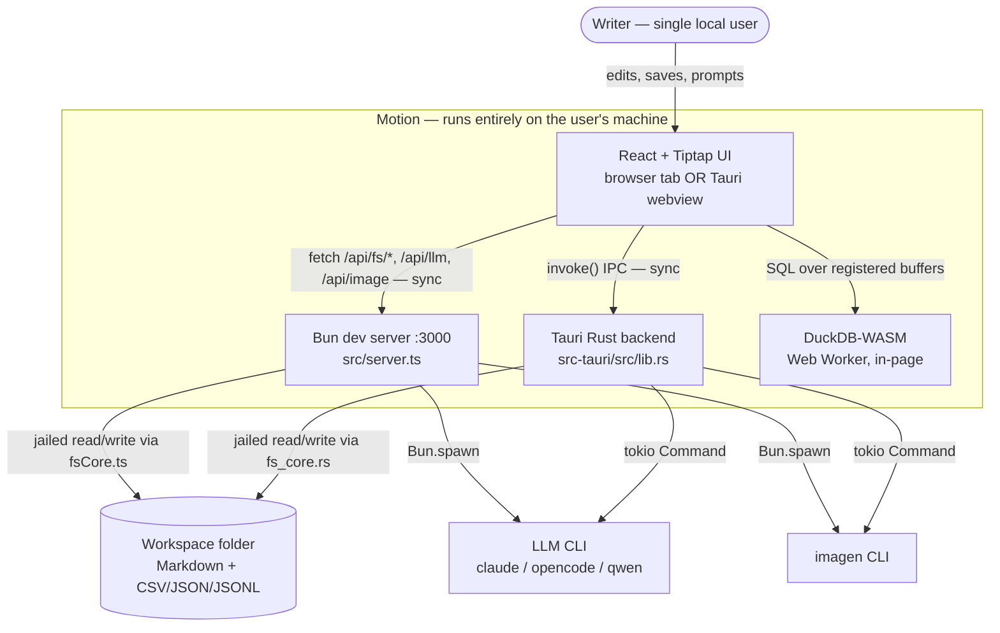
```mermaid
flowchart TB
    Writer(["Writer — single local user"])

    subgraph Motion["Motion — runs entirely on the user's machine"]
        UI["React + Tiptap UI<br/>browser tab OR Tauri webview"]
        Dev["Bun dev server :3000<br/>src/server.ts"]
        Rust["Tauri Rust backend<br/>src-tauri/src/lib.rs"]
        Duck["DuckDB-WASM<br/>Web Worker, in-page"]
    end

    FS[("Workspace folder<br/>Markdown + CSV/JSON/JSONL")]
    LLM["LLM CLI<br/>claude / opencode / qwen"]
    IMG["imagen CLI"]

    Writer -->|"edits, saves, prompts"| UI
    UI -->|"fetch /api/fs/*, /api/llm, /api/image — sync"| Dev
    UI -->|"invoke() IPC — sync"| Rust
    UI -->|"SQL over registered buffers"| Duck
    Dev -->|"jailed read/write via fsCore.ts"| FS
    Rust -->|"jailed read/write via fs_core.rs"| FS
    Dev -->|"Bun.spawn"| LLM
    Dev -->|"Bun.spawn"| IMG
    Rust -->|"tokio Command"| LLM
    Rust -->|"tokio Command"| IMG
```

**How to read it.** The Writer only ever touches the UI. The UI never touches the
filesystem or a CLI itself — it always crosses a process boundary first. Which
backend is active is decided once, at module load, by `isTauri()`
(`src/lib/storage/index.ts`, line 115). The two backend boxes are mutually
exclusive at runtime for storage purposes.

**Failure behaviour.** If a CLI is missing, the spawn fails and the error
surfaces in the block's own error state — nothing else is affected. If the
filesystem refuses a path, the error is classified (`denied` / `not-found` /
`not-a-directory`) and mapped to an HTTP status (`src/server.ts`, lines 280–285)
or to an IPC `Err(String)` (`src-tauri/src/fs_core.rs`, lines 51–55).

## 4.4 Major inputs and outputs

| Direction | Data | Format |
|---|---|---|
| In | Markdown notes | UTF-8 `.md` files |
| In | Datasets | `.csv`, `.json`, `.jsonl` |
| In | Configuration | `MOTION_WORKSPACE`, `PORT`, `CI`, `BASELINE` environment variables |
| Out | Markdown notes | UTF-8 `.md`, written in place |
| Out | Generated images | Base64 PNG data URI embedded in the Markdown |
| Out | Generated diagrams | Mermaid source embedded in the Markdown |

---

# 5. High-Level Architecture

## 5.1 The shape of the system in one paragraph

Motion is a single-page React application with two interchangeable backends. The
UI is identical in both modes and compiled into one bundle. A thin storage
interface (`StorageProvider`) is bound at module load to either `TauriStorage`
(IPC into Rust) or `HttpStorage` (HTTP into the Bun dev server). Behind each of
those sits a filesystem *core* — `fs_core.rs` and `fsCore.ts` — which are
independent implementations of one shared, hand-written behavioural contract.
Everything that requires a real process (spawning a CLI, touching the disk) lives
behind that boundary; everything in front of it is browser-safe code, and a
static guard proves it.

## 5.2 Logical architecture

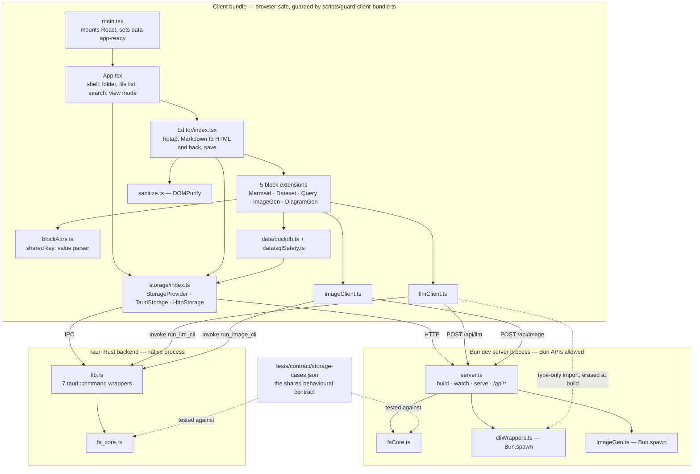
```mermaid
flowchart TB
    subgraph Client["Client bundle — browser-safe, guarded by scripts/guard-client-bundle.ts"]
        Main["main.tsx<br/>mounts React, sets data-app-ready"]
        App["App.tsx<br/>shell: folder, file list, search, view mode"]
        Ed["Editor/index.tsx<br/>Tiptap, Markdown to HTML and back, save"]
        Blocks["5 block extensions<br/>Mermaid · Dataset · Query · ImageGen · DiagramGen"]
        Attrs["blockAttrs.ts<br/>shared key: value parser"]
        Sanit["sanitize.ts — DOMPurify"]
        Duck["data/duckdb.ts + data/sqlSafety.ts"]
        Store["storage/index.ts<br/>StorageProvider · TauriStorage · HttpStorage"]
        LLMC["llmClient.ts"]
        IMGC["imageClient.ts"]
    end

    subgraph Server["Bun dev server process — Bun APIs allowed"]
        Srv["server.ts<br/>build · watch · serve · /api/*"]
        FSC["fsCore.ts"]
        CLIW["cliWrappers.ts — Bun.spawn"]
        IGEN["imageGen.ts — Bun.spawn"]
    end

    subgraph Tauri["Tauri Rust backend — native process"]
        Lib["lib.rs<br/>7 tauri::command wrappers"]
        FSR["fs_core.rs"]
    end

    Contract["tests/contract/storage-cases.json<br/>the shared behavioural contract"]

    Main --> App --> Ed --> Blocks
    Ed --> Sanit
    Blocks --> Attrs
    Blocks --> Duck
    Blocks --> LLMC
    Blocks --> IMGC
    App --> Store
    Ed --> Store
    Duck --> Store
    Store -->|"HTTP"| Srv
    Store -->|"IPC"| Lib
    LLMC -->|"POST /api/llm"| Srv
    LLMC -->|"invoke run_llm_cli"| Lib
    IMGC -->|"POST /api/image"| Srv
    IMGC -->|"invoke run_image_cli"| Lib
    Srv --> FSC
    Srv --> CLIW
    Srv --> IGEN
    Lib --> FSR
    Contract -.->|"tested against"| FSC
    Contract -.->|"tested against"| FSR
    LLMC -.->|"type-only import, erased at build"| CLIW
```

**How to read it.** Solid arrows are runtime calls or value imports; dotted
arrows are test-time obligations and erased type imports. Two things to notice:

- `fsCore.ts` sits inside the **server** box, not the client box. It imports
  `node:fs` (`src/lib/fsCore.ts`, lines 16–24) and executes in the Bun process.
  Its own header says so: *"NOT imported by the browser bundle"* (line 14).
- The dotted `llmClient → cliWrappers` edge is an `import type`
  (`src/lib/llmClient.ts`, line 3). It is erased at build time, which is the only
  reason the client can borrow `LLMOptions`/`LLMResponse` from a
  `Bun.spawn`-using module without failing the guard. The guard models this
  explicitly (`scripts/guard-client-bundle.ts — TYPE_ONLY_RE, line 57`).

## 5.3 Runtime architecture — the two modes

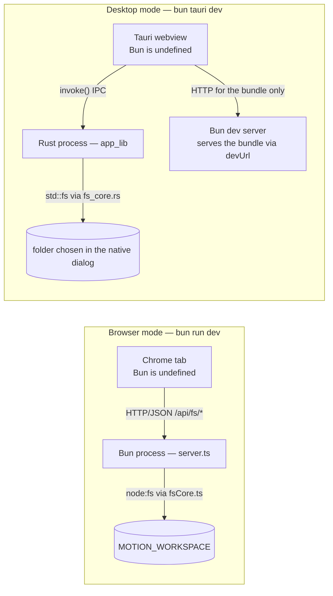
```mermaid
flowchart LR
    subgraph Browser["Browser mode — bun run dev"]
        B1["Chrome tab<br/>Bun is undefined"]
        B2["Bun process — server.ts"]
        B3[("MOTION_WORKSPACE")]
        B1 -->|"HTTP/JSON /api/fs/*"| B2
        B2 -->|"node:fs via fsCore.ts"| B3
    end

    subgraph Desktop["Desktop mode — bun tauri dev"]
        D1["Tauri webview<br/>Bun is undefined"]
        D2["Rust process — app_lib"]
        D3["Bun dev server<br/>serves the bundle via devUrl"]
        D4[("folder chosen in the native dialog")]
        D1 -->|"invoke() IPC"| D2
        D1 -->|"HTTP for the bundle only"| D3
        D2 -->|"std::fs via fs_core.rs"| D4
    end
```

**How to read it.** In desktop *development* mode the Bun dev server is still
running, because `src-tauri/tauri.conf.json` sets `devUrl` to
`http://localhost:3000` and `beforeDevCommand` to `bun run dev`. The webview
fetches the bundle over HTTP, but storage calls go over IPC to Rust, because
`isTauri()` returns true inside the webview. The dev server's `/api/fs/*` routes
are live but unused in that mode.

Note that `Bun` is undefined in **both** left-hand boxes. That is §6.4's entire
subject.

**Failure behaviour.** If the Rust side has no workspace opened,
`workspace_root()` returns `"No workspace opened. Open a folder first."`
(`src-tauri/src/lib.rs — workspace_root(), lines 99–107`) and every filesystem
command fails with that message.

## 5.4 Data flow — saving a note

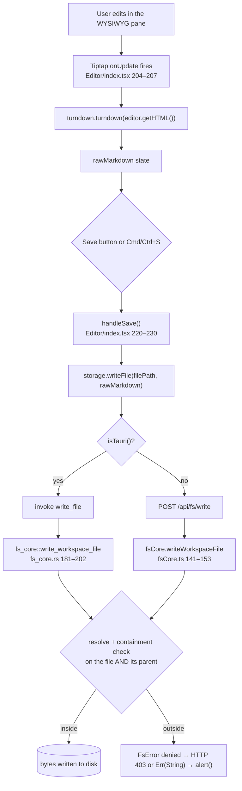
```mermaid
flowchart TB
    A["User edits in the WYSIWYG pane"] --> B["Tiptap onUpdate fires<br/>Editor/index.tsx 204–207"]
    B --> C["turndown.turndown(editor.getHTML())"]
    C --> D["rawMarkdown state"]
    D --> E{"Save button or Cmd/Ctrl+S"}
    E --> F["handleSave()<br/>Editor/index.tsx 220–230"]
    F --> G["storage.writeFile(filePath, rawMarkdown)"]
    G --> H{"isTauri()?"}
    H -->|"yes"| I["invoke write_file"]
    H -->|"no"| J["POST /api/fs/write"]
    I --> K["fs_core::write_workspace_file<br/>fs_core.rs 181–202"]
    J --> L["fsCore.writeWorkspaceFile<br/>fsCore.ts 141–153"]
    K --> M{"resolve + containment check<br/>on the file AND its parent"}
    L --> M
    M -->|"inside"| N[("bytes written to disk")]
    M -->|"outside"| O["FsError denied → HTTP 403 or Err(String) → alert()"]
```

**How to read it.** `rawMarkdown` is kept current continuously by `onUpdate`, not
computed at save time — deliberately, so switching to Markdown view never shows
stale content. The containment check is the same logical gate on both branches,
which is exactly the property the contract fixture exists to keep true.

**Failure behaviour.** A refused write surfaces as an `alert()`
(`src/components/Editor/index.tsx`, line 228) and, in browser mode, as an HTTP
403 that the E2E gate fails a test on unless the test explicitly allows it
(`e2e/persistence.spec.ts`, lines 111–113).

## 5.5 Trust-boundary diagram

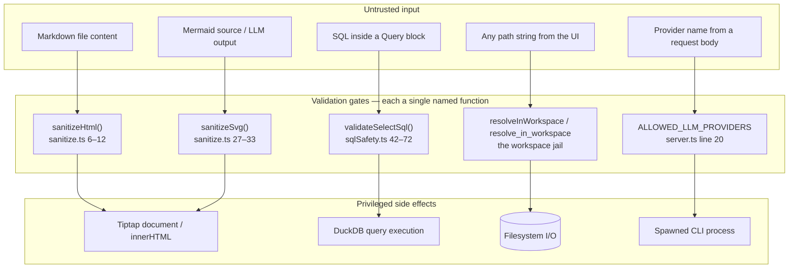
```mermaid
flowchart TB
    subgraph Untrusted["Untrusted input"]
        MD["Markdown file content"]
        SQL["SQL inside a Query block"]
        MER["Mermaid source / LLM output"]
        PATH["Any path string from the UI"]
        PROV["Provider name from a request body"]
    end

    subgraph Gates["Validation gates — each a single named function"]
        G1["sanitizeHtml()<br/>sanitize.ts 6–12"]
        G2["validateSelectSql()<br/>sqlSafety.ts 42–72"]
        G3["sanitizeSvg()<br/>sanitize.ts 27–33"]
        G4["resolveInWorkspace / resolve_in_workspace<br/>the workspace jail"]
        G5["ALLOWED_LLM_PROVIDERS<br/>server.ts line 20"]
    end

    subgraph Effects["Privileged side effects"]
        DOM["Tiptap document / innerHTML"]
        DUCK["DuckDB query execution"]
        DISK[("Filesystem I/O")]
        PROC["Spawned CLI process"]
    end

    MD --> G1 --> DOM
    SQL --> G2 --> DUCK
    MER --> G3 --> DOM
    PATH --> G4 --> DISK
    PROV --> G5 --> PROC
```

**How to read it.** Nothing crosses from left to right without passing through
the middle column. If you are adding a new path from untrusted input to a side
effect, you are adding a gate or reusing one of these five.

**The one asymmetry worth naming:** filesystem operations are jailed, but the
*prompt* passed to a spawned CLI is arbitrary user and document text. Only the
provider name is allowlisted. See §22.6.

## 5.6 Deployment architecture

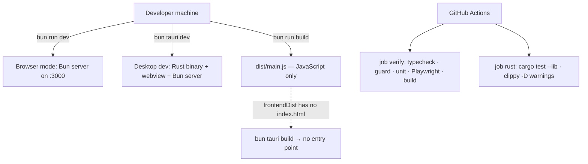
```mermaid
flowchart TB
    Dev["Developer machine"] -->|"bun run dev"| BD["Browser mode: Bun server on :3000"]
    Dev -->|"bun tauri dev"| TD["Desktop dev: Rust binary + webview + Bun server"]
    Dev -->|"bun run build"| PB["dist/main.js — JavaScript only"]
    PB -.->|"frontendDist has no index.html"| X["bun tauri build → no entry point"]
    CI["GitHub Actions"] --> J1["job verify: typecheck · guard · unit · Playwright · build"]
    CI --> J2["job rust: cargo test --lib · clippy -D warnings"]
```

**How to read it.** The dashed edge is the honest part. `bun run build` is
`bun build src/main.tsx --outdir=dist --minify` (`package.json`, line 8), which
emits JavaScript only; `src-tauri/tauri.conf.json` points `frontendDist` at
`../dist`, which therefore contains no HTML shell. CI runs the build
(`.github/workflows/ci.yml`, lines 54–55) and it *succeeds* — the build is not
broken, its output is incomplete for packaging. Tracked as B3 in
`docs/roadmap.md`.

---

# 6. Architectural Decisions

There is no `docs/adr/` directory. The decisions below are reconstructed from
code comments, the plan documents, and the changelog. Where a rationale is
inferred rather than written down, it is labelled **Assumption**.

## 6.1 AD-1 — One storage contract, two hand-written implementations, one shared fixture

**This is the central design decision in the system. Everything else in §6
follows from it.**

### 6.1.1 The decision

Motion needs identical filesystem behaviour in two runtimes that cannot share a
line of code:

- Browser mode runs in a Bun process and uses `node:fs`
  (`src/lib/fsCore.ts`, lines 16–24).
- Desktop mode runs in a Rust process and uses `std::fs`
  (`src-tauri/src/fs_core.rs`, line 10).

So the two implementations do not share code. They share a **behavioural
contract**, expressed as a hand-written JSON fixture, and *both test suites run
it*:

| Implementation | Test that runs the fixture | Command |
|---|---|---|
| `src/lib/fsCore.ts` | `src/lib/fsCore.contract.test.ts`, lines 74–132 | `bun test src` |
| `src-tauri/src/fs_core.rs` | `mod contract` — `storage_contract_rust_implementation()`, lines 279–375 | `cargo test --lib` |

The fixture is `tests/contract/storage-cases.json`: a `setup` block describing a
workspace to build (lines 22–38) and seventeen `cases`, each with an `op`, a
`path`, and an `expect` (lines 40–156).

### 6.1.2 Why the fixture is hand-written and language-neutral, not generated

This is the part worth understanding, and the file says it in its own header:

> *"Canonical storage contract. Hand-written and language-neutral on purpose:
> generating it from TypeScript would make TS the source of truth and give us a
> second artifact to keep in sync, which is the exact failure mode this file
> exists to prevent."*
> — `tests/contract/storage-cases.json`, lines 2–6

Unpacked, there are three distinct reasons:

1. **A generator picks a winner.** If the fixture were generated from the
   TypeScript implementation, then TypeScript's behaviour would *be* the
   specification by definition, and the Rust tests would only ever assert
   "Rust agrees with whatever TS currently does" — including its bugs. Neither
   implementation is meant to be authoritative. The fixture is.
2. **A generator is a third artifact that can drift.** The problem being solved
   is two things drifting apart. Adding a generator makes it three things, and
   the generator itself needs a source of truth, tests, and a run step in CI.
   A checked-in JSON file has none of those failure modes.
3. **A hand-written case can encode intent that no runtime behaviour reveals.**
   Several cases carry a `_why` field recording the specific incident they pin —
   e.g. line 55: *"B5/B11. The welcome document stores `source: data/sales.csv`.
   Rust used to reject this outright (no parent component) while Node would have
   resolved it against the process cwd. Both must now mean the same file."*
   A generator observing current behaviour cannot produce that.

**One further design property:** error cases assert an error *class*, not a
message string (`storage-cases.json`, lines 13–14). `expect.result` is one of
`ok | denied | not-found | not-a-directory`. That lets each language word its
errors naturally — `FsErrorCode` in TypeScript (`src/lib/fsCore.ts`, line 27),
`FsErrorCode` in Rust (`src-tauri/src/fs_core.rs`, lines 13–29) — while the
classification stays identical. The Rust enum's `as_str()` (lines 20–29) exists
purely to emit the fixture's wire names.

### 6.1.3 What the contract actually pins

| Case (abridged) | Fixture lines | What would break without it |
|---|---|---|
| reads a file at the workspace root | 41–46 | — |
| reads a nested file | 47–52 | Recursive resolution |
| resolves a relative path against the workspace root, not the cwd | 53–59 | Documents stop being portable between modes (B5/B11) |
| accepts an absolute path inside the workspace | 60–65 | The UI passes absolute paths from listings |
| reports a missing file as not-found, never as empty content | 66–72 | The dev server's old "200 + index.html" behaviour |
| refuses parent traversal | 73–78 | `..` escape |
| refuses an absolute path outside the workspace | 79–84 | Direct escape |
| refuses a sibling directory sharing the workspace name prefix | 85–91 | The `startsWith` bug — §6.2 |
| refuses a symlink pointing outside the workspace | 92–97 | Symlink escape |
| writes a new file and reads it back | 98–105 | The behaviour `WebStorage` used to fake |
| overwrites an existing file | 106–112 | — |
| writes into an existing subdirectory | 113–119 | — |
| refuses a write that escapes the workspace | 120–126 | Write-side escape |
| refuses a write through an escaping symlink | 127–133 | Write-side symlink escape |
| lists markdown recursively, sorted, skipping dotdirs and other extensions | 134–141 | Listing shape |
| lists data files by extension, sorted | 142–149 | Dataset picker |
| listing returns absolute paths | 150–155 | Web used to return bare filenames while Tauri returned absolute paths |

### 6.1.4 The fixture harnesses

Both harnesses build a fresh workspace per case, from the same `setup` block, and
both had to solve the same platform problem independently:

```ts
// src/lib/fsCore.contract.test.ts — buildFixture(), lines 33–37 (abridged)
// realpath the temp base: on macOS /tmp is a symlink to /private/tmp, and the
// implementation canonicalizes, so an un-resolved root would never match the
// paths it returns.
const base = realpathSync(mkdtempSync(join(tmpdir(), "motion-contract-")));
```

```rust
// src-tauri/src/fs_core.rs — build(), lines 231–234 (abridged)
// macOS temp dirs sit behind a symlink (/var -> /private/var); the
// implementation canonicalizes, so the fixture must too.
let base_real = fs::canonicalize(base.path()).expect("canonicalize base");
```

Both expand `$ROOT` and `$OUTSIDE` placeholders into the fixture's real
directories (`fsCore.contract.test.ts — expand(), lines 66–68`;
`fs_core.rs — expand(), lines 262–265`), and both compare listings as
workspace-relative, forward-slashed paths so the assertion is
platform-independent (`fsCore.contract.test.ts`, lines 117–119;
`fs_core.rs — relative_paths(), lines 267–277`).

### 6.1.5 Alternatives considered

| Alternative | Why not |
|---|---|
| Share one implementation via WebAssembly or an FFI binding | Enormous build complexity for ~160 lines of logic; would put a Rust toolchain in the browser-mode dependency path |
| Make desktop mode call the dev server too | Defeats the point of the desktop app — it would require a Bun process running alongside the packaged binary |
| Generate the fixture from one implementation | See §6.1.2 |
| Trust code review to keep them aligned | This is what was happening before, and the header of `fsCore.ts` records the result: *"they have already drifted seven ways once"* (lines 11–12) |

### 6.1.6 Consequences and revisit trigger

**Benefit.** Any behavioural divergence turns a build red rather than becoming a
bug report. The contract is the only artifact a reviewer must read to know what
storage is supposed to do.

**Cost.** Two implementations to maintain, and any new storage behaviour requires
three edits (TS, Rust, fixture) instead of one. Adding a case to the fixture
without implementing it in both languages fails one of the two suites
immediately, which is the intended pressure.

**Revisit when** the two implementations need to diverge intentionally (for
example if browser mode gains a permission model desktop mode does not have). At
that point the fixture needs per-implementation opt-outs, which it does not have
today.

## 6.2 AD-2 — Path containment is component-aware, never string `startsWith`

**Decision.** Both implementations decide "is this path inside the workspace?" by
comparing path *components*, never by comparing strings.

**The bug this avoids, concretely.** For a workspace at `/x/ws`, the string
`/x/ws-evil/planted.md` starts with `/x/ws`. A `candidate.startsWith(root)` check
therefore admits a completely unrelated sibling directory. An attacker (or a
mistaken document) needs only to create a directory whose name extends the
workspace name.

**TypeScript implementation:**

```ts
// src/lib/fsCore.ts — isInsideWorkspace(), lines 48–52
export function isInsideWorkspace(root: string, candidate: string): boolean {
    const rel = relative(root, candidate);
    if (rel === "") return true;
    return !rel.startsWith("..") && !isAbsolute(rel);
}
```

`path.relative("/x/ws", "/x/ws-evil/planted.md")` returns `"../ws-evil/planted.md"`,
which starts with `..` and is rejected. The comment above it (lines 36–47) names
the exact case and points at the Rust test that mirrors it.

**Rust implementation:**

```rust
// src-tauri/src/fs_core.rs — is_inside_workspace(), lines 75–77
pub fn is_inside_workspace(root: &Path, candidate: &Path) -> bool {
    candidate.starts_with(root)
}
```

**This is not the same function as the JavaScript one it resembles.**
`Path::starts_with` compares path components, not bytes — `/x/ws-evil` does not
start with `/x/ws` as a path. The doc comment says so explicitly (lines 71–74).
A reader skimming for `starts_with` and concluding "they used the naive check in
Rust" would be wrong, which is why the comment is there.

**Both are pinned by the same contract case**, "refuses a sibling directory
sharing the workspace name prefix" (`tests/contract/storage-cases.json`, lines
85–91), whose `_why` field states the reasoning. The fixture plants bait: a
`sibling_dirs: ["-evil"]` entry (line 37) creates `<root>-evil/planted.md` in
both harnesses (`fsCore.contract.test.ts`, lines 56–60;
`fs_core.rs`, lines 253–257).

**Second design property: the root itself counts as inside.** Both
implementations return true when the candidate *is* the root (TS: `rel === ""`,
line 50; Rust: `starts_with` is reflexive). This is required because
`writeWorkspaceFile` checks a file's *parent*, which for a top-level note is the
root itself (`src/lib/fsCore.ts`, lines 43–46 comment; the check at lines
143–148).

**Third design property: canonicalization happens before containment.** A path
that exists is resolved with `realpathSync` / `fs::canonicalize`; a path that
does *not* exist yet (a new note) has its **parent** canonicalized and the
filename joined on:

```ts
// src/lib/fsCore.ts — resolveInWorkspace(), lines 79–86
let resolved: string;
if (existsSync(absolute)) {
    resolved = realOrThrow(absolute);
} else {
    const parent = dirname(resolve(absolute));
    const parentReal = realOrThrow(parent);
    resolved = join(parentReal, basename(absolute));
}
```

```rust
// src-tauri/src/fs_core.rs — resolve_in_workspace(), lines 99–112 (abridged)
let resolved = if absolute.exists() {
    real_or_not_found(&absolute)?
} else {
    // Canonicalizing the parent is what resolves any `..` or symlink in the
    // path of a file that does not exist yet.
    real_or_not_found(parent)?.join(file_name)
};
```

Without this, a symlinked parent directory would let a *new* file be created
outside the jail even though the jail check passed.

## 6.3 AD-3 — The dev server's workspace root is environment-only

**Decision.** The Bun dev server's workspace root is read once, at startup, from
the `MOTION_WORKSPACE` environment variable. It is never taken from a request.

```ts
// src/server.ts, lines 27–40
/**
 * The workspace browser mode reads and writes.
 *
 * Env-only by design (see the /api/fs/ handler). Defaults to public/demo so a
 * fresh clone still opens with something to look at; E2E runs point it at a
 * seeded temp directory so specs never mutate tracked fixtures.
 */
const WORKSPACE_ROOT = resolve(
    PROJECT_ROOT,
    process.env["MOTION_WORKSPACE"] ?? join("public", "demo")
);
```

**Why this matters more than it looks.** The `/api/fs/*` handler takes a `path`
from the caller for read and write, but the *root* those paths are resolved
against is a server-side constant. The route handler's own comment states the
consequence of doing otherwise:

> *"The workspace root comes from MOTION_WORKSPACE and NOTHING ELSE. It is
> deliberately not client-supplied: accepting a directory from the request would
> turn the dev server into an arbitrary-filesystem read API for anything that can
> reach the port."*
> — `src/server.ts`, lines 232–236

If the root were a request parameter, the jail would still function — it would
just be a jail around a directory the caller chose, which is no jail at all. Any
page in the browser, any process on the machine, and (if the port were exposed)
anything on the network could read any file the dev-server user can read.

**Note the shape difference this creates in the storage interface.**
`HttpStorage.listFiles` ignores its `path` argument entirely:

```ts
// src/lib/storage/index.ts — HttpStorage.listFiles(), lines 82–86
async listFiles(_path: string): Promise<string[]> {
    const res = await fetch("/api/fs/list");
    ...
}
```

The underscore is deliberate. Browser mode always lists the configured root;
there is nothing for a caller to choose. Symmetrically,
`HttpStorage.openFolder()` (lines 75–80) does not open a picker — the browser has
none — it fetches `GET /api/fs/workspace` and returns the real root so the UI can
display where it is working.

**The desktop side solves the same problem differently**, because it *does* have
a folder picker. The root is set once by `set_workspace`
(`src-tauri/src/lib.rs`, lines 109–123), which canonicalizes and requires a
directory, and is then held in `WorkspaceState` behind a `Mutex`
(lines 90–92). Every command reads it via `workspace_root()` (lines 99–107).

**A closed hole worth recording (B14).** `list_markdown_files` used to *write*
the workspace root — it would re-root the jail to whatever directory it was
handed, giving a second, unguarded path into the sandbox that never went through
the folder dialog. It no longer writes state at all; its `path` argument is now
validated as a location *inside* the already-open workspace:

```rust
// src-tauri/src/lib.rs — list_markdown_files(), lines 145–150
fn list_markdown_files(path: String, state: State<'_, WorkspaceState>) -> Result<Vec<String>, String> {
    let root = workspace_root(&state)?;
    let target = fs_core::resolve_in_workspace(&root, &path).map_err(String::from)?;
    fs_core::collect_files(&target, fs_core::MARKDOWN_EXTENSIONS).map_err(String::from)
}
```

Pinned by `src-tauri/src/lib.rs — listing_cannot_re_root_the_workspace_and_refuses_outside_paths(), lines 232–248`.

**Defaults and test isolation.** The default root is `public/demo` so a fresh
clone opens with something to look at (`src/server.ts`, lines 34–37). E2E runs
override it with a seeded temp directory created at Playwright config load
(`playwright.config.ts`, line 6, passed via `webServer.env` at line 52) — because
specs now perform *real* writes and must never mutate the tracked fixtures in
`public/demo`. The config also refuses to reuse an existing server for exactly
this reason:

```ts
// playwright.config.ts, lines 48–50
// Never reuse a server here: an already-running dev server would be
// pointed at someone's real workspace, not the seeded scratch one.
reuseExistingServer: false,
```

## 6.4 AD-4 — `Bun` is undefined in the browser AND in the Tauri webview

**This is the root cause this codebase has fixed four separate times.**

**Context.** Bun is the project runtime, and `CLAUDE.md` instructs contributors to
prefer Bun APIs. That advice is correct for the dev server, the build, and the
tests. It is *wrong* for anything the UI executes, because:

- in a browser tab, `Bun` obviously does not exist;
- in the Tauri webview, `Bun` also does not exist — the webview is a browser, and
  the fact that a Rust process launched it changes nothing.

The second half is what keeps catching people. The guard script names the four
commits where it was re-fixed:

```ts
// scripts/guard-client-bundle.ts, lines 4–7 (verbatim)
 * This exists because one root cause has been re-fixed four times in this repo
 * (3ff4285, 21a28f9, 5e995d8, 261c89f) and is open a fifth time as 01KYJW5X:
 * code that assumes a Bun process while actually executing in a browser or a
 * Tauri webview, where `Bun` is undefined.
```

**Decision, part 1 — transport routers.** UI code never calls a Bun API. It calls
a router that picks the right transport for the current runtime:

```ts
// src/lib/llmClient.ts — callLLMFromUI(), lines 17–35 (abridged)
if (isTauri()) {
    const content = await invoke<string>("run_llm_cli", { provider, prompt, systemPrompt });
    return { content, rawOutput: content };
}
const res = await fetch("/api/llm", { method: "POST", /* ... */ });
```

`src/lib/imageClient.ts — generateImageFromUI(), lines 12–27` is the same shape
for images. These two modules are the *only* place in the client bundle that
knows which runtime is active for CLI work, and they are called only from block
extensions (`DiagramGenExtension.tsx`, line 6; `ImageGenExtension.tsx`, line 4).

Each router has a twin at each destination so the actual spawn happens in a real
process:

| Router | Browser destination | Desktop destination |
|---|---|---|
| `llmClient.ts` | `POST /api/llm` → `src/lib/cliWrappers.ts — callLLM(), lines 29–98` (`Bun.spawn`, line 56) | `invoke("run_llm_cli")` → `src-tauri/src/lib.rs — run_llm_cli(), lines 21–53` (`tokio::process::Command`, line 41) |
| `imageClient.ts` | `POST /api/image` → `src/lib/imageGen.ts — generateImage(), lines 26–75` (`Bun.spawn`, line 34) | `invoke("run_image_cli")` → `src-tauri/src/lib.rs — run_image_cli(), lines 59–86` |

**Decision, part 2 — a *static* guard, because a runtime gate cannot close this.**

`scripts/guard-client-bundle.ts` walks the real import graph from `src/main.tsx`
(the queue loop, lines 72–92) and fails on any `Bun.` use (lines 96–107).

The reasoning is quoted from the script's own header (lines 9–15):

> *"A runtime gate cannot catch this. The console/network fixture only sees code
> that a test actually executes, and the four enrichment modules (TopicRefiner,
> ContentInjector, TOCGenerator, SkillGenerator) are dead code — no E2E spec
> would ever run them, so they would stay green right up until the day someone
> wires them to a button. Their unit tests pass for the same reason: they mock
> the boundary and run inside Bun."*

That is the whole argument for static over runtime: **a runtime gate can only
observe code that runs, and the dangerous code is dormant.** Three
implementation details make the guard work:

| Detail | Line | Why |
|---|---|---|
| `BUN_USE` uses a negative lookbehind for identifier and quote characters | 27 | Matches `Bun.x` and `Bun[...]`, but not `myBun.x` or a quoted `"Bun."` |
| `TYPE_ONLY_RE` strips `import type ... from` before import extraction | 57 | Type imports are erased at build time. This is precisely how `llmClient.ts` line 3 borrows `LLMOptions`/`LLMResponse` from the Bun-only `cliWrappers.ts` without dragging `Bun.spawn` into the bundle |
| Comment-only lines are skipped | 82 | Otherwise the prose *about* Bun in these very files would trip the guard |

**Where it runs.** `bun run guard:client` is in `verify` (`package.json`, line
14), in CI (`.github/workflows/ci.yml`, lines 42–43), and in the pre-commit hook
(`hooks/pre-commit`, line 127). On success it prints the module count checked
(line 109).

**Revisit when** the client bundle is split per runtime — the guard would then
need one root per entrypoint.

## 6.5 AD-5 — The validation loop is architecture, not tooling

**Context.** `CHANGELOG.md` frames the release: *"The application itself has
existed since January 2026; this release is the point at which it became possible
to know whether it works."* (lines 7–9). Before it, the only CI workflow
validated work-log JSONL and never installed Bun or Rust, so a pull request
deleting `src/App.tsx` passed green (`CHANGELOG.md`, lines 34–37).

**Decision.** One command is the gate:

```json
// package.json, line 14
"verify": "bun run typecheck && bun run guard:client && bun run test && bun run test:e2e"
```

Five components, each designed against a specific past failure:

1. **`tsc --noEmit`, strict** — `package.json`, line 9.
2. **The static Bun guard** — §6.4. Covers what tests structurally cannot.
3. **Unit tests, scoped to `src`** — `package.json`, line 11. The scoping is not
   cosmetic: unscoped, Bun would try to execute the Playwright specs and fail
   (`CLAUDE.md`, testing table).
4. **E2E against the real dev server** — `playwright.config.ts`, lines 45–53.
   The comment at lines 10–12 states why: *"a spec run is a real app run — there
   is no separate 'test build' that could drift from what ships."*
5. **Rust tests plus clippy** — `.github/workflows/ci.yml`, lines 97–102. These
   are not in `verify` (they need a Rust toolchain) but they are in CI and in the
   Definition of Done.

**The console/network gate is the highest-leverage piece** and gets its own
decision below.

## 6.6 AD-6 — The E2E gate inspects HTTP status, not just transport failure

**Decision.** `e2e/fixtures.ts` registers four listeners, not three (lines
57–76): `console` filtered to `error`, `pageerror`, `requestfailed`, and
`response` where `status() >= 400`. The fixture is declared `auto: true`
(line 87), so **a spec cannot forget it** — importing `test` from
`./fixtures` is enough, and importing from `@playwright/test` directly is called
out as wrong in the header (lines 4–5).

**Why the fourth listener exists** — quoted from lines 13–17:

> *"Playwright's `requestfailed` event does NOT fire for HTTP 404 or 500 — those
> are *successful* requests that happen to carry an error status. A 404 is
> precisely the signature of bug B2 (New Note creates a file the editor then
> cannot read), so a gate watching only `requestfailed` would sail straight past
> the bug it exists to catch."*

**And it forced a server change.** The dev server used to answer *every*
unmatched path with `200` and the SPA shell, so a missing note read back
*successfully* as a page of HTML — structurally invisible to any network gate.
The fallback is now split three ways:

| Case | Response | Lines |
|---|---|---|
| Unknown `/api/*` route | JSON 404 | `src/server.ts`, 305–310 |
| Path whose last segment contains a `.` | 404 | `src/server.ts`, 318–321 |
| Everything else | SPA shell | `src/server.ts`, 324–327 |

The comment at lines 313–317 records the reasoning in full. A related fix:
`/favicon.ico` returns `204`, not 404 (lines 168–170), because the browser
requests it unprompted and a real 404 would fail every E2E run.

**Escape hatch, deliberately narrow.** `PageGuard.allow(pattern)` (lines 39–41)
lets one test opt out of one expected violation; the doc comment says *"a bare
`/./` defeats the gate."* The only current use is the spec that asserts the
filesystem API returns 403 for a path outside the workspace
(`e2e/persistence.spec.ts`, lines 111–113) — where the refusal *is* the pass
condition.

**Warnings are recorded but never fatal** (`e2e/fixtures.ts`, lines 60–62;
rationale at lines 19–20).

**The baseline was measured, not assumed.** Two probes are excluded from the
suite and run by hand with `BASELINE=1` (`playwright.config.ts`, line 22):
`e2e/baseline.capture.spec.ts` re-measures the cold-load console/network
baseline, and `e2e/guard.proof.capture.spec.ts` proves the gate still bites —
whose **correct result is 3 failed / 1 passed**. If all four pass, the gate is
broken (`CLAUDE.md`, testing section).

## 6.7 AD-7 — Security is enforced at the backend, in both backends

Summarised here, detailed in §22.

**Decision.** Neither backend trusts the UI. Every path is re-derived and
re-checked at the boundary; the UI's copy of a path is treated as a hint. The
jail lives in the shared cores (§6.1), not in the command wrappers — a rule the
Rust side states explicitly:

> *"All jail and path-resolution logic lives in fs_core, which is shared, tested,
> and held to tests/contract/storage-cases.json alongside the TypeScript
> implementation. These commands are thin wrappers... Keeping a second copy of
> the rules here is what let the two runtimes drift apart in the first place."*
> — `src-tauri/src/lib.rs`, lines 94–98

**Alternative rejected:** relying on `tauri-plugin-fs` scopes alone. The plugin is
registered (`src-tauri/src/lib.rs`, line 163) but its permission set is not the
workspace mechanism; custom commands with an explicit jail were chosen instead.

## 6.8 AD-8 — SQL is restricted by validation, not by a sandbox

**Decision.** Document-supplied SQL passes `validateSelectSql()`
(`src/lib/data/sqlSafety.ts`, lines 42–72) before reaching DuckDB: single
statement only (lines 52–55), must start with `SELECT` or `WITH` (lines 58–61),
and a word-boundary blocklist of nineteen mutating verbs (lines 65–69). Table
names go through `validateIdentifier()` (lines 10–15, regex at line 5) and are
double-quoted; file paths are single-quote-escaped (`escapeSqlString()`, lines
20–22); `LIMIT` is clamped to 10 000 (`clampLimit()`, lines 27–36).

**Tradeoff, stated honestly.** A keyword blocklist is a weaker guarantee than a
real parser or a read-only connection. The identifier regex and the clamp are the
strong parts; the verb blocklist is defence in depth. Since DuckDB runs
in-browser over data the user already owns, the blast radius of a bypass is
reading a file the user could open anyway — not privilege escalation.

**Revisit when** DuckDB gains write access to the real filesystem, or if `ATTACH`
becomes reachable. Then this needs to become a parser-level check.

## 6.9 AD-9 — One shared block-attribute parser

**Decision.** `parseBlockAttrs()`
(`src/components/Editor/extensions/blockAttrs.ts`, lines 14–25) is the single
`key: value` parser for the Dataset, ImageGen and DiagramGen blocks.

**Context, quoted from lines 4–9:** the parser existed as three near-identical
inline copies. The welcome document serializes an unset diagram as
`content: null`, which parsed to the **4-character string `"null"`** — truthy, so
the render guard let it through, and every cold page load called
`mermaid.render()` with it and logged an `UnknownDiagramError`. *"Fixing that in
one copy would have left the other two."*

**Implementation.** `EMPTY_SENTINELS` (line 12) maps `"null"` and `"undefined"`
to `""`. Values keep internal colons (`rest.join(":")`, line 21). Tested at
`src/components/Editor/extensions/blockAttrs.test.ts`, lines 4–30, with the
regression itself pinned at lines 21–26.

**Known limitation.** The parser is line-oriented, so a value containing a
newline cannot round-trip. That is tracked as B7 alongside the block round-trip
bug (§9.4).

## 6.10 AD-10 — Generated images are inline base64

**Decision.** `generateImage()` returns a `data:image/png;base64,...` URI
(`src/lib/imageGen.ts`, line 67), stored directly on the node's `src` attribute.

**Rationale and cost are both written down** (lines 8–13): it mirrors how
DiagramGen stores Mermaid text inline and avoids Tauri asset-protocol plumbing;
it bloats the Markdown file by roughly 1.3× the PNG's bytes. The comment names
the upgrade path — write real files under a workspace `assets/` directory if the
bloat becomes a problem.

## 6.11 Decision summary

| ID | Decision | Status | Revisit trigger |
|---|---|---|---|
| AD-1 | One contract, two implementations, one hand-written fixture | Active, enforced by both suites | Intentional divergence between modes |
| AD-2 | Component-aware containment | Active, pinned by contract | — |
| AD-3 | Env-only workspace root for the dev server | Active | Multi-workspace browser mode |
| AD-4 | Transport routers plus a static Bun guard | Active, in CI | Per-runtime bundle split |
| AD-5 | `bun run verify` is the gate | Active | — |
| AD-6 | E2E gate inspects HTTP status separately | Active | — |
| AD-7 | Jail lives in the shared cores, not the wrappers | Active | — |
| AD-8 | SELECT-only SQL validation | Active | DuckDB gains write access |
| AD-9 | One shared block-attribute parser | Active | Multi-line values (B7) |
| AD-10 | Inline base64 images | Active | File-size complaints |

---

# 7. Component Inventory

Ownership is **not defined** per component: there is no `CODEOWNERS` file, and
`.work/config.yml` names a single project repository. Scaling model is "not
applicable" for every row — this is a single-user desktop application with no
production server runtime.

| Component | Type | Responsibility | Inputs | Outputs | Depends on | Store | Failure impact | Reqs |
|---|---|---|---|---|---|---|---|---|
| `src/main.tsx` | Entry point | Mount React; set the `data-app-ready` signal after paint | DOM | Mounted app | React | — | Nothing renders | — |
| `src/App.tsx` | React shell | Folder open, file list, search, new note, view-mode switch | User events | `filePath`, `viewMode` | `storage` | — | No navigation | FR-1,2,5,6 |
| `src/components/Editor/index.tsx` | React component | Document lifecycle: load, edit, convert, save | `filePath`, `viewMode` | Files written | Tiptap, marked, turndown, `storage`, `sanitize` | Markdown files | Total editing loss | FR-3,4,6,12 |
| `Toolbar.tsx` | React component | Formatting, block insertion, save button | `editor` | Editor commands | `insertBlock` | — | Blocks only insertable via `/` | FR-12 |
| `insertBlock.ts` | Module | The five insertable types and the insert transaction | `editor`, `nodeType`, range | Doc mutation | Tiptap | — | No block creation | FR-12 |
| `MermaidExtension.tsx` | Tiptap node | Render/edit a Mermaid diagram | attr `content` | Sanitized SVG | `mermaid`, `sanitizeSvg` | — | Diagrams stop rendering | FR-7 |
| `DatasetExtension.tsx` | Tiptap node | Register a file as a table, preview N rows | `source`, `name`, `limit` | DuckDB table + preview | `duckdb`, `storage`, `blockAttrs` | DuckDB memory | Query blocks lose their tables | FR-8 |
| `QueryExtension.tsx` | Tiptap node | Run SQL, render a result table | `sql` | Rows | `duckdb` | DuckDB memory | No query results | FR-9 |
| `ImageGenExtension.tsx` | Tiptap node | Prompt to image, with refinement | `prompt`, `src` | data-URI on the node | `imageClient`, `blockAttrs` | Inline in the document | Image gen unavailable | FR-10 |
| `DiagramGenExtension.tsx` | Tiptap node | Prompt to validated Mermaid | `prompt`, `content` | Mermaid text + SVG | `llmClient`, `mermaid`, `sanitizeSvg`, `blockAttrs` | Inline in the document | Diagram gen unavailable | FR-11 |
| `blockAttrs.ts` | Module | Shared `key: value` parse with null sentinels | Serialized text | Attr map | — | — | The `"null"` render bug returns, in triplicate | — |
| `lib/storage/index.ts` | Module | Runtime-agnostic storage; two real implementations | Paths, content | Files | `@tauri-apps/api`, `plugin-dialog`, `fetch` | Filesystem | Everything file-related | FR-1..5 |
| `lib/fsCore.ts` | **Server** module | Jail, resolution, listing, read/write for browser mode | root + requested path | Content, listings, `FsError` | `node:fs`, `node:path` | Filesystem | Browser mode storage dead | NFR-1,2 |
| `src-tauri/src/fs_core.rs` | Rust module | The same, for desktop mode | root + requested path | Content, listings, `FsError` | `std::fs` | Filesystem | Desktop storage dead | NFR-1,2 |
| `tests/contract/storage-cases.json` | **Fixture** | The normative storage contract | — | Test cases | — | — | The two cores drift silently | NFR-2 |
| `lib/llmClient.ts` | Module | Route LLM calls to a process that has a shell | provider, options | `LLMResponse` | `invoke` or `fetch` | — | Diagram gen fails | NFR-3 |
| `lib/imageClient.ts` | Module | Route image calls likewise | prompt | data URI | `invoke` or `fetch` | — | Image gen fails | NFR-3 |
| `lib/cliWrappers.ts` | **Server** module | Spawn an LLM CLI (**Bun-only**) | provider, options | stdout | `Bun.spawn` | — | Browser-mode LLM proxy fails | FR-11 |
| `lib/imageGen.ts` | **Server** module | Spawn `imagen` (**Bun-only**) | prompt | base64 PNG | `Bun.spawn`, `node:fs` | temp file | Browser-mode image proxy fails | FR-10 |
| `lib/sanitize.ts` | Module | DOMPurify wrappers for HTML, SVG, and text escaping | HTML / SVG / text | Sanitized string | `dompurify` | — | XSS from documents and LLM output | NFR-5 |
| `lib/data/duckdb.ts` | Module | DuckDB lifecycle, file registration, query with retry | path, table, SQL | Row objects | `@duckdb/duckdb-wasm`, `storage`, `sqlSafety` | In-memory DB | Data blocks dead | FR-8,9 |
| `lib/data/sqlSafety.ts` | Module | SELECT-only validation, identifiers, limits | SQL / names / limits | Validated values or throw | — | — | SQL injection surface opens | NFR-4 |
| `src/server.ts` | Bun server | Build, watch, serve, `/api/fs/*`, `/api/llm`, `/api/image` | HTTP | Bundle, HTML, JSON | Bun, `fsCore`, `cliWrappers`, `imageGen` | `public/`, workspace | Browser mode and E2E stop | FR-1..5,10,11 |
| `src-tauri/src/lib.rs` | Rust backend | Seven IPC commands; workspace state | IPC | Results | `fs_core`, `tokio`, `base64` | Filesystem | Desktop app inert | NFR-1, FR-1..5,10,11 |
| `scripts/guard-client-bundle.ts` | Build guard | Static `Bun.` reachability check | `src/main.tsx` graph | Exit 0/1 | `node:fs` | — | The four-times bug returns | NFR-3 |
| `e2e/fixtures.ts` | Test harness | Automatic console/network gate on every spec | Page events | Assertion | Playwright | — | A broken UI passes quietly | NFR-6 |
| `e2e/workspace.ts` | Test harness | Seeded scratch workspace per run | — | Temp dir path | `node:fs` | Temp dir | Specs mutate tracked fixtures | NFR-2 |
| `.github/workflows/ci.yml` | CI | Two jobs: `verify` and `rust` | Push / PR | Pass/fail | — | — | Untested code merges | NFR-8 |

---

# 8. End-to-End Workflows

## 8.1 Open a workspace and list notes

**Trigger.** User clicks "Open Folder" (`src/App.tsx`, lines 105–107).
**Precondition.** None. Behaviour differs by mode, which is the interesting part.

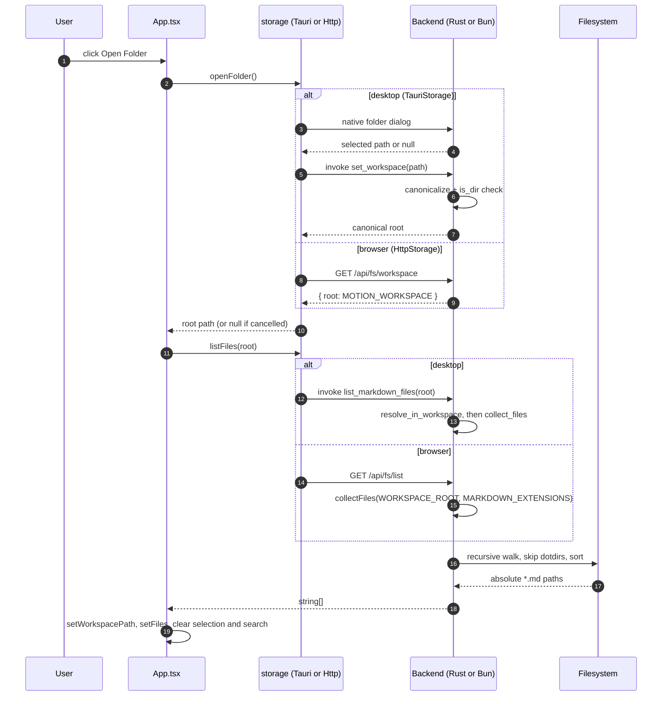
```mermaid
sequenceDiagram
    autonumber
    participant U as User
    participant App as App.tsx
    participant S as storage (Tauri or Http)
    participant B as Backend (Rust or Bun)
    participant FS as Filesystem

    U->>App: click Open Folder
    App->>S: openFolder()
    alt desktop (TauriStorage)
        S->>B: native folder dialog
        B-->>S: selected path or null
        S->>B: invoke set_workspace(path)
        B->>B: canonicalize + is_dir check
        B-->>S: canonical root
    else browser (HttpStorage)
        S->>B: GET /api/fs/workspace
        B-->>S: { root: MOTION_WORKSPACE }
    end
    S-->>App: root path (or null if cancelled)
    App->>S: listFiles(root)
    alt desktop
        S->>B: invoke list_markdown_files(root)
        B->>B: resolve_in_workspace, then collect_files
    else browser
        S->>B: GET /api/fs/list
        B->>B: collectFiles(WORKSPACE_ROOT, MARKDOWN_EXTENSIONS)
    end
    B->>FS: recursive walk, skip dotdirs, sort
    FS-->>B: absolute *.md paths
    B-->>App: string[]
    App->>App: setWorkspacePath, setFiles, clear selection and search
```

**Main flow.** As numbered. **Alternative flow (desktop only):** the dialog is
cancelled, `open()` returns a non-string, `openFolder` returns `null`
(`src/lib/storage/index.ts`, lines 21–23) and `App.tsx` line 28 skips every state
update.

**Failure flows.** Any backend error becomes a rejected promise;
`src/App.tsx` lines 35–39 log it and show `alert("Error opening folder: ...")`.
In browser mode the error message is the server's own, not a bare status code,
because `failed()` reads the JSON `error` field first
(`src/lib/storage/index.ts`, lines 46–55).

**Retries / timeouts / idempotency.** No retries, no timeouts. Both operations
are naturally idempotent.

**State changes.** Desktop: `WorkspaceState.root` in Rust. Both: `workspacePath`,
`files`, `currentFilePath`, `searchQuery` in React.

**Security checks.** Desktop: `set_workspace` canonicalizes and requires a
directory (`src-tauri/src/lib.rs`, lines 110–115); `list_markdown_files` resolves
its argument inside the already-open root (lines 146–149). Browser: the root is
never client-supplied (§6.3).

**Observability.** `console.error` only.

**Covered by** `e2e/persistence.spec.ts` — "lists the seeded workspace, including
nested files", lines 21–29, which asserts the nested seed file appears.

## 8.2 Open a note

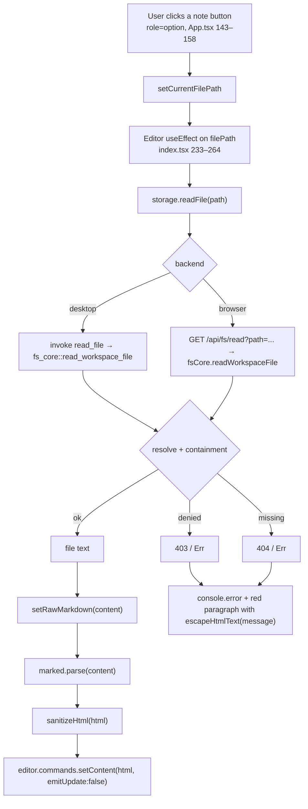
```mermaid
flowchart TB
    A["User clicks a note button<br/>role=option, App.tsx 143–158"] --> B["setCurrentFilePath"]
    B --> C["Editor useEffect on filePath<br/>index.tsx 233–264"]
    C --> D["storage.readFile(path)"]
    D --> E{"backend"}
    E -->|desktop| F["invoke read_file → fs_core::read_workspace_file"]
    E -->|browser| G["GET /api/fs/read?path=... → fsCore.readWorkspaceFile"]
    F --> H{"resolve + containment"}
    G --> H
    H -->|"ok"| I["file text"]
    H -->|"denied"| J["403 / Err"]
    H -->|"missing"| K["404 / Err"]
    I --> L["setRawMarkdown(content)"]
    L --> M["marked.parse(content)"]
    M --> N["sanitizeHtml(html)"]
    N --> O["editor.commands.setContent(html, emitUpdate:false)"]
    J --> P["console.error + red paragraph with escapeHtmlText(message)"]
    K --> P
```

**Why `emitUpdate: false` matters** (`src/components/Editor/index.tsx`, line
246): loading a file must not fire `onUpdate`, or the just-loaded content would
immediately be re-serialized through turndown and overwrite `rawMarkdown` with a
round-tripped version of itself.

**Why the error path escapes the message** (lines 249–255): the error string may
contain a path or content from an untrusted file. `escapeHtmlText()`
(`src/lib/sanitize.ts`, lines 38–45) prevents the error display itself becoming
an injection vector.

**Known gap.** There is no cancellation: rapidly switching files can let an older
`readFile` resolve after a newer one and overwrite the editor. Tracked as B13
("save completion signal and file-load cancellation") in `docs/roadmap.md`.

## 8.3 Edit and save

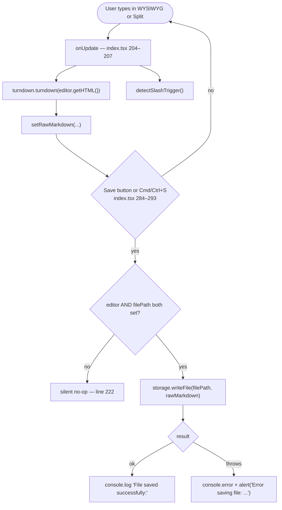
```mermaid
flowchart TB
    Start(["User types in WYSIWYG or Split"]) --> OnUpdate["onUpdate — index.tsx 204–207"]
    OnUpdate --> Turn["turndown.turndown(editor.getHTML())"]
    Turn --> Raw["setRawMarkdown(...)"]
    OnUpdate --> Slash["detectSlashTrigger()"]
    Raw --> Save{"Save button or Cmd/Ctrl+S<br/>index.tsx 284–293"}
    Save -->|no| Start
    Save -->|yes| Guard{"editor AND filePath both set?"}
    Guard -->|no| Noop["silent no-op — line 222"]
    Guard -->|yes| Write["storage.writeFile(filePath, rawMarkdown)"]
    Write --> Res{"result"}
    Res -->|ok| Log["console.log 'File saved successfully:'"]
    Res -->|throws| Err["console.error + alert('Error saving file: ...')"]
```

**Idempotency.** Saving twice writes the same bytes.

**No conflict detection.** Nothing checks whether the file changed on disk since
it was loaded, so an external edit is overwritten silently. **Assumption** —
acceptable for a single-user local editor; it is not on the roadmap.

**Security checks.** Both backends check containment on the resolved path *and*
on its parent directory before writing, so a symlinked parent cannot carry the
write out (`src/lib/fsCore.ts`, lines 143–148; `src-tauri/src/fs_core.rs`, lines
185–193).

**Directory creation.** Both create missing parent directories with
`recursive: true` / `create_dir_all` *after* the containment check
(`fsCore.ts`, lines 149–151; `fs_core.rs`, lines 194–198).

**Covered by** `e2e/persistence.spec.ts`:
- "an edit survives save and reload" (lines 31–52) — types a unique marker,
  waits on the actual `POST /api/fs/write` response and asserts status 200, then
  reloads and asserts the marker is present.
- "writes land on disk where the next read can find them" (lines 78–108) — reads
  the file back through the API, bypassing the editor entirely, *"proves the
  bytes are on disk, not merely in React state."*

Both specs assert on the write response rather than a timeout, which is the
pattern to copy for any new save-related spec.

## 8.4 Create a new note

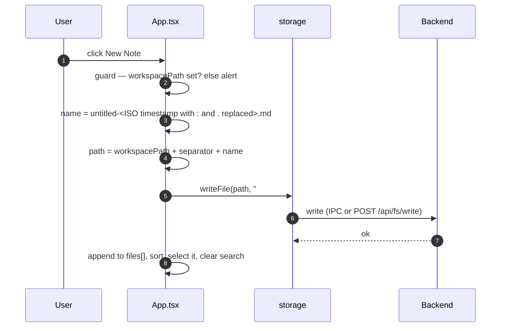
```mermaid
sequenceDiagram
    autonumber
    participant U as User
    participant App as App.tsx
    participant S as storage
    participant B as Backend

    U->>App: click New Note
    App->>App: guard — workspacePath set? else alert
    App->>App: name = untitled-<ISO timestamp with : and . replaced>.md
    App->>App: path = workspacePath + separator + name
    App->>S: writeFile(path, "# New Note\n\n")
    S->>B: write (IPC or POST /api/fs/write)
    B-->>S: ok
    App->>App: append to files[], sort, select it, clear search
```

**The path construction detail** (`src/App.tsx`, lines 53–57): the separator is
chosen by inspecting `workspacePath` for a backslash, and any trailing separator
is stripped. This works in both modes because `HttpStorage.openFolder()` returns
the server's real absolute root — not a placeholder — so an absolute path built
from it resolves inside the jail.

**Failure flow.** No workspace open → `alert("Open a folder first to create a new
note.")` and return (lines 47–50). A write failure → `console.error` plus an
alert (lines 62–66), and the file list is left untouched.

**Covered by** `e2e/persistence.spec.ts` — "a new note is created, listed, and
opens without error" (lines 54–76). Its comment records the original bug: *"B2:
New Note used to write to a no-op backend, then the editor fetched the file that
was never created. The dev server answered that miss with 200 + index.html, so
the note 'opened' showing a page of HTML."*

## 8.5 Insert a block via the slash menu

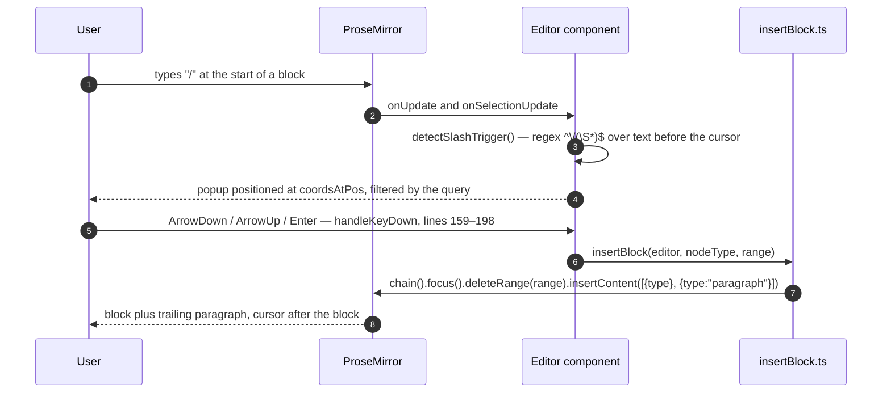
```mermaid
sequenceDiagram
    autonumber
    participant U as User
    participant PM as ProseMirror
    participant E as Editor component
    participant IB as insertBlock.ts

    U->>PM: types "/" at the start of a block
    PM->>E: onUpdate and onSelectionUpdate
    E->>E: detectSlashTrigger() — regex ^\/(\S*)$ over text before the cursor
    E-->>U: popup positioned at coordsAtPos, filtered by the query
    U->>E: ArrowDown / ArrowUp / Enter — handleKeyDown, lines 159–198
    E->>IB: insertBlock(editor, nodeType, range)
    IB->>PM: chain().focus().deleteRange(range).insertContent([{type}, {type:"paragraph"}])
    PM-->>U: block plus trailing paragraph, cursor after the block
```

**Two non-obvious details, both documented in the code:**

1. `detectSlashTrigger()` only fires when `/` is the **first** character of the
   current block (`src/components/Editor/index.tsx`, lines 60–63 comment; regex
   at line 69), so typing "and/or" mid-sentence never opens the menu.
2. `insertBlock()` always appends a trailing paragraph
   (`src/components/Editor/insertBlock.ts`, lines 16–20): an atom node inserted
   where nothing follows leaves a `NodeSelection` on itself, so the *next* insert
   would replace it instead of adding a new one. The trailing paragraph
   guarantees a text cursor lands after the block. This is why "insert twice in a
   row" is called out as a required E2E case in the plan.

Menu clicks use `onMouseDown` with `preventDefault()`
(`src/components/Editor/index.tsx`, lines 322–326) so editor focus and the stored
range survive the click.

## 8.6 Dataset to Query

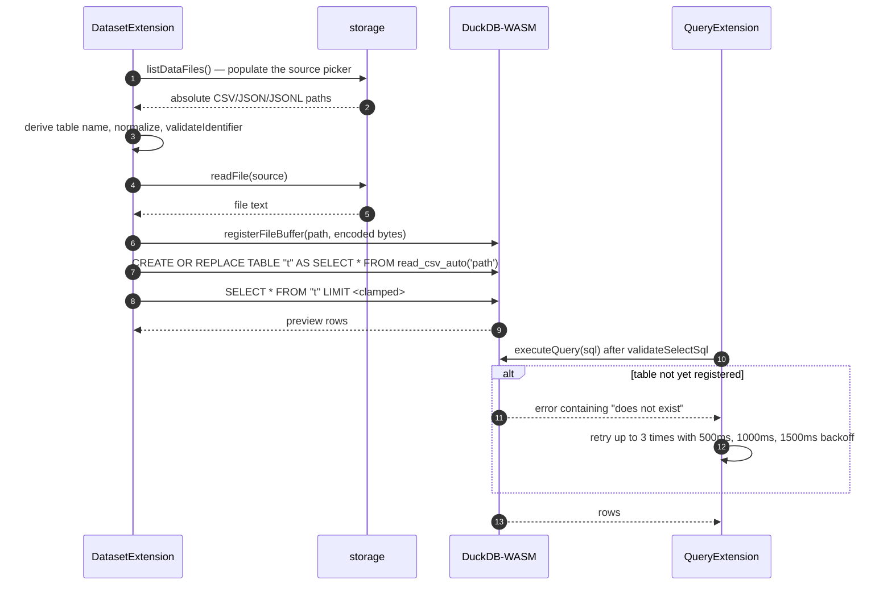
```mermaid
sequenceDiagram
    autonumber
    participant DS as DatasetExtension
    participant ST as storage
    participant DB as DuckDB-WASM
    participant QB as QueryExtension

    DS->>ST: listDataFiles() — populate the source picker
    ST-->>DS: absolute CSV/JSON/JSONL paths
    DS->>DS: derive table name, normalize, validateIdentifier
    DS->>ST: readFile(source)
    ST-->>DS: file text
    DS->>DB: registerFileBuffer(path, encoded bytes)
    DS->>DB: CREATE OR REPLACE TABLE "t" AS SELECT * FROM read_csv_auto('path')
    DS->>DB: SELECT * FROM "t" LIMIT <clamped>
    DB-->>DS: preview rows
    QB->>DB: executeQuery(sql) after validateSelectSql
    alt table not yet registered
        DB-->>QB: error containing "does not exist"
        QB->>QB: retry up to 3 times with 500ms, 1000ms, 1500ms backoff
    end
    DB-->>QB: rows
```

**The ordering hazard and its mitigation.** A Query block can mount before the
Dataset block that creates its table has finished registering. `executeQuery()`
handles this with a bounded retry keyed on the error text:

```ts
// src/lib/data/duckdb.ts — executeQuery(), lines 100–109 (abridged)
const message = err instanceof Error ? err.message : String(err);
if (message.includes("does not exist") && retryCount < 3) {
    await closeOnce();
    await new Promise((resolve) => setTimeout(resolve, 500 * (retryCount + 1)));
    return executeQuery(sql, retryCount + 1);
}
throw err;
```

**Assessment (Recommendation).** This is a string-matched retry against a
race, not a dependency ordering. It works, but it is the weakest mechanism in the
data path: a genuinely missing table costs three sleeps before erroring, and the
match would break if DuckDB reworded its error. A registration-completion signal
that Query blocks await would be a stronger design. Not currently on the roadmap.

**Connection handling.** `closeOnce()` (lines 89–94) guarantees the connection is
closed exactly once even across the retry, which is the bug that idiom exists to
prevent.

**Table-name derivation** (`DatasetExtension.tsx`, lines 25–30): the block name,
or the source filename without its extension, is normalized by replacing
non-alphanumerics with underscores and prefixing a leading digit, then passed
through `validateIdentifier()`. The result is interpolated into SQL inside double
quotes; the file path is interpolated inside single quotes after
`escapeSqlString()`.

## 8.7 Generate a diagram from a prompt

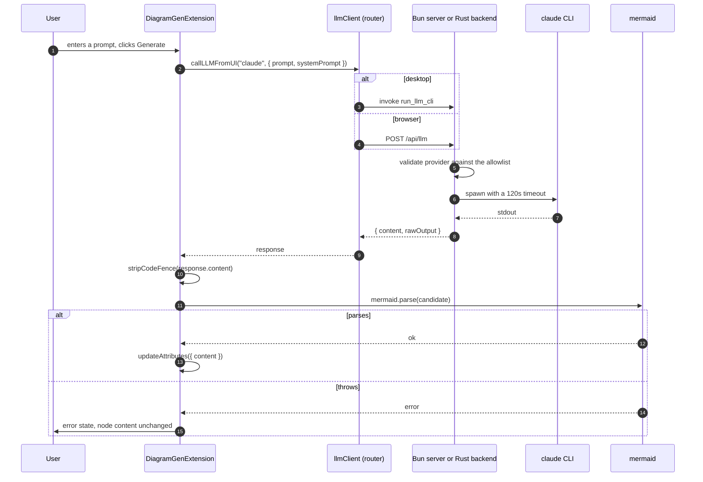
```mermaid
sequenceDiagram
    autonumber
    participant U as User
    participant DG as DiagramGenExtension
    participant R as llmClient (router)
    participant P as Bun server or Rust backend
    participant CLI as claude CLI
    participant M as mermaid

    U->>DG: enters a prompt, clicks Generate
    DG->>R: callLLMFromUI("claude", { prompt, systemPrompt })
    alt desktop
        R->>P: invoke run_llm_cli
    else browser
        R->>P: POST /api/llm
    end
    P->>P: validate provider against the allowlist
    P->>CLI: spawn with a 120s timeout
    CLI-->>P: stdout
    P-->>R: { content, rawOutput }
    R-->>DG: response
    DG->>DG: stripCodeFence(response.content)
    DG->>M: mermaid.parse(candidate)
    alt parses
        M-->>DG: ok
        DG->>DG: updateAttributes({ content })
    else throws
        M-->>DG: error
        DG->>U: error state, node content unchanged
    end
```

**Two validation steps that are easy to miss:**

- `stripCodeFence()` (`DiagramGenExtension.tsx`, lines 11–14): LLMs asked for
  "only Mermaid syntax" still often wrap the answer in a fenced code block. This
  strips it defensively before validating.
- `mermaid.parse(candidate)` (line 26) is called *before* the value is accepted
  onto the node. The comment notes it mirrors
  `ContentInjector.verifyCodeBlocks()` and that `parse()` throws on invalid
  syntax without rendering anything — so an unparseable generation never reaches
  the document.

**Timeouts.** 120 s on every path: `DEFAULT_TIMEOUT_MS`
(`src/lib/cliWrappers.ts`, line 24) and `LLM_TIMEOUT_SECS`
(`src-tauri/src/lib.rs`, line 12).

## 8.8 Generate an image from a prompt

Same router shape via `imageClient.ts`. The distinguishing details:

- The CLI writes a PNG to a temp file; the backend reads it, base64-encodes it,
  and deletes the temp file. Bun side: `src/lib/imageGen.ts`, lines 61–73 (the
  `unlink` is in a `finally`, line 73). Rust side: `src-tauri/src/lib.rs`, lines
  83–85.
- Temp filenames include a timestamp plus randomness (Bun, line 27) or a
  timestamp plus the process id (Rust, lines 61–68), so concurrent generations
  do not collide.
- The result is a `data:image/png;base64,...` URI stored on the node — see
  §6.10 for the size tradeoff.
- `imageGen.ts` explicitly errors when the CLI reports success but produced no
  file (lines 62–64), rather than returning an empty image.

---

# 9. Complex Business Logic

Four areas in this system have enough branching to deserve formal treatment.

## 9.1 Path resolution and the workspace jail

### 9.1.1 Plain-language explanation

Someone asks the backend for a file. That request may be a bare filename, a path
relative to the workspace, an absolute path, a path containing `..`, a symlink,
or a path to a file that does not exist yet. The backend must convert any of
these into one canonical absolute location, decide whether that location is
inside the workspace, and refuse it if not — without ever being fooled by a
symlink or by a directory whose *name* merely starts the same way.

### 9.1.2 Business rules

| # | Rule | Both implementations |
|---|---|---|
| R1 | The workspace root is canonicalized before anything is compared against it | `fsCore.ts` line 76; `fs_core.rs` line 90 |
| R2 | A relative path resolves against the **workspace root**, never the process working directory | `fsCore.ts` line 77; `fs_core.rs` lines 93–97 |
| R3 | An existing path is canonicalized (symlinks followed) | `fsCore.ts` line 81; `fs_core.rs` line 100 |
| R4 | A non-existent path has its **parent** canonicalized, with the filename joined on | `fsCore.ts` lines 83–85; `fs_core.rs` lines 102–111 |
| R5 | Containment is decided by path components, never by string prefix | `fsCore.ts` lines 48–52; `fs_core.rs` lines 75–77 |
| R6 | The root itself counts as inside | `fsCore.ts` line 50; reflexive `starts_with` in Rust |
| R7 | A write additionally re-checks the resolved path's parent | `fsCore.ts` lines 143–148; `fs_core.rs` lines 185–193 |
| R8 | A path that fails canonicalization is `not-found`, not `denied` | `fsCore.ts — realOrThrow(), lines 55–61`; `fs_core.rs — real_or_not_found(), lines 62–69` |

**R2 is why documents are portable between modes.** The comment at
`src/lib/fsCore.ts` lines 66–70 states it: a block storing
`source: data/sales.csv` means the same file on the desktop and in the browser.
The Rust doc comment (lines 82–87) records the regression it fixes: Rust used to
reject a bare relative path outright with "Path has no parent directory", while
the Node side would have resolved it against the process cwd.

**R8 has a security consequence worth stating.** A traversal to a path that does
not exist — `../../../etc/passwd` from a temp workspace, say — fails
canonicalization of its parent and returns `not-found`, never reaching the
containment check. That is why the E2E jail spec deliberately uses `/etc/passwd`,
a file that genuinely exists, to exercise the containment path
(`e2e/persistence.spec.ts`, lines 116–119, whose comment explains exactly this).

### 9.1.3 Decision table

Workspace root is `/x/ws`. `outside/` is a sibling directory.

| Requested path | Exists? | Canonical result | Inside? | Outcome |
|---|---|---|---|---|
| `note.md` | yes | `/x/ws/note.md` | yes | `ok` |
| `nested/deep.md` | yes | `/x/ws/nested/deep.md` | yes | `ok` |
| `data/sales.csv` | yes | `/x/ws/data/sales.csv` | yes | `ok` (R2) |
| `/x/ws/note.md` | yes | `/x/ws/note.md` | yes | `ok` |
| `no-such-note.md` | no | `/x/ws/no-such-note.md` (parent exists) | yes | `not-found` at the read step |
| `brand-new.md` (write) | no | `/x/ws/brand-new.md` | yes | `ok` — file created (R4) |
| `../outside/secret.md` | yes | `/x/outside/secret.md` | no | `denied` |
| `/x/outside/secret.md` | yes | `/x/outside/secret.md` | no | `denied` |
| `/x/ws-evil/planted.md` | yes | `/x/ws-evil/planted.md` | **no** (R5) | `denied` |
| `escape-link.md` → `../outside/secret.md` | yes | `/x/outside/secret.md` | no | `denied` (R3 then R5) |
| `../../../etc/passwd` | no (parent chain unresolvable from root) | — | — | `not-found` (R8) |

Every row except the last is a case in `tests/contract/storage-cases.json`.

### 9.1.4 Resolution activity diagram

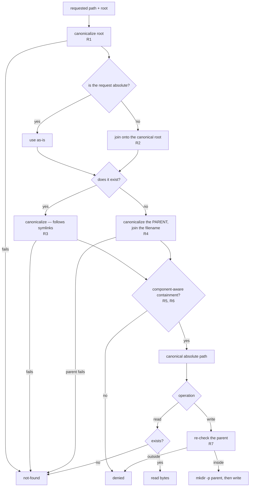
```mermaid
flowchart TB
    A["requested path + root"] --> B["canonicalize root<br/>R1"]
    B -->|"fails"| Z1["not-found"]
    B --> C{"is the request absolute?"}
    C -->|yes| D["use as-is"]
    C -->|no| E["join onto the canonical root<br/>R2"]
    D --> F{"does it exist?"}
    E --> F
    F -->|yes| G["canonicalize — follows symlinks<br/>R3"]
    F -->|no| H["canonicalize the PARENT,<br/>join the filename<br/>R4"]
    G -->|"fails"| Z1
    H -->|"parent fails"| Z1
    G --> I{"component-aware containment?<br/>R5, R6"}
    H --> I
    I -->|no| Z2["denied"]
    I -->|yes| J["canonical absolute path"]
    J --> K{"operation"}
    K -->|read| L{"exists?"}
    L -->|no| Z1
    L -->|yes| M["read bytes"]
    K -->|write| N["re-check the parent<br/>R7"]
    N -->|outside| Z2
    N -->|inside| O["mkdir -p parent, then write"]
```

**Failure behaviour and error mapping.** The three error classes map onto
transports as follows:

| Class | HTTP (browser) | IPC (desktop) |
|---|---|---|
| `denied` | 403 | `Err(String)` with "Access denied: path is outside the opened workspace" |
| `not-found` | 404 | `Err(String)` with the underlying message |
| `not-a-directory` | 400 | `Err(String)` with "Not a directory: ..." |

HTTP mapping: `src/server.ts`, lines 280–285. IPC mapping:
`src-tauri/src/fs_core.rs — impl From<FsError> for String, lines 51–55`.

**Audit requirements.** None exist. No filesystem operation is logged. See §25.

## 9.2 The dev server's request routing

The fallback chain is business logic, not plumbing, because getting it wrong made
a missing file invisible (§6.6).

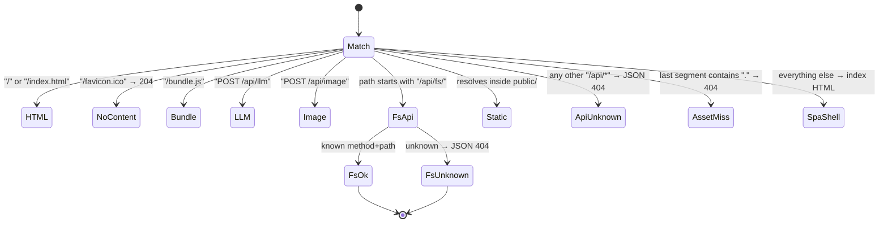
```mermaid
stateDiagram-v2
    [*] --> Match
    Match --> HTML: "/" or "/index.html"
    Match --> NoContent: "/favicon.ico" → 204
    Match --> Bundle: "/bundle.js"
    Match --> LLM: "POST /api/llm"
    Match --> Image: "POST /api/image"
    Match --> FsApi: path starts with "/api/fs/"
    Match --> Static: resolves inside public/
    Match --> ApiUnknown: any other "/api/*" → JSON 404
    Match --> AssetMiss: last segment contains "." → 404
    Match --> SpaShell: everything else → index HTML
    FsApi --> FsOk: known method+path
    FsApi --> FsUnknown: unknown → JSON 404
    FsOk --> [*]
    FsUnknown --> [*]
```

**Invalid transitions worth naming.** Before this design, `AssetMiss` and
`ApiUnknown` both fell through to `SpaShell`, returning `200` with a page of
HTML. `HttpStorage.readFile` checks `res.ok`, so a missing note read
*successfully* as HTML. The comment at `src/server.ts` lines 313–317 records it.

**Static file safety.** `isInsidePublicDir()` (`src/server.ts`, lines 111–115)
uses the same component-aware `relative()` idiom as the workspace jail, and
additionally rejects the directory itself (`rel !== ""`). Null bytes in the
decoded path are rejected before resolution (line 292).

## 9.3 Editor view-mode synchronisation

### 9.3.1 The problem

The document exists in two representations simultaneously: the ProseMirror
document and the `rawMarkdown` string. Edits in WYSIWYG update the former;
edits in the Markdown textarea update the latter. Getting the sync direction
wrong loses data — and did, before this logic existed.

### 9.3.2 The rule, isolated and unit-tested

```ts
// src/components/Editor/index.tsx — shouldSyncMarkdownIntoEditor(), lines 41–46
export function shouldSyncMarkdownIntoEditor(
    prevMode: ViewMode | null,
    nextMode: ViewMode
): boolean {
    return prevMode === "markdown" && nextMode !== "markdown";
}
```

The comment above it (lines 38–40) states the reasoning: *"Leaving markdown mode
is the only transition that needs an explicit push: wysiwyg/split edits keep
rawMarkdown current via onUpdate, but typing in the markdown textarea never
touches the editor doc directly."*

Extracting this as a pure function is what makes it testable without a DOM;
`src/components/Editor/index.test.ts` covers all six meaningful transitions
(lines 4–29), including the two negatives that matter — no sync on initial mount
(`prevMode === null`), and no sync when *entering* markdown mode.

### 9.3.3 State transition table

| From | To | Sync `rawMarkdown` into the editor? | Why |
|---|---|---|---|
| `null` (mount) | any | No | Nothing to push; content came from `loadFile` |
| `wysiwyg` | `split` | No | `onUpdate` already keeps `rawMarkdown` current |
| `split` | `wysiwyg` | No | Same |
| `wysiwyg` | `markdown` | No | The textarea reads `rawMarkdown`, which is current |
| `split` | `markdown` | No | Same |
| `markdown` | `wysiwyg` | **Yes** | Textarea edits never touched the ProseMirror doc |
| `markdown` | `split` | **Yes** | Same |

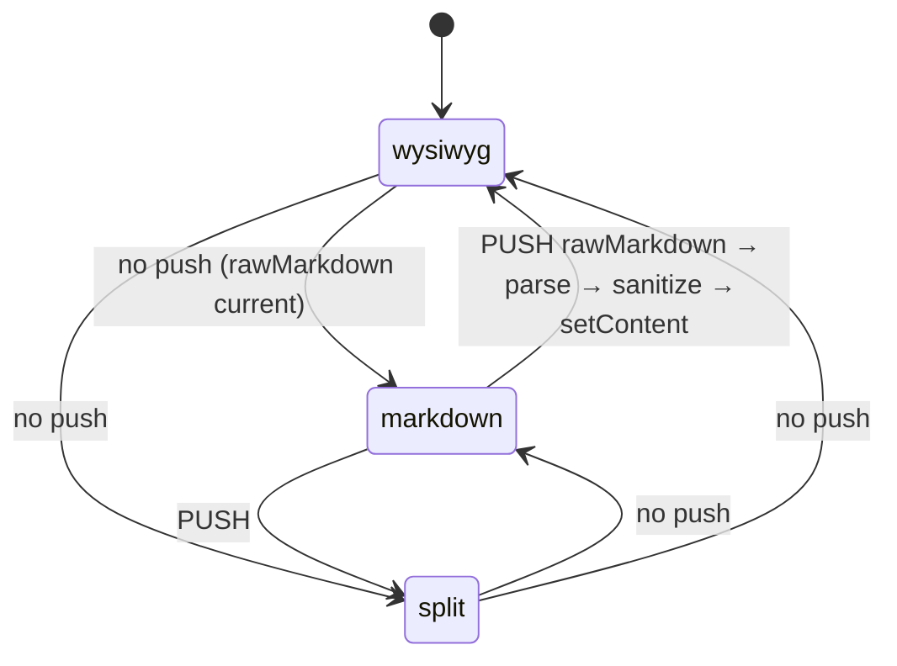
```mermaid
stateDiagram-v2
    [*] --> wysiwyg
    wysiwyg --> markdown: no push (rawMarkdown current)
    split --> markdown: no push
    wysiwyg --> split: no push
    split --> wysiwyg: no push
    markdown --> wysiwyg: PUSH rawMarkdown → parse → sanitize → setContent
    markdown --> split: PUSH
```

**Edge case handled.** The push is asynchronous (`marked.parse` may return a
promise) and runs inside an IIFE in the effect
(`src/components/Editor/index.tsx`, lines 272–278); `prevViewModeRef` is updated
synchronously afterwards (line 280) so a re-render mid-parse cannot double-push.

**Recovery behaviour.** None needed — no I/O is involved. The worst case is a
render of stale content, corrected on the next transition.

## 9.4 Block serialization and the round-trip defect

**This section documents a known defect. It is the second-largest limitation in
the system after the packaged build.**

### 9.4.1 The round trip

Saving converts the Tiptap document to HTML, then to Markdown via turndown.
Loading converts Markdown to HTML via marked, then parses it back into Tiptap
nodes. A block type survives the round trip only if every step preserves enough
information for its `parseHTML` rules to recognise it again.

```mermaid
flowchart LR
    N["Tiptap node"] -->|"renderHTML()"| H1["pre[data-type=X] > code"]
    H1 -->|"turndown fencedCodeBlock rule<br/>index.tsx 26–34"| MD["``` fence with language = code class minus 'language-'"]
    MD -->|"marked.parse"| H2["pre > code[class=language-...]"]
    H2 -->|"sanitizeHtml"| H3["sanitized HTML"]
    H3 -->|"parseHTML()"| N2["Tiptap node — or a plain code block"]
```

**The information that is lost.** turndown's rule reads the `class` attribute of
the `<code>` element and uses it as the fence language
(`src/components/Editor/index.tsx`, lines 27–33). The `data-type` attribute on
the `<pre>` is not preserved by a Markdown fence at all. So the *only* channel
through which a block's identity survives is the code element's `language-*`
class.

### 9.4.2 Which blocks survive, and why

| Block | `renderHTML` emits on `<code>` | `parseHTML` accepts | Survives? |
|---|---|---|---|
| Mermaid | `{ class: "language-mermaid" }` — `MermaidExtension.tsx`, line 248 | `pre[data-type="mermaid"]` **and** `pre` whose code has class `language-mermaid` — lines 219–242 | **Yes** |
| Dataset | `{}` — `DatasetExtension.tsx`, line 170 | `pre[data-type="dataset"]` only — line 140 | **No** |
| Query | `{}` — `QueryExtension.tsx`, line 164 | `pre[data-type="query"]` only — line 145 | **No** |
| ImageGen | `{}` — `ImageGenExtension.tsx`, line 208 | `pre[data-type="image-gen"]` only — line 190 | **No** |
| DiagramGen | `{}` — `DiagramGenExtension.tsx`, line 241 | `pre[data-type="diagram-gen"]` only — line 223 | **No** |

**Mermaid survives because it has both halves:** it stamps a language class on
serialization *and* accepts a plain `<pre>` carrying that class on parse. The
other four have neither half — they emit no class, and they require the
`data-type` attribute that a Markdown fence cannot carry.

**Observable behaviour.** Save a document containing a Dataset block, reload it,
and the block is a plain code block showing its `source: ... / name: ... / limit:
...` text. No data is lost from the file, but the block stops functioning.

**Second, related defect (B7).** `parseBlockAttrs()` is line-oriented
(`blockAttrs.ts`, lines 16–24), so an attribute value containing a newline cannot
round-trip even once the class problem is fixed.

**The fix, in outline (Recommendation).** Mirror Mermaid on the other four: emit
`class: "language-dataset"` (etc.) from `renderHTML`, and add a second
`parseHTML` rule matching a bare `pre` whose `code` carries that class. Tracked
as "B4 and B7: block round-trip and multi-line serialization" in
`docs/roadmap.md`, and as a required E2E case in the plan: *"save/reload round
trip for all five blocks asserting content is intact."*

**Status: no automated test covers this today.** The unit suite tests the
attribute parser and the fence stripper, but nothing exercises
`renderHTML → turndown → marked → parseHTML`. That is the single highest-value
test to add.

---

# 10. Domain Model

Motion's domain is small and file-shaped. There is no ORM, no schema, and no
identifier beyond the filesystem path.

## 10.1 Entities

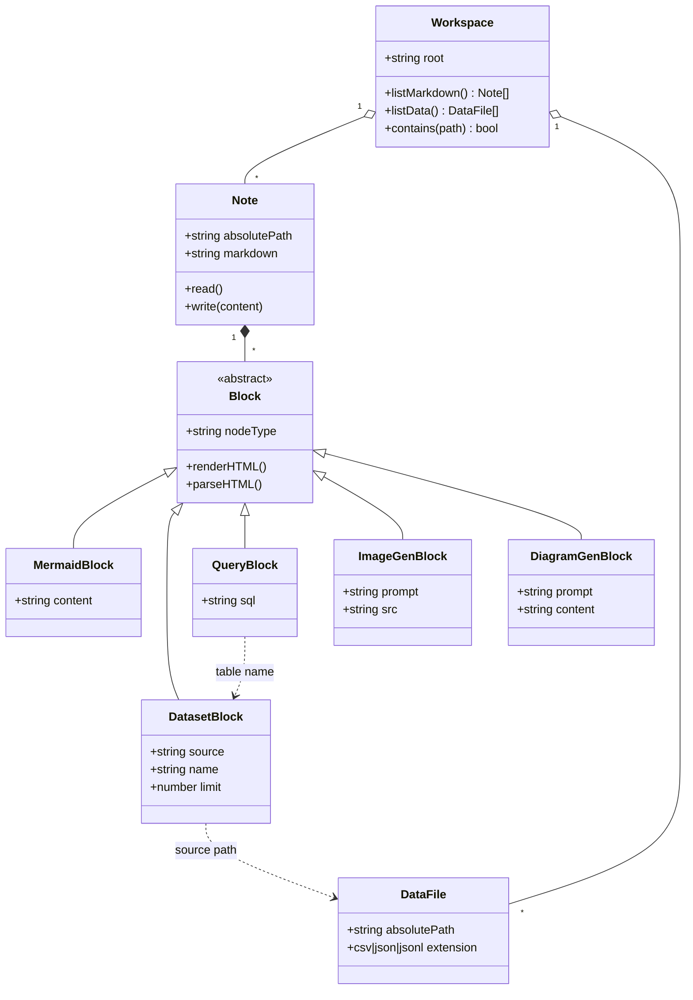
```mermaid
classDiagram
    class Workspace {
        +string root
        +listMarkdown() Note[]
        +listData() DataFile[]
        +contains(path) bool
    }
    class Note {
        +string absolutePath
        +string markdown
        +read()
        +write(content)
    }
    class DataFile {
        +string absolutePath
        +csv|json|jsonl extension
    }
    class Block {
        <<abstract>>
        +string nodeType
        +renderHTML()
        +parseHTML()
    }
    class MermaidBlock {
        +string content
    }
    class DatasetBlock {
        +string source
        +string name
        +number limit
    }
    class QueryBlock {
        +string sql
    }
    class ImageGenBlock {
        +string prompt
        +string src
    }
    class DiagramGenBlock {
        +string prompt
        +string content
    }

    Workspace "1" o-- "*" Note
    Workspace "1" o-- "*" DataFile
    Note "1" *-- "*" Block
    Block <|-- MermaidBlock
    Block <|-- DatasetBlock
    Block <|-- QueryBlock
    Block <|-- ImageGenBlock
    Block <|-- DiagramGenBlock
    DatasetBlock ..> DataFile : source path
    QueryBlock ..> DatasetBlock : table name
```

## 10.2 Per-entity detail

### Workspace

- **Purpose.** The aggregate root and the security boundary. Everything else is
  addressed relative to it.
- **Identity.** Its canonical absolute path.
- **Invariant.** Every path the system touches resolves inside it (§9.1).
- **Lifecycle.** Desktop: set by `set_workspace` from the native dialog, held in
  `WorkspaceState` (`src-tauri/src/lib.rs`, lines 90–92, 109–123). Browser: fixed
  for the process lifetime from `MOTION_WORKSPACE` (`src/server.ts`, lines 34–37).
- **Operations.** List markdown, list data files, read, write.
- **Security.** This *is* the security model.

### Note

- **Purpose.** One Markdown file.
- **Identity.** Absolute filesystem path. There is no note id, no title field, no
  frontmatter parsing. Display name is the basename (`src/App.tsx`, lines 15–17).
- **Fields.** Path and UTF-8 content. Nothing else is persisted.
- **Validation.** Only the jail; the content is arbitrary Markdown.
- **Lifecycle.** Created by `handleNewNote` with the name
  `untitled-<ISO timestamp>.md` (`src/App.tsx`, lines 53–55); updated by save;
  **never deleted or renamed by Motion** — there is no delete or rename feature.
- **Events produced.** None. There is no event system.

### DataFile

- **Purpose.** A CSV, JSON or JSONL file that a Dataset block can register.
- **Discovery.** `DATA_EXTENSIONS = ["csv", "json", "jsonl"]`, defined identically
  in both cores (`src/lib/fsCore.ts`, line 131; `src-tauri/src/fs_core.rs`, line
  60).
- **Lifecycle.** Read-only from Motion's perspective; never written.

### Block (five subtypes)

- **Purpose.** A live element embedded in a note.
- **Persistence model.** Serialized into the Markdown itself as a fenced code
  block. There is no sidecar file and no database row — see §9.4 for the
  round-trip defect this creates.
- **Invariants.** `DatasetBlock.name` must be a valid SQL identifier after
  normalization; `DatasetBlock.limit` is clamped to 1–10 000;
  `QueryBlock.sql` must pass `validateSelectSql`; `DiagramGenBlock.content` must
  parse as Mermaid before it is accepted.
- **Empty-value convention.** A serialized `null` or `undefined` means "unset",
  not the literal string — enforced centrally by `EMPTY_SENTINELS`
  (`blockAttrs.ts`, line 12). §6.9 explains why this matters.

## 10.3 Relationship table

| From | To | Cardinality | Mechanism |
|---|---|---|---|
| Workspace | Note | 1 to many | Recursive filesystem walk, dotdirs skipped |
| Workspace | DataFile | 1 to many | Same walk, different extension filter |
| Note | Block | 1 to many | Blocks are embedded in the note's Markdown |
| DatasetBlock | DataFile | many to 1 | `source` attribute, a workspace-relative or absolute path |
| QueryBlock | DatasetBlock | many to many | By DuckDB table name — **not a checked reference** |

**The unchecked reference is worth noting.** A Query block names tables in SQL
text. Nothing verifies that a Dataset block creating that table exists in the
document. A mismatch surfaces as a DuckDB error after three retries (§8.6).

---

# 11. Module-by-Module Design

## 11.1 Module dependency diagram

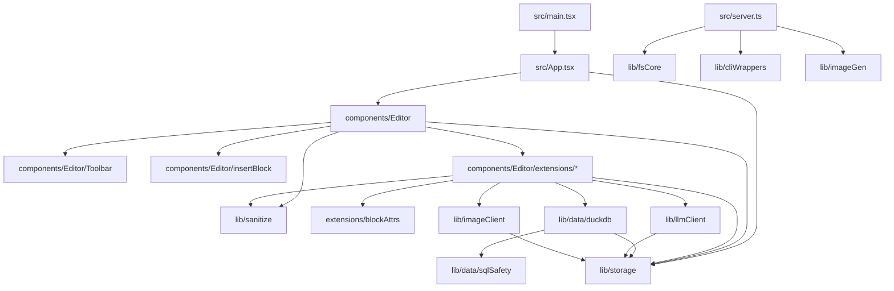
```mermaid
flowchart TB
    main["src/main.tsx"] --> app["src/App.tsx"]
    app --> editor["components/Editor"]
    app --> storage["lib/storage"]
    editor --> toolbar["components/Editor/Toolbar"]
    editor --> insert["components/Editor/insertBlock"]
    editor --> ext["components/Editor/extensions/*"]
    editor --> storage
    editor --> sanitize["lib/sanitize"]
    ext --> attrs["extensions/blockAttrs"]
    ext --> sanitize
    ext --> duckdb["lib/data/duckdb"]
    ext --> llmc["lib/llmClient"]
    ext --> imgc["lib/imageClient"]
    ext --> storage
    duckdb --> sqlsafety["lib/data/sqlSafety"]
    duckdb --> storage
    llmc --> storage
    imgc --> storage
    server["src/server.ts"] --> fscore["lib/fsCore"]
    server --> cliw["lib/cliWrappers"]
    server --> igen["lib/imageGen"]
```

**Note the shape.** `lib/storage` is the most depended-upon module in the client
(five importers) and depends on nothing but the Tauri API and `fetch` — the
correct shape for a boundary module. `llmClient` and `imageClient` import
`isTauri` from `lib/storage` (line 2 of each), which is why storage sits below
them.

**Circular dependencies:** none. **Boundary violations:** none in the client — the
guard would fail. **Coupling risk:** `components/Editor/index.tsx` is 398 lines
and holds document state, view-mode logic, the slash menu, save, and three render
branches. It is the most coupled module in the codebase and the first candidate
for splitting (§31, item T3).

## 11.2 `src/lib/fsCore.ts` — the browser-mode filesystem core

| Field | Value |
|---|---|
| Purpose | Jail, path resolution, listing, read and write for browser mode |
| Business responsibility | One half of NFR-1 and NFR-2 |
| Public interface | `FsError`, `FsErrorCode`, `isInsideWorkspace()`, `resolveInWorkspace()`, `collectFiles()`, `readWorkspaceFile()`, `writeWorkspaceFile()`, `toWorkspaceRelative()`, `MARKDOWN_EXTENSIONS`, `DATA_EXTENSIONS` |
| Internal | `realOrThrow()` (lines 55–61), `assertDirectory()` (lines 94–100) |
| Dependencies | `node:fs`, `node:path` only |
| Configuration | None — the root is always a parameter |
| Error handling | Throws `FsError` with one of three codes; never returns a sentinel |
| Logging / metrics | None |
| Testing | `src/lib/fsCore.contract.test.ts` runs the shared contract |
| Extension points | Add an extension constant; add a case to the contract *and* implement it in Rust |

**Design property worth copying.** The module's header states why it exists as a
separate file: *"Pure in the sense that matters for testing: no server, no
listener, no module-level side effects. `src/server.ts` starts a build, a watcher
and a socket at import time, so nothing reachable through it can be unit-tested;
these functions are the part that actually needs the tests."* (lines 4–7).

**Known risk.** It is not imported by the client bundle and must never be — the
header says so (line 14), and the guard enforces it transitively, since importing
it would pull in `node:fs`.

## 11.3 `src-tauri/src/fs_core.rs` — the desktop filesystem core

| Field | Value |
|---|---|
| Purpose | The Rust counterpart of §11.2 |
| Public interface | `FsError`, `FsErrorCode`, `is_inside_workspace()`, `resolve_in_workspace()`, `collect_files()`, `read_workspace_file()`, `write_workspace_file()`, `MARKDOWN_EXTENSIONS`, `DATA_EXTENSIONS` |
| Internal | `real_or_not_found()` (62–69), `assert_directory()` (123–132), `walk()` (143–167) |
| Dependencies | `std::fs`, `std::path`; `serde_json` and `tempfile` in tests only |
| Error handling | `FsResult<T> = Result<T, FsError>`; `From<FsError> for String` (51–55) converts at the command boundary |
| Testing | `mod contract` (204–376) runs the shared contract |

**Why it was split out of `lib.rs`** — its header (lines 3–5): the
`#[tauri::command]` functions take `tauri::State`, which needs a running app,
*"while everything that can actually be wrong about a filesystem jail lives here
as plain functions."* This is the same testability argument as §11.2, arrived at
independently on the Rust side.

**One deliberate asymmetry from the TypeScript version.** `collect_files` skips
entries whose `file_type()` cannot be read (`let Ok(file_type) = ... else
continue`, line 150), where the TypeScript version would throw. Not covered by
the contract; **Open Question** in §34.

## 11.4 `src/lib/storage/index.ts` — the storage boundary

| Field | Value |
|---|---|
| Purpose | Give every consumer one runtime-agnostic way to reach the filesystem |
| Public interface | `StorageProvider` (4–11), `TauriStorage` (13–43), `HttpStorage` (69–109), `isTauri()` (115), `storage` (117) |
| Internal | `failed()` (46–55) |
| Dependencies | `@tauri-apps/api/core`, `@tauri-apps/plugin-dialog`, `fetch` |
| Error handling | `TauriStorage` propagates the Rust `Err` string; `HttpStorage` surfaces the server's JSON `error` field when present, falling back to the status line |
| Testing | Indirectly, via E2E; no unit test — both implementations are pure I/O adapters |
| Extension points | A third implementation would need its own contract-runner |

**Runtime detection.** `isTauri()` delegates to the official
`isTauri` from `@tauri-apps/api/core` (line 1, re-exported at line 115). The
comment at lines 111–114 records the rejected alternative: *"Do not check
`window.__TAURI__` — that only exists when `withGlobalTauri` is enabled."*

**`HttpStorage` is the module that replaced `WebStorage`.** Its class doc (lines
57–68) states what changed and why it matters:

> *"This replaces the former WebStorage, which faked the filesystem: `writeFile`
> was a console.warn that reported success and `openFolder` returned the literal
> string "web-mock-folder". That made web mode useless as a test surface — saving
> could not fail, so testing a save proved nothing about the desktop app."*

## 11.5 `src/server.ts` — the Bun dev server

| Field | Value |
|---|---|
| Purpose | Build the bundle, serve the app, and be the browser-mode backend |
| Public interface | HTTP — see §14 |
| Configuration | `PORT` (line 25), `MOTION_WORKSPACE` (lines 34–37) |
| Dependencies | Bun, `node:fs`, `fsCore`, `cliWrappers`, `imageGen` |
| Error handling | `FsError` mapped to HTTP status (280–285); everything else 500 |
| Logging | `console.log` on build start/finish and file change |
| Testing | Not unit-tested — it starts a build, a watcher and a socket at import time. This is why `fsCore` was extracted |
| Known risks | Binds without authentication (§22.6); spawns subprocesses on request |

**Build and watch.** `buildApp()` (46–77) runs `Bun.build` targeting the browser
and reads the emitted `dist/main.js` into memory. The watcher (141–145) triggers
`scheduleRebuild()` (124–138), which debounces at 150 ms and awaits any in-flight
rebuild before starting another — the guard against concurrent-rebuild races.

**HTML generation.** `generateHTML()` (89–108) inlines `src/index.css` and points
at `/bundle.js`. The root `index.html` in the repository is **stale and unused**;
it references `/src/main.tsx`, a path the server does not serve (`CLAUDE.md`
lines 49–50 warns against "fixing" bugs by editing it). Deleting it and
generating both shells from one template is a roadmap item.

## 11.6 `src-tauri/src/lib.rs` — the Tauri backend

| Field | Value |
|---|---|
| Purpose | Expose seven IPC commands; own the workspace state |
| Public interface | `run()` (159–188) plus the seven commands |
| State | `WorkspaceState { root: Mutex<Option<PathBuf>> }` (90–92) |
| Dependencies | `fs_core`, `tokio` (process, time), `base64`, Tauri plugins (dialog, fs, log) |
| Error handling | Every command returns `Result<_, String>`; `fs_core` errors convert via `From` |
| Concurrency | One `Mutex`; a poisoned lock returns "Workspace lock poisoned" (lines 102, 119) |
| Testing | `mod tests` (190–249) — state handling only; the jail is covered by the contract |

**The commands are deliberately thin.** Their shared doc comment (94–98) is
quoted in §6.7. `read_file` and `write_file` are two lines each; `list_data_files`
is two lines. All logic lives in `fs_core`.

**Plugin registration** (161–166): dialog, fs, and — in debug builds only — the
log plugin at `Info` level (168–175).

## 11.7 The four enrichment modules — dead code, and why the guard exists for them

`src/lib/ContentInjector.ts`, `TopicRefiner.ts`, `TOCGenerator.ts`,
`SkillGenerator.ts`.

**What they are.** Four classes that build prompts and call an LLM to refine
content, analyse topics, annotate a table of contents, and synthesize a
`SKILL.md`. Each is constructed with a provider and optional model
(e.g. `ContentInjector`, lines 9–17).

**How they reach `Bun`.** Each begins with a **value** import:

```ts
// src/lib/ContentInjector.ts, line 1 — identical first line in all four
import { callLLM, type ModelProvider } from './cliWrappers';
```

`callLLM` uses `Bun.spawn` (`src/lib/cliWrappers.ts`, line 56). **Correction
worth stating precisely:** the four modules do not call `Bun.spawn` themselves —
they import a function that does. The effect is the same and the guard treats it
the same, because the import is a value import, not a type import, so
`cliWrappers.ts` would be pulled into any bundle that reached them.

**Why they cannot run in either shipped mode.** Both shipped modes execute UI code
in a webview or a browser tab, where `Bun` is undefined. There is no third mode.

**Why no test catches this.** Two reasons, both structural:

1. Nothing in the UI imports them. Verified by search: the only importers are
   their own unit tests (`ContentInjector.test.ts`, `TopicRefiner.test.ts`,
   `TOCGenerator.test.ts`, `SkillGenerator.test.ts`, `Integration.test.ts`). So
   no E2E spec can execute them.
2. Their unit tests pass because they mock the LLM boundary and run inside Bun,
   where `Bun.spawn` exists.

This is precisely the argument in `scripts/guard-client-bundle.ts` lines 9–15 for
a static guard: dormant browser-unsafe code stays green until someone wires it to
a button.

**Current guard status.** `bun run guard:client` passes today *because* these
modules are unreachable from `src/main.tsx`. The moment a UI component imports
one, the guard fails — which is the intended behaviour and the reason the roadmap
item is phrased as "B8: route the four enrichment modules through llmClient"
rather than "wire up the enrichment modules".

**Recommendation.** Either route them through `llmClient.ts` before wiring any
UI, or delete them. Leaving ~250 lines of untriggerable code in `src/lib/` with
passing tests is a maintenance liability that reads as working code.

## 11.8 Other client modules, briefly

| Module | Public interface | Notes |
|---|---|---|
| `lib/sanitize.ts` | `sanitizeHtml()`, `sanitizeSvg()`, `escapeHtmlText()` | `sanitizeSvg` needs three separate DOMPurify overrides to survive Mermaid's `foreignObject` label rendering; the reasoning is documented at lines 14–26 |
| `lib/data/sqlSafety.ts` | `validateIdentifier()`, `escapeSqlString()`, `clampLimit()`, `validateSelectSql()`, `MAX_QUERY_LIMIT` | Pure functions, no dependencies. Tested in `src/lib/Integration.test.ts`, lines 59–73 |
| `lib/data/duckdb.ts` | `initDuckDB()`, `registerFile()`, `executeQuery()`, plus re-exports of the safety helpers | Bundles are served locally from `public/duckdb/` to avoid CORS issues with Workers (lines 17–27) |
| `components/Editor/insertBlock.ts` | `INSERT_COMMANDS`, `insertBlock()` | The single source of the five block types, shared by the toolbar and the slash menu |
| `components/Editor/extensions/blockAttrs.ts` | `parseBlockAttrs()` | §6.9 |

---

# 12. Package-by-Package Design

The repository has no package manager boundaries inside `src/` — it is one Bun
project with directory-level structure. The directories function as packages and
are treated as such here.

| Package | Purpose | Public surface | May import | Must NOT import |
|---|---|---|---|---|
| `src/` (root) | Entry point and shell | `main.tsx`, `App.tsx` | Everything client-side | `fsCore.ts`, `cliWrappers.ts`, `imageGen.ts`, `server.ts` |
| `src/components/Editor/` | The editor | `default export Editor`, `shouldSyncMarkdownIntoEditor` | `lib/storage`, `lib/sanitize`, its own extensions | Any server module |
| `src/components/Editor/extensions/` | Block node types | One Tiptap `Node` per file, plus `parseBlockAttrs`, `stripCodeFence` | `lib/data`, `lib/llmClient`, `lib/imageClient`, `lib/sanitize`, `lib/storage` | Any server module |
| `src/lib/` | Client libraries plus (separately) server-only libraries | See §11 | Per module | The client subset must not import the server subset by value |
| `src/lib/data/` | DuckDB and SQL safety | `initDuckDB`, `registerFile`, `executeQuery`, safety helpers | `lib/storage` | Any server module |
| `src/lib/storage/` | The storage boundary | `StorageProvider`, `storage`, `isTauri` | Tauri API, `fetch` | Everything else |
| `src-tauri/src/` | Rust backend | `run()`, seven commands | `fs_core` | — |
| `e2e/` | Playwright specs and harness | `test`, `expect`, `gotoApp`, `createWorkspace` | Playwright, `node:fs` | Application source |
| `scripts/` | Build-time guards | Executable scripts | `node:fs` | — |
| `tests/contract/` | The shared fixture | JSON | — | — |

**The one import rule that is machine-enforced.** `src/lib/` is not split into
`client/` and `server/` directories; the distinction is enforced by
`scripts/guard-client-bundle.ts` walking the graph from `src/main.tsx` rather
than by directory convention.

**Recommendation.** Moving `fsCore.ts`, `cliWrappers.ts`, `imageGen.ts` and the
four enrichment modules into `src/lib/server/` would make the boundary visible to
a reader, not only to the guard. Low cost, purely organisational; not on the
roadmap.

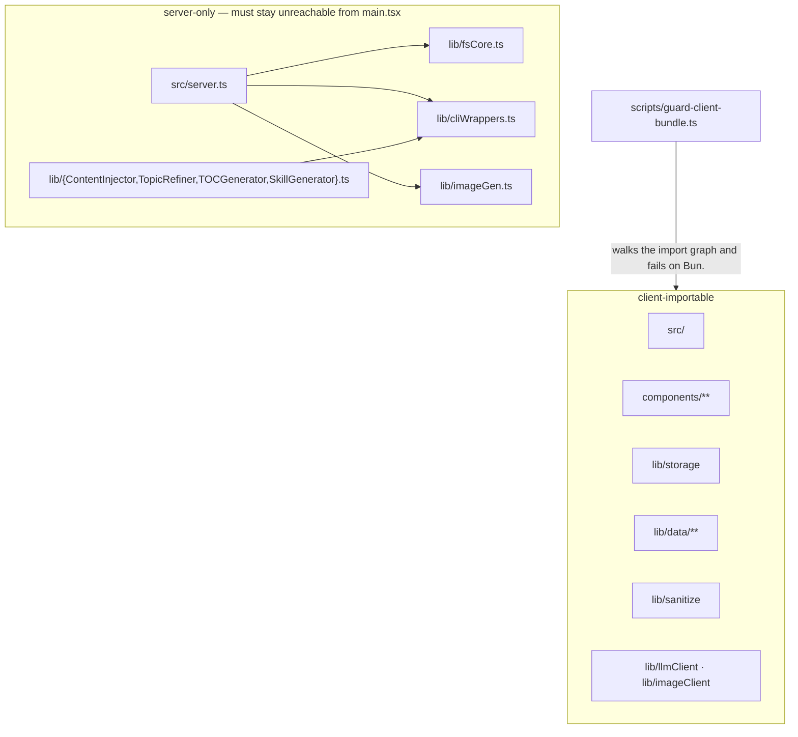
```mermaid
flowchart TB
    subgraph client["client-importable"]
        s1["src/"]
        s2["components/**"]
        s3["lib/storage"]
        s4["lib/data/**"]
        s5["lib/sanitize"]
        s6["lib/llmClient · lib/imageClient"]
    end
    subgraph server["server-only — must stay unreachable from main.tsx"]
        v1["src/server.ts"]
        v2["lib/fsCore.ts"]
        v3["lib/cliWrappers.ts"]
        v4["lib/imageGen.ts"]
        v5["lib/{ContentInjector,TopicRefiner,TOCGenerator,SkillGenerator}.ts"]
    end
    guard["scripts/guard-client-bundle.ts"] -->|"walks the import graph and fails on Bun."| client
    v1 --> v2
    v1 --> v3
    v1 --> v4
    v5 --> v3
```

---

# 13. Class-by-Class Design

Only classes and interfaces with behaviour are documented. React function
components are covered in §11 and §8.

## 13.1 `StorageProvider` (interface)

`src/lib/storage/index.ts`, lines 4–11.

| Method | Signature | Purpose | Preconditions | Returns | Throws |
|---|---|---|---|---|---|
| `openFolder` | `() => Promise<string \| null>` | Establish or report the workspace root | — | Absolute root, or `null` if the user cancelled | Backend errors |
| `listFiles` | `(path: string) => Promise<string[]>` | Markdown files, recursive, sorted, absolute | A workspace exists | Absolute paths | Backend errors |
| `readFile` | `(path: string) => Promise<string>` | File content | Path inside the workspace | UTF-8 content | `denied`, `not-found` |
| `writeFile` | `(path: string, content: string) => Promise<void>` | Write content, creating parents | Path inside the workspace | — | `denied` |
| `listDataFiles` | `() => Promise<string[]>` | CSV/JSON/JSONL for the Dataset picker | A workspace exists | Absolute paths | Backend errors |

**Idempotency.** All five are idempotent. **Authorization.** None beyond the jail.
**Transaction boundaries.** None — each call is a single filesystem operation.

## 13.2 `TauriStorage`

`src/lib/storage/index.ts`, lines 13–43. Implements `StorageProvider` over IPC.

- `openFolder()` (14–26) opens the native directory dialog, then calls
  `invoke("set_workspace", { path })` before returning — **the side effect that
  makes every later command legal.** Returns `null` when the dialog result is not
  a string.
- `listFiles(path)` → `invoke("list_markdown_files", { path })`.
- `readFile(path)` → `invoke("read_file", { path })`.
- `writeFile(path, content)` → `invoke("write_file", { path, content })`.
- `listDataFiles()` → `invoke("list_data_files")` — no arguments; the root is
  server-side state.

**Mocking boundary for tests.** `invoke` and `open`. There is no unit test today;
E2E covers the browser implementation only, since Playwright cannot drive a Tauri
webview (§28.6).

## 13.3 `HttpStorage`

`src/lib/storage/index.ts`, lines 69–109. Implements `StorageProvider` over HTTP.

| Method | Request | Response handling |
|---|---|---|
| `openFolder()` (75–80) | `GET /api/fs/workspace` | Returns `root`, or `null` if absent. **No picker** — the browser has none, and the workspace is fixed by `MOTION_WORKSPACE` (comment, lines 71–74) |
| `listFiles(_path)` (82–86) | `GET /api/fs/list` | Argument ignored by design (§6.3) |
| `readFile(path)` (88–93) | `GET /api/fs/read?path=<encoded>` | Returns `content` |
| `writeFile(path, content)` (95–102) | `POST /api/fs/write` with a JSON body | Throws on non-OK |
| `listDataFiles()` (104–108) | `GET /api/fs/data-files` | Array of absolute paths |

**Error surfacing.** Every non-OK response goes through `failed()` (46–55), which
parses the JSON body and prefers its `error` field over the bare status line —
so the user sees "Access denied: path is outside the opened workspace" rather
than "403 Forbidden".

## 13.4 `FsError` (TypeScript) and `FsError` (Rust)

| | TypeScript | Rust |
|---|---|---|
| Location | `src/lib/fsCore.ts`, lines 29–34 | `src-tauri/src/fs_core.rs`, lines 31–41 |
| Codes | `"denied" \| "not-found" \| "not-a-directory"` (line 27) | `FsErrorCode::{Denied, NotFound, NotADirectory}` (13–18) |
| Wire names | The string literals themselves | `FsErrorCode::as_str()` (20–29) |
| Conversion at the boundary | HTTP status map in `src/server.ts`, lines 280–285 | `impl From<FsError> for String`, lines 51–55 |

**Why the codes exist rather than message matching:** the contract asserts on the
class, not the text (`tests/contract/storage-cases.json`, lines 13–14), which is
what lets the two languages word their messages naturally while staying
behaviourally identical.

## 13.5 `PageGuard` (test infrastructure)

`e2e/fixtures.ts`, lines 29–50. Not production code, but architecturally
load-bearing (§6.6).

| Member | Lines | Purpose |
|---|---|---|
| `violations: string[]` | 30 | Everything recorded during the test |
| `warnings: string[]` | 31 | Recorded, never fatal |
| `allowed: RegExp[]` | 32 | Per-test opt-outs |
| `allow(pattern)` | 39–41 | Narrow escape hatch; *"a bare `/./` defeats the gate"* |
| `record(violation)` | 43–45 | Append |
| `unexpected()` | 47–49 | Violations not matching any allow pattern |

Assertion happens at fixture teardown (lines 80–85), after the test body, with
the full list in the failure message.

## 13.6 The five Tiptap node classes

All five are `Node.create({...})` with `group: "block"`, `atom: true`,
`draggable: true`, and a React node view.

| Node | `name` | Attributes | Node view | Notable |
|---|---|---|---|---|
| Mermaid | `"mermaid"` (line 205) | `content` with a default diagram (211–217) | `MermaidNodeView` (33–70+) | `priority: 1000` (line 209) so it wins over the generic code-block extension; two `parseHTML` rules (219–242) |
| Dataset | `"dataset"` (114) | `source`, `name`, `limit` — `limit` clamped on both parse and render (127–133) | `DatasetNodeView` (8–110) | Populates its picker from `storage.listDataFiles()` (16–18); keeps a hand-authored `source` in the options list even if unlisted (46–48) |
| Query | `"query"` (129) | `sql` | `QueryNodeView` (6–…) | Runs on mount and on `sql` change (28–30) |
| ImageGen | `"imageGen"` (171) | `prompt`, `src` | `ImageGenNodeView` (7–…) | `handleGenerate(isRefinement)` (15–35) supports refining an existing image |
| DiagramGen | `"diagramGen"` (204) | `prompt`, `content` | `DiagramGenNodeView` (29–…) | Validates with `mermaid.parse` before accepting (line 26) |

**Concurrency consideration, Mermaid.** The render effect uses a `cancelled` flag
(`MermaidExtension.tsx`, lines 45, 54, 58, 68) so a superseded render never
writes into `innerHTML` after a newer one. On error it clears the container
(lines 60–62) rather than leaving a stale diagram.

**Exceptions.** None of the node views throw; every failure becomes local error
state rendered inside the block. This is deliberate — a failed diagram must not
take down the document.

## 13.7 `WorkspaceState` (Rust)

`src-tauri/src/lib.rs`, lines 90–92.

```rust
struct WorkspaceState {
    root: Mutex<Option<PathBuf>>,
}
```

- **State managed.** The single canonical workspace root for the process.
- **Concurrency.** `Mutex`; every access goes through `workspace_root()`
  (99–107), which maps a poisoned lock to `"Workspace lock poisoned"` rather than
  panicking.
- **Invariant.** `None` until `set_workspace` succeeds; every filesystem command
  fails with `"No workspace opened. Open a folder first."` until then. Pinned by
  `refuses_every_operation_until_a_workspace_is_opened()` (200–205).
- **Only one writer.** `set_workspace` (109–123). `list_markdown_files` used to be
  a second writer; that hole is closed and pinned (§6.3).

---

# 14. API Design

Motion exposes two API surfaces: the dev server's HTTP endpoints (browser mode)
and the Tauri IPC commands (desktop mode). They are deliberately parallel.

## 14.1 HTTP API — `src/server.ts`

**Authentication: none. Authorization: none. Rate limits: none. Versioning: none.**
The API is bound to a local port for development use. §22.6 covers the exposure
risk this creates.

### `GET /api/fs/workspace`

| | |
|---|---|
| Purpose | Report the configured workspace root |
| Handler | `src/server.ts`, lines 240–241 |
| Request | No parameters |
| Response | `200 {"root": "/abs/path"}` |
| Downstream | None — returns the module constant |

### `GET /api/fs/list`

| | |
|---|---|
| Purpose | All Markdown files under the workspace, recursive, sorted, absolute |
| Handler | `src/server.ts`, lines 243–246 |
| Response | `200 ["/abs/a.md", "/abs/nested/b.md"]` |
| Errors | `400` if the root is not a directory |
| Downstream | `collectFiles(WORKSPACE_ROOT, MARKDOWN_EXTENSIONS)` |

### `GET /api/fs/data-files`

Identical to `/api/fs/list` with `DATA_EXTENSIONS`. Handler: lines 248–249.

### `GET /api/fs/read`

| | |
|---|---|
| Purpose | Read one file inside the workspace |
| Handler | `src/server.ts`, lines 251–259 |
| Query parameter | `path` — required; workspace-relative or absolute |
| Response | `200 {"content": "..."}` |
| Errors | `400 {"error":"Missing path"}`; `403` denied; `404` not found |
| Example | `GET /api/fs/read?path=welcome.md` |

### `POST /api/fs/write`

| | |
|---|---|
| Purpose | Write a file inside the workspace, creating parent directories |
| Handler | `src/server.ts`, lines 261–271 |
| Body | `{"path": "notes/new.md", "content": "# Hi\n"}` |
| Response | `200 {"ok": true}` |
| Errors | `400 {"error":"Missing path or content"}` — both must be strings; `403` denied |
| Idempotency | Yes — same body, same result |

### `POST /api/llm`

| | |
|---|---|
| Purpose | Run an LLM CLI in the Bun process |
| Handler | `src/server.ts`, lines 185–208 |
| Body | `{"provider": "claude"\|"opencode"\|"qwen", "prompt": "...", "systemPrompt"?: "...", "model"?: "..."}` |
| Validation | Provider must be in `ALLOWED_LLM_PROVIDERS` (line 20) else `400`; `prompt` must be a non-empty string else `400` |
| Response | `200 {"content": "...", "rawOutput": "..."}` |
| Errors | `500 {"error": "..."}` on spawn failure, non-zero exit, or timeout |
| Timeout | 120 s (`src/lib/cliWrappers.ts`, line 24) |

### `POST /api/image`

| | |
|---|---|
| Purpose | Run the `imagen` CLI in the Bun process |
| Handler | `src/server.ts`, lines 213–225 |
| Body | `{"prompt": "..."}` |
| Response | `200 {"dataUri": "data:image/png;base64,..."}` |
| Errors | `400` missing prompt; `500` on failure or timeout |
| Timeout | 120 s (`src/lib/imageGen.ts`, line 20) |

### Non-API routes

| Route | Response | Lines |
|---|---|---|
| `/` and `/index.html` | Generated HTML, `Cache-Control: no-cache` | 155–163 |
| `/favicon.ico` | `204` — never 404, or every E2E run fails the gate | 168–170 |
| `/bundle.js` | The in-memory bundle | 173–180 |
| Anything under `public/` | The file, if inside `PUBLIC_DIR` | 291–302 |
| Unknown `/api/*` | `404` JSON | 305–310 |
| Path whose last segment has a `.` | `404` | 318–321 |
| Anything else | SPA shell | 324–327 |

### Error format

All API errors are `{"error": "<message>"}`. Filesystem errors carry the shared
core's message and are mapped by class:

```ts
// src/server.ts, lines 279–285
const status =
    error instanceof FsError
        ? { denied: 403, "not-found": 404, "not-a-directory": 400 }[error.code]
        : 500;
```

### Sequence diagram: a save in browser mode

```mermaid
sequenceDiagram
    autonumber
    participant E as Editor
    participant H as HttpStorage
    participant S as Bun server
    participant C as fsCore
    participant D as Disk

    E->>H: writeFile("/ws/note.md", md)
    H->>S: POST /api/fs/write { path, content }
    S->>S: validate both are strings
    S->>C: writeWorkspaceFile(WORKSPACE_ROOT, path, content)
    C->>C: resolveInWorkspace — canonicalize + containment
    C->>C: re-check the parent, mkdir -p if missing
    C->>D: writeFileSync
    D-->>C: ok
    C-->>S: void
    S-->>H: 200 { ok: true }
    H-->>E: resolve
    Note over E,S: On denial: FsError("denied") → 403 → failed() → throw → alert()
```

## 14.2 IPC API — `src-tauri/src/lib.rs`

Registered in `run()` at lines 177–185. All return `Result<_, String>`; a JS
caller sees a rejected promise carrying the message.

| Command | Args | Returns | Preconditions | Lines |
|---|---|---|---|---|
| `set_workspace` | `path: String` | canonical root `String` | Path exists and is a directory | 109–123 |
| `read_file` | `path: String` | file content | A workspace is open; path resolves inside it | 125–129 |
| `write_file` | `path: String`, `content: String` | `()` | Same, plus the parent must be inside | 131–135 |
| `list_markdown_files` | `path: String` | `Vec<String>` | A workspace is open; `path` resolves inside it | 145–150 |
| `list_data_files` | — | `Vec<String>` | A workspace is open | 153–157 |
| `run_llm_cli` | `provider`, `prompt`, `system_prompt: Option<String>` | stdout `String` | Provider is one of three | 21–53 |
| `run_image_cli` | `prompt: String` | data URI `String` | — | 59–86 |

**Backward compatibility.** The IPC surface is versionless and internal — the
frontend and backend ship together. `list_markdown_files` keeps its `path`
argument purely to preserve the existing frontend call shape while removing the
re-rooting hole (§6.3).

**Known gap.** `run_llm_cli` has no `model` parameter, while the HTTP endpoint
accepts one. Tracked as B6 ("thread model through the run_llm_cli IPC
signature"). Today a desktop `callLLMFromUI` with `options.model` set silently
drops it — `src/lib/llmClient.ts` lines 18–22 do not pass it.

## 14.3 Pagination, filtering, deprecation

None of these exist. Listings return the full set; filtering is client-side
(`src/App.tsx`, lines 19–23). There is no deprecation policy because there are no
external consumers.

---

# 15. Persistent Store Design

There is no database. This section documents the two stores that do exist.

## 15.1 The workspace filesystem — the only durable store

| Property | Value |
|---|---|
| Type | The user's own filesystem |
| Purpose | Hold notes and datasets |
| Ownership | The user. Motion never relocates or deletes files |
| Connection strategy | Direct synchronous calls (`node:fs` / `std::fs`) |
| Transaction model | **None.** A write is a single `writeFileSync` / `fs::write` |
| Isolation | None. No locking, no conflict detection |
| Indexing | None. Every listing is a fresh recursive walk |
| Backup / recovery | The user's responsibility |
| Migration | Not applicable — the format is Markdown |
| Retention | Not applicable |
| Encryption | Whatever the user's disk provides |
| Access control | The workspace jail (§9.1) plus OS file permissions |

### Record types

| Record | Extensions | Read by | Written by | Sensitivity |
|---|---|---|---|---|
| Note | `.md` | `readWorkspaceFile` / `read_workspace_file` | `writeWorkspaceFile` / `write_workspace_file` | User content — potentially anything |
| Dataset | `.csv`, `.json`, `.jsonl` | `readFile` then registered into DuckDB | Never written | User content |

### Data lifecycle

```mermaid
flowchart LR
    A["User creates a note<br/>untitled-<timestamp>.md"] --> B["Edited in the editor"]
    B --> C["Saved — full-file overwrite"]
    C --> B
    C --> D["Listed on the next openFolder"]
    D --> B
    C -.->|"Motion never does this"| E["deleted / renamed / archived"]
```

### Concurrent updates and duplicate prevention

- **Duplicate prevention.** New-note filenames embed an ISO timestamp with `:`
  and `.` replaced (`src/App.tsx`, lines 53–55), which makes a collision
  essentially impossible within one session but is not a guarantee.
- **Concurrent updates.** Last write wins. Nothing detects that the file changed
  on disk since it was loaded. **Open Question** — §34.
- **Failed-write recovery.** A failed write leaves the previous file bytes
  untouched (neither implementation truncates before writing) and surfaces an
  alert. There is no partial-write window beyond what the OS provides for a
  single `write` call.

## 15.2 DuckDB-WASM — an ephemeral in-memory store

| Property | Value |
|---|---|
| Type | Analytical SQL engine compiled to WebAssembly |
| Purpose | Query registered CSV/JSON/JSONL data inside a note |
| Lifetime | Per page load. Nothing persists across a reload |
| Instantiation | Lazily, once, on first use — `initDuckDB()` memoises into a module-level `db` (`src/lib/data/duckdb.ts`, lines 29, 35–46) |
| Bundle source | Local files under `public/duckdb/`, not a CDN — *"to avoid CORS issues with Workers"* (lines 17–27) |
| Bundle selection | `duckdb.selectBundle(LOCAL_BUNDLES)` picks `mvp` or `eh` by browser capability (line 39) |
| Tables | Created by `registerFile()` as `CREATE OR REPLACE TABLE "<validated>" AS SELECT * FROM read_csv_auto\|read_json_auto('<escaped path>')` (lines 66–76) |
| Access control | `validateSelectSql` on every query (§6.8) |
| Backup / migration | Not applicable |

**Connection handling.** Every operation opens a connection and closes it in a
`finally`; `executeQuery` uses `closeOnce()` so the retry path cannot double-close
(lines 88–94, 110–112).

---

# 16. Cache Design

**Omitted — nothing caches.** See the omitted-sections list in §36.

The only memoised values in the system are `jsBundle` in the dev server
(`src/server.ts`, line 43, refreshed on every rebuild) and the DuckDB instance
(`src/lib/data/duckdb.ts`, line 29). Neither has a TTL, an invalidation strategy,
or an eviction policy, because neither is a cache — they are single-instance
handles.

---

# 17. MCP Server Integration

**Omitted — no Model Context Protocol server exists in this system.** Nothing in
the repository implements, connects to, or configures an MCP server.

---

# 18. AI Endpoint Design

Motion's AI integration is unusual and worth stating precisely: **there is no AI
endpoint.** Motion never opens a network connection to a model provider. It
spawns a local command-line tool and reads its stdout. Everything below follows
from that.

## 18.1 The integrations

| Integration | Tool | Purpose | Called from |
|---|---|---|---|
| LLM completion | `claude`, `opencode`, or `qwen` | Generate Mermaid diagram source | `DiagramGenExtension` via `llmClient.ts` |
| Image generation | `imagen` (wraps Google's Gemini Imagen API) | Generate a PNG from a prompt | `ImageGenExtension` via `imageClient.ts` |

**Provider and model selection.** The provider is chosen by the caller;
`DiagramGenExtension` hardcodes `"claude"` (line 17). Model defaults live in the
argument builders: `gpt-4o` for `opencode`, `qwen-max` for `qwen`, and no model
flag for `claude` (`src/lib/cliWrappers.ts`, lines 33–44;
`src-tauri/src/lib.rs`, lines 27–39). **Recommendation:** these defaults are
duplicated across the Bun and Rust argument builders and will drift; the Rust
side already lacks the `model` parameter entirely (§14.2).

## 18.2 Input structure and context construction

There is no retrieval, no context window management, and no conversation state.
Each call is a single prompt plus an optional system prompt:

```ts
// src/components/Editor/extensions/DiagramGenExtension.tsx — generateMermaidDiagram(), lines 17–21
const response = await callLLMFromUI("claude", {
    prompt: `Generate a Mermaid diagram for: ${userPrompt}`,
    systemPrompt:
        "You output only valid Mermaid diagram syntax. No markdown code fences, no explanation, no commentary -- just the diagram definition.",
});
```

**System-prompt responsibility** sits with the caller, not the transport. The
routers pass it through untouched.

## 18.3 Output handling and structured-output validation

This is the strongest part of the AI design and the part worth copying:

1. **Defensive de-fencing.** `stripCodeFence()` (`DiagramGenExtension.tsx`, lines
   11–14) removes a wrapping ```` ```mermaid ```` block, because *"LLMs asked for
   'only Mermaid syntax' still often wrap it in a fenced code block anyway"*
   (lines 9–10).
2. **Parse before accept.** `await mermaid.parse(candidate)` (line 26). If it
   throws, the node is never updated. The comment notes that `parse()` validates
   without rendering.
3. **Sanitize before display.** The eventual render goes through `sanitizeSvg()`
   before `innerHTML`.

For images there is no structured output to validate; the backend instead checks
that the CLI actually produced a file, and errors explicitly if it reported
success without one (`src/lib/imageGen.ts`, lines 62–64).

## 18.4 Guardrails and threat handling

| Threat | Handling |
|---|---|
| Hallucination producing invalid syntax | `mermaid.parse` gate — invalid output is rejected, the block shows an error, the document is unchanged |
| Prompt injection from document content | **Not mitigated.** The prompt is whatever the user typed into the block. Since the output is only ever parsed as Mermaid and sanitized as SVG, the blast radius is a bad diagram |
| Invalid structured output | Covered by the parse gate |
| Model unavailability | Spawn failure → error string → block error state |
| Latency | Bounded by the 120 s timeout |
| Token overflow | **Not handled.** No token counting exists anywhere |
| Non-determinism | Accepted; the user can regenerate |
| Provider change | The provider allowlist is a single constant on each side |
| Sensitive data leaving the machine | The CLI decides. Motion sends the prompt to a local process; what that process does with it is outside Motion's control and outside its threat model |

## 18.5 Timeouts, retries, and cost controls

| Path | Timeout | Mechanism |
|---|---|---|
| Bun LLM | 120 s | `DEFAULT_TIMEOUT_MS` + `setTimeout` killing the subprocess (`cliWrappers.ts`, lines 24, 61–68) |
| Bun image | 120 s | Same pattern (`imageGen.ts`, lines 20, 39–46) |
| Rust LLM | 120 s | `tokio::time::timeout` (`lib.rs`, lines 12, 42–45) |
| Rust image | 120 s | Same (`lib.rs`, lines 13, 73–76) |

**Retries: none.** A failed generation is surfaced to the user, who can press the
button again. **Cost controls: none** — Motion has no visibility into what the
CLI spends. **Rate limits: none.**

**Timeout implementation detail worth noting.** The Bun implementations set a
`timedOut` flag, kill the process, and then check the flag *after* awaiting exit,
so a killed process reports a timeout rather than a confusing non-zero exit
(`cliWrappers.ts`, lines 61–83). The `finally` always clears the timer (lines
95–97).

## 18.6 Full request lifecycle

```mermaid
sequenceDiagram
    autonumber
    participant B as Block node view
    participant R as llmClient / imageClient
    participant T as Transport (IPC or HTTP)
    participant P as Backend process
    participant C as CLI subprocess

    B->>R: call with prompt
    R->>R: isTauri() decides the transport
    R->>T: invoke(...) or fetch("/api/...")
    T->>P: dispatch
    P->>P: validate provider against the allowlist
    P->>C: spawn with a 120s timer
    alt success
        C-->>P: stdout, exit 0
        P-->>R: { content, rawOutput } or { dataUri }
        R-->>B: value
        B->>B: strip fence, parse, then updateAttributes
    else non-zero exit
        C-->>P: stderr
        P-->>R: error (500 or Err)
        R-->>B: throw
        B->>B: local error state
    else timeout at 120s
        P->>C: kill
        P-->>R: "timed out after 120s"
        R-->>B: throw
    end
```

**Logging policy.** Prompts and responses are not logged anywhere. The only
diagnostic output is `console.error` in the Bun wrappers
(`cliWrappers.ts`, line 93; `imageGen.ts`, line 69).

**Evaluation strategy: none.** There is no eval harness, no golden set, and no
regression suite for generation quality. **Recommendation** — for the diagram
path, the `mermaid.parse` gate makes a cheap eval possible: record prompts whose
generations fail to parse.

---

# 19. Managed AI Platform Integration

**Omitted — no managed AI platform is used.** No Bedrock, Vertex, Azure OpenAI,
or equivalent. §18 explains the CLI-subprocess model that replaces it.

---

# 20. External Service Integrations

The only external integrations are the four CLIs already covered in §18. Restated
here in integration terms:

| Aspect | LLM CLIs (`claude` / `opencode` / `qwen`) | `imagen` |
|---|---|---|
| Protocol | Process spawn; stdout/stderr pipes | Process spawn; output written to a temp file |
| Authentication | Owned entirely by the CLI. Motion holds no credentials | Same |
| Request format | Command-line arguments (`cliWrappers.ts`, lines 33–44; `lib.rs`, lines 27–39) | `imagen generate <prompt> -o <tmp path>` (`imageGen.ts`, line 34; `lib.rs`, lines 70–72) |
| Response format | Trimmed stdout | A PNG file, read and base64-encoded |
| Timeout | 120 s | 120 s |
| Retries | None | None |
| Circuit breaker | None | None |
| Rate limits | None | None |
| Idempotency | No — generation is non-deterministic | No |
| Error mapping | Non-zero exit → error carrying stderr | Same, plus "produced no readable output" if the file is missing |
| Monitoring | None | None |
| Failure impact | The two generative blocks stop working; nothing else | Same |
| Fallback | None. There is no secondary provider | None |
| Sandbox / test support | None. No test double exists for the CLI boundary in E2E | None |

**Supply-chain note.** Motion spawns whatever executable named `claude`,
`opencode`, `qwen`, or `imagen` is first on `PATH`. That is the intended
local-first design, and it is also an implicit trust of the user's `PATH`.

---

# 21. Event-Driven and Asynchronous Processing

**Omitted — there is no event bus, queue, topic, or background worker.**

Everything in Motion is request/response. The nearest things to asynchronous
processing, listed so the omission is not mistaken for an oversight:

| Mechanism | Location | Why it is not event-driven processing |
|---|---|---|
| Debounced rebuild | `src/server.ts — scheduleRebuild(), lines 124–138` | A 150 ms timer coalescing filesystem-watch callbacks; awaits any in-flight rebuild before starting another |
| DuckDB retry | `src/lib/data/duckdb.ts — executeQuery(), lines 100–109` | A bounded in-process retry, not a retry queue |
| React effects | Throughout | UI lifecycle, not messaging |

There is no dead-letter queue, no replay, no ordering guarantee to specify, and
no event schema to version.

---

# 22. Security Design

## 22.1 Model in one line

Motion has no users, no accounts, and no authorization — it has **one trust
boundary that matters (the workspace jail) and three input validators**
(paths, SQL, HTML/SVG).

## 22.2 The workspace jail

Covered in depth in §9.1. Summary of the controls:

| Control | Browser mode | Desktop mode |
|---|---|---|
| Root selection | `MOTION_WORKSPACE` only, never client-supplied (`src/server.ts`, lines 34–37, 232–236) | Native dialog, then `set_workspace` canonicalizes and requires a directory (`lib.rs`, 109–123) |
| Canonicalization | `realpathSync` (`fsCore.ts`, 55–61) | `fs::canonicalize` (`fs_core.rs`, 62–69) |
| Containment | `path.relative` component check (`fsCore.ts`, 48–52) | `Path::starts_with` component check (`fs_core.rs`, 75–77) |
| New-file handling | Parent canonicalized, name joined (`fsCore.ts`, 83–85) | Same (`fs_core.rs`, 102–111) |
| Write parent re-check | `fsCore.ts`, 143–148 | `fs_core.rs`, 185–193 |
| Re-rooting prevented | Root is a module constant | `list_markdown_files` no longer writes state (`lib.rs`, 145–150) |

**Verified by:** nine contract cases plus three Rust state tests plus one E2E
spec (`e2e/persistence.spec.ts`, lines 110–127) that fetches `/etc/passwd`
through the API and asserts `403` **and** that the body does not contain
`root:`.

## 22.3 Static-analysis control: the client-bundle guard

§6.4. This is a security control as much as a correctness one: it prevents
server-only code — including code that spawns processes — from being bundled into
a browser context.

## 22.4 SQL injection controls

`src/lib/data/sqlSafety.ts`. Three layers:

| Layer | Function | Lines | Guarantee |
|---|---|---|---|
| Identifier allowlist | `validateIdentifier()` | 10–15 | `/^[A-Za-z_][A-Za-z0-9_]*$/` — rejects quotes and punctuation outright |
| Literal escaping | `escapeSqlString()` | 20–22 | Doubles single quotes for path literals |
| Statement restriction | `validateSelectSql()` | 42–72 | Single statement; must start `SELECT`/`WITH`; nineteen forbidden verbs including `ATTACH`, `COPY`, `INSTALL`, `LOAD`, `PRAGMA` |
| Bound | `clampLimit()` | 27–36 | 1 to 10 000 rows |

Tested in `src/lib/Integration.test.ts`, lines 59–73.

## 22.5 Output-encoding controls

| Control | Function | Where used |
|---|---|---|
| Markdown-to-HTML sanitization | `sanitizeHtml()` (`sanitize.ts`, 6–12) | Before every `setContent` in the editor (lines 243–245, 274–276) |
| SVG sanitization | `sanitizeSvg()` (`sanitize.ts`, 27–33) | Before every `innerHTML` of a Mermaid render |
| Text escaping | `escapeHtmlText()` (`sanitize.ts`, 38–45) | The file-load error path (`Editor/index.tsx`, line 253) |

**`sanitizeSvg` deserves attention.** Mermaid renders node labels as HTML inside
`<foreignObject>`, and DOMPurify's SVG profile hard-excludes `foreignObject` as a
known XSS vector. Getting legitimate labels through requires three coordinated
overrides — the `html: true` profile, `ADD_TAGS: ["foreignobject"]`, and
`HTML_INTEGRATION_POINTS` — each explained at `sanitize.ts` lines 14–26. Loosening
any of them without understanding the other two is how this becomes a real
vulnerability.

## 22.6 Threat model

| # | Threat | Component | Likelihood | Impact | Mitigation | Residual risk | Detection |
|---|---|---|---|---|---|---|---|
| T1 | Path traversal to read a file outside the workspace | Both cores | Low | High | Canonicalize + component containment | Very low — nine contract cases | Contract tests; E2E 403 spec |
| T2 | Sibling-prefix directory escape (`/x/ws-evil`) | Both cores | Low | High | Component-aware containment (§6.2) | Very low | Contract case, lines 85–91 |
| T3 | Symlink escape, read or write | Both cores | Low | High | Canonicalization before containment | Very low | Contract cases, lines 92–97 and 127–133 |
| T4 | Write escaping via a symlinked parent | Both cores | Low | High | Parent re-check on write | Very low | Contract case, lines 120–126 |
| T5 | **Dev server reachable beyond localhost** | `src/server.ts` | **Medium** | **High** | None. `Bun.serve` is called without a `hostname`, so the bind address is Bun's default | **Accepted, undocumented** | None |
| T6 | Arbitrary process spawn via `/api/llm` | `src/server.ts`, 185–208 | Medium (given T5) | High | Provider allowlist (line 20) restricts *which* binary; the prompt is arbitrary | Prompt content is unrestricted | None |
| T7 | XSS from a malicious `.md` file | Editor | Medium | Medium | `sanitizeHtml` before every `setContent` | DOMPurify config allows `style` and all data attributes (`sanitize.ts`, lines 9–10) | None |
| T8 | XSS via Mermaid `foreignObject` | Mermaid block | Low | Medium | `sanitizeSvg` with three coordinated overrides | Configuration is subtle and easy to break | None |
| T9 | SQL used to reach data outside the registered tables | Query block | Low | Low | SELECT-only validation; DuckDB is in-browser over user-owned data | Keyword blocklist is not a parser | None |
| T10 | Prompt injection into a generative block | DiagramGen / ImageGen | Medium | Low | Output must parse as Mermaid before acceptance | A bad diagram | Visible to the user |
| T11 | Supply chain — a hostile `claude` binary on `PATH` | Both backends | Low | High | None; inherent to the local-first CLI design | Accepted | None |

**T5 and T6 together are the most significant open security item.** The dev
server is a development tool, but nothing in the code or the documentation states
that it must not be exposed, and nothing binds it to a loopback interface. See
§34, Q3.

## 22.7 Controls that do not exist

Named explicitly so nobody assumes otherwise: no authentication, no
authorization, no RBAC, no service-to-service auth, no secret management (there
are no secrets), no key rotation, no encryption at rest or in transit beyond what
the OS provides, no tenant isolation, and no audit logging.

## 22.8 Trust-boundary diagram

See §5.5. The authentication and authorization sequence diagrams the template
asks for do not exist, because neither mechanism exists.

---

# 23. Error Handling and Resilience

## 23.1 Error taxonomy

| Category | Representation | Retryable? | User-facing? | Example |
|---|---|---|---|---|
| Filesystem — denied | `FsError("denied")` → 403 / `Err` | No | Yes, via `alert()` or an in-editor message | Path outside the workspace |
| Filesystem — not found | `FsError("not-found")` → 404 / `Err` | No | Yes | Missing note |
| Filesystem — not a directory | `FsError("not-a-directory")` → 400 / `Err` | No | Yes | Listing a file |
| Validation — HTTP | `{"error": "..."}` with 400 | No | Yes | Missing `path`, unsupported provider |
| No workspace open | `Err("No workspace opened. Open a folder first.")` | No, until a folder is opened | Yes | Any desktop command before `set_workspace` |
| External process — non-zero exit | `Error` carrying stderr | User may retry manually | Yes, in the block | CLI not installed |
| External process — timeout | `Error("... timed out after 120s")` | Same | Yes | Hung CLI |
| Data — SQL rejected | `Error` from `sqlSafety` | No | Yes, in the block | `DROP TABLE` in a Query block |
| Data — table missing | DuckDB error | **Yes, automatically** — 3 attempts | Yes after retries | Query mounted before Dataset |
| Render — Mermaid parse failure | Local error state | User edits and retries | Yes, in the block | Invalid diagram source |
| Unexpected | HTTP 500 / uncaught | No | Console only | Anything else |

## 23.2 System-wide error-handling flow

```mermaid
flowchart TB
    E["Error raised"] --> C{"Where?"}
    C -->|"filesystem core"| F["FsError with a code"]
    F --> M{"transport"}
    M -->|HTTP| H["status from the code map<br/>server.ts 280–285"]
    M -->|IPC| I["Err(String) via From<FsError><br/>fs_core.rs 51–55"]
    H --> S["HttpStorage.failed() prefers the JSON error field"]
    I --> S2["invoke rejects with the message"]
    S --> U["caller: alert() or in-editor message"]
    S2 --> U
    C -->|"block node view"| B["local error state — the block renders its own error"]
    C -->|"DuckDB missing table"| R{"retries < 3?"}
    R -->|yes| RT["sleep 500 · 1000 · 1500 ms, retry"]
    R -->|no| B
    C -->|"subprocess"| P["Error with stderr or timeout message"]
    P --> B
    U --> G["E2E gate records console.error and any status >= 400"]
    B --> G
```

**The design principle visible here:** a failure inside a block stays inside that
block. No node view throws; each renders its own error. A failure in the document
lifecycle (load or save) escalates to an `alert()` because the user's data is at
stake.

## 23.3 Retry, timeout, and degradation policies

| Policy | Value | Where |
|---|---|---|
| Subprocess timeout | 120 s, all four paths | §18.5 |
| DuckDB table-not-found retry | 3 attempts, linear backoff 500/1000/1500 ms | `duckdb.ts`, 100–109 |
| Build debounce | 150 ms, with in-flight coalescing | `server.ts`, 124–138 |
| Playwright app-ready wait | 30 s | `e2e/fixtures.ts`, line 96 |
| Playwright webServer boot | 120 s | `playwright.config.ts`, line 51 |
| HTTP request timeout | **None** | — |
| Circuit breakers, bulkheads | **None** | — |

**Graceful degradation.** Missing CLIs degrade the two generative blocks only.
A missing DuckDB bundle degrades the two data blocks only. A missing workspace
degrades everything file-related but leaves the editor usable on the welcome
document.

**Compensation logic: none.** No operation spans two resources, so there is
nothing to compensate.

## 23.4 Correlation IDs

**None exist.** There is no request id, trace id, or correlation id anywhere in
the system. For a single-user local application this is defensible; it does mean
that correlating a console error with a server log line is manual.

---

# 24. Performance and Scalability

## 24.1 Load model

Single user, single document open at a time, one browser tab or one desktop
window. There is no concurrency model to describe beyond that.

## 24.2 Known cost centres

| Operation | Cost | Notes |
|---|---|---|
| Listing files | O(files in the workspace) per call, full recursive walk | No caching, no index. Called on every `openFolder`. Fine at hundreds of files; a workspace with tens of thousands would be noticeably slow |
| Loading a note | O(size) — read, `marked.parse`, `sanitizeHtml`, `setContent` | Synchronous on the main thread except the read |
| Every keystroke in WYSIWYG | `turndown.turndown(editor.getHTML())` on **every** `onUpdate` (`Editor/index.tsx`, line 205) | The most significant per-interaction cost in the app. Serializes the entire document on each edit |
| DuckDB first use | WASM instantiation plus worker start | Lazy and memoised; only paid once per page load |
| Dataset registration | File read plus a full table create | Re-runs whenever `source`, `name`, or `limit` changes (`DatasetExtension.tsx`, lines 41–43) |
| Generation | Bounded by the CLI, up to 120 s | Blocks only that node |
| Bundle rebuild | Full `Bun.build` per change | Debounced 150 ms |

## 24.3 Likely bottlenecks and mitigations

| Bottleneck | Symptom | Mitigation (Recommendation) |
|---|---|---|
| Full-document turndown per keystroke | Typing lag in large documents | Debounce the serialization, or derive `rawMarkdown` lazily when it is actually read |
| Uncached recursive listing | Slow folder open on a large tree | Cache the listing and invalidate on write; or watch the directory |
| Base64 images inline | Document size grows ~1.3× per PNG; every load re-parses them | The upgrade path is already documented (`imageGen.ts`, lines 8–13) |
| Full-file overwrite on save | Not a practical issue at note sizes | — |

**None of these are measured.** There is no benchmark, no performance test, and
no profiling artifact in the repository. Every entry above is an analysis of the
code path, labelled **Assumption** where it predicts user-visible impact.

## 24.4 Scaling units

There are none. The application does not scale horizontally or vertically; it
runs once, on one machine, for one person.

---

# 25. Observability

This section is short because the subject is thin. Stating it plainly is more
useful than dressing it up.

## 25.1 What exists

| Signal | Mechanism | Where |
|---|---|---|
| Client errors | `console.error` | `App.tsx` 36, 63; `Editor/index.tsx` 227, 248; block node views |
| Client success | `console.log("File saved successfully:", filePath)` | `Editor/index.tsx`, line 226 |
| Server lifecycle | `console.log` on build start, build complete, file change, and startup banner | `server.ts`, 47, 75, 132, 331–336 |
| Server errors | `console.error` on build failure | `server.ts`, 62–64 |
| Desktop logging | `tauri-plugin-log` at `Info` level, **debug builds only** | `lib.rs`, 168–175 |
| Subprocess errors | `console.error` before rethrowing | `cliWrappers.ts` 93; `imageGen.ts` 69 |
| User-facing failure | `alert()` | `App.tsx` 38, 65; `Editor/index.tsx` 228 |

## 25.2 What does not exist

No structured logging, no log levels in the client, no correlation ids, no
metrics, no tracing, no dashboards, no alerts, no SLIs or SLOs, no audit log, no
token or cost accounting, and no health-check endpoint.

## 25.3 The one real observability mechanism: the E2E gate

The most effective observability in this system is a test-time control, not a
runtime one. `e2e/fixtures.ts` turns any console error, uncaught exception,
failed request, or response ≥ 400 into a test failure with the full list attached
to the assertion message (lines 80–85). That is how defects are detected today.

## 25.4 Failure-scenario coverage table

| Failure | Log | Metric | Trace | Alert | Detected by |
|---|---|---|---|---|---|
| Save denied by the jail | `console.error` + `alert` | — | — | — | E2E gate (403 response) |
| Missing file read | `console.error` + in-editor message | — | — | — | E2E gate (404 response) |
| CLI missing | `console.error` + block error | — | — | — | Manual only — no E2E covers generation |
| Mermaid render failure | Block error state | — | — | — | E2E gate would catch an accompanying console error |
| DuckDB table missing | Block error after 3 retries | — | — | — | Manual only |
| Build failure | `console.error` in the server | — | — | — | CI typecheck / build step |

**Recommendation.** The cheapest meaningful improvement is a `--json` structured
log line for filesystem denials on the server side, so a denial can be correlated
with the client-side alert without reading two consoles.

---

# 26. Configuration and Secrets

## 26.1 Configuration surface

There is no configuration file for the application. Everything is either a
constant in source or an environment variable.

| Variable | Consumed by | Default | Effect |
|---|---|---|---|
| `MOTION_WORKSPACE` | `src/server.ts`, lines 34–37 | `public/demo` (resolved against the project root) | The workspace root for browser mode. **Never client-supplied** (§6.3) |
| `PORT` | `src/server.ts`, line 25 | `3000` | Dev server port |
| `CI` | `playwright.config.ts`, lines 25, 27, 41 | unset | Enables `forbidOnly`, adds the HTML reporter, and switches from installed Chrome to Playwright's pinned Chromium |
| `BASELINE` | `playwright.config.ts`, line 22 | unset | Opts the two `*.capture.spec.ts` diagnostic probes into the run |
| `WORKLOG_SKIP_APP_GATES` | `hooks/pre-commit`, line 122 | unset | Skips the fast application gates for a docs-only commit |
| `PYTHONDONTWRITEBYTECODE` | `hooks/pre-commit`, line 10 | set by the hook | Prevents the hook dirtying the worktree with `.pyc` files |

## 26.2 Constants worth knowing

| Constant | Value | Location |
|---|---|---|
| `ALLOWED_LLM_PROVIDERS` | `["opencode", "claude", "qwen"]` | `src/server.ts`, line 20 |
| `MARKDOWN_EXTENSIONS` | `["md"]` | `fsCore.ts` line 130; `fs_core.rs` line 59 |
| `DATA_EXTENSIONS` | `["csv", "json", "jsonl"]` | `fsCore.ts` line 131; `fs_core.rs` line 60 |
| `MAX_QUERY_LIMIT` | `10_000` | `sqlSafety.ts`, line 2 |
| LLM/image timeouts | `120_000` ms / `120` s | `cliWrappers.ts` 24, `imageGen.ts` 20, `lib.rs` 12–13 |
| Tauri window | 800×600, resizable | `src-tauri/tauri.conf.json` |

**Duplication risk.** The extension lists and the timeout values exist twice, once
per language. The extension lists are covered by contract cases; the timeouts are
not. Adding a fifth data extension in one language and not the other fails the
contract, which is the intended behaviour.

## 26.3 Secrets

**There are none.** Motion holds no API keys, tokens, or credentials. Model access
is delegated entirely to the CLIs, which authenticate themselves. There is
consequently no rotation policy, no secret store, and no startup secret
validation.

## 26.4 Startup validation

| Check | Behaviour |
|---|---|
| Workspace root missing | Created with `mkdirSync(..., { recursive: true })` (`server.ts`, lines 38–40) |
| Root element missing in the DOM | `throw new Error("Root element not found")` (`src/main.tsx`, lines 6–8) |
| Workspace not a directory (desktop) | `set_workspace` returns `Err("Workspace path is not a directory")` (`lib.rs`, lines 113–115) |

**Unsafe combination worth naming.** Pointing `MOTION_WORKSPACE` at a directory
containing files you do not want an automated test to overwrite. The Playwright
config protects against this by creating a scratch workspace and refusing to
reuse a running server (`playwright.config.ts`, lines 6, 48–50), but running
`bun run dev` by hand against a real folder and then running a save spec against
it would write to real files.

## 26.5 Content Security Policy

`src-tauri/tauri.conf.json` sets a CSP for the packaged desktop app allowing
`'unsafe-inline'` and `'wasm-unsafe-eval'` scripts (required by DuckDB-WASM),
`blob:` workers and children (required by the DuckDB worker), `data:` images
(required by the inline base64 image design), and `ipc:` / `http://ipc.localhost`
connections (required by Tauri).

**Finding.** The CSP still allows `https://fonts.googleapis.com` and
`https://fonts.gstatic.com`, but `CHANGELOG.md` records that the Google Fonts
CDN links were removed *"because an external font request makes the network gate
flaky and fails offline CI."* The permission is now unused. Harmless, but it is
drift; noted in §31.

---

# 27. Deployment Architecture

## 27.1 Environments

There is exactly one: the developer's or user's own machine. No staging, no
production, no regions, no networks, no load balancers, no orchestration, no
infrastructure-as-code.

## 27.2 Run modes

| Command | What runs | Use |
|---|---|---|
| `bun run dev` | `bun --hot run src/server.ts` — the Bun dev server on port 3000 | Browser mode; the E2E target |
| `bun tauri dev` | Tauri dev: Rust binary plus webview, with `beforeDevCommand` starting the dev server and `devUrl` pointing at it | **The only working way to run the desktop app** |
| `bun run build` | `bun build src/main.tsx --outdir=dist --minify` | Emits `dist/main.js` only |
| `bun tauri build` | Packages the app with `frontendDist: "../dist"` | **Does not produce a working app** — §27.3 |

**Note on `--hot`.** `bun run dev` uses `bun --hot`, which hot-reloads the *server
module* in the Bun process. It is not browser HMR — the page is never notified.
See §29.4.

## 27.3 The packaged-build defect, stated plainly

`bun run build` emits JavaScript and nothing else. `src-tauri/tauri.conf.json`
sets `frontendDist` to `../dist`, so the packaged application is pointed at a
directory containing `main.js` and no `index.html` — no entry point, nothing to
load.

The HTML shell exists only inside the dev server, generated in memory by
`generateHTML()` (`src/server.ts`, lines 89–108). The repository's root
`index.html` is stale and unused: it references `/src/main.tsx`, a path the
server does not serve, and `CLAUDE.md` explicitly warns against "fixing" a bug by
editing it.

**Consequence:** there is no distributable artifact today. `bun tauri dev` is the
only way to run the desktop application.

**Tracked as** B3, "fix the broken desktop production build (dist has no
index.html)", P1 in `docs/roadmap.md`. The plan pairs it with "Delete the stale
root index.html and generate dev and prod shells from one template", which is the
right fix: one template, two consumers.

**Note for whoever fixes it:** the plan also records that the packaging smoke
test must use `bun tauri build`, not `cargo build`, *"since only the former
exercises the frontendDist embedding that B3 broke"*
(`docs/plans/2026-07-28-validation-loop.md`, Phase 4).

## 27.4 CI/CD pipeline

`.github/workflows/ci.yml`. Triggers: push to `main`, and every pull request
(lines 13–16). Concurrency group per ref with `cancel-in-progress` (lines 18–20).

**Job `verify`** (lines 23–65), on `ubuntu-latest`:

| Step | Command | Lines |
|---|---|---|
| Install Bun | `oven-sh/setup-bun@v2` | 29–31 |
| Install deps | `bun install --frozen-lockfile` | 33–34 |
| Typecheck | `bun run typecheck` | 36–37 |
| Client-bundle guard | `bun run guard:client` | 42–43 |
| Unit tests | `bun test src` | 45–46 |
| Install browser | `bunx playwright install --with-deps chromium` | 48–49 |
| E2E | `bunx playwright test` | 51–52 |
| Production build | `bun run build` | 54–55 |
| Upload report on failure | `actions/upload-artifact@v4`, 7-day retention | 57–65 |

**Job `rust`** (lines 67–102):

| Step | Command | Lines |
|---|---|---|
| Toolchain | `dtolnay/rust-toolchain@stable` with clippy | 73–75 |
| Tauri system deps | `apt-get install libwebkit2gtk-4.1-dev` and six others | 79–89 |
| Cache | `Swatinem/rust-cache@v2` scoped to `src-tauri` | 91–93 |
| Tests | `cargo test --lib` | 97–99 |
| Lint | `cargo clippy --all-targets -- -D warnings` | 101–102 |

**Known gap, documented in the workflow itself** (lines 10–11): *"adding this
file does not block merges by itself. Branch protection must be configured to
require the `verify` and `rust` checks."* That is a human step outside the
repository, and until it is done the gate is advisory.

## 27.5 Pre-commit hook

`hooks/pre-commit`, installed with `git config core.hooksPath hooks`. It runs
work-log invariants and then, only when application code changed
(`git diff --cached --name-only` matching `^(src/|scripts/|e2e/|package\.json|tsconfig\.json)`,
line 125), the **fast subset**: typecheck, client guard, unit tests (lines
126–128).

The hook's own comment is the correct framing (lines 115–118): *"E2E, cargo test
and clippy live in CI, which is the authoritative gate — this hook is a courtesy
that catches the obvious before it leaves the machine. Agents use `--no-verify`
freely, so nothing here is load-bearing for correctness."*

## 27.6 Rollback

There is no deployment, so there is no rollback procedure. Reverting is a git
operation.

---

# 28. Testing Strategy

## 28.1 The one command

```
bun run verify   # typecheck → client-bundle guard → unit tests → E2E
```

`package.json`, line 14. Rust tests are not in `verify` because they need a Rust
toolchain; they are in CI and in the Definition of Done.

## 28.2 Test inventory

| Layer | Files | Runner | What it covers |
|---|---|---|---|
| Type checking | whole tree | `tsc --noEmit` | Strict TypeScript |
| Static guard | `scripts/guard-client-bundle.ts` | `bun run` | No `Bun.` reachable from `src/main.tsx` |
| Unit — contract (TS) | `src/lib/fsCore.contract.test.ts` | `bun test src` | 17 storage-contract cases against `fsCore.ts` |
| Unit — editor logic | `src/components/Editor/index.test.ts` | `bun test src` | 6 cases for `shouldSyncMarkdownIntoEditor` |
| Unit — block attributes | `src/components/Editor/extensions/blockAttrs.test.ts` | `bun test src` | 4 cases including the `"null"` regression |
| Unit — fence stripping | `src/components/Editor/extensions/DiagramGenExtension.test.ts` | `bun test src` | 4 cases for `stripCodeFence` |
| Unit — enrichment | `ContentInjector.test.ts`, `TopicRefiner.test.ts`, `TOCGenerator.test.ts`, `SkillGenerator.test.ts` | `bun test src` | Mock the LLM boundary; see §11.7 for why passing here proves little |
| Unit — integration mock + SQL safety | `src/lib/Integration.test.ts` | `bun test src` | Enrichment pipeline with a mocked LLM; `validateSelectSql` and `clampLimit` |
| Rust — contract | `src-tauri/src/fs_core.rs — mod contract` | `cargo test --lib` | The same 17 cases against `fs_core.rs` |
| Rust — state | `src-tauri/src/lib.rs — mod tests` | `cargo test --lib` | Workspace state, including the closed B14 re-rooting hole |
| E2E — smoke | `e2e/smoke.spec.ts` | `playwright test` | App boots, editor mounts, shell controls present, clean console |
| E2E — persistence | `e2e/persistence.spec.ts` | `playwright test` | Listing, save/reload, New Note, on-disk round trip, jail refusal |
| Diagnostic probes | `e2e/baseline.capture.spec.ts`, `e2e/guard.proof.capture.spec.ts` | `BASELINE=1 playwright test` | Re-measure the baseline; prove the gate bites |

## 28.3 The contract suite is the centrepiece

Both suites read `tests/contract/storage-cases.json` and build a fresh workspace
per case. See §6.1 for the design rationale. The operational rule that follows
from it:

> **Adding storage behaviour means three edits: the fixture, `fsCore.ts`, and
> `fs_core.rs`.** Adding a case without implementing it in both languages turns
> one of the two suites red immediately.

## 28.4 The E2E harness

| Property | Value | Where |
|---|---|---|
| Target | The real dev server, booted by Playwright | `playwright.config.ts`, lines 45–53 |
| Workspace | A seeded temp directory, created at config load | `playwright.config.ts`, line 6; `e2e/workspace.ts`, lines 20–28 |
| Seed data | 3 Markdown files (one nested), 1 CSV, 1 JSONL | `e2e/workspace.ts`, lines 12–18 |
| Workers | 1, `fullyParallel: false` | lines 23–24 |
| Retries | 0 | line 26 |
| Browser | Installed Chrome locally; pinned Chromium in CI | lines 33–44 |
| Readiness | `page.waitForSelector("[data-app-ready]")` with a 30 s timeout | `e2e/fixtures.ts`, lines 94–97; signal set in `src/main.tsx`, lines 16–18 |
| Artifacts | Trace on failure, screenshot on failure | lines 30–31 |

**Why `workers: 1`.** The comment at lines 14–16 is explicit: raising it requires
per-worker workspace isolation, *"otherwise parallel save/new-note specs race
each other over one shared filesystem root."* This is a known scaling limit of
the current harness, not an oversight.

**Locator strategy.** Specs address roles and accessible names — `getByRole`,
`getByLabel` — never CSS paths or screenshots. This is enforced by convention
(`CLAUDE.md`) and made possible by the accessibility pass that turned sidebar
entries into real `<button role="option">` elements
(`src/App.tsx`, lines 138–158, whose comment says the change is *"for users
first, and so E2E specs can select a note by its name instead of a brittle CSS
path."*)

**Screenshots are artifacts, never assertions.**

## 28.5 Required mocks and fixtures

| Boundary | Mocked in unit tests? | Mocked in E2E? |
|---|---|---|
| Filesystem | No — real temp directories | No — a real seeded temp workspace |
| Tauri `invoke` | Not tested | Not reachable — Playwright drives browser mode |
| LLM / image CLI | Yes, in the enrichment tests | **No, and not exercised** — no E2E covers generation |
| DuckDB | No | Loaded for real on the welcome document |

## 28.6 Coverage gaps, ranked

| Gap | Why it matters | Fix |
|---|---|---|
| **No block round-trip test** | §9.4 is a real, shipped defect that no test would catch | A spec that inserts each block, saves, reloads, and asserts the block is still a block |
| **No test of the desktop path** | `TauriStorage` and the seven IPC commands have no automated coverage; only the Rust core beneath them does | Blocked by tooling — `tauri-driver` does not work on macOS (plan, Phase 4). The plan's answer is a packaging smoke test, not UI automation |
| **No generation test** | The two generative blocks are untested end to end | Needs a CLI test double |
| **Two E2E spec files** | The plan calls for nine, each locking a past regression | Phase 2 of the plan |
| **No cancellation test** | B13 (rapid file switching) is unpinned | Listed in the plan |
| **`collect_files` skips unreadable entries in Rust but not TS** | Silent behavioural divergence outside the contract | Add a contract case |

## 28.7 Minimum expectations for a change

> **Amendment:** every user-visible feature must ship with unit tests under
> `src/` **and** a Playwright E2E under `e2e/` that asserts the new behaviour
> (not only that the shell mounts). Docs and wiki updates when product surface
> changes. See `CLAUDE.md` Definition of Done and §0.3.

From `CLAUDE.md`, Definition of Done: `bun run verify` passes; an E2E spec covers
the new or fixed behaviour; zero console errors, uncaught exceptions, failed
requests or responses ≥ 400 during E2E; Rust or storage changes additionally pass
`cargo test --lib` and `cargo clippy --all-targets -- -D warnings`.

---

# 29. Local Development

## 29.1 Prerequisites

- Bun 1.3 or later
- Rust, only for the desktop build
- Optionally the `claude` and `imagen` CLIs on `PATH`, for the generative blocks

## 29.2 Setup and run

```bash
bun install

bun run dev          # browser mode at http://localhost:3000
bun tauri dev        # desktop app (the only working desktop path)

MOTION_WORKSPACE=/path/to/notes bun run dev   # point browser mode at a real folder
```

Without `MOTION_WORKSPACE`, browser mode uses `public/demo` — and **writes to it
for real**, since Phase 1. Use a scratch directory if you do not want the tracked
demo fixtures modified.

## 29.3 Running the checks

```bash
bun run verify                        # the whole gate
bun run typecheck
bun run guard:client
bun test src                          # scoped to src on purpose
bunx playwright test
cd src-tauri && cargo test --lib
cd src-tauri && cargo clippy --all-targets -- -D warnings

BASELINE=1 bunx playwright test        # the two diagnostic probes
```

**`bun test src` must stay scoped.** Unscoped, Bun tries to execute the
Playwright specs and fails.

**`BASELINE=1` expectation:** `e2e/guard.proof.capture.spec.ts` is *correct* when
it reports **3 failed / 1 passed**. Four passes means the gate has stopped
biting.

## 29.4 Things that will confuse you if nobody says them

1. **There is no HMR.** The watcher rebuilds the bundle; the browser is never
   notified. Reload the page manually. (`server.ts`, lines 141–145.)
2. **The root `index.html` is stale and unused.** It points at `/src/main.tsx`,
   which the server does not serve. Do not fix a bug by editing it.
3. **`bun tauri dev` also starts the dev server.** Both are running; storage goes
   over IPC, the bundle comes over HTTP.
4. **Generic Bun "HTML imports with `Bun.serve()`" advice does not apply here.**
   Motion hand-writes its server and generates its HTML in memory.
5. **`Bun` is undefined in the Tauri webview**, not just in the browser. Route
   CLI work through `llmClient.ts` or `imageClient.ts`.

## 29.5 Common setup failures

| Symptom | Cause | Fix |
|---|---|---|
| `guard:client` fails after adding an import | A client module now reaches a Bun-using module by value | Route through a transport router, or make the import `import type` |
| Playwright fails to start the server | Port 3000 already bound | Stop the other server; the config refuses to reuse one deliberately |
| E2E writes into `public/demo` | `MOTION_WORKSPACE` set in the shell to a real folder | Unset it, or let the config create the scratch workspace |
| `cargo test` fails on Linux with missing headers | Tauri system dependencies absent | See the apt list in `.github/workflows/ci.yml`, lines 80–89 |
| A save "succeeds" but the file did not change | You are on an old checkout with `WebStorage` | Update — `HttpStorage` writes for real |

---

# 30. Operations and Support

Motion has no operators — it runs on the user's machine. This section covers
diagnosis, which is the part that transfers.

| Incident | First diagnostic | Likely cause | Recovery |
|---|---|---|---|
| "Save says it worked but the file is unchanged" | Check the browser network tab for `POST /api/fs/write` and its status | Old checkout (pre-Phase 1), or the write returned 403 | Update; or check the path is inside `MOTION_WORKSPACE` |
| "Opening a note shows a page of HTML" | Check the read response status | Pre-fix dev server returning 200 + SPA shell for a missing file | Update; the fallback is now split three ways (§9.2) |
| "Access denied" on a legitimate file | Compare the canonical workspace root with the file's canonical path | The file is outside the jail, or reached through a symlink that leaves it | Open the correct folder; `set_workspace` stores the canonical root |
| "No workspace opened" on every action | Desktop mode without a folder chosen | `WorkspaceState.root` is `None` | Click Open Folder |
| A block turned into a plain code block after reload | Which block type? | §9.4 — only Mermaid round-trips today | Re-insert the block; the underlying text is intact in the file |
| Diagram generation fails immediately | Is `claude` on `PATH`? | CLI missing or unauthenticated | Install/authenticate the CLI |
| Generation hangs then errors at ~2 minutes | The 120 s timeout fired | CLI hung | Retry; there is no automatic retry |
| Query block errors "does not exist" | Is there a Dataset block creating that table? | Table never registered, or 3 retries elapsed | Add or fix the Dataset block |
| Packaged desktop app shows nothing | `dist/` has no `index.html` | §27.3 | Use `bun tauri dev` |

**Data repair.** There is nothing to repair — the files are plain Markdown on the
user's disk, and Motion never deletes or renames. **Queue replay, cache flush,
model fallback:** not applicable; none of those mechanisms exist.

**On-call and escalation:** none. Single-maintainer project.

---

# 31. Risks, Tradeoffs, and Technical Debt

| ID | Item | Description | Area | Probability | Impact | Mitigation | Target |
|---|---|---|---|---|---|---|---|
| R1 | Packaged desktop build produces no entry point | `bun run build` emits JS only; `frontendDist` has no `index.html` | Build / packaging | Certain (present) | High — no distributable artifact | Generate dev and prod shells from one template; delete the stale root `index.html` | B3, P1 in `docs/roadmap.md` |
| R2 | 4 of 5 blocks do not survive save/reload | They serialize with no `language-*` class while their `parseHTML` requires `pre[data-type=...]` | Editor | Certain (present) | High — silent feature loss | Mirror Mermaid: emit a language class and accept it on parse | B4/B7, P1 |
| R3 | Enrichment modules are dead code that cannot run in either mode | Four classes import `callLLM`, which uses `Bun.spawn` | `src/lib` | Certain (present) | Medium — 250 lines that read as working code | Route through `llmClient.ts`, or delete | B8, P2 |
| R4 | No cancellation on file load | Rapid switching can let a stale read overwrite the editor | Editor | Medium | Medium — apparent data loss | Abort or sequence the load | B13, P2 |
| R5 | Dev server binds without authentication or an explicit loopback bind | `Bun.serve` is called with no `hostname`; `/api/llm` spawns processes | Server | Medium | High if exposed | Bind explicitly to `127.0.0.1`; document the constraint | **Not on the roadmap** — §34 Q3 |
| R6 | Desktop path has no automated test | `TauriStorage` and the seven commands are covered only beneath the IPC boundary | Testing | Certain (present) | Medium | Packaging smoke test; `tauri-driver` is unavailable on macOS | Phase 4, P2 |
| R7 | `executeQuery` retries on an error-message substring | `message.includes("does not exist")` | Data | Low | Medium | A registration-completion signal | Not tracked |
| R8 | Branch protection not configured | CI exists but does not block merges | Process | Certain (present) | Medium | A human must require `verify` and `rust` | Noted in `ci.yml` lines 10–11 |
| R9 | Save has no conflict detection | External edits are overwritten silently | Editor | Low | Medium | Compare mtime at save, or reload-on-focus | Not tracked |
| R10 | Model parameter dropped on the desktop LLM path | `run_llm_cli` has no `model` argument | IPC | Certain (present) | Low | Thread `model` through the IPC signature | B6, P3 |
| T1 | Full-document turndown on every keystroke | `onUpdate` serializes the whole document | Editor | — | Performance | Debounce or derive lazily | Not tracked |
| T2 | Timeout and model defaults duplicated across languages | Not covered by the contract | Cross-cutting | — | Low | Extend the contract, or accept | Not tracked |
| T3 | `Editor/index.tsx` holds five responsibilities in 398 lines | Document state, view modes, slash menu, save, three render branches | Editor | — | Maintainability | Split the slash menu and the save/load lifecycle into hooks | Not tracked |
| D1 | **`README.md` is stale** | ~~Pre-Phase-1 claim that browser mode does not persist writes~~ | Docs | **Closed** (dogfood README refresh) | — | — | §0.1 |
| D2 | Tauri CSP still allows Google Fonts hosts | The font links were removed; the CSP permission was not | Config | Certain (present) | Very low | Remove the two hosts | Not tracked |

---

# 32. Extension Roadmap

> **Amendment:** the validation-loop and next-phase epics are **complete** on
> `main`. Active work is `docs/plans/2026-07-29-save-ux-and-next.md` (§0). The
> table that previously listed B3–B8 as "next" is historical — those items
> shipped (PR #23–#28 and dogfood).

## 32.1 Completed (through dogfood)

| Phase | Deliverable |
|---|---|
| Phase 0–1 | Validation loop, real web filesystem, CI, a11y, contract suite |
| Phase 2–4 | Journey E2E, block round-trip, desktop build entry point, desktop smoke |
| Enrichment UI | AI Refine + workspace **Synthesize** (TOC.md / SKILL.md) |
| Dogfood (partial) | Labeled Save; create→edit→save E2E; dataset/SQL install E2E; DoD policy (unit + Playwright); user guide + README feature list; design-doc §0 amendment |

## 32.2 Next (active plan)

| # | Work | Acceptance |
|---|---|---|
| 1 | Welcome/demo datasets when open folder is not Motion | No false "Failed to load dataset" / missing `team` table for demo sources, or clear messaging |
| 2 | Sidebar directory tree | Navigate nested folders as a tree |
| 3 | Sort by name or date | User-selectable sort |
| 4 | Search inside file contents | Grep/glob UX, results open files |
| 5 | Agent-browser final pass in DoD | Documented/scripted dogfood, not a CI flake |
| 6 | Branch protection on `main` | `verify` + `rust` required checks |

**Historical critical path (done):** B3 → B4/B7 → Phase 2 → B13 → B8 → Phase 4.

## 32.3 Not in the plan but recommended

| Item | Rationale |
|---|---|
| Bind the dev server explicitly to `127.0.0.1` | §22.6 T5/T6. One-line change, closes the largest open security question |
| Rewrite the stale `README.md` sections | §31 D1. Published documentation currently misleads |
| Replace the DuckDB string-matched retry with a registration signal | §8.6. The weakest mechanism in the data path |
| Move server-only modules into `src/lib/server/` | §12. Makes the boundary visible to readers, not only to the guard |

---

# 33. Requirement-to-Design Traceability

| Req | Workflow | Component | Module | Class / function | Store | API | Test | Signal |
|---|---|---|---|---|---|---|---|---|
| FR-1 | §8.1 | Storage + cores | `storage`, `fsCore`, `fs_core` | `collectFiles()` / `collect_files()` | Filesystem | `GET /api/fs/list`, `list_markdown_files` | Contract cases 15,17; `persistence.spec.ts` 21–29 | Console errors only |
| FR-2 | §8.1 | Shell | `App.tsx` | `filteredFiles` | — | — | None | — |
| FR-3 | §8.2 | Editor + cores | `Editor`, `fsCore`, `fs_core` | `readWorkspaceFile()` / `read_workspace_file()` | Filesystem | `GET /api/fs/read`, `read_file` | Contract cases 1–5; `persistence.spec.ts` 31–52 | E2E gate on 4xx |
| FR-4 | §8.3 | Editor + cores | `Editor`, `fsCore`, `fs_core` | `writeWorkspaceFile()` / `write_workspace_file()` | Filesystem | `POST /api/fs/write`, `write_file` | Contract cases 10–14; `persistence.spec.ts` 31–52, 78–108 | E2E gate |
| FR-5 | §8.4 | Shell | `App.tsx` | `handleNewNote()` | Filesystem | Same as FR-4 | `persistence.spec.ts` 54–76 | E2E gate |
| FR-6 | §9.3 | Editor | `Editor` | `shouldSyncMarkdownIntoEditor()` | — | — | `index.test.ts` 4–29 | — |
| FR-7 | §9.4 | Mermaid block | `MermaidExtension` | `MermaidNodeView()` | Inline in the document | — | None (E2E gap) | E2E gate on render errors |
| FR-8 | §8.6 | Dataset block | `DatasetExtension`, `duckdb` | `registerFile()` | DuckDB memory | `listDataFiles` | None (E2E gap) | — |
| FR-9 | §8.6 | Query block | `QueryExtension`, `duckdb`, `sqlSafety` | `executeQuery()`, `validateSelectSql()` | DuckDB memory | — | `Integration.test.ts` 59–73 | — |
| FR-10 | §8.8 | ImageGen block | `imageClient`, `imageGen`, `run_image_cli` | `generateImageFromUI()` | Inline base64 | `POST /api/image`, `run_image_cli` | None | — |
| FR-11 | §8.7 | DiagramGen block | `llmClient`, `cliWrappers`, `run_llm_cli` | `generateMermaidDiagram()`, `stripCodeFence()` | Inline | `POST /api/llm`, `run_llm_cli` | `DiagramGenExtension.test.ts` 4–19 | — |
| FR-12 | §8.5 | Editor + toolbar | `insertBlock` | `insertBlock()`, `detectSlashTrigger()` | — | — | None (E2E gap) | — |
| FR-13 | §9.4 | Block extensions | all five | `renderHTML` / `parseHTML` | Markdown | — | **None — the gap that matters** | — |
| NFR-1 | §9.1 | Both cores | `fsCore`, `fs_core` | `resolveInWorkspace()` / `resolve_in_workspace()` | Filesystem | all `/api/fs/*` | Contract cases 6–9, 13–14; `persistence.spec.ts` 110–127 | E2E gate on 403 |
| NFR-2 | §6.1 | The contract | fixture | — | — | — | Both suites | Red build |
| NFR-3 | §6.4 | Guard | `guard-client-bundle` | the graph walk | — | — | `bun run guard:client` | CI failure |
| NFR-4 | §22.4 | Data | `sqlSafety` | `validateSelectSql()` | DuckDB | — | `Integration.test.ts` 59–73 | — |
| NFR-5 | §22.5 | Sanitizer | `sanitize` | `sanitizeHtml()`, `sanitizeSvg()` | — | — | None | E2E gate |
| NFR-6 | §6.6 | Harness | `e2e/fixtures` | `PageGuard` | — | — | Self-enforcing | The assertion itself |
| NFR-7 | §28.1 | Scripts | `package.json` | `verify` | — | — | — | — |
| NFR-8 | §27.4 | CI | `ci.yml` | both jobs | — | — | — | GitHub checks |
| NFR-12 | §27.3 | Build | `package.json`, `tauri.conf.json` | — | — | — | **None** | — |

---

# 34. Open Questions and Decisions Needed

| # | Question | Why it matters | Options | Recommendation | Impact of delay |
|---|---|---|---|---|---|
| Q1 | Should the dev server bind explicitly to loopback? | `Bun.serve` is called without a `hostname` (`src/server.ts`, lines 148–150), and `/api/fs/read` plus `/api/llm` are a filesystem-read and process-spawn API with no authentication | (a) Bind `127.0.0.1`; (b) add a token; (c) document that it is localhost-only and accept | **(a)** — one line, closes T5 and T6 with no ergonomic cost | The largest unmitigated risk in the threat model |
| Q2 | Fix the packaged build before or after block round-tripping? | Both are P1 | (a)/(b) | **Resolved: both shipped** (B3 then B4/B7) | — |
| Q3 | Route the enrichment modules through `llmClient`, or delete them? | Dead code at freeze | (a) Route + UI | **Resolved: (a)** — AI Refine + Synthesize | — |
| Q4 | Should save detect that the file changed on disk? | Motion overwrites silently (§8.3) | (a) Compare mtime and warn; (b) reload on window focus; (c) accept | (a) — cheapest correct answer | Low probability, but silent data loss when it happens |
| Q5 | Is the DuckDB error-substring retry acceptable long-term? | `message.includes("does not exist")` couples to a library's error wording | (a) Registration-completion signal Query blocks await; (b) keep with a test pinning the string | (a) when the data blocks are next touched | Breaks on a DuckDB upgrade, silently |
| Q6 | Should `collect_files` divergence be pinned? | Rust skips entries whose `file_type()` fails; TypeScript would throw | (a) Add a contract case and align; (b) document as accepted | (a) — the whole point of the fixture is that divergence is visible | An untested behavioural difference |
| Q7 | Who configures branch protection? | CI cannot block merges by itself (`ci.yml`, lines 10–11) | A repository admin action | Do it — the gate is advisory until then | Untested code can merge |

---

# 35. Appendices

## 35.1 Glossary

See §1.4.

## 35.2 API examples

```bash
# Where is the workspace?
curl http://localhost:3000/api/fs/workspace
# {"root":"/Users/me/notes"}

# List notes
curl http://localhost:3000/api/fs/list
# ["/Users/me/notes/nested/deeper.md","/Users/me/notes/welcome.md"]

# Read one
curl 'http://localhost:3000/api/fs/read?path=welcome.md'
# {"content":"# Welcome\n\n..."}

# Write one
curl -X POST http://localhost:3000/api/fs/write \
  -H 'Content-Type: application/json' \
  -d '{"path":"notes/new.md","content":"# Hi\n"}'
# {"ok":true}

# Refused — outside the workspace
curl -i 'http://localhost:3000/api/fs/read?path=/etc/passwd'
# HTTP/1.1 403 Forbidden
# {"error":"Access denied: path is outside the opened workspace"}

# Generate
curl -X POST http://localhost:3000/api/llm \
  -H 'Content-Type: application/json' \
  -d '{"provider":"claude","prompt":"Say hi"}'
# {"content":"...","rawOutput":"..."}
```

## 35.3 Contract fixture case schema

```jsonc
{
  "name": "human-readable case name",
  "_why": "optional: the incident this case pins",
  "op": "read | write | write_then_read | list_markdown | list_markdown_shape | list_data",
  "path": "workspace-relative, or $ROOT/... , or $OUTSIDE/...",
  "content": "for write ops",
  "expect": {
    "result": "ok | denied | not-found | not-a-directory",
    "content": "expected file content, for read ops",
    "relative_paths": ["expected", "listing", "workspace-relative"],
    "absolute": true
  }
}
```

`$ROOT` and `$OUTSIDE` are expanded by each harness into the fixture's real
directories (`fsCore.contract.test.ts`, lines 66–68; `fs_core.rs`, lines 262–265).

## 35.4 Block serialization formats

| Block | Serialized form |
|---|---|
| Mermaid | `<pre data-type="mermaid"><code class="language-mermaid">…diagram…</code></pre>` |
| Dataset | `<pre data-type="dataset" data-limit="5"><code>source: …\nname: …\nlimit: 5</code></pre>` |
| Query | `<pre data-type="query"><code>sql: SELECT …</code></pre>` |
| ImageGen | `<pre data-type="image-gen"><code>prompt: …\nsrc: …</code></pre>` |
| DiagramGen | `<pre data-type="diagram-gen"><code>prompt: …\ncontent: …</code></pre>` |

A serialized `null` or `undefined` value means "unset" (`blockAttrs.ts`, line 12).
Only the Mermaid form survives the Markdown round trip — §9.4.

## 35.5 Error-code catalogue

| Code | Meaning | HTTP | Raised by |
|---|---|---|---|
| `denied` | Path resolves outside the workspace | 403 | `resolveInWorkspace` / `resolve_in_workspace`; `writeWorkspaceFile` parent check |
| `not-found` | Path or parent cannot be canonicalized, or the file is missing on read | 404 | `realOrThrow` / `real_or_not_found`; `readWorkspaceFile` |
| `not-a-directory` | A listing root exists but is not a directory | 400 | `assertDirectory` / `assert_directory` |
| — | Missing or wrongly typed request parameter | 400 | `src/server.ts` handlers |
| — | Unsupported LLM provider | 400 | `src/server.ts`, line 189 |
| — | Unknown endpoint | 404 | `src/server.ts`, lines 273–276, 305–310 |
| — | Anything else | 500 | `src/server.ts`, lines 277–286 |

## 35.6 Diagram index

| § | Diagram | Type |
|---|---|---|
| 4.3 | System context | flowchart |
| 5.2 | Logical architecture | flowchart |
| 5.3 | Runtime architecture, two modes | flowchart |
| 5.4 | Data flow — saving | flowchart |
| 5.5 | Trust boundaries | flowchart |
| 5.6 | Deployment | flowchart |
| 8.1 | Open workspace and list | sequence |
| 8.2 | Open a note | flowchart |
| 8.3 | Edit and save | flowchart |
| 8.4 | Create a new note | sequence |
| 8.5 | Slash-menu insertion | sequence |
| 8.6 | Dataset to Query | sequence |
| 8.7 | Diagram generation | sequence |
| 9.1.4 | Path resolution | flowchart |
| 9.2 | Dev server routing | state |
| 9.3.3 | View-mode sync | state |
| 9.4.1 | Block round trip | flowchart |
| 10.1 | Domain model | class |
| 11.1 | Module dependencies | flowchart |
| 12 | Package boundaries | flowchart |
| 14.1 | Browser-mode save | sequence |
| 15.1 | Data lifecycle | flowchart |
| 18.6 | AI request lifecycle | sequence |
| 23.2 | Error handling | flowchart |

## 35.7 Decision log

See §6.11.

## 35.8 Assumption log

| # | Assumption | Basis | If wrong |
|---|---|---|---|
| A1 | Single user, single instance | No auth, no locking, no conflict detection anywhere | Concurrent saves silently lose data |
| A2 | The dev server is only ever reached from localhost | No bind address is specified and nothing documents the constraint | §22.6 T5/T6 become live |
| A3 | The CLIs are installed and authenticated by the user | Nothing installs or checks them | The generative blocks error, visibly |
| A4 | The desktop app is the intended product; browser mode is the automatable test surface | `README.md` lines 62–69; the plan's framing of Phase 1 | Browser mode would need its own product decisions (multi-workspace, picker) |
| A5 | Markdown files are under the user's own version control | No history, undo-across-sessions, or backup exists | An overwrite is unrecoverable |

---

# 36. Omitted Sections

Per the template's menu rule, sections whose subject does not exist in this
system are omitted rather than filled with N/A:

| Section | Reason for omission |
|---|---|
| 16. Cache Design | Nothing caches. The two memoised handles (`jsBundle`, the DuckDB instance) have no TTL, invalidation, or eviction and are not caches. Stated inline at §16 |
| 17. MCP Server Integration | No Model Context Protocol server exists — none is implemented, connected to, or configured |
| 19. Managed AI Platform Integration | No Bedrock, Vertex, Azure OpenAI or equivalent. AI access is via local CLI subprocess only (§18) |
| 21. Event-Driven and Asynchronous Processing | No event bus, queue, topic, worker, or dead-letter path. The three timer-based mechanisms that exist are catalogued at §21 so the omission is not mistaken for an oversight |
| Database Design (as a relational store) | There is no database. §15 documents the two stores that do exist — the workspace filesystem and the ephemeral DuckDB instance — using the same checklist |
| Authentication / authorization sequence diagrams (within §22) | Neither mechanism exists. §22.7 lists the absent controls explicitly |
| Backup, disaster recovery, retention, compliance (within §3) | Not applicable to a single-user local editor over the user's own files; stated at §3.3 |

---

# Closing

## 1. Top architectural risks

1. **No working distributable.** `bun run build` emits no HTML entry point, so
   `bun tauri build` cannot produce a runnable desktop app (§27.3). The product
   currently only exists as a development command.
2. **Four of five block types silently degrade on save/reload.** They serialize
   without a `language-*` class while their `parseHTML` requires
   `pre[data-type=...]`, and no test covers the round trip (§9.4).
3. **The dev server is an unauthenticated filesystem-read and process-spawn API
   with no explicit loopback bind** (§22.6, T5/T6).
4. **The desktop path has no automated test above the Rust core.** `TauriStorage`
   and the seven IPC commands are exercised only by hand (§28.6).
5. **Published documentation contradicts the code.** `README.md` still tells
   readers browser mode does not persist writes (§31, D1).

## 2. Immediate decisions required

| Decision | Recommended |
|---|---|
| Bind the dev server to `127.0.0.1`? | Yes — one line, closes the largest open threat |
| Packaged build before block round-tripping? | Yes — Phase 4's smoke test depends on it, and round-tripping is testable in browser mode meanwhile |
| Route or delete the four enrichment modules? | Delete, unless a UI entry point is committed this milestone |
| Who configures branch protection? | A repository admin, now — CI is advisory until then |

## 3. Recommended implementation order

1. B3 — repair the packaged build (one template, two shells; delete the stale
   root `index.html`).
2. B4/B7 — block round-trip, test-first: write the failing spec, then fix
   serialization.
3. Phase 2 — the remaining seven E2E specs, each locking a regression that has
   actually happened.
4. B13 — save signal and file-load cancellation (needs the rapid-switching spec
   from step 3).
5. B8 — route or delete the enrichment modules (parallelizable).
6. Phase 4 — desktop packaging smoke, using `bun tauri build`.
7. B6 — thread `model` through the IPC signature.
8. Backfill contract cases for the remaining behavioural divergences.

Out-of-band, cheap, and worth doing alongside any of the above: bind to loopback,
and rewrite the stale `README.md` sections.

## 4. Information still needed from stakeholders

| Question | Why |
|---|---|
| Is browser mode a product surface, or purely a test surface? | Determines whether it needs a folder picker, multi-workspace support, and its own security model |
| Is a signed, distributable desktop artifact a milestone goal? | Changes the priority and scope of B3 — packaging, signing, and notarization are separate from "emit an index.html" |
| Are the enrichment modules a committed feature? | Q3 cannot be settled without this |
| What is the largest workspace Motion must stay responsive in? | §24 identifies uncached recursive listing and per-keystroke serialization as the cost centres, but there is no target to measure against |
