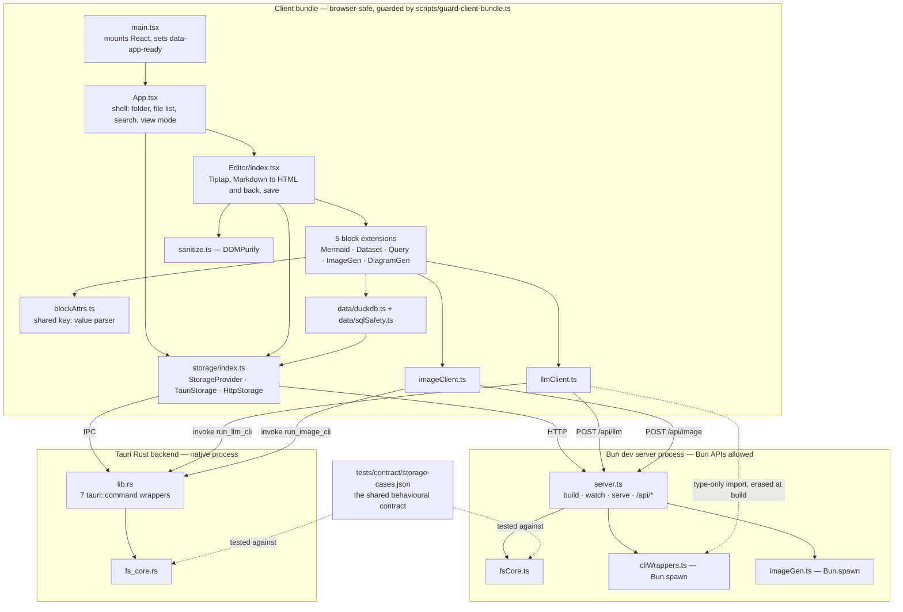
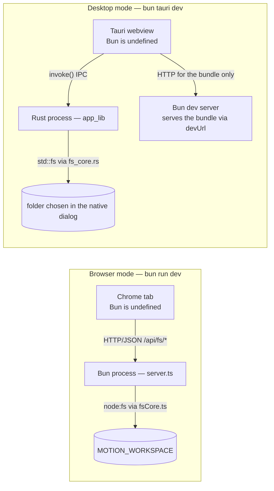
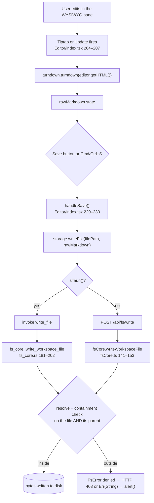
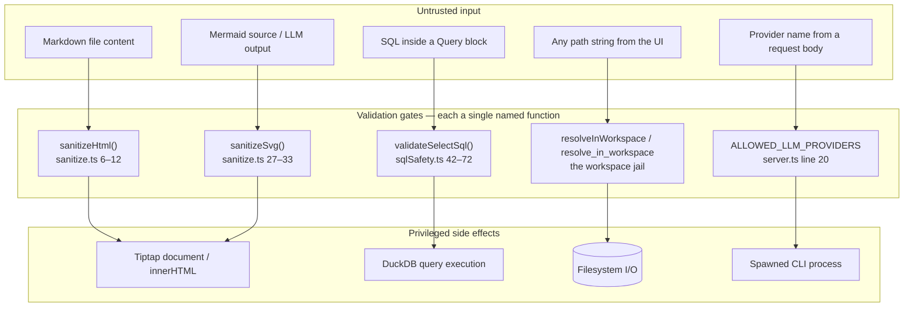
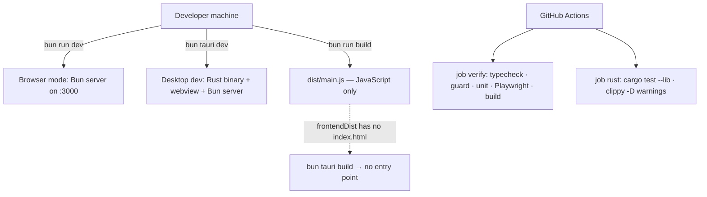

# Motion — Current Design Document

> Generated against the code as it exists at commit
> `13240d084d2f97b1df49616a573ebd29f7e994e2`, immediately after Phase 1 of the
> validation-loop plan landed. Every code claim cites a repository-relative path,
> a function, and line numbers. Where the repository's own prose contradicts the
> code, the code wins and the contradiction is recorded in §31.
>
> **Note for readers of an earlier revision of this document:** `WebStorage` no
> longer exists. Browser mode is now backed by a real filesystem API. See §6.1.

---

# 1. Document Overview

## 1.1 Purpose

Motion is a local-first technical writing IDE: it edits Markdown files on the
user's own filesystem, renders diagrams and SQL query results inline, and can
generate images and diagrams from natural-language prompts by shelling out to
command-line tools the user already has installed.

This document explains what the system does, why it is built the way it is, how
the components interact, and what a developer must understand before changing
it. It is written for two audiences at once: a junior developer who needs
implementation-level guidance, and a project manager who needs scope,
dependencies, risk, and known limitations.

## 1.2 Scope

**In scope:** the shipped application — the React/Tiptap editor, the two storage
implementations, the Bun development server, the Tauri desktop shell, the
DuckDB-WASM data layer, the CLI-backed generative blocks, and the validation loop
(tests, guards, CI) that gates all of it.

**Out of scope:** the `bin/` worklog tooling (a work-tracking and documentation
CLI that lives alongside the app but is not part of it), the generated
`docs/.index/` wiki artifacts, and the vendored DuckDB-WASM binaries under
`public/duckdb/`.

## 1.3 Intended audience and where to start

| Reader | Start at |
|---|---|
| New contributor | §2, §5, §6.1 (one contract, two implementations), §29 |
| Reviewer / architect | §5, §6, §22, §31 |
| Project manager | §2, §7, §31, §32 |
| Security reviewer | §22, §9.2, §14 |

## 1.4 Definitions and acronyms

| Term | Definition |
|---|---|
| **Workspace** | The single directory tree Motion is allowed to read and write. Everything outside it is refused. |
| **Workspace jail** | The containment check that enforces the above. Implemented twice — see §6.1. |
| **Storage contract** | The behavioural specification both filesystem implementations must satisfy, expressed as `tests/contract/storage-cases.json`. |
| **Browser mode** | `bun run dev` — the app served by the Bun dev server at `http://localhost:3000`, storage backed by HTTP. |
| **Desktop mode** | `bun tauri dev` — the same UI inside a Tauri 2 webview, storage backed by Rust IPC commands. |
| **Tauri** | A Rust framework that wraps a web UI in a native window. The UI is still a webview, so browser constraints still apply. |
| **IPC / `invoke`** | Inter-process communication. `invoke("cmd", args)` in JavaScript runs `#[tauri::command] fn cmd` in Rust. |
| **Bun** | The JavaScript runtime this project uses instead of Node.js. `Bun.*` APIs exist only in a real Bun process. |
| **HMR** | Hot Module Replacement — live browser refresh on source change. Motion does **not** have it (§29.4). |
| **Tiptap / ProseMirror** | The rich-text editor framework (Tiptap 3) and the document model beneath it. |
| **Atom node** | A Tiptap node with no editable child content. All five block extensions are atoms. |
| **E2E** | End-to-end tests — Playwright specs driving a real browser against the real dev server. |
| **DuckDB-WASM** | An analytical SQL engine compiled to WebAssembly, running in a Web Worker inside the page. |
| **Enrichment modules** | `ContentInjector`, `TopicRefiner`, `TOCGenerator`, `SkillGenerator` — currently unreachable code (§11.7). |
| **ULID** | Universally Unique Lexicographically Sortable Identifier — the work-item IDs in `docs/roadmap.md`. |

## 1.5 Related documents

| Document | Role | Currency |
|---|---|---|
| `README.md` | User-facing overview and known limitations | **Stale in two places** — §31, item D1 |
| `CLAUDE.md` | Working agreement, runtime facts, Definition of Done | Current at this commit (lines 54–58 describe `HttpStorage`) |
| `CHANGELOG.md` | Release history; the `0.1.0` entry begins at line 5 | Current |
| `docs/roadmap.md` | Generated from `.work/todo.jsonl`; the authoritative backlog | Generated, current |
| `docs/plans/2026-07-28-validation-loop.md` | The plan this work executes. Phases 0, 0.5 and 1 have landed | Current |
| `docs/plans/2026-07-26-motion-next-phase.md` | The prior feature-reachability plan | Partly superseded |
| `tests/contract/storage-cases.json` | The storage contract — normative, not documentation | Current |

There is no `docs/adr/` directory. §6 reconstructs the architectural decisions
from code comments, the plans, and the changelog, labelling anything inferred.

## 1.6 Assumptions

- **Assumption** — Motion is single-user and single-instance. Nothing
  authenticates a user, coordinates concurrent writers, or locks a file. The dev
  server binds a port with no authentication
  (`src/server.ts — Bun.serve(), lines 148–150`).
- **Assumption** — the intended deployment is a developer's own machine. There is
  no container image, no infrastructure-as-code, and no hosted environment
  anywhere in the repository.
- **Assumption** — the `claude`, `opencode`, `qwen` and `imagen` CLIs are
  user-installed and user-authenticated. Nothing installs, configures or checks
  them; `src/lib/cliWrappers.ts — callLLM(), line 56` spawns the provider name as
  an executable and nothing more.
- **Confirmed** — Markdown files on the user's disk are the only durable store.
  No database, no cache, no queue.

## 1.7 Open questions

Carried to §34 with full context. In brief: whether the packaged desktop build is
repaired before or after block round-tripping; whether the four enrichment
modules are wired up or deleted; and whether browser mode is ever intended to be
reachable from beyond `localhost`.

---

# 2. Executive Summary

## 2.1 Business purpose

Technical writers and developers keep documentation as Markdown in a folder or a
git repository. Editing it well means switching constantly between a text editor,
a diagram tool, a spreadsheet or SQL console, and an image generator. Motion
collapses that into one editor: the Markdown stays plain Markdown on disk, but
diagrams, datasets, SQL results and generated images render inline while you
write.

"Local-first" is the product's core promise and its main constraint
(`README.md`, lines 5–7). There is no account, no sync service, no server-side
storage. The only network calls the application makes are to its own dev server
on `localhost`; the only AI calls are subprocess invocations of command-line
tools the user already has installed.

## 2.2 Main user workflows

1. **Open a folder.** Motion lists every Markdown file underneath it, recursively.
2. **Open a note and edit it** in one of three view modes — WYSIWYG, raw
   Markdown, or a split view of both.
3. **Save** with the toolbar button or `Cmd/Ctrl+S`. The Tiptap document is
   converted back to Markdown and written to the same file.
4. **Create a new note** in the open workspace.
5. **Insert a content block** from the toolbar or by typing `/` at the start of a
   line: Mermaid diagram, Dataset, SQL Query, AI Image, AI Diagram.
6. **Query local data.** A Dataset block registers a CSV/JSON/JSONL file as a
   DuckDB table; a Query block runs `SELECT` against it and renders a table.
7. **Generate.** An AI Image block calls the `imagen` CLI; an AI Diagram block
   calls the `claude` CLI and validates that the result is parseable Mermaid.

## 2.3 Major system components

| Component | Where | One-line role |
|---|---|---|
| React shell | `src/App.tsx` | Header, search, file sidebar, view-mode switch |
| Tiptap editor | `src/components/Editor/index.tsx` | The document, three view modes, save |
| Block extensions | `src/components/Editor/extensions/` | Five custom node types with React node views |
| Storage abstraction | `src/lib/storage/index.ts` | One interface, two real implementations, chosen at module load |
| Browser filesystem core | `src/lib/fsCore.ts` | Jail, path resolution, listing, read/write — executed by the Bun dev server |
| Desktop filesystem core | `src-tauri/src/fs_core.rs` | The same behaviour in Rust, executed by the Tauri backend |
| The contract | `tests/contract/storage-cases.json` | The hand-written, language-neutral fixture both cores are tested against |
| Bun dev server | `src/server.ts` | Bundles, serves, exposes `/api/fs/*`, `/api/llm`, `/api/image` |
| Tauri backend | `src-tauri/src/lib.rs` | Seven IPC commands — thin wrappers over `fs_core` plus two CLI shells |
| Data layer | `src/lib/data/` | DuckDB-WASM lifecycle plus SQL validation |
| Transport routers | `src/lib/llmClient.ts`, `src/lib/imageClient.ts` | Pick `invoke()` or `fetch()` so UI code never touches `Bun` |
| Validation loop | `e2e/`, `scripts/guard-client-bundle.ts`, `.github/workflows/ci.yml` | The mechanism that makes "it works" checkable |

## 2.4 External dependencies

Everything external is a **local command-line tool**, not a network service:
`claude`, `opencode`, `qwen` (LLM CLIs) and `imagen` (image generation). All four
are optional; the app runs without them and the generative blocks fail with a
visible error. There is no API-key handling anywhere in the codebase because
Motion never talks to a provider directly — the CLI owns its own credentials.

There is no backend service, no database server, no message queue, no cache, no
managed AI platform, and no Model Context Protocol server.

## 2.5 Key architectural decisions

Each is developed fully in §6.

1. **One storage contract, two implementations, one shared fixture.** Browser
   mode and desktop mode cannot share code — one is TypeScript, one is Rust — so
   they share a hand-written *test fixture* instead, and both suites run it.
2. **Path containment is component-aware, never string `startsWith`.**
   `/x/ws` is a string prefix of `/x/ws-evil`.
3. **The dev server's workspace root is environment-only.** It is never taken
   from the request; accepting a client-supplied directory would turn the dev
   server into an arbitrary-filesystem read API.
4. **Anything needing `Bun` sits behind a transport router**, and a *static*
   guard over the import graph enforces it — a runtime check cannot, because
   dormant code never runs.
5. **The validation loop is a first-class architectural component.** The E2E
   harness fails on console errors, uncaught exceptions, failed requests, and any
   HTTP status ≥ 400.

## 2.6 Primary risks

| Risk | Severity | Detail |
|---|---|---|
| The packaged desktop build does not work | High | `bun run build` emits no `index.html`, so `frontendDist` points at a directory with no entry point. Only `bun tauri dev` runs. §27.3 |
| Four of five block types do not survive save/reload | High | They serialize without a language class, so the round trip degrades them into plain code blocks. §9.4 |
| Four enrichment modules are dead code | Medium | They reach `Bun.spawn` through `cliWrappers.ts` and cannot execute in either shipped mode. §11.7 |
| `README.md` still describes the pre-Phase-1 world | Medium | It tells readers browser mode does not persist writes. It does now. §31 D1 |
| No HMR | Low | Every source change needs a manual browser reload. §29.4 |

---

# 3. Requirements Summary

The repository has no formal requirements document. The requirements below are
**reconstructed** from the code, the tests, the contract fixture, `README.md`,
`CLAUDE.md`, and `docs/plans/2026-07-28-validation-loop.md`.

## 3.1 Functional requirements

| ID | Requirement | Implemented in | State |
|---|---|---|---|
| FR-1 | Open a folder and list every Markdown file beneath it, recursively | `src/lib/fsCore.ts — collectFiles(), lines 106–128`; `src-tauri/src/fs_core.rs — collect_files(), lines 135–141` | **Confirmed**, both modes |
| FR-2 | Filter the note list by name as the user types | `src/App.tsx — filteredFiles, lines 19–23` | **Confirmed** |
| FR-3 | Read a Markdown file into the editor | `src/components/Editor/index.tsx — loadFile(), lines 236–263` | **Confirmed** |
| FR-4 | Write the edited document back to the same file | `src/components/Editor/index.tsx — handleSave(), lines 220–230` | **Confirmed**, both modes |
| FR-5 | Create a new note in the open workspace | `src/App.tsx — handleNewNote(), lines 46–67` | **Confirmed**, both modes |
| FR-6 | Three view modes, switchable at any time, without content loss | `src/components/Editor/index.tsx — shouldSyncMarkdownIntoEditor(), lines 41–46`; render branches, lines 334–394 | **Confirmed** |
| FR-7 | Render a Mermaid diagram inline, editable in place | `src/components/Editor/extensions/MermaidExtension.tsx — MermaidNodeView(), lines 33–70` | **Confirmed** |
| FR-8 | Register a local CSV/JSON/JSONL file as a queryable table | `src/lib/data/duckdb.ts — registerFile(), lines 51–77` | **Confirmed** |
| FR-9 | Run SQL against registered datasets in-browser | `src/lib/data/duckdb.ts — executeQuery(), lines 83–113` | **Confirmed** |
| FR-10 | Generate an image from a prompt via the `imagen` CLI | `src/lib/imageClient.ts — generateImageFromUI(), lines 12–27` | **Confirmed** |
| FR-11 | Generate a Mermaid diagram from a prompt, validated before acceptance | `src/components/Editor/extensions/DiagramGenExtension.tsx — generateMermaidDiagram(), lines 16–27` | **Confirmed** |
| FR-12 | Insert any block from the toolbar or a `/` slash menu | `src/components/Editor/insertBlock.ts — insertBlock(), lines 21–31`; `index.tsx — detectSlashTrigger(), lines 64–78` | **Confirmed** |
| FR-13 | All five block types survive a save/reload cycle | — | **NOT MET — 1 of 5.** §9.4 |

## 3.2 Non-functional requirements

| ID | Requirement | Enforced by |
|---|---|---|
| NFR-1 | Filesystem access is confined to the opened workspace; `..`, absolute escapes, sibling-prefix directories and outward symlinks are all refused | `src/lib/fsCore.ts — resolveInWorkspace(), lines 75–92`; `src-tauri/src/fs_core.rs — resolve_in_workspace(), lines 89–121`; contract cases at `tests/contract/storage-cases.json` lines 73–97 |
| NFR-2 | Browser mode and desktop mode behave identically for storage | `tests/contract/storage-cases.json`, run by `src/lib/fsCore.contract.test.ts` lines 74–132 **and** `src-tauri/src/fs_core.rs — storage_contract_rust_implementation(), lines 279–375` |
| NFR-3 | No `Bun.*` API is reachable from the browser bundle | `scripts/guard-client-bundle.ts`, lines 72–107 |
| NFR-4 | Document-supplied SQL cannot modify data | `src/lib/data/sqlSafety.ts — validateSelectSql(), lines 42–72` |
| NFR-5 | Untrusted Markdown and generated SVG are sanitized before insertion | `src/lib/sanitize.ts — sanitizeHtml(), lines 6–12; sanitizeSvg(), lines 27–33` |
| NFR-6 | Zero console errors, uncaught exceptions, failed requests, or responses ≥ 400 during E2E | `e2e/fixtures.ts`, lines 52–89 (`auto: true`, line 87) |
| NFR-7 | One command answers "is the app OK?" | `package.json — scripts.verify, line 14` |
| NFR-8 | CI actually compiles and tests the application | `.github/workflows/ci.yml`, lines 23–102 |
| NFR-9 | An LLM or image CLI call cannot hang the app indefinitely | 120 s timeouts on all four paths — §18.5 |
| NFR-10 | Strict TypeScript across the codebase | `bun run typecheck`, in `verify` and in CI (lines 36–37) |
| NFR-11 | Rust warnings are errors | `.github/workflows/ci.yml`, lines 101–102 (`clippy -D warnings`) |
| NFR-12 | The packaged desktop application launches | **NOT MET.** §27.3 |

## 3.3 Requirements not addressed at all

Stated plainly rather than invented:

- **Availability, backup, disaster recovery.** Not applicable as designed — the
  user's files are the user's responsibility, presumably under their own version
  control.
- **Scalability.** Single-user, single-process. There is no scaling unit.
- **Compliance and data retention.** No personal data is collected, stored, or
  transmitted by Motion itself.
- **Observability.** Effectively absent; §25 documents what little exists.
- **Authentication and authorization.** Absent by design. §22.6 explains why that
  constrains how the dev server may be exposed.

## 3.4 Traceability (summary)

The full matrix is §33. The load-bearing rows:

| Requirement | Component | Test that catches a regression |
|---|---|---|
| NFR-1 | `fsCore.ts` + `fs_core.rs` | Contract cases "refuses parent traversal", "refuses an absolute path outside the workspace", "refuses a sibling directory sharing the workspace name prefix", "refuses a symlink pointing outside the workspace" |
| NFR-2 | The contract fixture itself | `bun test src` **and** `cargo test --lib` |
| NFR-3 | `guard-client-bundle.ts` | `bun run guard:client`, in CI at lines 42–43 |
| FR-4 | `HttpStorage.writeFile` / `write_file` | `e2e/persistence.spec.ts` — "an edit survives save and reload", lines 31–52 |
| NFR-6 | `e2e/fixtures.ts` | Self-enforcing |

---

# 4. System Context

## 4.1 Actors and external systems

| Actor / system | Type | Interaction |
|---|---|---|
| **Writer** (the only human actor) | User | Drives the editor UI directly. No account, no roles. |
| **Local filesystem** | External store | The one durable store. Read and written only through the workspace jail. |
| **`claude` / `opencode` / `qwen` CLI** | External process | Spawned for LLM completions. Optional. Owns its own credentials. |
| **`imagen` CLI** | External process | Spawned for image generation. Optional. Wraps Google's Gemini Imagen API. |
| **DuckDB-WASM** | In-process engine | Served from `public/duckdb/`, runs in a Web Worker inside the page. |
| **Chrome / Chromium** | Test-only | Playwright drives it against the real dev server. |
| **GitHub Actions** | Build system | Runs the whole validation loop on every pull request. |

## 4.2 Trust boundaries

There are four, and confusing them is how the interesting bugs happen:

1. **Webview / browser ↔ backend.** The UI runs where `Bun` is undefined. It may
   only reach the filesystem or a CLI through IPC (`invoke`) or HTTP
   (`fetch("/api/...")`).
2. **Backend ↔ filesystem.** The workspace jail. Every caller-supplied path is
   canonicalized and checked for containment before any I/O.
3. **Document content ↔ execution.** A Markdown file is untrusted input. Its HTML
   is sanitized; its SQL is validated as `SELECT`-only; Mermaid output is
   sanitized as SVG before it reaches `innerHTML`.
4. **Backend ↔ spawned CLI.** Provider names are allowlisted before a process is
   spawned; a timeout bounds every call.

## 4.3 System context diagram

**How to read it.** The Writer only ever touches the UI. The UI never touches the
filesystem or a CLI itself — it always crosses a process boundary first. Which
backend is active is decided once, at module load, by `isTauri()`
(`src/lib/storage/index.ts`, line 115). The two backend boxes are mutually
exclusive at runtime for storage purposes.

**Failure behaviour.** If a CLI is missing, the spawn fails and the error
surfaces in the block's own error state — nothing else is affected. If the
filesystem refuses a path, the error is classified (`denied` / `not-found` /
`not-a-directory`) and mapped to an HTTP status (`src/server.ts`, lines 280–285)
or to an IPC `Err(String)` (`src-tauri/src/fs_core.rs`, lines 51–55).

## 4.4 Major inputs and outputs

| Direction | Data | Format |
|---|---|---|
| In | Markdown notes | UTF-8 `.md` files |
| In | Datasets | `.csv`, `.json`, `.jsonl` |
| In | Configuration | `MOTION_WORKSPACE`, `PORT`, `CI`, `BASELINE` environment variables |
| Out | Markdown notes | UTF-8 `.md`, written in place |
| Out | Generated images | Base64 PNG data URI embedded in the Markdown |
| Out | Generated diagrams | Mermaid source embedded in the Markdown |

---

# 5. High-Level Architecture

## 5.1 The shape of the system in one paragraph

Motion is a single-page React application with two interchangeable backends. The
UI is identical in both modes and compiled into one bundle. A thin storage
interface (`StorageProvider`) is bound at module load to either `TauriStorage`
(IPC into Rust) or `HttpStorage` (HTTP into the Bun dev server). Behind each of
those sits a filesystem *core* — `fs_core.rs` and `fsCore.ts` — which are
independent implementations of one shared, hand-written behavioural contract.
Everything that requires a real process (spawning a CLI, touching the disk) lives
behind that boundary; everything in front of it is browser-safe code, and a
static guard proves it.

## 5.2 Logical architecture

**How to read it.** Solid arrows are runtime calls or value imports; dotted
arrows are test-time obligations and erased type imports. Two things to notice:

- `fsCore.ts` sits inside the **server** box, not the client box. It imports
  `node:fs` (`src/lib/fsCore.ts`, lines 16–24) and executes in the Bun process.
  Its own header says so: *"NOT imported by the browser bundle"* (line 14).
- The dotted `llmClient → cliWrappers` edge is an `import type`
  (`src/lib/llmClient.ts`, line 3). It is erased at build time, which is the only
  reason the client can borrow `LLMOptions`/`LLMResponse` from a
  `Bun.spawn`-using module without failing the guard. The guard models this
  explicitly (`scripts/guard-client-bundle.ts — TYPE_ONLY_RE, line 57`).

## 5.3 Runtime architecture — the two modes

**How to read it.** In desktop *development* mode the Bun dev server is still
running, because `src-tauri/tauri.conf.json` sets `devUrl` to
`http://localhost:3000` and `beforeDevCommand` to `bun run dev`. The webview
fetches the bundle over HTTP, but storage calls go over IPC to Rust, because
`isTauri()` returns true inside the webview. The dev server's `/api/fs/*` routes
are live but unused in that mode.

Note that `Bun` is undefined in **both** left-hand boxes. That is §6.4's entire
subject.

**Failure behaviour.** If the Rust side has no workspace opened,
`workspace_root()` returns `"No workspace opened. Open a folder first."`
(`src-tauri/src/lib.rs — workspace_root(), lines 99–107`) and every filesystem
command fails with that message.

## 5.4 Data flow — saving a note

**How to read it.** `rawMarkdown` is kept current continuously by `onUpdate`, not
computed at save time — deliberately, so switching to Markdown view never shows
stale content. The containment check is the same logical gate on both branches,
which is exactly the property the contract fixture exists to keep true.

**Failure behaviour.** A refused write surfaces as an `alert()`
(`src/components/Editor/index.tsx`, line 228) and, in browser mode, as an HTTP
403 that the E2E gate fails a test on unless the test explicitly allows it
(`e2e/persistence.spec.ts`, lines 111–113).

## 5.5 Trust-boundary diagram

**How to read it.** Nothing crosses from left to right without passing through
the middle column. If you are adding a new path from untrusted input to a side
effect, you are adding a gate or reusing one of these five.

**The one asymmetry worth naming:** filesystem operations are jailed, but the
*prompt* passed to a spawned CLI is arbitrary user and document text. Only the
provider name is allowlisted. See §22.6.

## 5.6 Deployment architecture

**How to read it.** The dashed edge is the honest part. `bun run build` is
`bun build src/main.tsx --outdir=dist --minify` (`package.json`, line 8), which
emits JavaScript only; `src-tauri/tauri.conf.json` points `frontendDist` at
`../dist`, which therefore contains no HTML shell. CI runs the build
(`.github/workflows/ci.yml`, lines 54–55) and it *succeeds* — the build is not
broken, its output is incomplete for packaging. Tracked as B3 in
`docs/roadmap.md`.
