<!-- GENERATED by worklog roadmap-render. DO NOT EDIT. -->

> This file is generated from `.work/todo.jsonl`. Edits will be overwritten.
> To change the roadmap, change the work items: `worklog add|update|close`.

# Roadmap

_2 epic(s) in flight, 28 open item(s), 0 blocked, 0 unclassified._

## Now

_Nothing here._

## Next

### Motion next development phase  ·  P1  ·  15 of 18 done  ·  feature 13 / bug 5
Close the gap between Motion's stated vision (organize/edit/visualize documentation, local-first) and what a user can actually reach today: several real, working modules (enrichment pipeline, editor extensions) have no UI entry point, plus a pre-existing editor mode-desync data-loss bug. Sequenced: verify CLI contract, fix data loss, build a creation UX, fix dev storage mock, ship real diagram-gen + scope ImageGen backend, wire the per-note enrichment action.

| # | Item | Type | Priority | Status | Blocked by |
|---|---|---|---|---|---|
| 01KYFZ6R | Wire the per-note enrichment action into the UI | task | P2 | todo | — |
| 01KYFZ6R | Per-note "AI Refine"/"Generate Summary" toolbar action backed by ContentInjector | subtask | P2 | todo | — |

### Validation loop: prove the UI works before the human launches it  ·  P1  ·  17 of 41 done  ·  feature 38 / bug 3
Motion has real features and no way to know whether they work. The web mode designed as the browser-automation test surface never became real: WebStorage fakes writes and fakes openFolder, so testing saves against it proves nothing. One root cause (code assuming a Bun process while running in a browser) has been re-fixed four times and is open a fifth. CI never installs Bun or Rust, so a PR deleting src/App.tsx passes green. This epic builds the validation loop first, then fixes what the loop exposes, so the human gives design feedback instead of debugging.

| # | Item | Type | Priority | Status | Blocked by |
|---|---|---|---|---|---|
| 01KYK6NH | Implement the path jail with component-aware containment, not string startsWith | subtask | P1 | todo | — |
| 01KYK6NH | Phase 1: make web mode a real filesystem backend | task | P1 | todo | — |
| 01KYK6NH | Phase 0.5: accessibility pass so role-based locators are possible | task | P1 | todo | — |
| 01KYK6NH | Add /api/fs/* routes to server.ts with an env-only workspace root | subtask | P1 | todo | — |
| 01KYK6NH | Extract pure filesystem cores: src/lib/fsCore.ts and src-tauri/src/fs_core.rs | subtask | P1 | todo | — |
| 01KYK6NH | Give each Playwright worker a seeded temp workspace | subtask | P1 | todo | — |
| 01KYK6NH | Add the language-neutral parity fixture run by both bun test and cargo test | subtask | P1 | todo | — |
| 01KYK6NH | B4 and B7: block round-trip and multi-line serialization | subtask | P1 | todo | — |
| 01KYK6NH | Phase 2: E2E coverage of the journeys that have actually broken | task | P1 | todo | — |
| 01KYK6NH | Replace WebStorage with a real HttpStorage | subtask | P1 | todo | — |
| 01KYK6NH | B3: fix the broken desktop production build (dist has no index.html) | subtask | P1 | todo | — |
| 01KYK6NH | Phase 3: fix what the loop exposes | task | P1 | todo | — |
| 01KYK6NH | B8: route the four enrichment modules through llmClient | subtask | P2 | todo | — |
| 01KYK6NH | Add resolveWorkspacePath so documents are portable between modes | subtask | P2 | todo | — |
| 01KYK6NH | B5: welcome doc paths resolve in both modes | subtask | P2 | todo | — |
| 01KYK6NH | Add bin/smoke-desktop.sh building and launching the packaged app | subtask | P2 | todo | — |
| 01KYK6NH | B13: save completion signal and file-load cancellation | subtask | P2 | todo | — |
| 01KYK6NH | Backfill tests on the untested security boundaries | subtask | P2 | todo | — |
| 01KYK6NH | Delete the stale root index.html and generate dev and prod shells from one template | subtask | P2 | todo | — |
| 01KYK6NH | Phase 4: desktop confidence without a WebDriver | task | P2 | todo | — |

### (no epic)

| # | Item | Type | Priority | Status | Blocked by |
|---|---|---|---|---|---|
| 01KYJW5X | TopicRefiner/ContentInjector/TOCGenerator/SkillGenerator need llmClient.ts routing before UI wiring | subtask | P2 | todo | — |

## Later

### Motion next development phase  ·  P1  ·  15 of 18 done  ·  feature 13 / bug 5
Close the gap between Motion's stated vision (organize/edit/visualize documentation, local-first) and what a user can actually reach today: several real, working modules (enrichment pipeline, editor extensions) have no UI entry point, plus a pre-existing editor mode-desync data-loss bug. Sequenced: verify CLI contract, fix data loss, build a creation UX, fix dev storage mock, ship real diagram-gen + scope ImageGen backend, wire the per-note enrichment action.

| # | Item | Type | Priority | Status | Blocked by |
|---|---|---|---|---|---|
| 01KYJXSY | Mermaid's internal parse-error UI ('bomb' error graphic) injects into document.body instead of staying inside the failing block's container | task | P3 | todo | — |

### Validation loop: prove the UI works before the human launches it  ·  P1  ·  17 of 41 done  ·  feature 38 / bug 3
Motion has real features and no way to know whether they work. The web mode designed as the browser-automation test surface never became real: WebStorage fakes writes and fakes openFolder, so testing saves against it proves nothing. One root cause (code assuming a Bun process while running in a browser) has been re-fixed four times and is open a fifth. CI never installs Bun or Rust, so a PR deleting src/App.tsx passes green. This epic builds the validation loop first, then fixes what the loop exposes, so the human gives design feedback instead of debugging.

| # | Item | Type | Priority | Status | Blocked by |
|---|---|---|---|---|---|
| 01KYK6NH | B6: thread model through the run_llm_cli IPC signature | subtask | P3 | todo | — |
| 01KYK6NH | Write the short release-only manual checklist | subtask | P3 | todo | — |
| 01KYK6NH | B9: contain the Mermaid parse-error graphic | subtask | P3 | todo | — |
| 01KYK7WZ | Demo Query block returns zero rows: case mismatch in the demo data JOIN | subtask | P3 | todo | — |

## Visual roadmap

### Dependency graph

```mermaid
graph TD
    01KYFZ6RBHABFSC9K9NJ90168Q["📦 Motion next development phase"]
    01KYFZ6RBJV920SFW0MAN9MX9J["📦 Wire the per-note enrichment a"]
    01KYFZ6RBJZNYDT9AK2V0RA11T["📦 Per-note AI Refine/Generate Su"]
    01KYFZ8RGR06XBSG9CH4TEWYJY["📦 Workspace-level topic clusteri"]
    01KYJW5XJ5HTG7ESZ7DDDS8W0C["🐛 TopicRefiner/ContentInjector/T"]
    01KYJXSYEZ97M9638S91GYZWV0["🐛 Mermaid's internal parse-error"]
    01KYK6NHSFJNG9XV6D8K5SHWCV["📦 Validation loop prove the UI w"]
    01KYK6NHSG0VG2NDWC3E7FRJFA["📦 Implement the path jail with c"]
    01KYK6NHSGP58Q6GQ3Z3HEMXXN["📦 Phase 1 make web mode a real f"]
    01KYK6NHSGPYHDTHG3T7Y80MAR["📦 Phase 0.5 accessibility pass s"]
    01KYK6NHSGSAMNDS6CJ47YST2C["📦 Add /api/fs/* routes to server"]
    01KYK6NHSGXDY0C5GZRQDVEQGC["📦 Extract pure filesystem cores"]
    01KYK6NHSH15H376EZGAMTZE9J["📦 B8 route the four enrichment m"]
    01KYK6NHSH1PJ0YBJ1WEG3SZ4R["📦 Give each Playwright worker a"]
    01KYK6NHSH2RMTJQ3SR7MGW7Q8["📦 Add resolveWorkspacePath so do"]
    01KYK6NHSH8WXC8MEGFPFM8DYC["📦 Add the language-neutral parit"]
    01KYK6NHSH9BTQ4BND9DZEFAY7["📦 B4 and B7 block round-trip and"]
    01KYK6NHSHBJ0SV2MM8N3A0KJR["📦 Phase 2 E2E coverage of the jo"]
    01KYK6NHSHD4NMT2QVMQD2HHBP["📦 B5 welcome doc paths resolve i"]
    01KYK6NHSHKCZWFNWZX3NATX04["📦 Replace WebStorage with a real"]
    01KYK6NHSHKXZNTXS3F3ANDYV9["📦 Add bin/smoke-desktop.sh build"]
    01KYK6NHSHKZ20DY8FBB5S1PP9["📦 B6 thread model through the ru"]
    01KYK6NHSHQZZQV7DJM5A64C6E["📦 B13 save completion signal and"]
    01KYK6NHSHRFE2KXPBTV76JR02["📦 Write the short release-only m"]
    01KYK6NHSHRFPGDZXKE6EH4QRJ["📦 B3 fix the broken desktop prod"]
    01KYK6NHSHSASEERK1KJ7XVDPN["📦 Backfill tests on the untested"]
    01KYK6NHSHVJEFG9W6TZYWXNEF["📦 Delete the stale root index.ht"]
    01KYK6NHSHVZ2EZZH7NBRADW7E["📦 B9 contain the Mermaid parse-e"]
    01KYK6NHSHZF8S0ZNGQ9ZAD05F["📦 Phase 4 desktop confidence wit"]
    01KYK6NHSHZJNNCYMEW9ZG77NP["📦 Phase 3 fix what the loop expo"]
    01KYK7WZRS65D7DPP0D1DT58Z7["🐛 Demo Query block returns zero"]
    01KYFZ6RBHABFSC9K9NJ90168Q --> 01KYFZ6RBJV920SFW0MAN9MX9J
    01KYFZ6RBJV920SFW0MAN9MX9J --> 01KYFZ6RBJZNYDT9AK2V0RA11T
    01KYK6NHSGP58Q6GQ3Z3HEMXXN --> 01KYK6NHSG0VG2NDWC3E7FRJFA
    01KYK6NHSFJNG9XV6D8K5SHWCV --> 01KYK6NHSGP58Q6GQ3Z3HEMXXN
    01KYK6NHSFJNG9XV6D8K5SHWCV --> 01KYK6NHSGPYHDTHG3T7Y80MAR
    01KYK6NHSGP58Q6GQ3Z3HEMXXN --> 01KYK6NHSGSAMNDS6CJ47YST2C
    01KYK6NHSGP58Q6GQ3Z3HEMXXN --> 01KYK6NHSGXDY0C5GZRQDVEQGC
    01KYK6NHSHZJNNCYMEW9ZG77NP --> 01KYK6NHSH15H376EZGAMTZE9J
    01KYK6NHSGP58Q6GQ3Z3HEMXXN --> 01KYK6NHSH1PJ0YBJ1WEG3SZ4R
    01KYK6NHSGP58Q6GQ3Z3HEMXXN --> 01KYK6NHSH2RMTJQ3SR7MGW7Q8
    01KYK6NHSGP58Q6GQ3Z3HEMXXN --> 01KYK6NHSH8WXC8MEGFPFM8DYC
    01KYK6NHSHZJNNCYMEW9ZG77NP --> 01KYK6NHSH9BTQ4BND9DZEFAY7
    01KYK6NHSFJNG9XV6D8K5SHWCV --> 01KYK6NHSHBJ0SV2MM8N3A0KJR
    01KYK6NHSHZJNNCYMEW9ZG77NP --> 01KYK6NHSHD4NMT2QVMQD2HHBP
    01KYK6NHSGP58Q6GQ3Z3HEMXXN --> 01KYK6NHSHKCZWFNWZX3NATX04
    01KYK6NHSHZF8S0ZNGQ9ZAD05F --> 01KYK6NHSHKXZNTXS3F3ANDYV9
    01KYK6NHSHZJNNCYMEW9ZG77NP --> 01KYK6NHSHKZ20DY8FBB5S1PP9
    01KYK6NHSHZJNNCYMEW9ZG77NP --> 01KYK6NHSHQZZQV7DJM5A64C6E
    01KYK6NHSHZF8S0ZNGQ9ZAD05F --> 01KYK6NHSHRFE2KXPBTV76JR02
    01KYK6NHSHZJNNCYMEW9ZG77NP --> 01KYK6NHSHRFPGDZXKE6EH4QRJ
    01KYK6NHSHZJNNCYMEW9ZG77NP --> 01KYK6NHSHSASEERK1KJ7XVDPN
    01KYK6NHSGP58Q6GQ3Z3HEMXXN --> 01KYK6NHSHVJEFG9W6TZYWXNEF
    01KYK6NHSHZJNNCYMEW9ZG77NP --> 01KYK6NHSHVZ2EZZH7NBRADW7E
    01KYK6NHSFJNG9XV6D8K5SHWCV --> 01KYK6NHSHZF8S0ZNGQ9ZAD05F
    01KYK6NHSFJNG9XV6D8K5SHWCV --> 01KYK6NHSHZJNNCYMEW9ZG77NP
    classDef todo fill:#f4f4f4,stroke:#999999
    class 01KYFZ6RBHABFSC9K9NJ90168Q,01KYFZ6RBJV920SFW0MAN9MX9J,01KYFZ6RBJZNYDT9AK2V0RA11T,01KYFZ8RGR06XBSG9CH4TEWYJY,01KYJW5XJ5HTG7ESZ7DDDS8W0C,01KYJXSYEZ97M9638S91GYZWV0,01KYK6NHSFJNG9XV6D8K5SHWCV,01KYK6NHSG0VG2NDWC3E7FRJFA,01KYK6NHSGP58Q6GQ3Z3HEMXXN,01KYK6NHSGPYHDTHG3T7Y80MAR,01KYK6NHSGSAMNDS6CJ47YST2C,01KYK6NHSGXDY0C5GZRQDVEQGC,01KYK6NHSH15H376EZGAMTZE9J,01KYK6NHSH1PJ0YBJ1WEG3SZ4R,01KYK6NHSH2RMTJQ3SR7MGW7Q8,01KYK6NHSH8WXC8MEGFPFM8DYC,01KYK6NHSH9BTQ4BND9DZEFAY7,01KYK6NHSHBJ0SV2MM8N3A0KJR,01KYK6NHSHD4NMT2QVMQD2HHBP,01KYK6NHSHKCZWFNWZX3NATX04,01KYK6NHSHKXZNTXS3F3ANDYV9,01KYK6NHSHKZ20DY8FBB5S1PP9,01KYK6NHSHQZZQV7DJM5A64C6E,01KYK6NHSHRFE2KXPBTV76JR02,01KYK6NHSHRFPGDZXKE6EH4QRJ,01KYK6NHSHSASEERK1KJ7XVDPN,01KYK6NHSHVJEFG9W6TZYWXNEF,01KYK6NHSHVZ2EZZH7NBRADW7E,01KYK6NHSHZF8S0ZNGQ9ZAD05F,01KYK6NHSHZJNNCYMEW9ZG77NP,01KYK7WZRS65D7DPP0D1DT58Z7 todo
```

### Hierarchy

```mermaid
graph TD
    01KYFZ6RBHABFSC9K9NJ90168Q["📦 Motion next development phase"]
    01KYFZ6RBJV920SFW0MAN9MX9J["📦 Wire the per-note enrichment a"]
    01KYFZ6RBJZNYDT9AK2V0RA11T["📦 Per-note AI Refine/Generate Su"]
    01KYFZ8RGR06XBSG9CH4TEWYJY["📦 Workspace-level topic clusteri"]
    01KYJW5XJ5HTG7ESZ7DDDS8W0C["🐛 TopicRefiner/ContentInjector/T"]
    01KYJXSYEZ97M9638S91GYZWV0["🐛 Mermaid's internal parse-error"]
    01KYK6NHSFJNG9XV6D8K5SHWCV["📦 Validation loop prove the UI w"]
    01KYK6NHSG0VG2NDWC3E7FRJFA["📦 Implement the path jail with c"]
    01KYK6NHSGP58Q6GQ3Z3HEMXXN["📦 Phase 1 make web mode a real f"]
    01KYK6NHSGPYHDTHG3T7Y80MAR["📦 Phase 0.5 accessibility pass s"]
    01KYK6NHSGSAMNDS6CJ47YST2C["📦 Add /api/fs/* routes to server"]
    01KYK6NHSGXDY0C5GZRQDVEQGC["📦 Extract pure filesystem cores"]
    01KYK6NHSH15H376EZGAMTZE9J["📦 B8 route the four enrichment m"]
    01KYK6NHSH1PJ0YBJ1WEG3SZ4R["📦 Give each Playwright worker a"]
    01KYK6NHSH2RMTJQ3SR7MGW7Q8["📦 Add resolveWorkspacePath so do"]
    01KYK6NHSH8WXC8MEGFPFM8DYC["📦 Add the language-neutral parit"]
    01KYK6NHSH9BTQ4BND9DZEFAY7["📦 B4 and B7 block round-trip and"]
    01KYK6NHSHBJ0SV2MM8N3A0KJR["📦 Phase 2 E2E coverage of the jo"]
    01KYK6NHSHD4NMT2QVMQD2HHBP["📦 B5 welcome doc paths resolve i"]
    01KYK6NHSHKCZWFNWZX3NATX04["📦 Replace WebStorage with a real"]
    01KYK6NHSHKXZNTXS3F3ANDYV9["📦 Add bin/smoke-desktop.sh build"]
    01KYK6NHSHKZ20DY8FBB5S1PP9["📦 B6 thread model through the ru"]
    01KYK6NHSHQZZQV7DJM5A64C6E["📦 B13 save completion signal and"]
    01KYK6NHSHRFE2KXPBTV76JR02["📦 Write the short release-only m"]
    01KYK6NHSHRFPGDZXKE6EH4QRJ["📦 B3 fix the broken desktop prod"]
    01KYK6NHSHSASEERK1KJ7XVDPN["📦 Backfill tests on the untested"]
    01KYK6NHSHVJEFG9W6TZYWXNEF["📦 Delete the stale root index.ht"]
    01KYK6NHSHVZ2EZZH7NBRADW7E["📦 B9 contain the Mermaid parse-e"]
    01KYK6NHSHZF8S0ZNGQ9ZAD05F["📦 Phase 4 desktop confidence wit"]
    01KYK6NHSHZJNNCYMEW9ZG77NP["📦 Phase 3 fix what the loop expo"]
    01KYK7WZRS65D7DPP0D1DT58Z7["🐛 Demo Query block returns zero"]
    01KYFZ6RBHABFSC9K9NJ90168Q --> 01KYFZ6RBJV920SFW0MAN9MX9J
    01KYFZ6RBJV920SFW0MAN9MX9J --> 01KYFZ6RBJZNYDT9AK2V0RA11T
    01KYK6NHSGP58Q6GQ3Z3HEMXXN --> 01KYK6NHSG0VG2NDWC3E7FRJFA
    01KYK6NHSFJNG9XV6D8K5SHWCV --> 01KYK6NHSGP58Q6GQ3Z3HEMXXN
    01KYK6NHSFJNG9XV6D8K5SHWCV --> 01KYK6NHSGPYHDTHG3T7Y80MAR
    01KYK6NHSGP58Q6GQ3Z3HEMXXN --> 01KYK6NHSGSAMNDS6CJ47YST2C
    01KYK6NHSGP58Q6GQ3Z3HEMXXN --> 01KYK6NHSGXDY0C5GZRQDVEQGC
    01KYK6NHSHZJNNCYMEW9ZG77NP --> 01KYK6NHSH15H376EZGAMTZE9J
    01KYK6NHSGP58Q6GQ3Z3HEMXXN --> 01KYK6NHSH1PJ0YBJ1WEG3SZ4R
    01KYK6NHSGP58Q6GQ3Z3HEMXXN --> 01KYK6NHSH2RMTJQ3SR7MGW7Q8
    01KYK6NHSGP58Q6GQ3Z3HEMXXN --> 01KYK6NHSH8WXC8MEGFPFM8DYC
    01KYK6NHSHZJNNCYMEW9ZG77NP --> 01KYK6NHSH9BTQ4BND9DZEFAY7
    01KYK6NHSFJNG9XV6D8K5SHWCV --> 01KYK6NHSHBJ0SV2MM8N3A0KJR
    01KYK6NHSHZJNNCYMEW9ZG77NP --> 01KYK6NHSHD4NMT2QVMQD2HHBP
    01KYK6NHSGP58Q6GQ3Z3HEMXXN --> 01KYK6NHSHKCZWFNWZX3NATX04
    01KYK6NHSHZF8S0ZNGQ9ZAD05F --> 01KYK6NHSHKXZNTXS3F3ANDYV9
    01KYK6NHSHZJNNCYMEW9ZG77NP --> 01KYK6NHSHKZ20DY8FBB5S1PP9
    01KYK6NHSHZJNNCYMEW9ZG77NP --> 01KYK6NHSHQZZQV7DJM5A64C6E
    01KYK6NHSHZF8S0ZNGQ9ZAD05F --> 01KYK6NHSHRFE2KXPBTV76JR02
    01KYK6NHSHZJNNCYMEW9ZG77NP --> 01KYK6NHSHRFPGDZXKE6EH4QRJ
    01KYK6NHSHZJNNCYMEW9ZG77NP --> 01KYK6NHSHSASEERK1KJ7XVDPN
    01KYK6NHSGP58Q6GQ3Z3HEMXXN --> 01KYK6NHSHVJEFG9W6TZYWXNEF
    01KYK6NHSHZJNNCYMEW9ZG77NP --> 01KYK6NHSHVZ2EZZH7NBRADW7E
    01KYK6NHSFJNG9XV6D8K5SHWCV --> 01KYK6NHSHZF8S0ZNGQ9ZAD05F
    01KYK6NHSFJNG9XV6D8K5SHWCV --> 01KYK6NHSHZJNNCYMEW9ZG77NP
```

