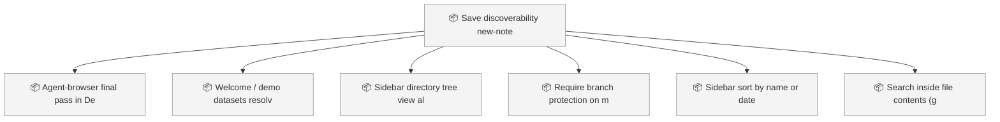
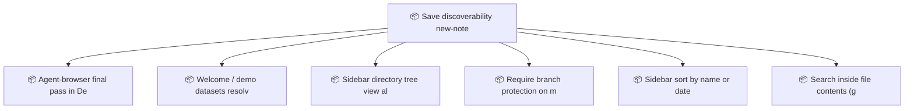

<!-- GENERATED by worklog roadmap-render. DO NOT EDIT. -->

> This file is generated from `.work/todo.jsonl`. Edits will be overwritten.
> To change the roadmap, change the work items: `worklog add|update|close`.

# Roadmap

_1 epic(s) in flight, 6 open item(s), 0 blocked, 0 unclassified._

## Now

_Nothing here._

## Next

### Save discoverability, new-note persistence E2E, and post-v0.1 follow-ups  ·  P1  ·  6 of 12 done
Make Save findable after New Note, lock create to edit to save to reload in Playwright, land dataset and SQL install E2E, and file post-v0.1 product gaps.

| # | Item | Type | Priority | Status | Blocked by |
|---|---|---|---|---|---|
| 01KYQYYN | Agent-browser final pass in Definition of Done | task | P2 | todo | — |
| 01KYQYYN | Welcome / demo datasets resolve when the open folder is not Motion | task | P2 | todo | — |
| 01KYQYYN | Sidebar: directory tree view alongside flat markdown list | task | P2 | todo | — |
| 01KYQYYN | Sidebar: sort by name or date | task | P2 | todo | — |
| 01KYQYYN | Search inside file contents (grep/glob UX) | task | P2 | todo | — |

## Later

### Save discoverability, new-note persistence E2E, and post-v0.1 follow-ups  ·  P1  ·  6 of 12 done
Make Save findable after New Note, lock create to edit to save to reload in Playwright, land dataset and SQL install E2E, and file post-v0.1 product gaps.

| # | Item | Type | Priority | Status | Blocked by |
|---|---|---|---|---|---|
| 01KYQYYN | Require branch protection on main for verify + rust checks | task | P3 | todo | — |

## Visual roadmap

### Dependency graph

### Hierarchy

