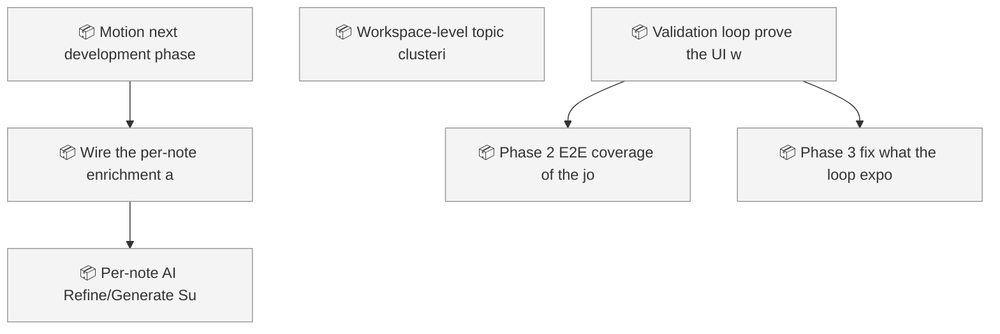
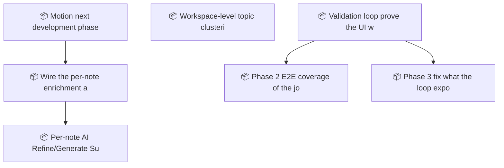

<!-- GENERATED by worklog roadmap-render. DO NOT EDIT. -->

> This file is generated from `.work/todo.jsonl`. Edits will be overwritten.
> To change the roadmap, change the work items: `worklog add|update|close`.

# Roadmap

_2 epic(s) in flight, 4 open item(s), 0 blocked, 0 unclassified._

## Now

_Nothing here._

## Next

### Motion next development phase  ·  P1  ·  16 of 18 done  ·  feature 13 / bug 5
Close the gap between Motion's stated vision (organize/edit/visualize documentation, local-first) and what a user can actually reach today: several real, working modules (enrichment pipeline, editor extensions) have no UI entry point, plus a pre-existing editor mode-desync data-loss bug. Sequenced: verify CLI contract, fix data loss, build a creation UX, fix dev storage mock, ship real diagram-gen + scope ImageGen backend, wire the per-note enrichment action.

| # | Item | Type | Priority | Status | Blocked by |
|---|---|---|---|---|---|
| 01KYFZ6R | Wire the per-note enrichment action into the UI | task | P2 | todo | — |
| 01KYFZ6R | Per-note "AI Refine"/"Generate Summary" toolbar action backed by ContentInjector | subtask | P2 | todo | — |

### Validation loop: prove the UI works before the human launches it  ·  P1  ·  46 of 48 done  ·  feature 38 / bug 7 / ops 3
Motion has real features and no way to know whether they work. The web mode designed as the browser-automation test surface never became real: WebStorage fakes writes and fakes openFolder, so testing saves against it proves nothing. One root cause (code assuming a Bun process while running in a browser) has been re-fixed four times and is open a fifth. CI never installs Bun or Rust, so a PR deleting src/App.tsx passes green. This epic builds the validation loop first, then fixes what the loop exposes, so the human gives design feedback instead of debugging.

| # | Item | Type | Priority | Status | Blocked by |
|---|---|---|---|---|---|
| 01KYK6NH | Phase 2: E2E coverage of the journeys that have actually broken | task | P1 | todo | — |
| 01KYK6NH | Phase 3: fix what the loop exposes | task | P1 | todo | — |

## Later

_Nothing here._

## Visual roadmap

### Dependency graph

### Hierarchy

