<!-- GENERATED by worklog roadmap-render. DO NOT EDIT. -->

> This file is generated from `.work/todo.jsonl`. Edits will be overwritten.
> To change the roadmap, change the work items: `worklog add|update|close`.

# Roadmap

_2 epic(s) in flight, 44 open item(s), 0 blocked, 0 unclassified._

## Now

_Nothing here._

## Next

### Save discoverability, new-note persistence E2E, and post-v0.1 follow-ups  ·  P1  ·  27 of 29 done  ·  feature 25 / bug 4
Make Save findable after New Note, lock create to edit to save to reload in Playwright, land dataset and SQL install E2E, and file post-v0.1 product gaps.

| # | Item | Type | Priority | Status | Blocked by |
|---|---|---|---|---|---|
| 01KYQYYN | Agent-browser final pass in Definition of Done | task | P2 | todo | — |

### CLI file argument, unsaved-changes guard, and editor zoom  ·  P1  ·  0 of 41 done  ·  feature 40 / ops 1
Three independent usability gaps found while dogfooding the motion CLI. First, 'motion note.md' exits with an error because the CLI only accepts directories, so the natural way to open a note fails. Second, nothing in the app tracks unsaved edits, so clicking another note in the sidebar silently throws away in-flight work. Third, there is no way to change text size, and the setting should be remembered between sessions. Save itself already works and is out of scope.

| # | Item | Type | Priority | Status | Blocked by |
|---|---|---|---|---|---|
| 01KZF796 | Carry `openFile` through the bootstrap payload | task | P1 | todo | — |
| 01KZF796 | Teach `bin/motion` to accept a markdown file | task | P1 | todo | — |
| 01KZF796 | Pure CLI path-argument classifier | task | P1 | todo | — |
| 01KZF796 | Warn before switching notes with unsaved edits | task | P1 | todo | — |
| 01KZF796 | Open the CLI-supplied file on boot | task | P1 | todo | — |
| 01KZF796 | Track unsaved editor changes | task | P1 | todo | — |
| 01KZPMAC | Isolate E2E settings file and add an auto-open dev server | task | P1 | todo | — |
| 01KZF796 | Implement `classifyPathArg` in `src/lib/cliPathArg.ts` | subtask | P2 | todo | — |
| 01KZF796 | Replace the `-d` check with file/directory classification | subtask | P2 | todo | — |
| 01KZF796 | Create the file when missing, then export `MOTION_OPEN_FILE` | subtask | P2 | todo | — |
| 01KZF796 | Add `openFile` to `/api/fs/workspace` in `src/server.ts` | subtask | P2 | todo | — |
| 01KZF796 | Run `bun test src/lib/cliPathArg.test.ts` green and commit | subtask | P2 | todo | — |
| 01KZF796 | Verify by hand against a scratch directory and commit | subtask | P2 | todo | — |
| 01KZF796 | Write failing tests for directory, existing `.md`, missing `.md`, and non-markdown non-directory | subtask | P2 | todo | — |
| 01KZF796 | Run `bun test src/lib/settings.test.ts` green and commit | subtask | P2 | todo | — |
| 01KZF796 | Intercept file selection in `src/App.tsx` | subtask | P2 | todo | — |
| 01KZF796 | Extend `BootstrapInfo` in `src/lib/storage/index.ts` | subtask | P2 | todo | — |
| 01KZF796 | Write `e2e/unsaved-guard.spec.ts` covering all three outcomes plus the clean-switch case | subtask | P2 | todo | — |
| 01KZF796 | Write `e2e/cli-open-file.spec.ts` driving a server booted with the env var | subtask | P2 | todo | — |
| 01KZF796 | Run `cargo test --lib` and `cargo clippy --all-targets -- -D warnings`, then commit | subtask | P2 | todo | — |
| 01KZF796 | Add a validated zoom level to settings | task | P2 | todo | — |
| 01KZF796 | Run the E2E green and commit | subtask | P2 | todo | — |
| 01KZF796 | Write failing tests for `zoom` absent, out of range, and non-numeric | subtask | P2 | todo | — |
| 01KZF796 | Extend the auto-open effect in `src/App.tsx` to select `openFile` | subtask | P2 | todo | — |
| 01KZF796 | Build `UnsavedChangesDialog` with the three documented actions | subtask | P2 | todo | — |
| 01KZF796 | Add `open_file` to `BootstrapInfo` in `src-tauri/src/lib.rs` | subtask | P2 | todo | — |
| 01KZF796 | Zoom the app with ⌘+, ⌘− and ⌘0 | task | P2 | todo | — |
| 01KZF796 | Add the `savedMarkdown` snapshot and `onDirtyChange` to the Editor | subtask | P2 | todo | — |
| 01KZF796 | Write failing tests for the dirty predicate | subtask | P2 | todo | — |
| 01KZF796 | Run `bun test src` green and commit | subtask | P2 | todo | — |
| 01KZF796 | Add the `check:` rubric rows to `e2e/layout.spec.ts` and commit | subtask | P2 | todo | — |
| 01KZF796 | Add the field, default, and clamp to `src/lib/settings.ts` | subtask | P2 | todo | — |
| 01KZF796 | Document the file argument, the unsaved guard, and zoom in `docs/user_guide/user-guide.md` | subtask | P2 | todo | — |
| 01KZF796 | Implement `src/lib/zoom.ts` and the `useZoom` hook with debounced persistence | subtask | P2 | todo | — |
| 01KZF796 | Write `e2e/zoom.spec.ts` asserting the computed root font size and survival across reload | subtask | P2 | todo | — |
| 01KZF796 | Mount it in `src/App.tsx` and apply the saved value at boot | subtask | P2 | todo | — |
| 01KZF796 | Update the README feature list and known limitations | subtask | P2 | todo | — |
| 01KZF796 | Commit | subtask | P2 | todo | — |
| 01KZF796 | Run `bun run verify` and commit | subtask | P2 | todo | — |
| 01KZF796 | Write failing tests for the scale reducer | subtask | P2 | todo | — |
| 01KZF796 | Update user-facing docs | task | P2 | todo | — |

### (no epic)

| # | Item | Type | Priority | Status | Blocked by |
|---|---|---|---|---|---|
| 01KZPN3V | Second desktop instance silently shows the wrong workspace | story | P2 | todo | — |

## Later

### Save discoverability, new-note persistence E2E, and post-v0.1 follow-ups  ·  P1  ·  27 of 29 done  ·  feature 25 / bug 4
Make Save findable after New Note, lock create to edit to save to reload in Playwright, land dataset and SQL install E2E, and file post-v0.1 product gaps.

| # | Item | Type | Priority | Status | Blocked by |
|---|---|---|---|---|---|
| 01KYQYYN | Require branch protection on main for verify + rust checks | task | P3 | todo | — |

## Visual roadmap

### Dependency graph

```mermaid
graph TD
    01KYQYYN3SBWDT25TC6H3G4EAA["📦 Save discoverability new-note"]
    01KYQYYN3T2SSGG33ESEWPXKH8["📦 Agent-browser final pass in De"]
    01KZF796D63FJCPA6FMJC6582E["📦 Implement classifyPathArg in s"]
    01KZF796D647FD32J1W2452NWM["📦 CLI file argument unsaved-chan"]
    01KZF796D6BPZCFNVPWEGYSSA0["📦 Carry openFile through the boo"]
    01KZF796D6F9ZDTXF28PQBH969["📦 Teach bin/motion to accept a m"]
    01KZF796D6FMZHDDXEX6D8TZ96["📦 Replace the -d check with file"]
    01KZF796D6JZ2XPNGVFEGXJ9QR["📦 Create the file when missing t"]
    01KZF796D6PYF8DQXHV67QRJDD["📦 Add openFile to /api/fs/worksp"]
    01KZF796D6RNJ0Q40G0113QV8Q["📦 Pure CLI path-argument classif"]
    01KZF796D6SECSX92KFSQMRPN4["📦 Run bun test src/lib/cliPathAr"]
    01KZF796D6SJFH8JAYQAAS98H8["📦 Verify by hand against a scrat"]
    01KZF796D6VPDRQYR7N0F5JJZ5["📦 Write failing tests for direct"]
    01KZF796D70MHWVDM1PZGFDCPN["📦 Run bun test src/lib/settings."]
    01KZF796D715WDWPYE7DBVV7WZ["📦 Intercept file selection in sr"]
    01KZF796D71ATP5ZX7XZY1FG7V["📦 Extend BootstrapInfo in src/li"]
    01KZF796D71X3W53R1W9GRGDEC["📦 Write e2e/unsaved-guard.spec.t"]
    01KZF796D725F72PYEAHRZZSKQ["📦 Write e2e/cli-open-file.spec.t"]
    01KZF796D72GZ2QWRAASHTNSRA["📦 Run cargo test --lib and cargo"]
    01KZF796D745F0RNS2QGV44EMK["📦 Add a validated zoom level to"]
    01KZF796D75MSG13JB0ZED5NQ1["📦 Run the E2E green and commit"]
    01KZF796D75QVQM6MQYPGVMSKE["📦 Write failing tests for zoom a"]
    01KZF796D78HWFN79T9TNYVJPN["📦 Extend the auto-open effect in"]
    01KZF796D7H8F2PH7VJJDVCR9M["📦 Build UnsavedChangesDialog wit"]
    01KZF796D7K5T4BS7K4ZWVKFT1["📦 Warn before switching notes wi"]
    01KZF796D7K6BR1ZQQ8SVC8YPH["📦 Open the CLI-supplied file on"]
    01KZF796D7PP25PNYZ3003PJ74["📦 Add open_file to BootstrapInfo"]
    01KZF796D7SBPX52KF580NPAPW["📦 Track unsaved editor changes"]
    01KZF796D7T4MB8E1N5S9B3RJW["📦 Zoom the app with ⌘+ ⌘− and ⌘0"]
    01KZF796D7WSC35B41ZNQV9P5V["📦 Add the savedMarkdown snapshot"]
    01KZF796D7X9DM9THYCNTFPH03["📦 Write failing tests for the di"]
    01KZF796D7Y5RN6FRFXT6AKC11["📦 Run bun test src green and com"]
    01KZF796D7ZGXJ30SD9QX6F2SW["📦 Add the check rubric rows to e"]
    01KZF796D7ZQYQQPP1BX3H9HQB["📦 Add the field default and clam"]
    01KZF796D86GET2MKXHP5AJRMQ["📦 Document the file argument the"]
    01KZF796D88VACJ230R487YY1K["📦 Implement src/lib/zoom.ts and"]
    01KZF796D88XT43Y4PTYPCKP7E["📦 Write e2e/zoom.spec.ts asserti"]
    01KZF796D89YD00DR64VGVAJ1V["📦 Mount it in src/App.tsx and ap"]
    01KZF796D8ARMVFVGRX3FGE262["📦 Update the README feature list"]
    01KZPMAC16GK23F8C5PZS0VV5H["🔧 Isolate E2E settings file and"]
    01KYQYYN3SBWDT25TC6H3G4EAA --> 01KYQYYN3T2SSGG33ESEWPXKH8
    01KZF796D6RNJ0Q40G0113QV8Q --> 01KZF796D63FJCPA6FMJC6582E
    01KZF796D647FD32J1W2452NWM --> 01KZF796D6BPZCFNVPWEGYSSA0
    01KZF796D647FD32J1W2452NWM --> 01KZF796D6F9ZDTXF28PQBH969
    01KZF796D6F9ZDTXF28PQBH969 --> 01KZF796D6FMZHDDXEX6D8TZ96
    01KZF796D6F9ZDTXF28PQBH969 --> 01KZF796D6JZ2XPNGVFEGXJ9QR
    01KZF796D6BPZCFNVPWEGYSSA0 --> 01KZF796D6PYF8DQXHV67QRJDD
    01KZF796D647FD32J1W2452NWM --> 01KZF796D6RNJ0Q40G0113QV8Q
    01KZF796D6RNJ0Q40G0113QV8Q --> 01KZF796D6SECSX92KFSQMRPN4
    01KZF796D6F9ZDTXF28PQBH969 --> 01KZF796D6SJFH8JAYQAAS98H8
    01KZF796D6RNJ0Q40G0113QV8Q --> 01KZF796D6VPDRQYR7N0F5JJZ5
    01KZF796D745F0RNS2QGV44EMK --> 01KZF796D70MHWVDM1PZGFDCPN
    01KZF796D7K5T4BS7K4ZWVKFT1 --> 01KZF796D715WDWPYE7DBVV7WZ
    01KZF796D6BPZCFNVPWEGYSSA0 --> 01KZF796D71ATP5ZX7XZY1FG7V
    01KZF796D7K5T4BS7K4ZWVKFT1 --> 01KZF796D71X3W53R1W9GRGDEC
    01KZF796D7K6BR1ZQQ8SVC8YPH --> 01KZF796D725F72PYEAHRZZSKQ
    01KZF796D6BPZCFNVPWEGYSSA0 --> 01KZF796D72GZ2QWRAASHTNSRA
    01KZF796D647FD32J1W2452NWM --> 01KZF796D745F0RNS2QGV44EMK
    01KZF796D7K6BR1ZQQ8SVC8YPH --> 01KZF796D75MSG13JB0ZED5NQ1
    01KZF796D745F0RNS2QGV44EMK --> 01KZF796D75QVQM6MQYPGVMSKE
    01KZF796D7K6BR1ZQQ8SVC8YPH --> 01KZF796D78HWFN79T9TNYVJPN
    01KZF796D7K5T4BS7K4ZWVKFT1 --> 01KZF796D7H8F2PH7VJJDVCR9M
    01KZF796D647FD32J1W2452NWM --> 01KZF796D7K5T4BS7K4ZWVKFT1
    01KZF796D647FD32J1W2452NWM --> 01KZF796D7K6BR1ZQQ8SVC8YPH
    01KZF796D6BPZCFNVPWEGYSSA0 --> 01KZF796D7PP25PNYZ3003PJ74
    01KZF796D647FD32J1W2452NWM --> 01KZF796D7SBPX52KF580NPAPW
    01KZF796D647FD32J1W2452NWM --> 01KZF796D7T4MB8E1N5S9B3RJW
    01KZF796D7SBPX52KF580NPAPW --> 01KZF796D7WSC35B41ZNQV9P5V
    01KZF796D7SBPX52KF580NPAPW --> 01KZF796D7X9DM9THYCNTFPH03
    01KZF796D7SBPX52KF580NPAPW --> 01KZF796D7Y5RN6FRFXT6AKC11
    01KZF796D7K5T4BS7K4ZWVKFT1 --> 01KZF796D7ZGXJ30SD9QX6F2SW
    01KZF796D745F0RNS2QGV44EMK --> 01KZF796D7ZQYQQPP1BX3H9HQB
    01KZF796D7T4MB8E1N5S9B3RJW --> 01KZF796D88VACJ230R487YY1K
    01KZF796D7T4MB8E1N5S9B3RJW --> 01KZF796D88XT43Y4PTYPCKP7E
    01KZF796D7T4MB8E1N5S9B3RJW --> 01KZF796D89YD00DR64VGVAJ1V
    01KZF796D647FD32J1W2452NWM --> 01KZPMAC16GK23F8C5PZS0VV5H
    classDef todo fill:#f4f4f4,stroke:#999999
    class 01KYQYYN3SBWDT25TC6H3G4EAA,01KYQYYN3T2SSGG33ESEWPXKH8,01KZF796D63FJCPA6FMJC6582E,01KZF796D647FD32J1W2452NWM,01KZF796D6BPZCFNVPWEGYSSA0,01KZF796D6F9ZDTXF28PQBH969,01KZF796D6FMZHDDXEX6D8TZ96,01KZF796D6JZ2XPNGVFEGXJ9QR,01KZF796D6PYF8DQXHV67QRJDD,01KZF796D6RNJ0Q40G0113QV8Q,01KZF796D6SECSX92KFSQMRPN4,01KZF796D6SJFH8JAYQAAS98H8,01KZF796D6VPDRQYR7N0F5JJZ5,01KZF796D70MHWVDM1PZGFDCPN,01KZF796D715WDWPYE7DBVV7WZ,01KZF796D71ATP5ZX7XZY1FG7V,01KZF796D71X3W53R1W9GRGDEC,01KZF796D725F72PYEAHRZZSKQ,01KZF796D72GZ2QWRAASHTNSRA,01KZF796D745F0RNS2QGV44EMK,01KZF796D75MSG13JB0ZED5NQ1,01KZF796D75QVQM6MQYPGVMSKE,01KZF796D78HWFN79T9TNYVJPN,01KZF796D7H8F2PH7VJJDVCR9M,01KZF796D7K5T4BS7K4ZWVKFT1,01KZF796D7K6BR1ZQQ8SVC8YPH,01KZF796D7PP25PNYZ3003PJ74,01KZF796D7SBPX52KF580NPAPW,01KZF796D7T4MB8E1N5S9B3RJW,01KZF796D7WSC35B41ZNQV9P5V,01KZF796D7X9DM9THYCNTFPH03,01KZF796D7Y5RN6FRFXT6AKC11,01KZF796D7ZGXJ30SD9QX6F2SW,01KZF796D7ZQYQQPP1BX3H9HQB,01KZF796D86GET2MKXHP5AJRMQ,01KZF796D88VACJ230R487YY1K,01KZF796D88XT43Y4PTYPCKP7E,01KZF796D89YD00DR64VGVAJ1V,01KZF796D8ARMVFVGRX3FGE262,01KZPMAC16GK23F8C5PZS0VV5H todo
```

_+6 more items not shown_

### Hierarchy

```mermaid
graph TD
    01KYQYYN3SBWDT25TC6H3G4EAA["📦 Save discoverability new-note"]
    01KYQYYN3T2SSGG33ESEWPXKH8["📦 Agent-browser final pass in De"]
    01KZF796D63FJCPA6FMJC6582E["📦 Implement classifyPathArg in s"]
    01KZF796D647FD32J1W2452NWM["📦 CLI file argument unsaved-chan"]
    01KZF796D6BPZCFNVPWEGYSSA0["📦 Carry openFile through the boo"]
    01KZF796D6F9ZDTXF28PQBH969["📦 Teach bin/motion to accept a m"]
    01KZF796D6FMZHDDXEX6D8TZ96["📦 Replace the -d check with file"]
    01KZF796D6JZ2XPNGVFEGXJ9QR["📦 Create the file when missing t"]
    01KZF796D6PYF8DQXHV67QRJDD["📦 Add openFile to /api/fs/worksp"]
    01KZF796D6RNJ0Q40G0113QV8Q["📦 Pure CLI path-argument classif"]
    01KZF796D6SECSX92KFSQMRPN4["📦 Run bun test src/lib/cliPathAr"]
    01KZF796D6SJFH8JAYQAAS98H8["📦 Verify by hand against a scrat"]
    01KZF796D6VPDRQYR7N0F5JJZ5["📦 Write failing tests for direct"]
    01KZF796D70MHWVDM1PZGFDCPN["📦 Run bun test src/lib/settings."]
    01KZF796D715WDWPYE7DBVV7WZ["📦 Intercept file selection in sr"]
    01KZF796D71ATP5ZX7XZY1FG7V["📦 Extend BootstrapInfo in src/li"]
    01KZF796D71X3W53R1W9GRGDEC["📦 Write e2e/unsaved-guard.spec.t"]
    01KZF796D725F72PYEAHRZZSKQ["📦 Write e2e/cli-open-file.spec.t"]
    01KZF796D72GZ2QWRAASHTNSRA["📦 Run cargo test --lib and cargo"]
    01KZF796D745F0RNS2QGV44EMK["📦 Add a validated zoom level to"]
    01KZF796D75MSG13JB0ZED5NQ1["📦 Run the E2E green and commit"]
    01KZF796D75QVQM6MQYPGVMSKE["📦 Write failing tests for zoom a"]
    01KZF796D78HWFN79T9TNYVJPN["📦 Extend the auto-open effect in"]
    01KZF796D7H8F2PH7VJJDVCR9M["📦 Build UnsavedChangesDialog wit"]
    01KZF796D7K5T4BS7K4ZWVKFT1["📦 Warn before switching notes wi"]
    01KZF796D7K6BR1ZQQ8SVC8YPH["📦 Open the CLI-supplied file on"]
    01KZF796D7PP25PNYZ3003PJ74["📦 Add open_file to BootstrapInfo"]
    01KZF796D7SBPX52KF580NPAPW["📦 Track unsaved editor changes"]
    01KZF796D7T4MB8E1N5S9B3RJW["📦 Zoom the app with ⌘+ ⌘− and ⌘0"]
    01KZF796D7WSC35B41ZNQV9P5V["📦 Add the savedMarkdown snapshot"]
    01KZF796D7X9DM9THYCNTFPH03["📦 Write failing tests for the di"]
    01KZF796D7Y5RN6FRFXT6AKC11["📦 Run bun test src green and com"]
    01KZF796D7ZGXJ30SD9QX6F2SW["📦 Add the check rubric rows to e"]
    01KZF796D7ZQYQQPP1BX3H9HQB["📦 Add the field default and clam"]
    01KZF796D86GET2MKXHP5AJRMQ["📦 Document the file argument the"]
    01KZF796D88VACJ230R487YY1K["📦 Implement src/lib/zoom.ts and"]
    01KZF796D88XT43Y4PTYPCKP7E["📦 Write e2e/zoom.spec.ts asserti"]
    01KZF796D89YD00DR64VGVAJ1V["📦 Mount it in src/App.tsx and ap"]
    01KZF796D8ARMVFVGRX3FGE262["📦 Update the README feature list"]
    01KZPMAC16GK23F8C5PZS0VV5H["🔧 Isolate E2E settings file and"]
    01KYQYYN3SBWDT25TC6H3G4EAA --> 01KYQYYN3T2SSGG33ESEWPXKH8
    01KZF796D6RNJ0Q40G0113QV8Q --> 01KZF796D63FJCPA6FMJC6582E
    01KZF796D647FD32J1W2452NWM --> 01KZF796D6BPZCFNVPWEGYSSA0
    01KZF796D647FD32J1W2452NWM --> 01KZF796D6F9ZDTXF28PQBH969
    01KZF796D6F9ZDTXF28PQBH969 --> 01KZF796D6FMZHDDXEX6D8TZ96
    01KZF796D6F9ZDTXF28PQBH969 --> 01KZF796D6JZ2XPNGVFEGXJ9QR
    01KZF796D6BPZCFNVPWEGYSSA0 --> 01KZF796D6PYF8DQXHV67QRJDD
    01KZF796D647FD32J1W2452NWM --> 01KZF796D6RNJ0Q40G0113QV8Q
    01KZF796D6RNJ0Q40G0113QV8Q --> 01KZF796D6SECSX92KFSQMRPN4
    01KZF796D6F9ZDTXF28PQBH969 --> 01KZF796D6SJFH8JAYQAAS98H8
    01KZF796D6RNJ0Q40G0113QV8Q --> 01KZF796D6VPDRQYR7N0F5JJZ5
    01KZF796D745F0RNS2QGV44EMK --> 01KZF796D70MHWVDM1PZGFDCPN
    01KZF796D7K5T4BS7K4ZWVKFT1 --> 01KZF796D715WDWPYE7DBVV7WZ
    01KZF796D6BPZCFNVPWEGYSSA0 --> 01KZF796D71ATP5ZX7XZY1FG7V
    01KZF796D7K5T4BS7K4ZWVKFT1 --> 01KZF796D71X3W53R1W9GRGDEC
    01KZF796D7K6BR1ZQQ8SVC8YPH --> 01KZF796D725F72PYEAHRZZSKQ
    01KZF796D6BPZCFNVPWEGYSSA0 --> 01KZF796D72GZ2QWRAASHTNSRA
    01KZF796D647FD32J1W2452NWM --> 01KZF796D745F0RNS2QGV44EMK
    01KZF796D7K6BR1ZQQ8SVC8YPH --> 01KZF796D75MSG13JB0ZED5NQ1
    01KZF796D745F0RNS2QGV44EMK --> 01KZF796D75QVQM6MQYPGVMSKE
    01KZF796D7K6BR1ZQQ8SVC8YPH --> 01KZF796D78HWFN79T9TNYVJPN
    01KZF796D7K5T4BS7K4ZWVKFT1 --> 01KZF796D7H8F2PH7VJJDVCR9M
    01KZF796D647FD32J1W2452NWM --> 01KZF796D7K5T4BS7K4ZWVKFT1
    01KZF796D647FD32J1W2452NWM --> 01KZF796D7K6BR1ZQQ8SVC8YPH
    01KZF796D6BPZCFNVPWEGYSSA0 --> 01KZF796D7PP25PNYZ3003PJ74
    01KZF796D647FD32J1W2452NWM --> 01KZF796D7SBPX52KF580NPAPW
    01KZF796D647FD32J1W2452NWM --> 01KZF796D7T4MB8E1N5S9B3RJW
    01KZF796D7SBPX52KF580NPAPW --> 01KZF796D7WSC35B41ZNQV9P5V
    01KZF796D7SBPX52KF580NPAPW --> 01KZF796D7X9DM9THYCNTFPH03
    01KZF796D7SBPX52KF580NPAPW --> 01KZF796D7Y5RN6FRFXT6AKC11
    01KZF796D7K5T4BS7K4ZWVKFT1 --> 01KZF796D7ZGXJ30SD9QX6F2SW
    01KZF796D745F0RNS2QGV44EMK --> 01KZF796D7ZQYQQPP1BX3H9HQB
    01KZF796D7T4MB8E1N5S9B3RJW --> 01KZF796D88VACJ230R487YY1K
    01KZF796D7T4MB8E1N5S9B3RJW --> 01KZF796D88XT43Y4PTYPCKP7E
    01KZF796D7T4MB8E1N5S9B3RJW --> 01KZF796D89YD00DR64VGVAJ1V
    01KZF796D647FD32J1W2452NWM --> 01KZPMAC16GK23F8C5PZS0VV5H
```

_+6 more items not shown_
