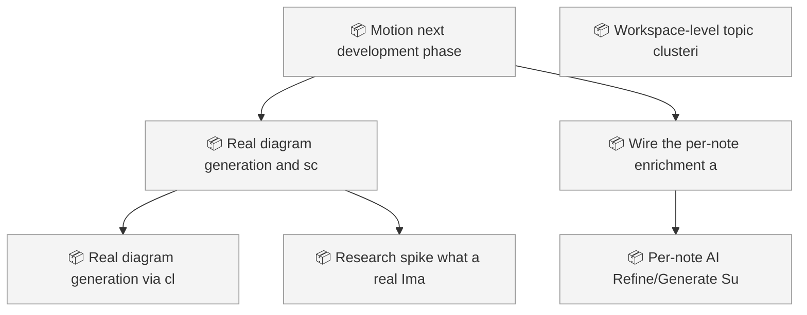
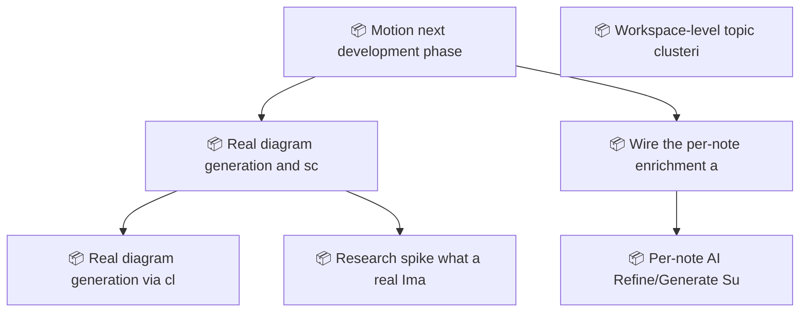

<!-- GENERATED by worklog roadmap-render. DO NOT EDIT. -->

> This file is generated from `.work/todo.jsonl`. Edits will be overwritten.
> To change the roadmap, change the work items: `worklog add|update|close`.

# Roadmap

_1 epic(s) in flight, 5 open item(s), 0 blocked, 0 unclassified._

## Now

_Nothing here._

## Next

### Motion next development phase  ·  P1  ·  11 of 16 done  ·  feature 13 / bug 3
Close the gap between Motion's stated vision (organize/edit/visualize documentation, local-first) and what a user can actually reach today: several real, working modules (enrichment pipeline, editor extensions) have no UI entry point, plus a pre-existing editor mode-desync data-loss bug. Sequenced: verify CLI contract, fix data loss, build a creation UX, fix dev storage mock, ship real diagram-gen + scope ImageGen backend, wire the per-note enrichment action.

| # | Item | Type | Priority | Status | Blocked by |
|---|---|---|---|---|---|
| 01KYFZ6R | Real diagram generation, and scope a real ImageGen backend | task | P2 | todo | — |
| 01KYFZ6R | Real diagram generation via cliWrappers.callLLM + Mermaid-validate-before-accept, | subtask | P2 | todo | — |
| 01KYFZ6R | Research spike: what a real ImageGen backend would require (candidate CLIs/APIs, | subtask | P2 | todo | — |
| 01KYFZ6R | Wire the per-note enrichment action into the UI | task | P2 | todo | — |
| 01KYFZ6R | Per-note "AI Refine"/"Generate Summary" toolbar action backed by ContentInjector | subtask | P2 | todo | — |

## Later

_Nothing here._

## Visual roadmap

### Dependency graph

### Hierarchy

