<!-- GENERATED by worklog roadmap-render. DO NOT EDIT. -->

> This file is generated from `.work/todo.jsonl`. Edits will be overwritten.
> To change the roadmap, change the work items: `worklog add|update|close`.

# Roadmap

_2 epic(s) in flight, 9 open item(s), 0 blocked, 0 unclassified._

## Now

_Nothing here._

## Next

### Save discoverability, new-note persistence E2E, and post-v0.1 follow-ups  ·  P1  ·  9 of 14 done  ·  feature 13 / ops 1  ·  → v0.6.1
Make Save findable after New Note, lock create to edit to save to reload in Playwright, land dataset and SQL install E2E, and file post-v0.1 product gaps.

| # | Item | Type | Priority | Status | Blocked by |
|---|---|---|---|---|---|
| 01KYQYYN | Agent-browser final pass in Definition of Done | task | P2 | todo | — |
| 01KYQYYN | Sidebar: sort by name or date | task | P2 | todo | — |
| 01KYQYYN | Search inside file contents (grep/glob UX) | task | P2 | todo | — |

### AI editor: selection, /ai, preview  ·  P1  ·  10 of 13 done  ·  feature 9 / bug 4  ·  → mixed
Three entry points, one pipeline, preview before commit. Phase 1 on the existing CLI transport.

| # | Item | Type | Priority | Status | Blocked by |
|---|---|---|---|---|---|
| 01M19Z6Z | Bun sidecar so packaged Tauri streams Ask AI | task | P2 | todo | — |

### (no epic)

| # | Item | Type | Priority | Status | Blocked by |
|---|---|---|---|---|---|
| 01M18Q56 | Mac dogfood: unsigned .app, Finder Open With, overlay padding | task | P1 | todo | — |

## Later

### Save discoverability, new-note persistence E2E, and post-v0.1 follow-ups  ·  P1  ·  9 of 14 done  ·  feature 13 / ops 1
Make Save findable after New Note, lock create to edit to save to reload in Playwright, land dataset and SQL install E2E, and file post-v0.1 product gaps.

| # | Item | Type | Priority | Status | Blocked by |
|---|---|---|---|---|---|
| 01KYQYYN | Require branch protection on main for verify + rust checks | task | P3 | todo | — |
| 01M1ABZH | Dev-server publish handlers have no test of their own | task | P3 | todo | — |

### AI editor: selection, /ai, preview  ·  P1  ·  10 of 13 done  ·  feature 9 / bug 4
Three entry points, one pipeline, preview before commit. Phase 1 on the existing CLI transport.

| # | Item | Type | Priority | Status | Blocked by |
|---|---|---|---|---|---|
| 01M18R79 | Dictation last | task | P3 | todo | — |
| 01M1ABZH | Ask AI does not say when a reply was cut off at max_tokens | task | P3 | todo | — |

## Milestones

### v0.6.0

| # | Item | Type | Priority | Status | Blocked by |
|---|---|---|---|---|---|
| 01M18Q56 | Mac dogfood: unsigned .app, Finder Open With, overlay padding | task | P1 | todo | — |
| 01M19Z6Z | Bun sidecar so packaged Tauri streams Ask AI | task | P2 | todo | — |
| 01M18R79 | Dictation last | task | P3 | todo | — |

### v0.6.1

| # | Item | Type | Priority | Status | Blocked by |
|---|---|---|---|---|---|
| 01M1ABZH | Ask AI does not say when a reply was cut off at max_tokens | task | P3 | todo | — |

## Visual roadmap

### Dependency graph

```mermaid
graph TD
    01KYQYYN3SBWDT25TC6H3G4EAA["📦 Save discoverability new-note"]
    01KYQYYN3T2SSGG33ESEWPXKH8["📦 Agent-browser final pass in De"]
    01KYQYYN3T731B57N8NXQ8C0FQ["📦 Require branch protection on m"]
    01KYQYYN3TA69K8848E483HC82["📦 Sidebar sort by name or date"]
    01KYQYYN3TKW93D9SVW07VKFZY["📦 Search inside file contents (g"]
    01M18Q560MPAYQJTA0W6F4DAW3["🔧 Mac dogfood unsigned .app Find"]
    01M18R79ZM90HJ0MBG3CX6VW7E["📦 Dictation last"]
    01M18R79ZMN53CMV76JFHKVEFN["📦 AI editor selection /ai previe"]
    01M19Z6Z3XQZ03EYNXKKBG5WK7["📦 Bun sidecar so packaged Tauri"]
    01M1ABZH14RJDDJ7M7HT3TZKYW["🐛 Ask AI does not say when a rep"]
    01M1ABZH2F573CM32N93NDMAGB["🔧 Dev-server publish handlers ha"]
    01KYQYYN3SBWDT25TC6H3G4EAA --> 01KYQYYN3T2SSGG33ESEWPXKH8
    01KYQYYN3SBWDT25TC6H3G4EAA --> 01KYQYYN3T731B57N8NXQ8C0FQ
    01KYQYYN3SBWDT25TC6H3G4EAA --> 01KYQYYN3TA69K8848E483HC82
    01KYQYYN3SBWDT25TC6H3G4EAA --> 01KYQYYN3TKW93D9SVW07VKFZY
    01M18R79ZMN53CMV76JFHKVEFN --> 01M18R79ZM90HJ0MBG3CX6VW7E
    01M18R79ZMN53CMV76JFHKVEFN --> 01M19Z6Z3XQZ03EYNXKKBG5WK7
    01M18R79ZMN53CMV76JFHKVEFN --> 01M1ABZH14RJDDJ7M7HT3TZKYW
    01KYQYYN3SBWDT25TC6H3G4EAA --> 01M1ABZH2F573CM32N93NDMAGB
    classDef todo fill:#f4f4f4,stroke:#999999
    class 01KYQYYN3SBWDT25TC6H3G4EAA,01KYQYYN3T2SSGG33ESEWPXKH8,01KYQYYN3T731B57N8NXQ8C0FQ,01KYQYYN3TA69K8848E483HC82,01KYQYYN3TKW93D9SVW07VKFZY,01M18Q560MPAYQJTA0W6F4DAW3,01M18R79ZM90HJ0MBG3CX6VW7E,01M18R79ZMN53CMV76JFHKVEFN,01M19Z6Z3XQZ03EYNXKKBG5WK7,01M1ABZH14RJDDJ7M7HT3TZKYW,01M1ABZH2F573CM32N93NDMAGB todo
```

### Hierarchy

```mermaid
graph TD
    01KYQYYN3SBWDT25TC6H3G4EAA["📦 Save discoverability new-note"]
    01KYQYYN3T2SSGG33ESEWPXKH8["📦 Agent-browser final pass in De"]
    01KYQYYN3T731B57N8NXQ8C0FQ["📦 Require branch protection on m"]
    01KYQYYN3TA69K8848E483HC82["📦 Sidebar sort by name or date"]
    01KYQYYN3TKW93D9SVW07VKFZY["📦 Search inside file contents (g"]
    01M18Q560MPAYQJTA0W6F4DAW3["🔧 Mac dogfood unsigned .app Find"]
    01M18R79ZM90HJ0MBG3CX6VW7E["📦 Dictation last"]
    01M18R79ZMN53CMV76JFHKVEFN["📦 AI editor selection /ai previe"]
    01M19Z6Z3XQZ03EYNXKKBG5WK7["📦 Bun sidecar so packaged Tauri"]
    01M1ABZH14RJDDJ7M7HT3TZKYW["🐛 Ask AI does not say when a rep"]
    01M1ABZH2F573CM32N93NDMAGB["🔧 Dev-server publish handlers ha"]
    01KYQYYN3SBWDT25TC6H3G4EAA --> 01KYQYYN3T2SSGG33ESEWPXKH8
    01KYQYYN3SBWDT25TC6H3G4EAA --> 01KYQYYN3T731B57N8NXQ8C0FQ
    01KYQYYN3SBWDT25TC6H3G4EAA --> 01KYQYYN3TA69K8848E483HC82
    01KYQYYN3SBWDT25TC6H3G4EAA --> 01KYQYYN3TKW93D9SVW07VKFZY
    01M18R79ZMN53CMV76JFHKVEFN --> 01M18R79ZM90HJ0MBG3CX6VW7E
    01M18R79ZMN53CMV76JFHKVEFN --> 01M19Z6Z3XQZ03EYNXKKBG5WK7
    01M18R79ZMN53CMV76JFHKVEFN --> 01M1ABZH14RJDDJ7M7HT3TZKYW
    01KYQYYN3SBWDT25TC6H3G4EAA --> 01M1ABZH2F573CM32N93NDMAGB
```

