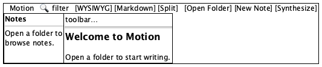
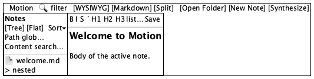
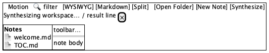

# App shell

**Source:** `src/App.tsx` — `App`
**Reach:** `/` — the frame every other screen sits inside
**States:** welcome (no workspace) · workspace open · synthesis banner

## Spec

CSS grid: full-width **header** (`--header-height` 56px), optional **synthesis
banner** spanning both columns, then **sidebar** (`--sidebar-width` 280px) +
**main**. Only `.app-main` scrolls for long notes; the shell chrome stays put.

### Layout states

| State | Condition | What renders |
|---|---|---|
| Welcome | `workspacePath === null` | Sidebar empty prompt; editor shows built-in Welcome doc; New Note / Synthesize / header search disabled |
| Workspace | folder opened via Open Folder | Sidebar lists notes; actions enabled |
| Synthesis | `synthesis` string set | Banner under header with status text + dismiss |

### Header, left to right

1. **Logo** — icon + “Motion” (decoration)
2. **Search** — `type=search`, `aria-label="Search notes"` (header mirror of path filter; disabled without workspace)
3. **View toggle** — WYSIWYG · Markdown · Split (exactly one `.active`)
4. **Open Folder** · **New Note** · **Synthesize**

### Synthesis banner

`role="status"` `aria-label="Workspace synthesis"`. Dismiss via
`aria-label="Dismiss synthesis status"`. Progress and result share this surface.

## Addressability

| What | Selector |
|---|---|
| Shell root | `.app` |
| Header | `header.app-header` |
| Search | `getByLabel("Search notes")` |
| View mode | `getByRole("button", { name: "WYSIWYG" \| "Markdown" \| "Split" })` |
| Open Folder | `getByRole("button", { name: "Open Folder" })` |
| New Note | `getByRole("button", { name: "New Note" })` |
| Synthesize | `getByRole("button", { name: "Synthesize" })` |
| Sidebar | `aside.app-sidebar` |
| Main | `main.app-main` |
| Editor surface | `.ProseMirror` (wysiwyg) |
| Synthesis | `getByRole("status", { name: "Workspace synthesis" })` |
| Ready | `[data-app-ready]` on `<html>` |

## Capture recipe

```
1. seed localStorage["motion-ui-freeze"] = "1"
2. load /, viewport 1280x800
3. wait for [data-app-ready] and .ProseMirror
4. screenshot → app-shell-01-welcome
5. click Open Folder; wait for role=option name=welcome.md
6. screenshot → app-shell-02-workspace
```

| State | How |
|---|---|
| Welcome | Default cold load (E2E workspace is server-side; UI still needs Open Folder) |
| Workspace | Open Folder once |
| Synthesis | Open Folder → Synthesize (needs LLM in real runs; banner can be stubbed by driving `setSynthesis` only in unit tests — capture optional until mocked) |

## Wireframes

| State | Wireframe |
|---|---|
| 1 · Welcome |  |
| 2 · Workspace open |  |
| 3 · Synthesis banner |  |

## Rubric

Tokens: [tokens.md](tokens.md).

### Must Match
- [ ] Header is full width above sidebar+main; height uses `--header-height` — `check:layout › grid topology`
- [ ] Sidebar is the left column under the header; main is to its right — `check:layout › grid topology`
- [ ] View toggle has three buttons: WYSIWYG, Markdown, Split; exactly one has class `active` — `check:layout › view toggle`
- [ ] Open Folder is always present and enabled on boot — `check:layout › inventory`
- [ ] Welcome heading visible in editor before Open Folder — `check:layout › inventory`
- [ ] New Note and Synthesize are disabled until a workspace is open — `check:layout › inventory`
- [ ] Synthesis banner, when shown, is under the header and has a dismiss control — `agent`
- [ ] Logo reads “Motion” left of the search bar — `agent`

### Acceptable Differences
- Workspace folder basename in the sidebar title
- Which note is selected; seed file set
- Font metrics, scrollbars, sub-pixel spacing
- Salt wireframe proportions and monochrome styling
- Synthesize disabled while a run is in progress (banner visible)

### Must NOT Appear
- A second full app chrome nested inside main
- Light-theme surfaces (app is dark-first; no accidental white canvas)
- Unlabelled icon-only controls in the header

### Failure Criteria
- Header scrolls away with main content
- Sidebar overlaps main or header
- Any header control outside the 1280×800 viewport
- Console error or failed network request on boot

## Out of scope

[Sidebar](sidebar.md), [Editor](editor.md). Save lives on the editor toolbar, not the shell header.
