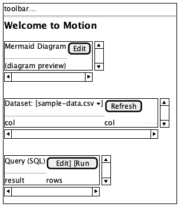
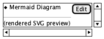
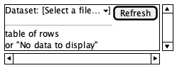
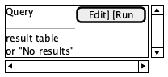
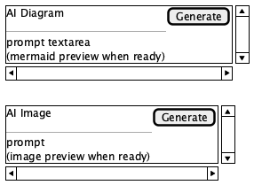

# Blocks

**Source:** `src/components/Editor/extensions/*`, `insertBlock.ts`
**Reach:** Welcome doc (built-in), or insert via toolbar `Insert {Mermaid|Dataset|Query|AI Diagram|AI Image}` / slash menu
**States:** rest views for the five custom block types

## Spec

Custom TipTap node views embedded in the WYSIWYG surface. Each block is a
bordered card with a header row (type label + actions) and a body (preview,
table, prompt, or diagram).

| Type | Class / data | Header accent | Primary actions |
|---|---|---|---|
| Mermaid | `.mermaid-block` | purple “Mermaid Diagram” | Edit → Cancel / Save |
| Dataset | `.dataset-block` | “Dataset:” + source `<select>` | Refresh |
| Query | `.query-block` | purple SQL title | Edit / Run · Cancel / Save when editing |
| AI Diagram | `.diagram-gen-block` | purple | Generate / edit prompt |
| AI Image | `.image-gen-block` | orange | Generate / prompt |

Markdown fences: ` ```mermaid `, ` ```dataset `, ` ```query `, ` ```diagram-gen `, ` ```image-gen `.

Insert commands (`INSERT_COMMANDS`): Mermaid, Dataset, Query, AI Diagram, AI Image —
toolbar buttons titled `Insert {label}`.

### Empty / error

| Block | Empty | Error |
|---|---|---|
| Dataset | “No data to display” | `.dataset-error` with message |
| Query | “No results” | `.dataset-error` |
| Mermaid | (invalid syntax) error inside the block, not `document.body` | see sanitize e2e |
| AI blocks | idle prompt / loading line | `.dataset-error` |

## Addressability

| What | Selector |
|---|---|
| Mermaid | `.mermaid-block` or `[data-type="mermaid"]` |
| Dataset | `.dataset-block` |
| Query | `.query-block` |
| Diagram gen | `.diagram-gen-block` |
| Image gen | `.image-gen-block` |
| Insert Mermaid | `getByRole("button", { name: "Insert Mermaid" })` |
| Insert Dataset | `getByRole("button", { name: "Insert Dataset" })` |
| Insert Query | `getByRole("button", { name: "Insert Query" })` |
| Insert AI Diagram | `getByRole("button", { name: "Insert AI Diagram" })` |
| Insert AI Image | `getByRole("button", { name: "Insert AI Image" })` |
| Slash menu | `getByRole("listbox", { name: "Insert block" })` (when open) |

## Capture recipe

```
1. seed motion-ui-freeze=1
2. load /, 1280×800, wait [data-app-ready] and .ProseMirror
3. # Welcome doc already mounts mermaid + dataset + query node views
4. wait .dataset-block and .query-block and .mermaid-block (timeout 15s)
5. screenshot → blocks-01-welcome-rest
6. Open Folder → scratch-blocks.md (or New Note)
7. click Insert Mermaid; wait .mermaid-block
8. screenshot clip of main → blocks-02-mermaid-rest  (optional single-type)
```

Prefer the welcome multi-block capture for agent judgment; single-type shots are
optional when debugging one extension.

## Wireframes

| State | Wireframe |
|---|---|
| 1 · Welcome multi-block rest |  |
| 2 · Mermaid card |  |
| 3 · Dataset card |  |
| 4 · Query card |  |
| 5 · AI Diagram / Image header pattern |  |

## Rubric

### Must Match
- [ ] Welcome doc renders mermaid, dataset, and query as node views (not bare `<pre>`) — `check:blocks › welcome node views` (also `e2e/blocks.spec.ts`)
- [ ] Toolbar exposes Insert Mermaid, Dataset, Query, AI Diagram, AI Image — `check:layout › insert block buttons`
- [ ] Dataset header includes a source select and Refresh — `agent`
- [ ] Query header includes Edit and Run (or Save when editing) — `agent`
- [ ] Mermaid rest state shows “Mermaid Diagram” + Edit — `agent`
- [ ] Block errors render inside the block card, not as a full-page crash — covered by sanitize / data e2e
- [ ] Round-trip save/reload keeps fence content — `e2e/blocks.spec.ts`

### Acceptable Differences
- Table row counts, SQL text, mermaid SVG geometry
- Loading labels (“Loading…”, “Running…”, “Imagining…”)
- Whether AI blocks show preview or empty prompt
- Salt monochrome vs real accent colours

### Must NOT Appear
- Custom block content only as a plain fenced code block in WYSIWYG when the type is registered
- Uncaught exception banners from a bad mermaid/SQL parse (errors stay in-block)

### Failure Criteria
- Insert button missing accessible name
- Block type missing from welcome without a deliberate product change + doc update
- Query/dataset error escapes into shell chrome

## Out of scope

Toolbar chrome outside insert group ([editor.md](editor.md)). LLM quality of AI
outputs. DuckDB SQL correctness beyond “runs without shell crash” (see data e2e).
