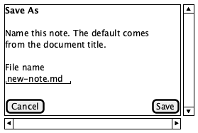
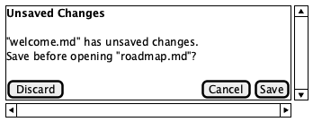

# Dialogs

**Source:** `src/components/SaveNameDialog.tsx`
**Reach:** New Note (or Rename) → Save when the document needs a real path
**States:** Save As (new / untitled) · Rename (existing named note)

## Spec

Modal overlay for naming a note on first save (macOS-style Untitled) or when
renaming. Backdrop dismisses on outside click; Escape cancels; Enter confirms.

### Layout

1. **Backdrop** — `.save-name-dialog-backdrop`, `role="presentation"`
2. **Dialog** — `role="dialog"` `aria-modal="true"` labelled by the title `h2`
3. **Title** — e.g. “Save As” or rename wording from the editor
4. **Hint** — “Name this note. The default comes from the document title.”
5. **File name** — labelled text field (default from H1 → slug + `.md`)
6. **Actions** — Cancel (secondary) · confirm (primary, default “Save”)

Empty / invalid names (blank or `.md` only) do not submit.

## Addressability

| What | Selector |
|---|---|
| Dialog | `getByRole("dialog", { name: /Save As/i })` (or rename title) |
| File name | `dialog.getByLabel("File name")` |
| Cancel | `dialog.getByRole("button", { name: "Cancel" })` |
| Confirm | `dialog.getByRole("button", { name: /^Save$/ })` (or confirmLabel) |
| Backdrop | `.save-name-dialog-backdrop` |

## Capture recipe

```
1. seed motion-ui-freeze=1
2. load /, 1280×800, wait [data-app-ready]
3. Open Folder; wait welcome.md
4. New Note; wait ProseMirror “New Note” and toolbar Untitled
5. click Save (toolbar /^Save/)
6. wait role=dialog name=/Save As/i
7. screenshot → dialogs-01-save-as
```

| State | How |
|---|---|
| Save As | Recipe above |
| Rename | Open named note → rename chip / path that opens the same dialog with a different title (when product wires it) |

## Wireframes

| State | Wireframe |
|---|---|
| 1 · Save As |  |

## Rubric

### Must Match
- [ ] Dialog is `role="dialog"` with `aria-modal="true"` and a visible title — `check:layout › save-as dialog`
- [ ] File name field is labelled “File name” and prefilled with a `.md` suggestion — `check:layout › save-as dialog`
- [ ] Cancel and primary Save buttons are present inside the dialog — `check:layout › save-as dialog`
- [ ] Confirming writes to the workspace and selects the new note in the sidebar — covered by `e2e/persistence.spec.ts`
- [ ] Escape / backdrop cancel closes without writing — `agent`
- [ ] Dialog sits above the shell chrome (backdrop covers app) — `agent`

### Acceptable Differences
- Exact default filename (title-derived slug)
- Dialog title wording for rename vs Save As
- Focus ring and selection range inside the input
- Salt proportions

### Must NOT Appear
- A second nested dialog
- Unlabelled file name control
- Dialog without a dismiss path (Cancel or Escape)

### Failure Criteria
- Dialog missing accessible name
- Save confirms with empty name and creates a broken path
- Dialog traps focus incorrectly so Cancel is unreachable

## Out of scope

Editor buffer content ([editor.md](editor.md)). Open Folder is a native/API picker, not this dialog.

---

# Settings (CLI launcher)

**Source:** `src/components/SettingsDialog.tsx`
**Reach:** header **Settings** button

## Spec

Modal for user preferences that the `motion` CLI also reads from
`~/.config/motion/settings.json`:

- Launch mode: **web** (`bun run dev` + browser) or **desktop** (`bun tauri dev`)
- Web port + open-browser toggle
- Install hint for putting `bin/motion` on `PATH`

## Addressability

| What | Selector |
|---|---|
| Open | `getByRole("button", { name: "Settings" })` |
| Dialog | `getByRole("dialog", { name: "Settings" })` |
| Launch radios | `radio` named Web / Desktop |
| Port | `getByLabel("Web port")` |
| Done | `getByRole("button", { name: "Done" })` |

## Capture recipe

```
1. seed motion-ui-freeze=1; load /
2. click Settings
3. wait role=dialog name=Settings
4. screenshot → dialogs-02-settings
```

---

# Unsaved Changes

**Source:** `src/components/UnsavedChangesDialog.tsx`
**Reach:** select a different note in the sidebar while the open note has unsaved edits
**States:** one — the guard

## Spec

Modal that intercepts a sidebar file switch when the editor buffer differs from
the last saved content. Three outcomes, which is precisely why this is a real
component and not a native `confirm()`: `confirm()` offers two, and its chrome
is outside the DOM, so a Playwright spec written against roles and names — the
form this repo requires — cannot address it at all.

Dirty state is derived (`rawMarkdown !== savedMarkdown`), never assigned, so no
future edit path can forget to flag it.

As built, a **new unsaved note counts too**: it snapshots its `# New Note`
template as the baseline, so typing into it is dirty like any other buffer.
Otherwise the one document with nothing on disk to fall back on would have been
the only one left unguarded.

### Layout

1. **Backdrop** — `role="presentation"`, covers the shell
2. **Dialog** — `role="dialog"` `aria-modal="true"` labelled by the title `h2`
3. **Title** — “Unsaved Changes”
4. **Message** — names the dirty note and the note being opened
5. **Actions** — Discard (secondary) · Cancel (secondary) · Save (primary)

Outcomes:

| Action | Result |
|---|---|
| Save | run the editor's existing save, then open the requested note |
| Discard | open the requested note, losing the edits |
| Cancel | stay put; selection does not move and the buffer stays dirty |

If Save routes to the Save As sheet (the dirty document is Untitled), the
pending switch is **abandoned** — the user is mid-naming, and moving them off
the document at that moment is worse than making them re-click the target.

The Editor's save therefore reports which of those happened: `SaveOutcome` is
`"saved" | "needs-name" | "failed"`, and only `"saved"` proceeds with the
switch. The dialog runs that same save — the one the toolbar and `⌘S` run — so
there is no second write path to drift from it.

## Addressability

| What | Selector |
|---|---|
| Dialog | `getByRole("dialog", { name: /Unsaved Changes/i })` |
| Save | `dialog.getByRole("button", { name: /^Save$/ })` |
| Discard | `dialog.getByRole("button", { name: "Discard" })` |
| Cancel | `dialog.getByRole("button", { name: "Cancel" })` |

## Capture recipe

```
1. seed motion-ui-freeze=1
2. load /, 1280×800, wait [data-app-ready]
3. Open Folder; wait welcome.md
4. click welcome.md; type into ProseMirror (buffer now dirty)
5. click a second note in the sidebar
6. wait role=dialog name=/Unsaved Changes/i
7. screenshot → dialogs-03-unsaved-changes
```

## Wireframes

| State | Wireframe |
|---|---|
| 1 · Guard |  |

## Rubric

### Must Match
- [ ] Dialog is `role="dialog"` with `aria-modal="true"` and an accessible name — `check:layout › unsaved dialog`
- [ ] All three actions present and labelled Save / Discard / Cancel — `check:layout › unsaved dialog`
- [ ] Cancel leaves the original note active and still dirty — `check:layout › unsaved dialog`
- [ ] Save writes, then opens the requested note — covered by `e2e/persistence.spec.ts`
- [ ] Discard opens the requested note and drops the edits — `check:layout › unsaved dialog`
- [ ] Clean buffer switches notes with no dialog at all — `check:layout › unsaved dialog`
- [ ] Message names both the dirty note and the incoming note — `agent`
- [ ] Dialog sits above the shell chrome — `agent`

### Acceptable Differences
- Message wording
- Button order within the action row
- Whether Escape maps to Cancel (it should, but it is not the gate)
- Salt proportions

### Must NOT Appear
- A dialog when the buffer is clean — a guard that cries wolf gets clicked through
- Two-button form that forces Cancel → ⌘S → re-click
- Dismiss path that silently discards edits

### Failure Criteria
- Switching notes loses edits with no prompt
- Cancel moves the selection anyway
- Dialog has no accessible name

## Out of scope

Window/tab close (`beforeunload`) and folder switching are **not** guarded by
this dialog — see Deferred in
[the design doc](../designs/2026-08-07-cli-file-arg-dirty-zoom-design.md).
