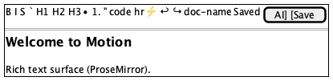
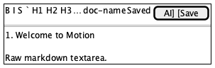
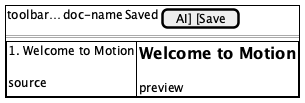

# Editor + toolbar

**Source:** `src/components/Editor/index.tsx`, `Toolbar.tsx`
**Reach:** `main.app-main` after boot; mode via shell view toggle
**States:** WYSIWYG · Markdown · Split

## Spec

Primary writing surface. Three modes share one document buffer:

| Mode | Surface |
|---|---|
| WYSIWYG | Tiptap `.ProseMirror` |
| Markdown | Raw source textarea / code surface |
| Split | Source + rendered preview side by side |

### Toolbar (left → right groups)

Formatting (Bold, Italic, Strike, Inline Code) · Headings · Lists / quote ·
Code block / HR · Insert block commands · Undo / Redo · **document name**
(rename) · **save status** · AI Refine · **Save**

Save status is `role=status` (`.save-status`) — the signal E2E asserts on.
Save requires a workspace and either a path or a new document.

Built-in **Welcome to Motion** document loads when there is no open file and
the user is not in New Note mode.

## Addressability

| What | Selector |
|---|---|
| Toolbar | `.editor-toolbar` |
| Format buttons | `getByRole("button", { name: /Bold|Italic|…/ })` |
| Doc name | `.toolbar-doc-name` |
| Save status | `.save-status` / `role=status` inside toolbar |
| Save | `getByRole("button", { name: /Save/ })` |
| AI Refine | `getByRole("button", { name: /AI Refine/ })` |
| WYSIWYG body | `.ProseMirror` |
| Welcome H1 | `getByRole("heading", { name: "Welcome to Motion" })` |

## Capture recipe

```
1. seed motion-ui-freeze=1
2. load /, 1280x800, wait .ProseMirror + Welcome heading
3. screenshot → editor-01-wysiwyg
4. click Markdown; wait for source surface (not only .ProseMirror)
5. screenshot → editor-02-markdown
6. click Split; wait for both panes
7. screenshot → editor-03-split
```

Open Folder first if the capture needs a saveable doc / rename chip with a real name.

## Wireframes

| State | Wireframe |
|---|---|
| 1 · WYSIWYG |  |
| 2 · Markdown |  |
| 3 · Split |  |

## Rubric

### Must Match
- [ ] Toolbar sits above the writing surface inside main — `check:layout › grid topology`
- [ ] Welcome H1 visible in default WYSIWYG — `check:layout › inventory`
- [ ] Switching to Markdown and Split does not throw console errors — `check:layout › view modes switch cleanly`
- [ ] Exactly one of WYSIWYG/Markdown/Split is active in the shell toggle — `check:layout › view toggle`
- [ ] Icon toolbar buttons expose `aria-label` / accessible names — `check:layout › toolbar named`
- [ ] Save status region exists when toolbar is shown — `agent`
- [ ] Split mode shows two panes side by side without clipping either at 1280×800 — `agent`

### Acceptable Differences
- Document title / rename label text
- Save status string (Saved / Saving… / Unsaved)
- Which formatting button is pressed
- Preview vs source scroll positions

### Must NOT Appear
- Front matter YAML visible in WYSIWYG for files that have it (see frontmatter e2e)
- Unnamed icon-only toolbar controls

### Failure Criteria
- Mode switch loses buffer content (mode-desync)
- Save control missing when a workspace + file is open
- Interactive toolbar control outside the viewport

## Out of scope

Block-type specifics — [blocks.md](blocks.md).
Save-name dialog — [dialogs.md](dialogs.md).
