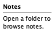
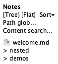
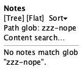

# Sidebar

**Source:** `src/components/FileSidebar.tsx`
**Reach:** always mounted in `aside.app-sidebar`
**States:** empty (no folder) · tree with notes · glob filter empty

## Spec

Project navigator for markdown notes. With a workspace open it shows:

1. **Title** — workspace basename (or “Documents” when closed)
2. **Toolbar** — Tree / Flat segment + Sort select
3. **Path glob** + **content grep** inputs with a live hint line
4. **List** — tree (`role=listbox` Notes with collapsible dirs) or flat options; or search results; or empty copy

Tree mode starts **folders collapsed**. Flat lists every note as a top-level option.

### Empty / filter empty copy

| Condition | Copy |
|---|---|
| No files | “No folder opened or no markdown files found.” |
| Glob matches nothing | `No notes match glob “{filter}”.` |

## Addressability

| What | Selector |
|---|---|
| Column | `aside.app-sidebar` |
| Title | `.file-sidebar-title` |
| Layout group | `role=group[name="List layout"]` |
| Tree / Flat | buttons Tree / Flat (`aria-pressed`) |
| Sort | `getByLabel("Sort notes")` |
| Path glob | `getByLabel("Path glob")` (also header `Search notes`) |
| Content search | `getByLabel("Search in file contents")` |
| Notes list | `role=listbox[name="Notes"]` |
| File option | `role=option[name="<file>"]` |
| Folder | `role=button` with `aria-expanded` (folder name) |
| Empty | `.file-sidebar-empty` text |

## Capture recipe

```
1. seed motion-ui-freeze=1
2. load /, 1280x800, wait [data-app-ready]
3. screenshot clip=aside → sidebar-01-empty
4. Open Folder; wait option welcome.md
5. screenshot clip=aside → sidebar-02-tree
6. fill Path glob with "zzz-nope-no-match"
7. wait for empty copy; screenshot clip=aside → sidebar-03-filter-empty
```

## Wireframes

| State | Wireframe |
|---|---|
| 1 · Empty |  |
| 2 · Tree |  |
| 3 · Filter empty |  |

## Rubric

### Must Match
- [ ] Empty state shows open-folder guidance when no workspace — `check:layout › inventory`
- [ ] After Open Folder, `role=listbox` Notes contains `welcome.md` — `check:layout › inventory`
- [ ] Tree / Flat segment exists with one `aria-pressed=true` — `check:layout › sidebar controls`
- [ ] Sort select is labelled “Sort notes” — `check:layout › sidebar controls`
- [ ] Path glob and content search inputs are present and labelled — `check:layout › sidebar controls`
- [ ] Folders are collapsible buttons; nested files hidden until expand — covered by `e2e/sidebar.spec.ts`
- [ ] Filter-empty state shows the “No notes match glob” copy — `agent`

### Acceptable Differences
- File names and folder names from seed/workspace
- Sort order
- Hint line wording for match counts
- Tree vs flat default if a future persist is added

### Must NOT Appear
- Nested files of a collapsed folder
- Content-search results while the grep field is empty

### Failure Criteria
- Selecting a file does not load it in the editor
- Unnamed interactive controls in the sidebar chrome

## Out of scope

App shell header search mirror ([app-shell.md](app-shell.md)). Editor content after selection ([editor.md](editor.md)).
